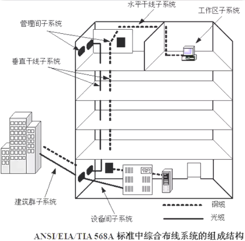

# 网络规划与设计

## 最佳实践

### 考察问

1. 零碎知识
    1. 网络系统生命周期可以划分为5个阶段，实施这5个阶段的合理顺序是`()`规范、`()`规范、`()`网络设计、`()`网络设计、`()`阶段
    2. 网络开发过程中，物理网络设计阶段的任务是依据逻辑网络设计的功能要求，确定设备的具体物理分布和运行环境
    3. 选择路由协议应该属于`()`网络设计阶段的任务。
    4. 网络逻辑结构设计的内容包括`()`, `()`, `()`
    5. 层次化网络设计包括: `()`, `()`, `()`
        - 核心层：主要是`()`，实现高速数据传输、出口路由，常用`()`机制。
        - 汇聚层：网络`()`、数据包处理和过滤、策略路由、广播域定义、寻址。
        - 接入层：主要是针对用户端，实现`()`、计费管理、MAC地址认证、MAC地址过滤、收集用户信息，可以使用集线器代替交换机。
    6. 综合布线
        1. 工作区子系统(工位)
        2. 水平子系统(楼层)
        3. 垂直干线子系统(建筑)

### 考察点

1. 零碎知识
    1. 网络系统生命周期可以划分为5个阶段，实施这5个阶段的合理顺序是`需求`规范、`通信`规范、`逻辑`网络设计、`物理`网络设计、`实施`阶段
    2. 网络开发过程中，物理网络设计阶段的任务是依据逻辑网络设计的功能要求，确定设备的具体物理分布和运行环境
    3. 选择路由协议应该属于`逻辑`网络设计阶段的任务。
    4. 网络逻辑结构设计的内容包括`逻辑网络设计图`, `IP地址方案`, `具体的软硬件、广域网连接和基本服务`
    5. 层次化网络设计包括: `核心层`, `汇聚层`, `接入层`
        - 核心层：主要是`高速数据交换`，实现高速数据传输、出口路由，常用`冗余`机制。
        - 汇聚层：网络`访问策略控制`、数据包处理和过滤、策略路由、广播域定义、寻址。
        - 接入层：主要是针对用户端，实现`用户接入`、计费管理、MAC地址认证、MAC地址过滤、收集用户信息，可以使用集线器代替交换机。
    6. 综合布线
        1. 工作区子系统(工位)
        2. 水平子系统(楼层)
        3. 垂直干线子系统(建筑)

## 网络规划与设计流程

1. 需求分析：
    1. 确定需求，包括业务需求、用户需求、应用需求、计算机平台需求、网络通信需求等。
    2. 产物：需求规范
2. 通信规范分析：
    1. 对现有的网络体系分析，估计和测量通信量及设备利用率。
    2. 产物：通信规范
3. 逻辑网络设计：
    1. 选择符合需求的设计，确定网络逻辑结构。
    2. 产物：逻辑设计文档
4. 物理网络设计：
    1. 将逻辑设计应用到物理空间，确定网络物理结构。
    2. 产物：物理结构设计文档
5. 实施阶段：实现物理网络设计，安装和维护 。

## 逻辑网络设计

逻辑网络设计是体现网络设计核心思想的关键阶段，在这一阶段根据需求规范和通信规范，选择一种比较适宜的网络逻辑结构，并基于该逻辑结构实施后续的资源分配规划、安全规划等内容。利用需求分析和现有网络体系分析的结果来设计逻辑网络结构，最后得到一份逻辑网络设计文档。

逻辑网络设计工作主要包括以下内容：

1. 网络结构的设计
2. 物理层技术的选择
3. 局域网技术的选择与应用
4. 广域网技术的选择与应用
5. 地址设计和命名模型
6. 路由选择协议
7. 网络管理
8. 网络安全
9. 逻辑网络设计文档

输出内容包括以下几点：

1. 逻辑网络设计图
2. IP地址方案
3. 安全管理方案
4. 具体的软/硬件、广域网连接设备和基本的网络服务
5. 招聘和培训网络员工的具体说明
6. 对软/硬件费用、服务提供费用、员工和培训的费用初步估计

## 物理网络设计

物理网络设计是对逻辑网络设计的物理实现，通过对设备的具体物理分布、运行环境等确定，确保网络的物理连接符合逻辑连接的要求。在这一阶段，网络设计者需要确定具体的软/硬件、连接设备、布线和服务的部署方案，输出如下内容：

1. 网络物理结构图和布线方案
2. 设备和部件的详细列表清单
3. 软硬件和安装费用的估算
4. 安装日程表，详细说明服务的时间以及期限
5. 安装后的测试计划
6. 用户的培训计划

🔒问题

1. 网络系统生命周期可以划分为5个阶段，实施这5个阶段的合理顺序是(  )。
    - A. 需求规范、通信规范、逻辑网络设计、物理网络设计、实施阶段
    - B. 需求规范、逻辑网络设计、通信规范、物理网络设计、实施阶段
    - C. 通信规范、物理网络设计、需求规范、逻辑网络设计、实施阶段
    - D. 通信规范、需求规范、逻辑网络设计、物理网络设计、实施阶段

    答案: A

2. 网络开发过程中，物理网络设计阶段的任务是(  )。
    - A. 依据逻辑网络设计的功能要求，确定设备的具体物理分布和运行环境
    - B. 分析现有网络和新网络的各类资源分布，掌握网络所处状态
    - C. 根据需求规范和通信规范，实施资源分配和安全规划
    - D. 理解网络应该具有的功能和性能，最终设计出符合用户需求的网络

    答案: A

3. 网络设计过程包括逻辑网络设计和物理网络设计两个阶段，下面的选项中，(  ) 应该属于逻辑网络设计阶段的任务。
    - A. 选择路由协议
    - B. 设备选型
    - C. 结构化布线
    - D. 机房设计

    答案: A

4. 网络逻辑结构设计的内容不包括(  )。
    - A. 逻辑网络设计图
    - B. IP地址方案
    - C. 具体的软硬件、广域网连接和基本服务
    - D. 用户培训计划

    答案: D

## 层次化网络设计

- 核心层：主要是高速数据交换，实现高速数据传输、出口路由，常用冗余机制。
- 汇聚层：网络访问策略控制、数据包处理和过滤、策略路由、广播域定义、寻址。
- 接入层：主要是针对用户端，实现用户接入、计费管理、MAC地址认证、MAC地址过滤、收集用户信息，可以使用集线器代替交换机。

🔒问题

1. 大型局域网通常划分为核心层、汇聚层和接入层，以下关于各个网络层次的描述中，不正确的是(  )。
    - A. 核心层进行访问控制列表检查
    - B. 汇聚层定义了网络的访问策略
    - C. 接入层提供局域网络接入功能
    - D. 接入层可以使用集线器代替交换机

    答案: A

2. 核心层交换机应该实现多种功能，下面选项中，不属于核心层特性的是(  ) 。
    - A. 高速连接
    - B. 冗余设计
    - C. 策略路由
    - D. 较少的设备连接

    答案: C

## 网络冗余设计

在网络冗余设计中，对于通信线路常见的设计目标主要有两个：一个是备用路径，另一个是负载分担。

备用路径，提高可用性，由路由器、交换机等设备之间的独立备用链路构成，一般情况下备用路径仅仅在主路径失效时投入使用。设计时主要考虑：

1. 备用路径的带宽
2. 切换时间
3. 非对称
4. 自动切换
5. 测试

负载分担，是对备用路径方式的扩充，通过并行链路提供流量分担(冗余的形式)来提高性能，主要的实现方法是利用两个或多个网络接口和路径来同时传递流量，设计时注意考虑：

1. 网络中存在备用路径、备用链路时，可以考虑加入负载分担设计
2. 对于主路径、备用路径都相同的情况，可以实施负载分担的特例—负载均衡
3. 对于主路径、备用路径不相同的情况，可以采用策略路由机制，让一部分应用的流量分摊到备用路径上

🔒问题

1. 以下关于网络冗余设计的叙述中，错误的是 (  ) 。
    - A. 网络冗余设计避免网络组件单点失效造成应用失效
    - B. 备用路径与主路径同时投入使用，分担主路径流量
    - C. 负载分担是通过并行链路提供流量分担来提高性能的
    - D. 网络中存在备用链路时，可以考虑加入负载分担设计

    答案: B

## 网络接入技术

- 有线接入：
    - 公用交换电话网络(PSTN)
    - 数字数据网(DDN)
    - 综合业务数字网(ISDN)
    - 非对称数字用户线路(ADSL)
    - 同轴光纤技术(HFC)
- 无线接入：
    - IEEE 802.11(WiFi)
    - IEEE 802.15(蓝牙Bluetooth)
    - 红外(IrDA)
    - WAPI

## 综合布线

1. 工作区子系统(工位): 由信息插座、插座盒、连接跳线和适配器组成。
2. 水平子系统(楼层): 由一个工作区的信息插座开始，经水平布置到管理区的内侧配线架的线缆所组成。
3. 管理间子系统(楼层汇总)由交连、互连配线架组成。管理子系统为连接其它子系统提供连接手段。
4. 垂直干线子系统(建筑)由建筑物内所有的垂直干线多对数电缆及相关支撑硬件组成，以提供设备间总配线架与干线接线间楼层配线架之间的干线路由。
5. 设备间子系统(建筑汇总)是由设备间中的电缆、连接器和有关的支撑硬件组成，作用是将计算机、PBX、摄像头、监视器等弱电设备互连起来并连接到主配线架上。
6. 建筑群子系统(建筑群)将一个建筑物的电缆延伸到建筑群的另外一些建筑物中的通信设备和装置上，是结构化布线系统的一部分，支持提供楼群之间通信所需的硬件。它由电缆、光缆和入楼处的过流过压电气保护设备等相关硬件组成，常用介质是光缆。 

🔒问题

1. 建筑物综合布线系统中的垂直子系统是指( )。
    - A. 由终端到信息插座之间的连线系统
    - B. 楼层接线间的配线架和线缆系统
    - C. 各楼层设备之间的互连系统
    - D. 连接各个建筑物的通信系统
  
    答案: C