# Web架构

## 最佳实践
### 考察问

1. 同步异步
    1. 同步: `()`事务内完成
    2. 异步: `()`事务内完成
2. 分片算法
    1. `()`: 对key做哈希计算, 除以总结点数, 结果取余对应节点. 当增减节点时, 对应关系全部变化.
    2. `()`: 对主机做哈希计算, 放在圆环上. 对key做哈希计算, 同样放在圆环上, 然后顺时针找到第一主机, 既为分配的节点. 对应关系小部分变化.
3. 布隆过滤器
    1. 添加元素, 通过`()`个`哈希函数`映射成数字, 然后将`()`数组中对应点设置为`()`。
    2. 查找元素, 同样的方法, 相应位置是否全为1
        1. 全为1, `()`在集合中
        2. 不全为1, `()`不在集合中
    3. 特点: 空间`()`, 效率`()`; `()`阳性, `()`查找和删除元素
4. SQL注入: 通过把`()`插入到`()`提交，`()`。可以通过以下方式抵御 SQL 注入攻击：

    1. `()`, 将 “模板” 与 “参数” 分离
    2. `()`
    3. `()`框架
    4. `()`与过滤, 如正则表达式
    5. `()`

5. Web优化
    1. 数据库与服务器`()`
    2. 反向代理, 负载`()`
    3. 数据库`()`分离
    4. 数据库`()`技术
    5. 内容`()`网络

6. 缓存技术
    1. 缓存与数据库的写作方式
    2. Redis与MemCache对比
        1. 都支持key/value类型. `()`还支持list, set, hash; `()`支持图片视频
        2. Redis`()`持久化, MemCache`()`持久化
        3. Redis`()`容灾, MemCache`()`容灾
7. REST: 利用`()`和`()`进行基于Web通信的技术
8. XML与JSON: JSON较XML更`()`
9. MVC的组成: `()`, `()`, `()`

### 考察点

1. 同步异步
    1. 同步: `同一`事务内完成
    2. 异步: `不同`事务内完成
2. 分片算法
    1. `Hash分片`: 对key做哈希计算, 除以总结点数, 结果取余对应节点. 当增减节点时, 对应关系全部变化.
    2. `一致性hash分片`: 对主机做哈希计算, 放在圆环上. 对key做哈希计算, 同样放在圆环上, 然后顺时针找到第一主机, 既为分配的节点. 对应关系小部分变化.
3. 布隆过滤器
    1. 添加元素, 通过`多`个`哈希函数`映射成`位``数组`中`多个点`并`置为1`。
    2. 查找元素, 同样的方法, 相应位置是否全为1
        1. 全为1, `可能`在集合中
        2. 不全为1, `一定`不在集合中
    3. 特点: 空间`小`, 效率`高`; `假`阳性, `无法`查找和删除元素
4. SQL注入: 通过把`SQL命令`插入到`Web表单`提交，`执行恶意的SQL命令`。可以通过以下方式抵御 SQL 注入攻击：

    1. `预编译语句`(Prepared Statements), 将 “模板” 与 “参数” 分离
    2. 使用`ORM`框架
    4. 使用`存储过程`
    3. `输入验证`与过滤, 如正则表达式
    5. `专业的安全产品 `

5. Web优化
    1. 数据库与服务器`分离`
    2. 反向代理, 负载`均衡`
    3. 数据库`读写`分离
    4. 数据库`缓存`技术
    5. 内容`分发`网络

6. 缓存技术
    1. 缓存与数据库的写作方式
    2. Redis与MemCache对比
        1. 都支持key/value类型. `Redis`还支持list, set, hash; `MemCache`支持图片视频
        2. Redis`支持`持久化, MemCache`不支持`持久化
        3. Redis`支持`容灾, MemCache`不支持`容灾
7. REST: 利用`HTTP`和`XML`进行基于`Web`通信的技术
8. XML与JSON: JSON较XML更`轻量化`
9. MVC的组成: `模型`(Model), `视图`(View), `控制器`(Controller)

## 基本概念

|维度|涉及技术内容|
| ---- | ---- |
|从架构来看|MVC，MVP，MVVM，REST，Webservice，微服务|
|从并发分流来看|集群(负载均衡)、CDN|
|从缓存来看|MemCache，Redis，Squid|
|从数据来看|主从库(主从复制)，内存数据库，反规范化技术，NoSQL，分区(分表)技术，视图与物化视图|
|从持久化来看|Hibernate，Mybatis|
|从分布存储来看|Hadoop，FastDFS，区块链|
|从数据编码来看|XML，JSON|
|从Web应用服务器来看|Apache，WebSphere，WebLogic，Tomcat，JBOSS，IIS|
|从安全性来看|SQL注入攻击|
|其他|静态化，有状态与无状态，响应式Web设计，中台| 

## 单台机器到数据库与服务器分离 

应用一个服务器, 数据库一个服务器

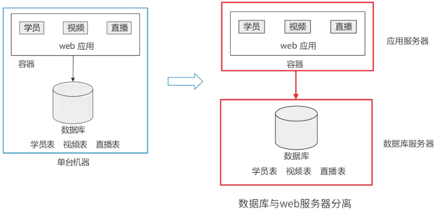

## 负载均衡

### 服务器集群

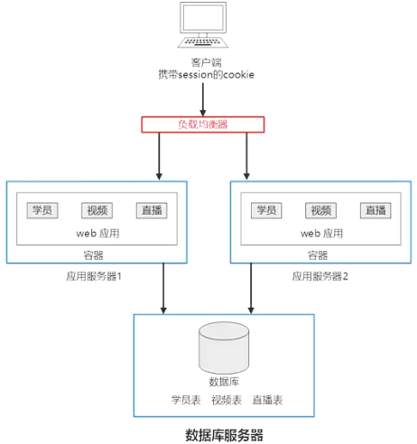

存在的问题：

1. 用户的请求由谁来转发到具体的应用服务器
2. 用户如果每次访问到的服务器不一样，那么如何维护 session 的一致性(负载均衡和有无状态问题)

解决办法是负载均衡.

### 负载均衡方法

- 应用层：
  
    - `HTTP重定向`

        http 重定向：HTTP 重定向属于应用层的请求转发。当用户发起请求时，该请求先到达 HTTP 重定向负载均衡服务器，服务器依据算法指令让用户重定向，用户收到重定向请求后，才会再次向真正的集群发起请求。

        特点：`实现简单`，`性能较差`

    - `反向代理`

        反向代理服务器：当用户的请求抵达反向代理服务器(此时请求已到达网站机房)，反向代理服务器会按照算法将请求转发至具体的服务器。像常用的 apache、nginx 都能充当反向代理服务器。

        特点：`部署简单`，不过`代理服务器`有可能成为`性能瓶颈` 

- 传输层：

    - `DNS`

        当用户向 DNS 服务器请求获取域名对应的 IP 地址时，DNS 服务器会直接给出经过负载均衡后的服务器 IP。

        特点：与 HTTP 重定向相比，`效率更高`，还能`降低维护负载均衡服务器的成本`。然而，若某个`应用服务器出现故障，无法及时通知 DNS`。并且，`DNS 负载均衡的控制权掌握在域名服务商手中`，网站`难以进行更多优化和强有力的管理`。

    - `NAT`

        这种负载均衡方式是将`一个外部 IP` 地址`映射`为`多个 IP 地址`，每次连接请求时会动态转换为一个内部节点的地址。

        特点：技术较为成熟，一般部署在网关位置，可通过硬件实现。例如四层交换机通常就采用了该技术。

### 负载均衡算法

- 静态算法(不考虑动态负载)
    - 轮转算法：依次将服务请求(任务)调度到不同节点(即服务器)。
    - 加权轮转算法：考虑不同节点处理能力的差异。
    - 源地址哈希散列算法：依据请求的源IP地址，作为散列键从静态分配的散列表找出对应节点。
    - 目标地址哈希散列算法：根据请求目标IP进行散列以找出对应节点。
    - 随机算法：随机分配，方式简单但缺乏可控性。
- 动态算法(考虑动态负载)
    - 最小连接数算法：在每个节点处理能力相同情况下，将新请求分配给当前活动请求数量最少的节点 。
    - 加权最小连接数算法：考虑节点处理能力不同，按最小连接数进行分配。
    - 加权百分比算法：综合考虑节点利用率、硬盘速率、进程个数等，用利用率体现剩余处理能力。
- 硬件负载均衡：如F5。
- 软件负载均衡：例如LVS、Nginx、HAproxy 。

## 数据库读写分离

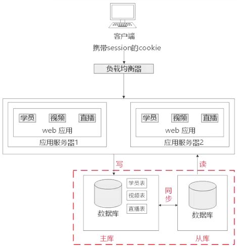

主从数据库结构特点：

1. 通常情况下是一主多从的模式，不过也支持多主多从的架构。
2. 主数据库主要负责处理写操作，而从数据库则用于执行读操作。

主从复制步骤：

1. 在主库(Master)完成数据更新之前，会将相关操作记录到binlog日志文件中。
2. 从库(Salve)开启I/O线程与主库建立连接，执行binlog dump process(二进制日志转储进程)，并把接收到的事件写入中继日志。 
3. 从库执行中继日志中的事件，以此保证数据与主库保持一致。 

## 缓存技术

### 缓存与数据库的协作

1. 数据读取
    1. 根据key从缓存读取。
    2. 若缓存中没有，则根据key在数据库中查找。
    3. 读取到值之后，更新缓存。

2. 数据写入
    1. 根据key值写数据库。
    2. 根据key更新缓存。 

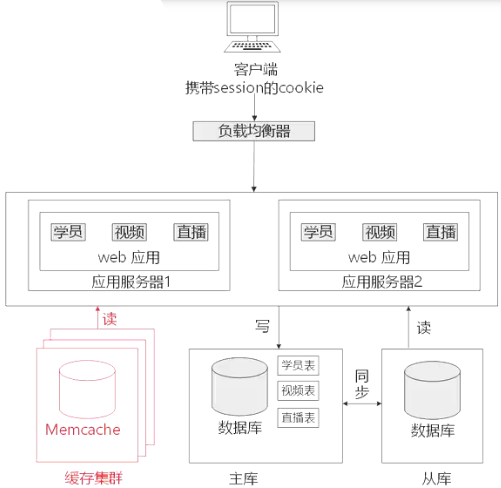

### 缓存数据库

- MemCache：Memcache是一个高性能的分布式内存对象缓存系统，主要用于动态Web应用，目的是减轻数据库负载。它通过在内存中维护一个统一的大型hash表，能够存储各种格式的数据，例如图像、视频、文件以及数据库检索结果等。
- Redis：Redis是一个开源的，使用ANSI C语言编写的数据库。它支持网络，数据既可基于内存存储，也能进行持久化，属于日志型的Key-Value数据库，并为多种语言提供API。 
- Squid：Squid是一个高性能的代理缓存服务器，支持FTP、gopher、HTTPS和HTTP协议 。和一般的代理缓存软件不同，Squid用一个单独的、非模块化的、I/O 驱动的进程来处理所有的客户端请求。 

### Redis与MemCache对比

|工作|Redis|MemCache|
| ---- | ---- | ---- |
|数据类型|key/value, list、set、hash|key/value, 图片视频|
|持久性|支持|不支持|
|存储位置|内存+硬盘|内存|
|数据容灾|支持，可以在灾难发生时，恢复数据|不支持，不能做数据恢复| 
|事务支持|有限支持|不支持|

1. 他们都支持key-value数据类型。同时Memcache还可用于缓存其他东西，例如图片、视频等等，Redis还支持list、set、hash等数据结构的存储。
2. Redis支持数据的持久化，可以将内存中的数据保持在磁盘中，重启的时候可以再次加载进行使用，Memcache挂掉之后，数据就没了。
3. 在Redis中，并不是所有的数据都一直存储在内存中的。这是和Memcache相比一个最大的区别。当物理内存用完时，Redis可以将一些很久没用到的value交换到磁盘。
4. 灾难恢复。Memcache挂掉后，数据不可恢复；Redis数据丢失后可以恢复。

所以在选择方面如果有持久方面的需求或对数据类型和处理有要求的应该选择Redis。如果简单的key/value存储应该选择Memcache。

## CDN

内容分发网络(Content Delivery Network，CDN)，依靠部署在各地的边缘服务器，通过中心平台的负载均衡、内容分发、调度等功能模块，使用户就近获取所需内容，降低网络拥塞，提高用户访问响应速度和命中率。CDN的关键技术主要有内容存储和分发技术。

CDN的基本原理是广泛采用各种缓存服务器，将这些缓存服务器分布到用户访问相对集中的地区或网络中，在用户访问网站时，利用全局负载技术将用户的访问指向距离最近的工作正常的缓存服务器上，由缓存服务器直接响应用户请求。CDN主要加速静态资源，如HTML、CSS、JS、图片、视频等。 

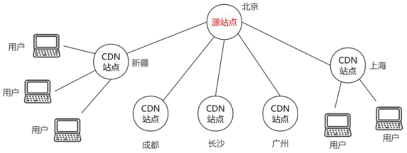

 

## 面向服务架构

面相服务架构(Service Oriented Architecture，SOA)是一种设计理念，其中包含多个服务，服务之间通过相互依赖最终提供一系列完整的功能。各个服务通常以独立的形式部署运行，服务之间通过网络进行调用。

企业服务总线(Enterprise Service Bus, ESB)

1. SOA的一种实现方式，ESB在面向服务的架构中起到的是总线作用，将各种服务进行连接与整合
2. 描述服务的元数据和服务注册管理
3. 在服务请求者和提供者之间传递数据，以及对这些数据进行转换的能力，并支持由实践中总结出来的一些模式如同步模式、异步模式等
4. 发现、路由、匹配和选择的能力，以支持服务之间的动态交互，解耦服务请求者和服务提供者。高级一些的能力，包括对安全的支持、服务质量保证、可管理性和负载平衡等

ESB的主要功能：

1. 服务位置透明性
2. 传输协议转换
3. 消息格式转换
4. 消息路由
5. 消息增强
6. 安全性
7. 监控与管理

## 微服务

微服务架构将一个大型的单个应用或服务划分成一组微型、可独立部署的服务，微服务架构`围绕业务领域`将服务进行`拆分`，每个服务可以`独立进行开发、管理和迭代`，彼此之间`使用统一接口进行交流`，实现了在分散组件中的部署、管理与服务功能，使产品交付变得更加简单，从而达到有效拆分应用，实现`敏捷开发`与部署的目的。 

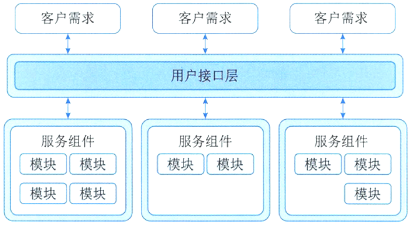

微服务的优势：

1. `解耦`。微服务架构将单一模块应用`分解为多个微服务`，同时`保持总体功能不变`。
2. `独立`。每个微服务可进行`独立开发与部署`，并具备独立的运行进程。 
3. 技术`选型灵活`。开发团队可根据自身应用的业务需求发展状况选择合适的体系架构与技术。 
4. `容错`。由于各个微服务相互独立，`故障`会`被隔离在单个服务中`，并且其他微服务可通过重试、平稳退化等机制实现应用层的容错，从而提高系统应用的容错性。 
5. 松耦合，`易扩展`。微服务架构中每个服务之间都是松耦合的，可以根据实际需求实现`独立扩展`，体现微服务架构的灵活性。 

微服务架构带来的挑战：

1. 并非所有的系统都能转成微服务。例如一些数据库层的底层操作是不推荐服务化的。 
2. `部署`较以往架构更加`复杂`：系统由众多微服务搭建，`每个微服务需要单独部署`，从而增加部署的复杂度，容器技术能够解决这一问题。 
3. `性能`问题：由于微服务注重独立性，`互相通信时`只能通过标准接口，可能`产生延迟`或调用 出错。例如一个服务需要访问另一个服务的数据，只能通过服务间接口来进行数据传输，如果是频繁访问，则可能带来较大的延迟。
4. 数据`一致性`问题：作为分布式部署的微服务，在保持数据一致性方面需要比传统架构更加困难。

微服务和SOA对比

|微服务|SOA|
| ---- | ---- |
|能拆分的就拆分|是整体的，服务能放一起的都放一起|
|纵向业务划分|是水平分多层|
|由单一组织负责|按层级划分不同部门的组织负责|
|细粒度|粗粒度|
|两句话可以解释明白|几百字只相当于SOA的目录|
|独立的子公司|类似大公司里面划分了一些业务单元(BU)|
|组件小|存在较复杂的组件|
|业务逻辑存在于每一个服务中|业务逻辑横跨多个业务领域|
|使用轻量级的通信方式，如HTTP|企业服务产总线(ESB)充当了服务之间通信的角色| 

|对比维度|微服务架构实现|SOA实现|
| ---- | ---- | ---- |
|实施范围与方式|团队级，自底向上开展实施|企业级，自顶向下开展实施|
|服务粒度|一个系统被拆分成多个服务，粒度细|服务由多个子系统组成，粒度大|
|架构形态|无集中式总线，松散的服务架构|企业服务总线，集中式的服务架构|
|集成方式|简单(HTTP/REST/JSON)|复杂(ESB/WS/SOAP)|
|部署特点|服务能独立部署|单块架构系统，相互依赖，部署复杂| 

## REST

表述性状态转移(Representational State Transfer，REST)是一种利用HTTP和XML进行基于Web通信的技术，能够降低`开发的复杂程度`，提升`系统的可伸缩性`。目的是为了让不同的软件或应用程序在任何网络环境下都可以进行信息的互相传递。例如：`http://www.educity.cn/orders/29127123134` 

REST的核心思想是，将Web应用程序的功能作为资源来表示，使用统一资源标识符(URI)来对这些资源进行操作，并通过 HTTP 协议(GET、POST、PUT、DELETE 等)来定义对这些资源的操作，强调无状态、缓存机制、统一接口、分层系统、客户端 - 服务器分离等原则。

REST核心概念:

1. 资源。REST是以资源为中心构建，资源可以是一个订单，也可以是一幅图片。将互联网中一切暴露给客户端的事物都可以看作是一种资源，对资源相关数据和表述进行组合，借助URI(统一资源标识符)标识Web上的资源，客户端通过这个URI来访问资源。资源和URI是一对多关系。

2. 表述。REST中用表述描述资源在Web中某一个时间的状态。客户端和服务端借助RESTful API传递数据，实际就是在进行资源表述的交互。表述在Web中常用表现形式有HTML、JSON、XML、纯文本等，但是资源表述返回客户端的形式只是统一格式，是开发阶段根据实际需求设计一个统一的表述格式。

3. 状态转移。REST定义中状态分为两种：应用状态和资源状态。应用状态是对某个时间内用户请求会话相关信息的快照，保存在客户端，由客户端自身维护，可以和缓存配合降低服务端并发请求压力。资源状态在服务端保存，是对某个时间资源请求表述的快照，保证在服务端，如果一段时间内没有对资源状态进行改变，则客户端对同一资源请求返回的表述一致。同时状态转移还要借助HTTP方法来实现，如GET、POST、DELETE方法。

4. 超链接。超链接是通过在页面中嵌入链接和其他资源建立联系，这里的资源可以是文本、图片、文件等。REST定义中超链接是很重要的一部分，在资源表述中除了处理当前请求资源信息外，还会添加一些相关资源URI，将一些资源接口暴露给客户端，便于用户请求这些资源，实现资源状态转移。这些超链接是包含在应用状态中，由客户端维护保存，并不是服务端提前设定好的，是服务请求过程中添加进去，客户端对其解析提供给用户。 

REST的主要特点：

1. 无状态性。服务器不保存客户端的状态信息。每次请求都是独立的，服务器根据请求本身(包括URI、HTTP方法、请求头、请求体等)来响应请求。这有助于构建可伸缩的服务器，因为服务器可以轻松地处理大量的并发请求。
2. 缓存。REST允许对响应进行缓存。客户端可以缓存GET请求的响应，并在需要时重用这些缓存的响应，而无需再次与服务器通信。这可以显著提高应用程序的性能。 
3. 统一接口。REST风格要求客户端和服务器之间通过统一的接口进行交互。这包括使用标准的HTTP方法来表示对资源的操作，以及使用标准的HTTP状态码来表示请求的结果。 
4. 分层系统。客户端不能直接与服务器交互，而是通过一系列的中间层(如负载均衡器、安全层)来与服务器通信。这些中间层对客户端是透明的，客户端不需要知道它们的存在。 
5. 客户端-服务器。REST风格基于客户端-服务器模型，客户端发送请求，服务器接收并处理请求，然后返回响应。客户端和服务器之间的交互是松耦合的(相互分离)，这有助于系统的扩展和维护。 

REST的5个原则:

1. 网络中的所有事物都可抽象为资源。
2. 每个资源都有唯一对应的资源标识。
3. 借助通用的连接件接口对资源进行操作。 
4. 对资源执行的各种操作不会改变其资源标识。
5. 所有操作均为无状态的。 

✨RESTful 是遵循 REST 原则的 Web 服务，是 REST 的形容词。REST是一种设计风格而不是一个架构

## XML与JSON

### XML

扩展标记语言(Extensible Markup Language, XML)是一种用于标记电子文件，使其具备结构性的标记语言。它可用来标记数据、定义数据类型，还是一种允许用户自定义标记语言的源语言。

1. XML的优点
    1. 格式统一，符合标准。
    2. 便于与其他系统进行远程交互，数据共享较为方便 。

2. XML的缺点
    1. XML文件通常较为庞大，文件格式复杂，传输时占用带宽较多。
    2. 服务器端和客户端都需编写大量代码来解析XML，这会让两端的代码变得非常复杂且难以维护。
    3. 不同的客户端浏览器解析XML的方式存在差异，需要重复编写大量代码。 
    4. 服务器端和客户端解析XML会消耗较多的资源和时间。 

### JSON

JSON(JavaScript Object Notation)是一种轻量级的数据交换格式，具备良好的可读性，并且便于快速编写，能够在不同平台之间进行数据交换。

1. JSON的优点

    1. 数据格式较为简单，易于读写，且格式经过压缩，占用带宽较小。
    2. 解析方便，客户端JavaScript可通过eval()函数轻松读取JSON数据。 
    3. 支持多种语言，包括ActionScript、C、C#、ColdFusion、Java、JavaScript、Perl、PHP、Python、Ruby等服务器端语言，利于服务器端进行解析。
    4. JSON格式可直接被服务器端代码使用，极大地简化了服务器端和客户端的代码开发量，同时不改变任务完成效果，维护起来较为容易。

2. JSON的缺点

    与XML相比，JSON格式的推广程度没那么深入人心，使用范围也没有XML广泛，通用性稍逊一筹。

## MVC

MVC强制性地把一个应用的输入、处理、输出流程按照视图、控制、模型的方式进行分离，形成了模型、视图、控制器三个核心模块。

1. 模型(Model)：是应用程序中用于处理应用程序数据逻辑的部分。通常模型对象负责在数据库中存取数据。模型表示业务数据和业务逻辑。
2. 视图(View)：是应用程序中处理数据显示的部分。通常视图是依据模型数据创建的。是用户看到并与之交互的界面。视图向用户显示相关的数据，并能接收用户的输入数据，但是它并不进行任何实际的业务处理。 
3. 控制器(Controller)：是应用程序中处理用户交互的部分。通常控制器负责从视图读取数据，控制用户输入，并向模型发送数据。 

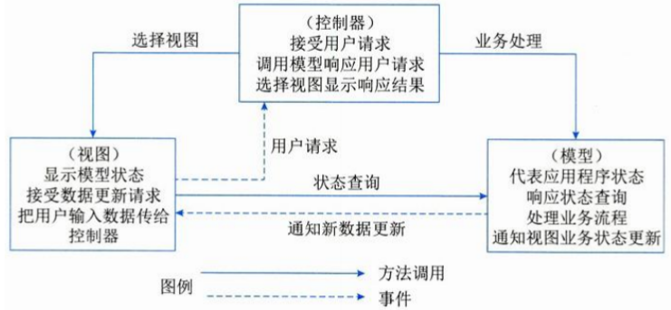

MVC分层有助于管理复杂的应用程序，因为可以在一个时间内专门关注一个方面。例如，可以在不依赖业务逻辑的情况下专注于视图设计。同时也让应用程序的测试更加容易。MVC分层同时也简化了分组开发。不同的开发人员可同时开发视图、控制器逻辑和业务逻辑。

MVC可以将业务处理与显示分离，将应用分为控制器、模型和视图，增加了应用的可拓展性、强壮性及灵活性。基于MVC的优点，目前比较先进的Web应用框架都是基于MVC设计模式的。 

## 响应式web设计

响应式WEB设计是一种网络页面设计布局，其理念是：集中创建页面的图片排版大小，可以智能地根据用户行为以及使用的设备环境进行相对应的布局。比如电脑和手机.

方法与策略:

1. 采用流式布局和弹性化设计：运用相对单位，以设定百分比而非具体数值的方式来设置页面元素的大小。
2. 响应式图片：不仅要对图片进行同比缩放，还需在小设备上降低图片自身的分辨率 。 

## 有状态与无状态:

无状态服务(stateless service)指对单次请求的处理不依赖其他请求，处理一次请求所需的全部信息，要么包含在该请求里，要么可从外部(如数据库)获取，服务器本身不存储任何信息。

有状态服务(stateful service)与之相反，它会在自身保存一些数据，先后的请求是有关联的。

判断以下构件是有状态服务还是无状态服务：

1. Identification Bean(身份认证构件)有状态
2. ResPublish Bean(资源发布构件)无状态
3. ResRetrieval Bean(资源检索构件)无状态
4. OnlineEdit Bean(在线编辑构件)有状态
5. Statistics Bean(统计分析构件)无状态

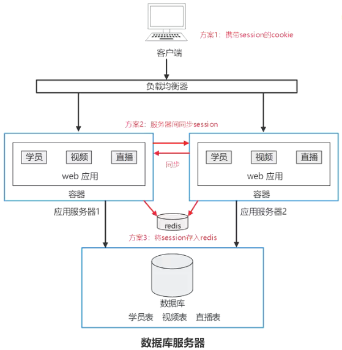

## ORM

### 概念

ORM(Object Relational Mapping)即对象与关系数据之间的映射。

|面向对象|关系数据库|
| ---- | ---- |
|类(class)|数据库的表(table)|
|对象(object)|记录(record，行数据)|
|对象的属性(attribute)|字段(field)|

1. ORM的优点：

    1. 使用ORM可以大大降低学习和开发成本
    2. 程序员不用再写SQL来进行数据库操作
    3. 减少程序的代码量
    4. 降低由于SQL代码质量差而带来的影响

2. ORM的缺点：

    1. 不太容易处理复杂查询语句
    2. 性能较直接用SQL差

### 实现技术对比表

|维度|Hibernate|MyBatis|
| ---- | ---- | ---- |
|简单对比|强大，复杂，间接，SQL无关|小巧，简单，直接，SQL相关|
|可移植性|好(不关心具体数据库)|差(根据数据库SQL编写)|
|复杂多表关联|不支持|支持|

## 中台

中台是一种融合互联网技术与行业特性的企业架构。它将企业的核心能力以共享服务的形式沉淀下来，构建出“大中台、小前台”的组织和业务机制，助力企业以快速且低成本的方式开展业务创新。中台还能进一步细分，像业务中台、数据中台等。从本质上讲，它们都是企业通用能力在不同层面的沉淀，并且对外开放这些能力。

中台的践行者

- Supercell：作为芬兰的移动游戏巨头，在2015年世界排名前十的游戏中占据5席，员工数量仅200多人。凭借中台架构，具备小团队快速开发的能力，后被腾讯以86亿美元收购。
- 阿里：2015 年参观Supercell后，开始推行中台策略。 

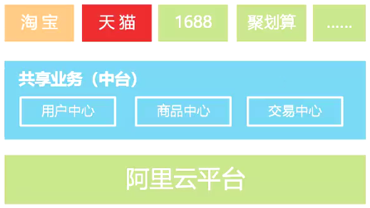

业务中台 VS 数据中台

- 多个电商渠道使用同一个下单服务，一个订单接口能同时为多个前台系统提供服务。业务中台
- 多个前台系统可以依据一个用户的手机号，获取该用户对应的画像以及用户标签。 数据中台
- 把多个支付通道进行抽象，建立成一个支付API，并提供给前台业务系统。业务中台
- 通过一个订单编号，获取可能的商品推荐清单，实现交叉销售。 数据中台

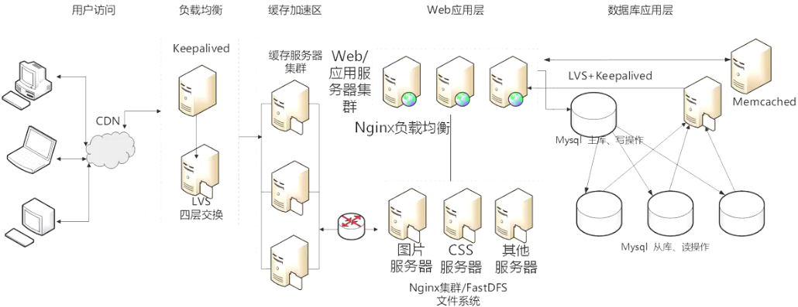

## JWT

### JWT的优点：
1. 无状态：JWT是无状态的，服务器不需要保存任何会话信息，可以轻松扩展和在分布式环境下使用。
2. 安全：JWT通过密钥对头部和载荷进行签名，保证了数据的完整性和安全性。 
3. 跨域支持：JWT可以跨域使用，可以在不同的域名和服务器之间使用。 
4. 简单易用：JWT使用简单，易于实现和维护。 

### JWT的缺点：
1. 载荷信息不能太多：JWT的载荷信息不能太多，否则会导致JWT的长度过长，增加网络传输的负担。 
2. 安全性依赖于密钥: JWT的安全性依赖于密钥的保护，如果密钥泄露，则JWT的安全性将受到威胁。
3. 无法撤销: 一旦JWT生成后，无法撤销，除非修改密钥或者设置短期的过期时间。 

## 🔒题目

1. (25分)数据库主从复制、读写分离架构：Redis缓存数据库(2023下)

2. (25分)Hibernat 架构、数据持久层、jwt。(2023下)

1. 某大型电商平台建立了一个在线B2B商店系统，并在全国多地建设了货物仓储中心，通过提前备货的方式来提高货物的运送效率。但是在运营过程中，发现会出现很多跨仓储中心调货从而延误货物运送的情况。为此，该企业计划新建立一个全国仓储货物管理系统，在实现仓储中心常规管理功能之外，通过对在线B2B商店系统中订单信息进行及时的分析和挖掘，并通过大数据分析预测各地仓储中心中各类货物的配置数量，从而提高运送效率，降低成本。

    当用户通过在线B2B商店系统选购货物时，全国仓储货物管理系统会通过该用户所在地址、商品类别以及仓储中心的货物信息和地址，实时为用户订单反馈货物起运地(某仓储中心)并预测送达时间。反馈送达时间的响应时间应小于1秒。

    为满足反馈送达时间功能的性能要求，设计团队建议在全国仓储货物管理系统中采用数据缓存集群的方式，将仓储中心基本信息、商品类别以及库存数量放置在内存的缓存中，而仓储中心的其它商品信息则存储在数据库系统。

    1. (9分)设计团队在讨论缓存和数据库的数据一致性问题时，李工建议采取数据实时同步更新方案，而张工则建议采用数据异步准实时更新方案。请用200字以内的文字，简要介绍两种方案的基本思路，说明全国仓储货物管理系统应该采用哪种方案，并说明采取该方案的原因。(2022下)

        1. 李工同步更新方案思路：更新数据时在`同一事务`内依次完成`删除缓存`，`更新数据库`，再`写入缓存`。
        1. 张工异步准实时方案思路：当数据库数据更新时，不立即更新缓存数据，而是将需要更新的操作记录成日志，再逐步`排队完成更新`。
        1. 采用方案及原因：本项目数据量大，性能要求高，同步方案并发时的性能不可控，因此应采用张工提出的异步准实时方案较好。

    2. (9分)随着业务的发展，仓储中心以及商品的数量日益增加，需要对集群部署多个缓存节点，提高缓存的处理能力。李工建议采用缓存分片方法，把缓存的数据拆分到多个节点分别存储，减轻单个缓存节点的访问压力，达到分流效果。缓存分片方法常用的有哈希算法和一致性哈希算法，李工建议采用一致性哈希算法来进行分片。请用200字以内的文字简要说明两种算法的基本原理，并说明李工采用一致性哈希算法的原因。(2022下)

        1. Hash分片算法原理：就是对缓存的`Key做哈希计算`，然后`对总的缓存节点个数取余`。例如，部署了三个缓存节点组成一个缓存集群，当有新的数据要写入时，首先对这个缓存的Key做Hash算法生成Hash值(比如CRC32等)，然后对Hash值模3，得到的结果就是要存入缓存节点的序号。特点：这个算法最大的优点就是简单易理解，缺点是当增加或者减少缓存节点时，缓存总的节点个数变化造成计算出来的节点发生变化，从而造成缓存失效不可用。 
        2. 一致性哈希分片算法：是一种特殊的哈希算法，将整个哈希值空间映射成一个按顺时针方向组织的虚拟圆环，然后将缓存节点的IP地址或者主机名做Hash取值后，放置在这个圆环上。当需要确定某一个Key存放在到哪个节点上时，先对在这个Key做同样的Hash取值，然后根据Hash值的位置沿圆环顺时针查找，将数据分配到第一个遇到的缓存节点。用一致性Hash算法可以很好地解决增加和删减节点时，命中率下降的问题。
        3. 一致性哈希分片算法的优点：①可扩展性。在增加或减少节点时，数据存储的改变最少；②更好地适应数据的快速增长。 

        参考: https://www.cnblogs.com/json-92/p/18660144

    3. (7分)全国仓储货物管理系统开发完成，在运营一段时间后，系统维护人员发现大量黑客故意发起非法的商品送达时间查询请求，造成了缓存击穿，张工建议尽快采用布隆过滤器方法解决。请用200字以内的文字解释布隆过滤器的工作原理和优缺点。(2022下) 

        - 原理：布隆过滤器本质是概率型数据结构，当元素加入集合，通过K个散列函数映射成位数组中K个点并置为1。检索时，看点是否全为1判断元素可能存在(全1)或一定不存在(有0) 。
        - 优点
            - 占用内存小。
            - 增加和查询元素时间复杂度为O(K) (K小且与数据量无关) 。
            - 哈希函数相互独立，利于硬件并行运算。
            - 无需存储元素本身，保密场合优势大。
            - 数据量大时可表示全集，其他结构难做到。
            - 同组散列函数的可进行交、并、差运算。 
        - 缺点
            - 有误判率(假阳性)，不能准确判断元素是否在集合。
            - 无法获取元素本身。
            - 一般不能删除元素，计数删除可能有计数回绕问题。 

        参考: 
        1. https://zhuanlan.zhihu.com/p/94433082
        2. https://gallery.selfboot.cn/zh/algorithms/bloomfilter

1. 某公司拟开发一款基于Web的工业设备监测系统，以实现对多种工业设备数据的分类采集、运行状态监测以及相关信息的管理。该系统应具备以下功能：
    - 现场设备状态采集功能：根据数据类型对设备监测指标状态信号进行分类采集；
    - 设备采集数据传输功能：利用可靠的传输技术，实现将设备数据从制造现场传输到系统后台； 
    - 设备监测显示功能：对设备的运行状态、工作状态以及报警状态进行监测并提供相应的图形化显示界面； 
    - 设备信息管理功能：支持设备运行历史状态、报警记录、参数信息的查询。同时，该系统还需满足以下非功能性需求：
        
        - (a)系统应支持大于100个工业设备的并行监测；
        - (b)设备数据从制造现场传输到系统后台的传输时间小于1s；
        - (c)系统应7×24小时工作；
        - (d)可抵御常见XSS攻击；
        - (e)系统在故障情况下，应在0.5小时内恢复；
        - (f)支持数据审计。

    面对系统需求，公司召开项目组讨论会议，制定系统设计方案，最终决定采用三层拓扑结构，即现场设备数据采集层、web监测服务层和前端web显示层。 

    1. (14分)该系统的Web监测服务层拟采用SSM开发。SSM框架的工作流程图如图所示，完善图中(1)~(7)处空白的内容。(2020下)

        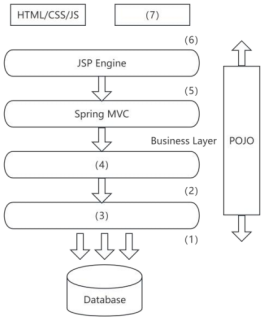

        (a)Connection Pool
        (b)Struts2
        (c)Persistent Layer
        (d)Mybatis
        (e)HTTP
        (f)MVC
        (g)Kafka
        (h)View Layer
        (i)JSP
        (j)Controller Layer
        (k)Spring 

        (1)a(2)c(3)d(4)k(5)j(6)h(7)i

        SSM(Spring+Spring MVC+MyBatis)框架集由 Spring、MyBatis 两个开源框架整合而成(Spring MVC 是 Spring 中的部分内容)，常作为数据源较简单的 web 项目的框架。

    3. (5分)该系统的现场设备数据采集层需要采集多种工业设备的运行数据。为了保证系统的兼容性、可维护性和扩展性，开发团队决定采用标准的数据访问机制。请用200字以内的文字简要说明采用标准的数据访问机制的原因。(2020下)

        标准的数据访问机制提供了不同标准间的数据访问机制，屏蔽了不同通信协议之间的差异，为上层应用程序提供统一的访问接口，可以容易地实现应用程序对不同总线协议设备的互操作，使得从低层的开发中脱离出来。它独立于平台，确保实现来自多个厂商的设备之间信息的无缝传输，具有语言无关性、代码重用性、易于集成性等优点。当硬件升级或修改时只需改动硬件接口部分即可，不会影响上层应用程序。例如，工业自动化领域常用OPC。

1. 某公司拟开发一个物流车辆管理系统，该系统可支持各车辆实时位置监控、车辆历史轨迹管理、违规违章记录管理、车辆固定资产管理、随车备品及配件更换记录管理，车辆寿命管理等功能需求。其非功能性需求如下：

    - (1)系统应支持大于50个终端设备的并发请求；
    - (2)系统应能够实时识别车牌，识别时间应小于1s；
    - (3)系统应7×24小时工作；
    - (4)具有友好的用户界面；
    - (5)可抵御常见SQL注入攻击； 
    - (6)独立事务操作响应时间应小于3s；
    - (7)系统在故障情况下，应在1小时内恢复；
    - (8)新用户学习使用系统的时间少于1小时。

    面对系统需求，公司召开项目组讨论会议，制订系统设计方案，最终决定基于分布式架构设计实现该物流车辆管理系统，应用Kafka、Redis数据缓存等技术实现对物流车辆自身数据、业务数据进行快速、高效的处理。

    1. (14分)经项目组讨论，完成了该系统的分布式架构设计，如图所示。请从下面给出的(a)~(j)中进行选择，补充完善图中(1)~(7)处空白的内容。(2019下)

    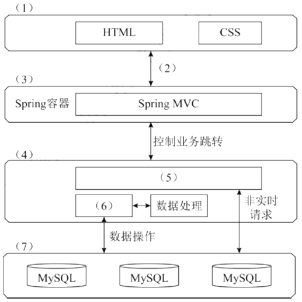

    (a)数据存储层
    (b)Struct2
    (c)负载均衡层
    (d)表现层
    (e)HTTP 协议
    (f)Redis 数据缓存
    (g)Kafka 分发消息
    (h)分布式通信处理层
    (i)逻辑处理层
    (j)CDN 内容分发

    (1)d(2)e(3)i(4)h(5)g(6)f(7)a

    2. (7 分)该物流车辆管理系统需抵御常见的 SQL 注入攻击，请用 200 字以内的文字说明什么是 SQL 注入攻击，并列举出两种抵御 SQL 注入攻击的方式。(2019下)

        SQL 注入攻击，就是通过把 SQL 命令插入到 Web 表单提交或输入域名或页面请求的查询字符串，最终达到欺骗服务器执行恶意的 SQL 命令。

        可以通过以下方式抵御 SQL 注入攻击：

        1. 预编译语句(Prepared Statements), 将 “模板” 与 “参数” 分离
        2. 使用 ORM 框架
        3. 输入验证与过滤, 如正则表达式
        4. 使用`存储过程`
        5. `专业的安全产品 `

1. 某软件企业受该省教育部门委托建设高校数字化教育教学资源共享平台，实现以众筹众创的方式组织省内普通高校联合开展教育教学资源内容建设，实现全省优质教学资源整合和共享。该资源共享平台的主要功能模块包括：

    - (1)统一身份认证模块：提供统一的认证入口，为平台其他核心业务模块提供用户管理、身份认证、权限分级和单点登录等功能；
    - (2)共享资源管理模块：提供教学资源申报流程服务，包括了资源申报、分类定制、资料上传、资源审核和资源发布等功能；
    - (3)共享资源展示模块：提供教育教学共享资源的展示服务，包括资源导航、视频点播、资源检索、分类展示、资源评价和推荐等功能；
    - (4)资源元模型管理模块：依据资源类型提供共享资源的描述属性、内容属性和展示属性，包括共享资源统一标准和规范、资源加工和在线编辑工具、数字水印和模板定制等功能；
    - (5)系统综合管理模块：提供系统管理和维护服务，包括系统配置、数据备份恢复、资源导入导出和统计分析等功能。

    项目组经过分析和讨论，决定采用基于 Java EE 的 MVC 模式设计资源共享平台的软件架构，如图所示。 

    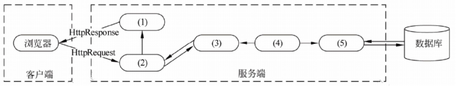

    1. (9 分)MVC 架构中包含哪三种元素，它们的作用分别是什么?请根据图 2 - 1 所示架构将 Java EE 中 JSP、Servlet、Service、JavaBean、DAO 五种构件分别填入空(1)~(5)所示位置。(2017下)

        MVC 架构包含的三种元素是：模型、视图、控制器。模型负责提供操作数据对象；视图负责提供用户操作界面；控制器负责按照输入指令和业务逻辑操作数据对象，并产生输出。
        (1)JSP 
        (2)Servlet 
        (3)JavaBean 
        (4)Service 
        (5)DAO 

    2. (6 分)项目组架构师王工提出在图 2 - 1 所示架构设计中加入 EJB 构件，采用企业级 Java EE 架构开发资源共享平台。请说明 EJB 构件中的 Bean(构件)分为哪三种类型，每种类型 Bean 的职责是什么。(2017下)

        EJB 构件中的 Bean 分为：

        - (1)Session Bean(会话构件)负责处理客户与服务端交互的业务逻辑；
        - (2)Entity Bean(实体构件)表示数据库中存在的业务实体；
        - (3)Message Driven Bean(消息驱动构件)用于接收异步 JMS 消息。 

    3. (10 分)如果采用王工提出的企业级 Java EE 架构，请说明下列(a)~(e)所给出的业务功能构件中，有状态和无状态构件分别包括哪些。(2017下)

        - (a)Identification Bean(身份认证构件)
        - (b)ResPublish Bean(资源发布构件) 
        - (c)ResRetrieval Bean(资源检索构件)
        - (d)OnlineEdit Bean(在线编辑构件) 
        - (e)Statistics Bean(统计分析构件) 

        (1)有状态构件：(a)、(d)：(2)无状态构件：(b)、(c)、(e)。

1. 某制造企业为拓展网上销售业务，委托某软件企业开发一套电子商务网站。初期仅解决基本的网上销售、订单等功能需求。该软件企业很快决定基于.NET 平台和 SQL Server 数据库进行开发，但在数据库访问方式上出现了争议。王工认为应该采用程序在线访问的方式访问数据库；而李工认为本企业内部程序员缺乏数据库开发经验，而且应用简单，应该采用 ORM(对象关系映射)方式。最终经过综合考虑，该软件企业采用了李工的建议。

    随着业务的发展，该电子商务网站逐渐发展成一个通用的电子商务平台，销售多家制造企业的产品，电子商务平台的功能也日益复杂。目前急需对该电子商务网站进行改造，以支持对多种异构数据库平台的数据访问，同时满足复杂的数据管理需求。该软件企业针对上述需求，对电子商务网站的架构进行了重新设计，新增加了数据访问层，同时采用工厂设计模式解决异构数据库访问的问题。新设计的系统架构如图所示。 

    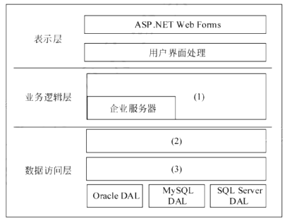

    1. (9 分)请用 300 字以内的文字分别说明数据库程序在线访问方式和 ORM 方式的优缺点说明该软件企业采用 ORM 的原因。(2017下)

        在线访问方式：在程序中通过数据库提供的程序接口直接访问数据。其优点是灵活，性能高。缺点是需要程序员对数据库有较深了解，同时数据模型的变更会导致相应程序的变更，数据库迁移困难。

        ORM 方式：是一种工具或平台，能够提供应用程序中的数据与关系数据库中的记录之间的相互转换，使得程序无须考虑记录，仅考虑对象。优点是简化程序开发，降低了对程序员关于数据库的知识要求，使得程序员可以仅关注于业务逻辑；缺点是不太容易处理复杂查询语句，性能比直接使用 SQL 要差。

        根据题干说明，原电子商务平台功能简单，没有复杂业务功能，数据访问仅需要提供基本功能即可；软件企业的程序开发人员缺乏数据库开发经验；ORM 的方式的数据接口简单清晰，开发周期短，因此采用 ORM 方式是较好的选择。 

    2. (9 分)请用 100 字以内的文字说明新体系架构中增加数据访问层的原因。请根据图所示，填写图中空白处(1)~(3)。(2017下)

        根据题干说明，新的电子商务平台业务复杂，而且需要访问异构的数据源，也就是说需要访问不同类型的数据库。因此，需要增加新的数据库访问层来封装对数据库的访问，使得在应用程序设计时，不会因为数据库种类的不同而受到影响，尽量做到数据库无关。

        (1)业务构件/业务组件；
        (2)DAL 接口/数据访问接口；
        (3)DAL 工厂/数据访问工厂。

    3. (7 分)应用程序设计中，数据库访问需要良好的封装性和可维护性，因此经常使用工厂设计模式来实现对数据库访问的封装。请解释工厂设计模式，并说明其优点和应用场景；请解释说明工厂模式在数据访问层中的应用。(2017下) 

        工厂设计模式定义了创建对象的接口，允许子类决定实例化哪个类，而且允许请求者无须知道要被实例化的特定类，这样可以在不修改代码的情况下引入新类。

        优点是：
        (1)没有了将应用程序类绑定到代码中的要求，可以使用任何实现了接口的类；
        (2)允许子类提供对象的扩展版本。

        工厂设计模式的应用场景有：

        (1)类不能预料它必须创建的对象的类；
        (2)类希望其子类指定它要创建的对象。

        在数据访问层定义采用工程模式，定义统一的操纵数据库的接口，然后根据数据库的不同，由类工厂来决定实例化哪个类。在具体类中实现特定的数据库访问类。这样，就可以实现由客户端指定或根据配置文件来选择访问不同的数据库，从而实现应用程序与数据库无关。 

1. 某电子商务企业因发展良好，客户量逐步增大，企业业务不断扩充，导致其原有的 B2C 商品交易平台已不能满足现有业务需求。因此，该企业委托某软件公司重新开发一套商品交易平台。该企业要求新平台应可适应客户从手机、平板设备、电脑等不同终端设备访问系统，同时满足电商定期开展“秒杀”“限时促销”等活动的系统高并发访问量的需求。面对系统需求，软件公司召开项目组讨论会议，制定系统设计方案。讨论会议上，王工提出可以应用响应式 Web 设计满足客户从不同设备正确访问系统的需求。同时，采用增加镜像站点、CDN 内容分发等方式解决高并发访问量带来的问题。李工在王工的提议上补充，仅仅依靠上述外网加速技术不能完全解决高用户并发访问问题，如果访问量持续增加，系统仍存在崩溃可能。李工提出应同时结合负载均衡、缓存服务器、Web 应用服务器、分布式文件系统、分布式数据库等方法设计系统架构。经过项目组讨论，最终决定综合王工和李工的思路，完成新系统的架构设计。

    1. (5 分)请用 200 字以内的文字描述什么是“响应式 Web 设计”，并列举 2 个响应式 Web 设计的实现方式。(2017下) 

        响应式 Web 设计(Responsive Web Design)的理念是：页面的设计与开发应当根据用户行为以及设备环境(系统平台、屏幕尺寸、屏幕定向等)进行相应的响应和调整。无论用户正在使用笔记本还是 iPad，页面都应该能够自动切换分辨率、图片尺寸及相关脚本功能等，以适应不同设备；即页面应该有能力去自动响应用户的设备环境。响应式网页设计就是一个网站能够兼容多个终端，而不是为每个终端做一个特定的版本。减小为不断到来的新设备做专门的版本设计和开发的工作量。

        响应式 Web 设计具体的实现方式包括媒体查询(media query)、流式布局(弹性布局、动态布局)、液态图片(弹性图片)等。 

    2. (16 分)综合王工和李工的提议，项目组完成了新商品交易平台的系统架构设计方案。新系统架构图如图 5 - 1 所示。请从选项(a)~(j)中为架构图中(1)~(8)处空白选择相应的内容，补充支持高并发的 Web 应用系统架构设计图。(2017下) 

        

        (a)Web 应用层
        (b)界面层
        (c)负载均衡层
        (d)CDN 内容分发
        (e)主数据库
        (f)缓存服务器集群
        (g)从数据库
        (h)写操作
        (i)读操作
        (j)文件服务器集群 

        (1)(d);(2)(c);(3)(f);(4)(a);(5)(e);(6)(h);(7)(g);(8)(i)。

2. 某电子产品制造公司，几年前开发建设了企业网站系统，实现了企业宣传、产品介绍、客服以及售后服务等基本功能。该网站技术上采用了 Web 服务器、动态脚本语言 PHP。随着市场销售渠道变化以及企业业务的急剧拓展，该公司急需建立完善的电子商务平台。

    公司张工建议对原有网站系统进行扩展，增加新的功能(包括订单系统、支付系统、库存管理等)，这样有利于降低成本、快速上线；而王工则认为原有网站系统在技术上存在先天不足，不能满足企业业务的快速发展，尤其是企业业务将服务全球，需要提供 24 小时不间断服务，系统在大负荷和长时间运行下的稳定性至关重要。建议采用应用服务器的 Web 开发方法，例如 J2EE，为该企业重新开发新的电子商务平台。

    1. (7 分)王工认为原有网站在技术上存在先天不足，不能满足企业业务的快速发展，根据你的理解，请用 300 字以内的文字说明原系统存在哪几个方面的不足。(2016下)  

        原有基于 Web 服务器的脚本语言的解决方案，其实质是在 Web 服务器端放入一个通用的脚本语言解释器，负责脚本语言的解释执行。其存在的不足有：
        1. 脚本语言嵌入在 HTML 文件中，使得 I/O、业务逻辑、数据处理等程序代码混杂在一起，导致开发、维护困难；
        2. 系统采用 Web 服务器实现业务逻辑，系统的扩展性差，并发能力差，系统一旦繁忙，缺乏有效的手段进行扩充； 
        3. 系统缺乏有效的维护、管理工具。 

    2. (8 分)请简要说明应用服务器的概念，并重点说明应用服务器如何来保障系统在大负荷和长时间运行下的稳定性以及可扩展性。(2016下)  

        应用服务器是指通过各种协议把商业逻辑暴露给客户端的程序。它提供了访问商业逻辑的途径以供客户端应用程序使用。应用服务器为实现 Web 应用程序和系统资源的访问机制提供了一种简单、可管理的方式。它是一个开发、部署、运行、管理和维护的平台，可以提供软件 “集群” 功能，让多个不同的异构服务器协同工作、相互备份，满足企业级应用所需要的可用性、高性能、可靠性和伸缩性。

3. (10 分)J2EE 平台采用了多层分布式应用程序模型，实现不同逻辑功能的应用程序被封装到不同的构件中，处于不同层次的构件可被分别部署到不同的机器中。请填写图中(1)~(5)处的空白，完成 J2EE 的 N 层体系结构。(2016下)

    

    Scrum 是一个增量的、迭代的敏捷软件开发过程。某软件公司计划开发一个基于 Web 的 Scrum 项目管理系统，用于支持项目团队采用 Scrum 敏捷开发方法进行软件开发，辅助主管智能决策。此项目管理系统提供的主要服务包括项目团队的管理、敏捷开发过程管理和工件的管理。

    Scrum 敏捷开发中，项目团队由 Scrum 主管、产品负责人和开发团队人员三种不同的角色组成，其开发过程由若干个 Sprint(短的迭代周期，通常为 2～4 周)活动组成。 

    Product Backlog 是在 Scrum 过程初期产生的一个按照商业价值排序的需求列表，该列表条目的体现形式通常为用户故事。在每一个 Sprint 活动中，项目团队从 Product Backlog 中挑选最高优先级的用户故事进行开发。被挑选的用户故事在 Sprint 计划会议上经过细化分解为任务，同时初步估算每一个任务的预计完成时间，编写 Sprint Backlog。 

    在 Sprint 活动期间，项目团队每天早晨需举行每日站立会议，重新估算剩余任务的预计完成时间，更新 Sprint Backlog、Sprint 燃尽图和 Release 燃尽图。在每个 Sprint 活动结束时，项目团队召开评审会议和回顾会议，交付产品增量，总结 Sprint 期间的工作情况和问题。此时，如果 Product Backlog 中还有未完成的用户故事，则项目团队将开始筹备下一个 Sprint 活动迭代。

    为完成 Scrum 项目管理系统，考虑到系统的智能决策需求，公司决定使用 MVC 架构模式开发该项目管理系统。具体来说，系统采用轻量级 J2EE 架构和 SSH 框架进行开发，使用 MySQL 数据库作为底层存储。

1. (10 分)Scrum 项目管理软件需真实模拟 Scrum 敏捷开发流程，请根据你的理解完成图 5-1 给出的 Scrum 敏捷开发状态图，填写其中(1)~(5)的内容。 

    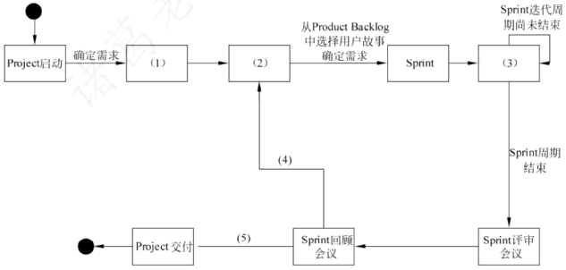

    (1)制定 Product Backlog
    (2)Sprint 计划会议
    (3)每日站立会议
    (4)Product Backlog 中还有未完成的用户故事
    (5)已交付 Product Backlog 中的所有用户故事 

2. (6 分)根据题干描述，本系统采用 MVC 架构模式，请从备选答案 a~n 中分别选出属于 MVC 架构模型中的模型(Model)、视图(View)和控制器(Controller)的相关内容描述填入表 5-1 的空(1)~(3)处。 

    |架构模式|包含内容|
    | ---- | ---- |
    |模型(Model)|(1)|
    |视图(View)|(2)|
    |控制器(Controller)|(3)|

    备选答案
    |  |  |  |  |
    | ---- | ---- | ---- | ---- |
    | a | Sprint 燃尽图 | h | 用户 |
    | b | Project | i | 交付产品增量 |
    | c | Product Backlog | j | 新建项目 |
    | d | 用户故事 | k | Task |
    | e | 估算任务预计完成时间 | l | Sprint |
    | f | Release 燃尽图 | m | 产品负责人 |
    | g | Sprint 回顾会议 | n | Sprint Backlog | 

    (1)b, c, d, h, k, l, m, n
    (2)a, f
    (3)e, j
    注：各空中的项没有次序要求 

3. 根据项目组给出的系统设计方案，将备选答案 a~l 的内容填写在图 5-2 中的空(1)~(9)，完成系统架构图。 

    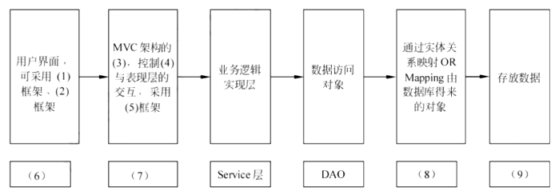

    |  |  |  |  |
    | ---- | ---- | ---- | ---- |
    | a | Struts 2 | g | 模型层 |
    | b | Hibernate 持久层 | h | 控制层 |
    | c | 数据库服务(MySQL) | i | EJB |
    | d | Sitemesh | g | Web 层 |
    | e | 业务逻辑层 | k | 视图层 |
    | f | JQuery | l | PostgreSQL |

    (1)d 或 f
    (2)f 或 d
    (3)h
    (4)e
    (5)a
    (6)k
    (7)j
    (8)b
    (9)c
    注：(1)、(2)答案可互换，但不能重复选择。 

