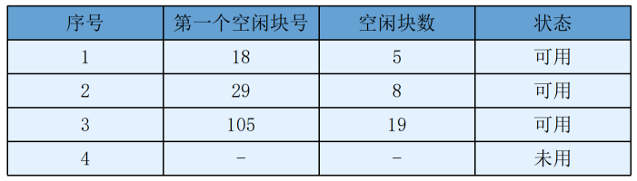
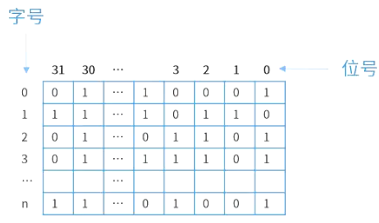

# 文件空闲存储空间的管理

## 最佳实践

### 考察问
1. 🟡🟩💚位示图
    1. 位号是指(行or列)号
    2. 字号是指(行or列)号
    3. 编号从(0or1)开始

### 考察点

1. 位示图
    1. 位号, 列号
    2. 字号, 行号
    3. 编号从0开始, 可以先+1计算容量更容易理解

## 空闲空间管理办法

常用的空闲空间的管理方法有：空闲区表、位示图、空闲块链和成组链接法。

- 空闲区表

    将外存空间上的一个连续的未分配区域称为"空闲区"。操作系统为磁盘外存上的所有空闲区建立一张空闲表，每个表项对应一个空闲区，空闲表中包含序号、空闲区的第一块号、空闲块的块数和状态等信息。它适用于连续文件结构。

    

- 位视图

    

    🔒题目:

    1. 💚某文件管理系统在磁盘上建立了位示图，记录磁盘的使用情况。若系统的字长为32位，磁盘上的物理块依次编号为：0、1、2、...，那么4096号物理块的使用情况在位示图的第( )个字中描述；若磁盘的容量为200GB，物理块的大小为1MB，那么位示图的大小为( )个字。

        

        - A. 129
        - B. 257
        - C. 513
        - D. 1025

        - A. 600
        - B. 1200
        - C. 3200
        - D. 6400

        答案: AD

        1. 系统的字长为32位，可记录32个物理块，由于物理块编号从0开始的, 所以(4096+1)/32 = 128余1，所以4096在第129个字中的第一个位置, 编号为0。
        2. 磁盘有200GB/1MB = 204800个物理块，故位示图大小为204800/32 = 6400个字。

- 空闲块链

    每个空闲物理块中有指向下一个空闲物理块的指针，所有空闲物理块构成一个链表，链表的头指针放在文件存储器的特定位置上(如管理块中)，不需要磁盘分配表，节省空间。每次申请空闲物理块只需根据链表的头指针取出第一个空闲物理块，根据第一个空闲物理块的指针可找到第二个空闲物理块，依此类推。

    

- 成组链接法

    系统将空闲块分成若干组，每100个空闲块为一组，每组的第一个空闲块登记了下一组空闲块的物理块号（的地址）和空闲块总数。UNIX系统采用该方法。

    
