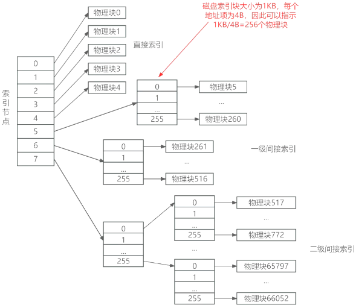
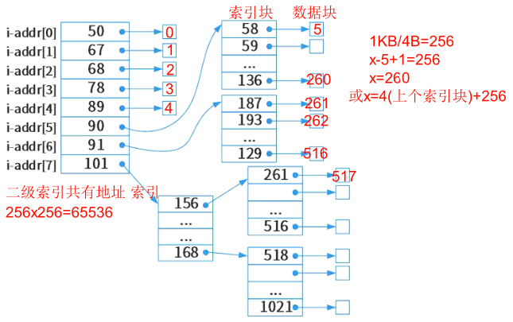

# 文件管理

## 最佳实践

### 考察问

1. 🟡🟨❤️1个磁盘索引块包含多个地址项, 地址项个数 = `()`/`()`
2. 🟡🟨❤️磁盘索引块的一个地址项对应一个`()`
3. 🟡🟨💛`(左/右)`是索引块(物理块), `(左/右)`是数据块(逻辑块)
    1. 索引块(物理块)地址项的序号是随机的
    2. 数据块(逻辑块)的序号是顺序的, 从0开始
4. 🟡🟨💛三级索引结构
    1. 一级索引, 一个物理块(索引快)对应`一个`逻辑块(数据块)
    2. 二级索引, 一个物理块(索引块)对应`多个`个逻辑块
    3. 三级索引, 一个物理块(索引块)对应`多个*多个`个逻辑块

### 考察点

1. 1个磁盘索引块包含多个地址项, 地址项个数 = `磁盘索引块大大小`/`地址项大小`
2. 磁盘索引块的一个地址项对应一个`磁盘数据块`
3. `左边`是索引块(物理块), `右边`是数据块(逻辑块)
    1. 索引块(物理块)地址项的序号是随机的
    2. 数据块(逻辑块)的序号是顺序的, 从0开始
4. 三级索引结构
    1. 一级索引, 一个物理块(索引快)对应一个逻辑块(数据块)
    2. 二级索引, 一个物理块(索引块)对应256个逻辑块
    3. 三级索引, 一个物理块(索引块)对应256*256个逻辑块
5. 序号的计算, 用上一逻辑块的最后一个数据块的序号, 加上1得到该逻辑块对应数据块的开始, 加上256得到该逻辑块对应数据块的结束

✨256又1KB/4B计算得来, 题目一般都这样设计

## 文件概念

文件（File）是具有符号名的、在逻辑上具有完整意义的一组相关信息项的集合。例如，一个源程序、一个目标程序、编译程序、一批待加工的数据和各种文档等都可以各自组成一个文件。

文件的命名：一般包括文件名和扩展名。

## 文件物理结构

文件的物理结构是指文件的内部组织形式，即文件在物理存储设备上的存放方法。

1. 连续结构，逻辑上连续的文件信息（如记录）依次存放在连续编号的物理块上
2. 链接结构，逻辑上连续的文件信息存放在不连续编号的物理块上
3. 索引结构，逻辑上连续的文件信息(如记录)存放在不连续的物理块中，系统为每个文件建立一张索引表。索引表记录了文件信息所在的逻辑块号对应的物理块号
4. 多个物理块的索引表，根据一个文件大小的不同，其索引表占用物理块的个数不同，一般占一个或多个物理块。

在UNIX文件系统中采用的是三级索引结构，其文件索引表项分4种寻址方式：直接寻址、一级间接寻址、二级间接寻址和三级间接寻址。

举例, 如下图三级索引文件结构：0-9为直接索引，即每个索引节点存放的为数据；10为一级间接索引；11为二级间接索引。

三级索引文件结构举例：设文件索引节点中有8个地址项i_addr[0]～i_addr[7]，每个地址项大小为4字节，其中

1. i_addr[0]～i_addr[4]采用直接地址索引
2. i_addr[5]和i_addr[6]采用一级间接地址索引
3. i_addr[7]采用二级间接地址索引，磁盘索引块和磁盘数据块大小均为1KB。

🔒题目:

1. ❤️假设文件系统采用索引节点管理，且索引节点有8个地址项addr[0]~addr[7]，每个地址项大小为4字节，addr[0]~addr[4]采用直接地址索引，addr[5]和addr[6]采用一级间接地址索引，addr[7]采用二级间接地址索引。假设磁盘索引块和磁盘数据块大小均为1KB字节，文件File1的索引节点如下图所示。若用户访问文件File1中逻辑块号为5和261的信息，则对应的物理块号分别为 (  ) ；101号物理块存放的是 (  ) 。

    

    - A. 89和90
    - B. 89和136
    - C. 58和187
    - D. 90和136

    - A. File1的信息
    - B. 直接地址索引表
    - C. 一级地址索引表
    - D. 二级地址索引表

    答案: CD

2. ❤️某文件系统文件存储采用文件索引节点法。假设磁盘索引块和磁盘数据块大小均为1KB，每个文件的索引节点中有8个地址项iaddr[0]~iaddr[7]，每个地址项大小为4字节，其中iaddr[0]~iaddr[5]为直接地址索引，iaddr[6]是一级间接地址索引，iaddr[7]是二级间接地址索引。如果要访问jicwutil.dll文件的逻辑块号分别为0、260和518，则系统应分别采用（  ）。该文件系统可表示的单个文件最大长度是（  ）KB。

    - A. 直接地址索引、一级间接地址索引和二级间接地址索引
    - B. 直接地址索引、二级间接地址索引和二级间接地址索引
    - C. 一级间接地址索引、一级间接地址索引和二级间接地址索引
    - D. 一级间接地址索引、二级间接地址索引和二级间接地址索引

    - A. 518
    - B. 1030
    - C. 16514
    - D. 65798

    1. 0~5直接索引, 对应逻辑块[0, 5]
    2. 6一级间接索引, 对应逻辑块[6, 261], 总长度256
    3. 7二级间接索引, 对应逻辑块[262, ], 总长度256 x 256
    4. 总长度(6+256+65536)x1KB

3. 🔴某文件系统文件存储采用文件索引节点法。每个文件索引节点中有8个地址项，每个地址项大小为4字节，其中5个地址项为直接地址索引，2个地址项是一级间接地址索引，1个地址项是二级间接地址索引。磁盘索引块和磁盘数据块大小均为1KB。若要访问iclsClient.dll文件的逻辑块号分别为1、518，则系统应分别采用（  ）。

    - A. 直接地址索引和直接地址索
    - B. 直接地址索引和一级间接地址索引
    - C. 直接地址索引和二级间接地址索
    - D. 一级间接地址索引和二级间接地址索引

    答案：C

    1. 直接地址索引有5个地址项，对应逻辑块号0~4。
    2. 一级间接索引有2个地址项，每个地址项对应1KB/4B = 1024B/4B = 256个物理块，对应逻辑块号范围是5~516。
    3. 二级间接索引有一个地址项，对应256×256 = 65536个物理块，对应逻辑块号范围是517以上。
