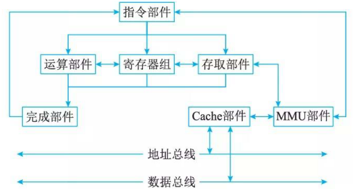

# CPU

## 最佳实践

### 考察问
5. CPU组成
    1. CPU的两个组成部分是`()`和`()`
    2. 运算器的组件包含哪些
        1. `()`(Arithmetic Logic Unit, ALU)的作用
        2. `()`(Accumulator，AC)的作用: 暂存数据
        3. `()`(Data Register, DR)的作用: 数据缓冲, CPU和内存的桥梁
        4. `()`(Program Status Word，PSW)的作用: 进位标志
    3. 控制器的组件包含哪些
        1. `()`(Instruction Register，IR)的作用: 当前指令
        2. `()`(Program Counter，PC)的作用: 下一条指令
        3. `()`(Address Register，AR)的作用: 数据地址
        4. `()`(Instruction Decoder，ID)的作用: 解释

6. 主频 = `()`

7. 嵌入式CPU:
    1. 数字信号处理器(Digital Signal Processor, DSP)处理`()`
    2. 微处理器(Micro Processor Unit, MPU)类似`()`
    3. 片上系统(System On Chip, SOC)是`()`
    4. 微控制单元, 单片机(Micro Controller Unit，MCU)是`()`

8. CPU结构
    1. 冯诺依曼, 常用于`()`
    2. 哈佛结构, 常用于`()`
1. 精简指令集特点
    1. 指令: 数量(), 长度()
    2. 寄存器: 数量()
    3. 结果: 编程量(), 效率()

### 考察点

1. CPU组成
    1. CPU的两个组成部分是`运算器`和`控制器`
    2. 运算器的组件包含哪些
        1. `算术逻辑单元`(Arithmetic Logic Unit, ALU)的作用
        2. `累加寄存器`(Accumulator，AC)的作用: 暂存数据
        3. `数据缓冲寄存器`(Data Register, DR)的作用: 数据缓冲, CPU和内存的桥梁
        4. `状态条件寄存器`(Program Status Word，PSW)的作用: 进位标志
    3. 控制器的组件包含哪些
        1. `指令寄存器`(Instruction Register，IR)的作用: 当前指令
        2. `程序计数器`(Program Counter，PC)的作用: 下一条指令
        3. `地址寄存器`(Address Register，AR)的作用: 数据地址
        4. `指令译码器`(Instruction Decoder，ID)的作用: 解释

2. 主频 = `外频 x 倍频`

3. 嵌入式CPU:
    1. 数字信号处理器(Digital Signal Processor, DSP)处理`信号`
    2. 微处理器(Microprocessor Unit, MPU)类似`CPU`
    3. 片上系统(System on Chip, SOC)是`CPU+其他组件`
    4. 微控制单元, 单片机(Microcontroller Unit，MCU)是`CPU+其他组件`

4. CPU结构
    1. 冯诺依曼, 常用于`PC`
    2. 哈佛结构, 常用于`嵌入式`

1. 精简指令集
    1. `指令`: `数量少`, `长度固`
    2. `寄存器`: `数量多`
    3. `结果`: `编程量大`, `效率高`

## 指令集分类

处理器的指令集按照其复杂程度可分为:

1. 复杂指令集(Complex Instruction Set Computers, CISC)
2. 精简指令集(Reduced Instruction  Set Computers, RISC)

CISC 以 Intel 、 AMD的 x86CPU 为代表， RISC 以 ARM 和 Power 为代表。，除了由千历史原因而仍然存在的 CISC 结构外， RISC 已经成为计算机指令集发展的趋势，几乎所有后期出现的指令集均为 RISC 架构。

|特性|CISC|RISC|
| ---- | ---- | ---- |
|指令数目|多|少|
|指令长度|可变长指令|大部分等长指令|
|控制器复杂性|复杂|简单|
|寻址方式|较丰富，提高编程灵活性|较少，以提高效率|
|编程便利性|指令多，编程灵活|编程量更大，采用较多通用寄存器|
|实现方式|微程序控制技术|采用硬布线逻辑控制优化编译程序，采用流水线技术|

🔒题目:

1. RISC(精简指令系统计算机)的特点不包括( )。

    - A. 指令长度固定，指令种类尽量少
    - B. 寻址方式尽量丰富，指令功能尽可能强
    - C. 增加寄存器数目，以减少访存次数
    - D. 用硬布线电路实现指令解码，以尽快完成指令译码

    答案: B

## 运算器和控制器

1. 运算器: 算术运算操作

    1. 运算器的功能:

        1. 算术运算如：加、减、乘、除等基本运算
        2. 逻辑运算如: 与、或、非等逻辑运算

    2. 运算器的组件:

        1. 算术逻辑单元(Arithmetic Logic Unit, ALU)：数据的算术运算和逻辑运算
        2. 累加寄存器(Accumulator，AC)：通用寄存器，为ALU提供一个工作区，用于`暂存数据`
        3. 数据缓冲寄存器(Data Register, DR)：`缓冲区`, 解决CPU与内存之间的速度差异
        4. 状态条件寄存器(Program Status Word，PSW)：存状态标志与控制标志, 如运算结果`进位标志`、溢出标志、中断标志等

2. 控制器: 控制运算的过程

    1. 指令寄存器(Instruction Register，IR)：存储`当前``执行的指令`
    2. 程序计数器(Program Counter，PC)：存储`下一条指令``在内存的地址`。每当一条指令被执行完毕，程序计数器会自动递增以指向下一条指令的地址.
    3. 地址寄存器(Address Register，AR)：存放CPU访问`数据在内存的地址`
    4. 指令译码器(Instruction Decoder，ID)：对`指令中进行解释`, 例如，当译码器接收到一个操作码为 “0010” 的指令时，它会知道该指令是要进行加法操作。

🔒题目:

1. 执行CPU指令时，在一个指令周期的过程中，首先需从内存读取要执行的指令，此时先要将指令的地址即(  )的内容送到地址总线上。

    - A. 指令寄存器(IR)
    - B. 通用寄存器(GR)
    - C. 程序计数器(PC)
    - D. 状态寄存器(PSW)

    🔑答案: C

指令部件通过 MMU-Cache 的存储结构，从内存等存储设备中取得相应的软件代码指令并完成译码和控制操作，控制存取部件从存储设备中取得新的数据，控制寄存器组为运算器准备有关寄存器数据，并准备好结果寄存器，控制整型、浮点、向量等运算部件开展运算。运算部件、寄存器单元、存取部件将执行结果通知完成部件，并在完成部件中完成结果的排队，由完成部件向指令部件反馈执行结果，控制指令的顺序执行、跳转等时序。

## 专用目的处理器芯片

1. 数字信号处理器(Digital Signal Processor, DSP): 是一种特别适合于进行数字信号处理运算的微处理器。
2. 微处理器(Micro Processor Unit, MPU): 微机中的中央处理器(CPU)称为微处理器(MPU)，控制整个微型计算机工作的作用，产生控制信号对相应的部件进行控制，并执行相应的操作。
3. 微控制单元单片机(Micro Controller Unit，MCU)，也称单片机是把中央处理器(Central Process Unit；CPU)的频率与规格做适当缩减，并将内存(memory)、计数器(Timer)、USB、A/D 转换、UART、PLC、DMA 等周边接口，甚至 LCD 驱动电路都整合在单一芯片上，形成芯片级的计算机。
4. 片上系统(System on Chip, SOC): SoC是一个微型系统，如果说中央处理器(CPU)是大脑，那么 SoC 就包括大脑、心脏、眼睛和手的系统。

总结: DSP信号, MPU和CPU相似, MCU和SOC是系统

🔒题目:

1. 嵌入式处理器是嵌入式系统的核心部件，一般可分为嵌入式微处理器(MPU)、微控制器(MCU)、数字信号处理器(DSP)和片上系统(SOC)。以下叙述中，错误的是( )。

    - A MPU 在安全性和可靠性等方面进行增强，适用于运算量较大的智能系统
    - B MCU 典型代表是单片机，体积小从而使功耗和成本下降
    - C DSP 处理器对系统结构和指令进行了特殊设计，适合数字信号处理
    - D SOC 是一个有专用目标的集成电路，其中包括完整系统并有嵌入式软件的全部内容

    🔑答案: A

## CPU频率

CPU 的工作频率 (主频) 包括两个部分：外频与倍频，两者的乘积就是主频。所谓外频，就是外部频率，指的是系统总线频率。倍频的全称是倍频系数，倍频系数是指 CPU 主频与外频之间的相对比例关系。

最初 CPU 主频和系统总线速度是一样的，但 CPU 的速度越来越快，倍频技术也就相应产生。它的作用是使系统总线工作在相对较低的频率上，而 CPU 速度可以通过倍频来提升。

主频 = 外频 x 倍频

🔒题目:

1. CPU的频率有主频、倍频和外频。某处理器外频是200MHz，倍频是13，该款处理器的主频是____。
    - A. 2.6GHz
    - B. 1300MHz
    - C. 15.38Mhz
    - D. 200MHz

    🔑答案: A

## CPU结构

1. 冯·诺依曼结构

    冯·诺依曼结构, 是一种将程序指令存储器和数据存储器合并在一起的存储器结构。一般用于PC处理器，如I3，I5，I7处理器

2. 哈佛结构

    哈佛结构是一种将程序指令存储和数据存储分开的存储器结构。一般用于嵌入式系统处理器(DSP)数字信号处理(DSP，Digital Signal Processing)

🔒题目:

1. 目前处理器市场中存在 CPU 和 DSP 两种类型处理器，分别用于不同场景，这两种处理器具有不同的体系结构，DSP 采用( )。

    - A 冯・诺伊曼结构
    - B 哈佛结构
    - C FPGA 结构
    - D 与GPU相同结构

    🔑答案: B

