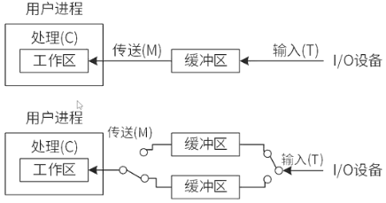
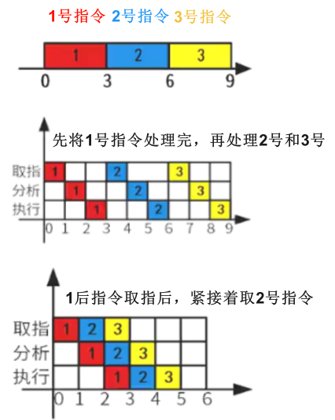
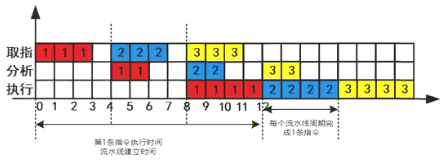

# 流水线技术

## 最佳实践

### 🔒题目

- 一条指令的执行过程可以分解为取指、分析和执行三步，取指时间$t_{取}=3\Delta t$、分析时间$t_{分析}=2\Delta t$、执行时间$t_{执行}=4\Delta t$。

    1. 10条指令的吞吐率: $\frac{10}{45 \Delta t}$
    2. 最大吞吐率: $\frac{1}{4 \Delta t}$

- 某计算机系统采用5级流水线结构执行指令，设每条指令的执行由取指令(2Δt)、分析指令(1Δt)、取操作数(3Δt)、运算(1Δt)和写回结果(2Δt)组成，并分别用5个子部件完成，该流水线的最大吞吐率为(1)；若连续向流水线输入10条指令，则该流水线的加速比为(2)。

    1. A. $\frac{1}{9\Delta t}$  B. $\frac{1}{3\Delta t}$  C. $\frac{1}{2\Delta t}$  D. $\frac{1}{1\Delta t}$
    2. A. 1:10  B. 2:1  C. 5:2  D. 3:1

    答案: BC

    - 未用流水线的时间: (2+1+3+1+2) * 10 = 90
    - 使用流水线的时间: 2+1+3+1+2+3(10-1) = 9+27 = 36
    - 加速比: 90/36 = 5/2

- 假设磁盘块与缓冲区大小相同，每个盘块读入缓冲区的时间为15μs，由缓冲区送至用户区的时间是5μs，在用户区内系统对每块数据的处理时间为1μs，若用户需要将大小为10个磁盘块的Doc1文件逐块从磁盘读入缓冲区，并送至用户区进行处理，那么采用单缓冲区需要花费的时间为(  )μs；采用双缓冲区需要花费的时间为(  )μs。

    

    

    这道题中处理数据有三个处理步骤：

    1. 从磁盘读入到缓冲区(15μs)；
    2. 从缓冲区读入到(内存)用户区(5μs)；
    3. 处理(内存)用户区数据(1μs)。

    根据单缓冲区和双缓冲区构造不同流水线:

    4. 单缓冲区

        1. 步骤1和2都需要访问临界资源: 缓冲区，使用缓冲区时不能并行, 所以需要合并成一个操作阶段。
        2. 构造成流水线后，`整个过程划分为2个阶段`
            1. 使用缓冲区时间(从磁盘读入, 读出到用户取): 15 + 5 = 20μs
            2. 处理(内存)用户区数据: 1μs
        3. 根据流水线执行公式: 20 + 1 + (10 - 1)*20 = 201μs。

    5. 双缓冲区：

        1. 读入缓冲区，和从缓冲区读入用户区，可以对不同的缓冲区进行，也就是说，可以并行处理。
        2. 构造成流水线后，`整个过程划分为3个阶段`，
            1. 从磁盘读入到缓冲区: 15μs
            2. 从缓冲区读入到用户区: 5μs
            3. 处理(内存)用户区数据: 1μs
        3. 根据流水线执行公式，流水线执行时间为15 + 5 + 1 + (10 - 1)*15 = 156μs。

- 某计算机系统输入/输出采用双缓冲工作方式，其工作过程如下图所示，假设磁盘块与缓冲区大小相同，每个盘块读入缓冲区的时间T为10us，缓冲区送用户区的时间M为6us，系统对每个磁盘块数据的处理时间C为2us。若用户需要将大小为10个磁盘块的Doc1文件逐块从磁盘读入缓冲区，并送用户区进行处理，那么采用双缓冲需要花费的时间为_____us，比使用单缓冲节约了_____us时间。

    

    1. 单缓冲：10+2+(10-1)*16 = 162us
    2. 双缓冲：10+6+2+(10-1)*10 = 108us

### 考察问

- 一条指令执行分为三个阶段:

    1. 取指$t_1$
    2. 分析$t_2$
    3. 执行$t_3$

- 流水线周期指指令`()`的阶段
- 不使用流水线执行时间等于`()`乘以`()`
- 使用流水线执行时间等于`()`条指令完整时间加上`()`乘以`()`
- 流水线加速比: $S = \frac{`()`}{`()`}$✨长的是分`()`, 短的是分`()`
- 流水线吞吐率:
    - $吞吐率 = \frac{`()`}{`()`}$
    - 最大吞吐率 = 流水线周期的`()`
- 流水线与缓冲区, 
    - 单缓冲区分为`()`阶段算指令流水线: 1. `()`; 2. `()`
    - 双缓冲区分为`()`阶段算指令流水线: 1. `()`; 2. `()`; 3. `()`

### 考察点

- 一条指令执行分为三个阶段:

    1. 取指$t_1$
    2. 分析$t_2$
    3. 执行$t_3$

- 流水线周期指指令`执行时间最长`的阶段
- 不使用流水线执行时间等于`每条指令的总时间`乘以`指令个数`
- 使用流水线执行时间等于`第一`条指令完整时间加上`(指令数-1)`乘以`流水线周期`
- 流水线加速比: $S = \frac{`不使用流水线执行时间`}{`使用流水线执行时间`}$✨长的是分`子`, 短的是分`母`
- 流水线吞吐率:
    - $吞吐率 = \frac{`指令条数`}{`流水线执行时间`}$
    - 最大吞吐率 = 流水线周期的`倒数`
- 流水线与缓冲区, 
    - 单缓冲区分为`2`阶段算指令流水线: 1. `读入与读出缓冲区`; 2. `处理数据`
    - 双缓冲区分为`3`阶段算指令流水线: 1. `读入缓冲区`; 2. `读出缓冲区`; 3. `处理数据`

## 流水线计算

### 流水线基本概念

一条指令执行分为三个阶段:

1. 取指
2. 分析
3. 执行

指令流水线: 当部件1处理完取指操作后, 可以直接执行下一个指令的取指操作, 而不需要等待当前指令后续的分析和执行完成.

流水线周期为：流水线周期指指令`执行时间最长`的阶段, 用$t$表示某阶段的执行时间: $t = Max(t_1, ..., t_k)$

1. 理论公式：$(t_{1}+t_{2}+...+t_{k})+(n - 1)*t$, 既第一条指令的时间, 加上剩余指令个数乘以执行时间最长的一段.
2. 实践公式：$k*t+(n - 1)*t$, 既将第一条指令的每个操作都当成执行时间最长的一段.

其中:

1. $t_{1}$到$t_{k}$代表指令执行过程各段的时间
2. $n$是指令条数
3. $t$是流水线周期($Max(t_1, ..., t_k)$) 。

一条指令的执行过程可以分解为取指、分析和执行三步，在

1. 取指时间$t_{取指}=3\Delta t$、
2. 分析时间$t_{分析}=2\Delta t$、
3. 执行时间$t_{执行}=4\Delta t$

的情况下，

1. 若不按流水线的方式执行，则10条指令全部执行完需要( (3+2+4)x10 )$\Delta t$；
2. 若按流水线的方式执行，流水线周期为4$\Delta t$，则10条指令全部执行完需要

    1. 理论公式: 3+2+4+(10-1)x4

        

    2. 实践公式: 4+4+4+(10-1)x4

        

✨这个例子中$t = Max(t_1, ..., t_k)$正好在执行这一步, 很好理解; 如果不在执行这一步也可以直接套用公式, 不过是不好理解.

### 流水线的加速比

完成同样一批任务，不使用流水线所用的时间与使用流水线所用的时间之比称为流水线的加速比：

$$S = \frac{不使用流水线执行时间}{使用流水线执行时间}$$

### 流水线吞吐率

流水线的吞吐率(Though Put rate，TP)是指在单位时间内流水线所完成指令条数:

$$TP = \frac{指令条数}{流水线执行时间}$$

流水线最大吞吐率：

$$TP_{max} = \lim_{n \to \infty} \frac{n}{k + (n - 1)t} = \frac{1}{t}$$

其中:

1. $n$为指令条数
2. $k$ 一般指指令执行过程分段数
3. $t$为流水线周期 。

🔒一条指令的执行过程可以分解为取指、分析和执行三步，取指时间$t_{取}=3\Delta t$、分析时间$t_{分析}=2\Delta t$、执行时间$t_{执行}=4\Delta t$。

1. 10条指令的吞吐率: $\frac{10}{45 \Delta t}$
2. 最大吞吐率: $\frac{1}{4 \Delta t}$

