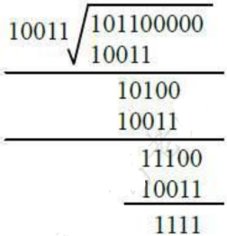
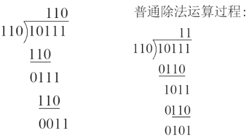

# 校验码

## 最佳实践

### 考察问

1. 奇偶校验
    1. 校验步骤
        1. 在`()`一位将`()`的个数配成奇数个或偶数个
        2. 发送和接收都检验1的个数是奇数个还是偶数个
    2. `()`检错, `()`纠错
2. 循环冗余校验原理
    1. 循环冗余校验步骤
        1. 被除数: `()`+`()`(从`()`次项开始计算, 不包含常数项)
        2. 除数: 多项式每项是否存在(从`()`次项)
        3. 模2除法: 相同为`()`, 不同为`()`, 不进位, 不退位, 余数既为校验码
    2. `()`检错, `()`纠错
3. 海明码长度计算公式
    1. 计算步骤:
        1. 根据原数据确定原数据位数$k$, k是数据的`()`
        2. 枚举$r$, 找到满足$2^{r}\geq k + r + 1$的`()`的$r$
        3. 海明码长度为$`()`$
    2. `()`检错, `()`纠错

### 考察点

1. 奇偶校验
    1. 校验步骤
        1. 在`最后`一位将`1`的个数配成奇数个或偶数个
        2. 发送和接收都检验1的个数是奇数个还是偶数个
    2. `可`检错, `不可`纠错
2. 循环冗余校验原理
    1. 循环冗余校验步骤
        1. 被除数: `原数据`+`多项式阶数个0`(从`1`次项开始计算, 不包含常数项)
        2. 除数: 多项式每项是否存在(从`0`次项)
        3. 模2除法: 相同为`0`, 不同为`1`, 不进位, 不退位, 余数既为校验码
    2. `可`检错, `不可`纠错
3. 海明码长度计算公式
    1. 计算步骤:
        1. 根据原数据确定原数据位数$k$, k是数据的`长度`
        2. 枚举$r$, 找到满足$2^{r}\geq k + r + 1$的`最小`的$r$
        3. 海明码长度为$`k+r`$
    2. `可`检错, `可`纠错

## 奇偶校验(parity check)

奇偶校验码通过在编码中增加一位校验位，使编码中`1的个数`为奇数(奇校验)或偶数(偶校验)。

|数据|奇校验|偶校验|
| ---- | ---- | ---- |
|1011001|1011001 1|1011001 0|

🔒发送方传输的数据是"1011001"，有4个偶数个"1", 如果采用奇校验，那么需要添加一个校验位，使得整个数据中 “1”的个数为奇数, 所以校验位应为1，这样传输的数据就变成了"1011001 1"。

接收方收到数据后，会检查数据中 “1” 的个数是否为奇数。

1. 如果 “1” 的个数不是奇数，就说明数据在传输过程中出现了错误。
2. 如果是奇数，则可能有错, 也可能没错. 可能有错的原因如下:

    如果采用奇校验，传输的数据是"1011001 1"。假设在传输过程中发生了两位错误，比如第2位和第6位的数据发生了变化，从"1011001 1"变成了"1111011 1"。

    原数据中 “1” 的个数是 4 个，变化后 “1” 的个数是 6 个，增加校验码1后依然是奇数。此时，接收方按照奇校验规则检查，会认为数据没有错误，但实际上数据已经发生了两位错误。

## 循环冗余校验码(Cyclic Redundancy Check, CRC)

CRC的编码方法是:在`k位信息码`之`后`拼接`r位校验码`。

🔒假设原始信息串为10110，CRC的生成多项式为$G(x)=x^{4}+x+1$，求CRC校验码。

1. 在原始信息后添加多项式的`阶位`个0。在本题中，$G(x)$阶为4，则在原始信息串后加`4个0`，得到的新串为10110 0000，作为`被除数`。
2. 由多项式得到除数，多项式的`幂指数存在的位置记为1，不存在的位置记为0`。在本题中，$x$的幂指数4，1，0对应的变量都存在，而幂指数2，3对应的变量不存在，因此得到串10011。
3. 生成CRC校验码，将前两步得出的被除数和除数进行模2除法运算(既不进位也不借位的除法运算), 余数即为校验码。

    

    ✨`余数位数小于阶数，则余数左边用若干个0补齐`。若余数为11，$r=4$，则余数左边补两个0得到0011。
4. 生成最终发送信息串，将余数添加到原始信息后。本例中，原始信息为10110，添加余数1111后，结果为10110 1111。发送方将此数据发送给接收方。
5. 接收方进行校验。接收方的CRC校验过程与生成过程类似，接收方接收了带校验和的帧后，用多项式G(x)来除。若余数为0，则表示信息正确；否则要求发送方进行重传。

✨模2除法是指在做除法运算的过程中`不计其进位`的除法, 相同为0不同为1。和普通除法有何区别如下图：

✨被除数补0是多项式个数, 从1开始计算. 除数是从0开始计算, 有则为1, 没有则为0.

## 海明码(Hamming code)

海明码是一种多重奇偶校验码，具备检错和纠错功能。海明不等式$2^{r}\geq k + r + 1$来确定`校验码位数`$r$，其中$k$为`信息位数`

🔒求二进制数据101101的海明码长度。

对于二进制数据101101，其海明码长度的计算过程如下：

- 首先根据海明不等式$2^{r}\geq k + r + 1$来确定校验码位数$r$，其中$k$为信息位数，这里$k = 6$。
- 当$r = 3$时，$2^{3}=8$，$6 + 3 + 1=10$，$8<10$，不满足不等式。
- 当$r = 4$时，$2^{4}=16$，$6 + 4 + 1=11$，$16>11$，满足不等式。所以校验码位数$r = 4$。
- 海明码长度等于信息位与校验位的位数之和，即$6 + 4 = 10$位。

所以，二进制数据101101的海明码长度是10位。

## 校验码分类总结

|  |校验码位数|校验码位置|检错|纠错|校验方式|
| ---- | ---- | ---- | ---- | ---- | ---- |
|奇偶校验|1|拼接在信息位尾部|可检奇数位错|不可纠错|奇校验：最终1的个数是奇数个； 偶校验：最终1的个数是偶数个|
|CRC循环冗余校验|生成多项式最高次幂决定|拼接在信息位尾部|可检错|不可纠错|模2除法求余数，拼接作为校验位|
|海明校验|$2^{r}\geq m + r + 1$($r$为校验码位数，$m$为信息位位数)|插入在信息位中间($2^{k}$位置)|可检错|可纠错|分组奇偶校验|
