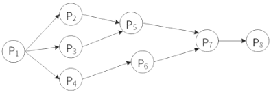
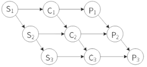
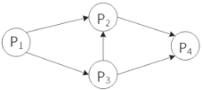
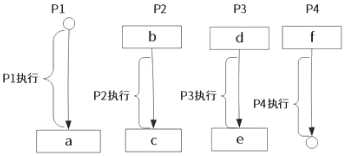
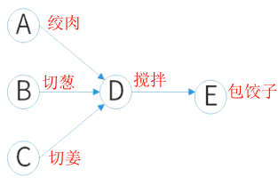
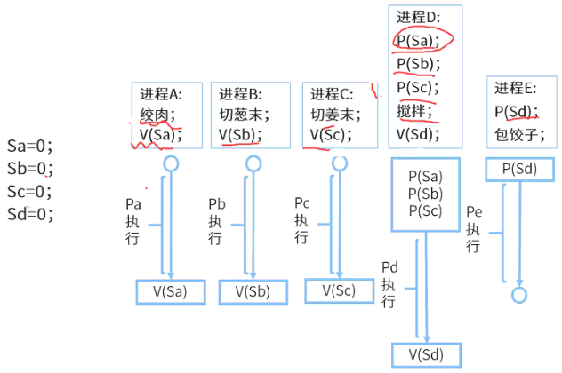

# 前趋图与PV操作

## 最佳实践

### 题目总结

1. 🟨前趋图(Precedence Graph)是一个有向无环图，记为：→={(Pi, Pj)|Pi 完成后 Pj 才能开始}。假设系统中进程P={P1，P2，P3，P4，P5，P6，P7，P8}，且进程的前驱图如下：

    

    那么前驱图可记为：(  )

    - A. →={(P2,P1),(P3,P1),(P4,P1),(P4,P6),(P7,P5),(P7,P6),(P8,P7)}
    - B. →={(P1,P2),(P1,P3),(P1,P4),(P2,P5),(P5,P7),(P6,P7),(P7,P8)}
    - C. →={(P1,P2),(P1,P3),(P1,P4),(P2,P5),(P3,P5),(P4,P6),(P5,P7),(P6,P7),(P7,P8)}
    - D. →={(P2,P1),(P3,P1),(P4,P1),(P5,P2),(P5,P3),(P6,P4),(P7,P5),(P7,P6),(P8,P7)}

    答案： C

2. 🟨某计算机系统中有一个CPU、一台扫描仪和一台打印机。现有三个图像任务，每个任务有三个程序段：扫描Si，图像处理Ci和打印Pi (i = 1，2，3)。下图为三个任务各程序段并发执行的前驱图，其中，(  )可并行执行，(  )的直接制约，(  )的间接制约。

    

    - A. “C1S2”，“P1C2S3”，“P2C3”
    - B. “C1S1”，“S2C2P2” ，“C3P3”
    - C. “S1C1P1”，“S2C2P2” ，“S3C3P3”
    - D. “S1S2S3”，“C1C2C3”，“P1P2P3”

    - A. S1受到S2和S3、C1受到C2和C3、P1受到P2和P3
    - B. S2和S3受到S1、C2和C3受到C1、P2和P3受到P1
    - C. C1和P1受到S1、C2和P2受到S2、C3和P3受到S3
    - D. C1和S1受到P1、C2和S2受到P2、C3和S3受到P3

    - A. S1受到S2和S3、C1受到C2和C3、P1受到P2和P3
    - B. S2和S3受到S1、C2和C3受到C1、P2和P3受到P1
    - C. C1和P1受到S1、C2和P2受到S2、C3和P3受到S3
    - D. C1和S1受到P1、C2和S2受到P2、C3和S3受到P3

    答案: ACB

3. 🟨进程P1、P2、P3和P4的前趋图如下所示：

    

    若用PV操作控制进程P1~P4并发执行的过程，则需要设置5个信号量S1、S2、S3、S4和S5，且信号量S1-S5的初值都等于0。下图中a、b和c处应分别填写(  )；d、e和f处应分别填写(  )。

    

    - A. V(S1)V(S2)、P(S1)V(S3)和V(S4)
    - B. P(S1)V(S2)、P(S1)P(S2)和V(S1)
    - C. V(S1)V(S2)、P(S1)P(S3)和V(S4)
    - D. P(S1)P(S2)、V(S1)P(S3)和V(S2)

    - A. P(S2)、V(S3)V(S5)和P(S4)P(S5)
    - B. V(S2)、P(S3)V(S5)和V(S4)P(S5)
    - C. P(S2)、V(S3)P(S5)和P(S4)V(S5)
    - D. V(S2)、V(S3)P(S5)和P(S4)V(S5)

    答案: CA

### 考察问

1. 前趋图
    1. 节点表示(), 箭头表示()
    2. 箭头流出端(P/V)操作, 流入端(P/V)操作
    3. 直接制约是()操作, 间接制约是()操作

### 考察点

1. 前趋图
    1. 节点表示`进程`, 箭头表示`依赖`
    2. 前趋箭头流出端V操作, 后继流入端P操作
    3. 箭头线段上是信号量
    4. 直接制约是`不同`操作, 间接制约是`相同`操作

## 前趋图

节点表示进程, 箭头表示进程与进程的依赖关系. 如下图进程A是进程D的前趋, 进程D是进程A的后继. 只有在前趋进程完成后, 才能开始后继进程.

箭头流出对应V操作, 箭头流入对应P操作:

1. 前趋进程使用V操作, 告诉后继产出资源
2. 后继使用P操作检查结果.

Pa没有前趋, 不需要进行PV操作, 完成后产生资源, 进行V操作
