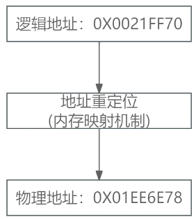
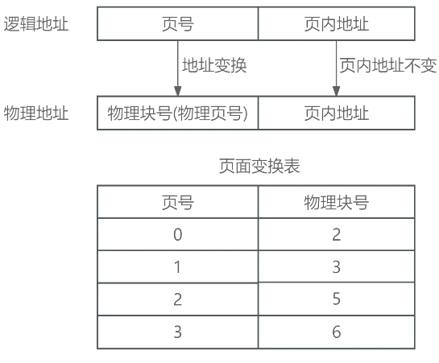
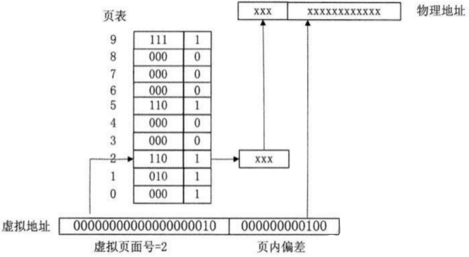
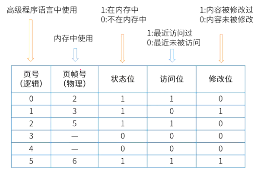
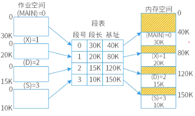
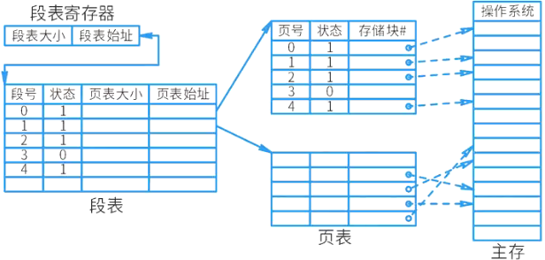

# 存储管理

## 最佳实践

### 题目总结

1. 逻辑物理映射题目
    1. 通过`页面大小`(一般为4Kb, 12比特位, 二进制数12位, 十六进制数3位)和逻辑地址, 找到页号
    2. 通过页号查到块号(页帧号)
    3. 将块号和页内地址拼合成物理地址
2. 页面置换算法
    1. 先筛选状态为1的
    2. 然后看访问位为0的
    3. 再替换修改为为0的

3. 段式存储: 逻辑大小不能大于段长

### 考察问

- 基本概念:
    - 逻辑地址是由操作系统分配给程序使用的`()`
    - 物理地址是`()`于计算机系统中的地址
    - 地址映射是将`()`变换成主存`()`的过程.

- 页式存储
    - 逻辑物理映射
        - 页号: 进程P有8个页面, 所以表格的页号是`()`
        - 页面: 页面大小为4k, 既`()`个页内地址,
        - 逻辑地址为十六进制5148H = `()` + `()`
            - 16进制的后`()`位是2进制的12位, 对应了页内地址
            - 16进制的第`()`位, 是页号
        - 物理地址 = `()` + `()`
            - 通过页号查到页帧号, 并替换
            - 逻加上页内地址
    - 页面置换算法
        - 筛选(状态位or访问位or修改位)位为1的
        - 先替换(状态位or访问位or修改位)位0的
        - 如果访问位都为1再替换(状态位or访问位or修改位)为0的
- 段式存储
    - 定位(段号or段长)
    - 比较(段号or段长)

### 考察点

- 基本概念:
    1. 逻辑地址是由操作系统分配给程序使用的`虚拟`地址
    2. 物理地址是`实际`存在于计算机系统中的地址
    3. 地址映射是将`逻辑地址`变换成主存`物理地址`的过程
    4. `逻辑`地址是`固定`的映射的`虚拟`地址是`随机`的

- 页式存储
    - 逻辑物理映射

        - 页号: 进程P有8个页面, 所以表格的页号是`0~7`
        - 页面: 页面大小为4k, 既`2^{12}`个页内地址,
        - 逻辑地址为十六进制5148H = `页号` + `页内地址`
            - 16进制的后`3`位是2进制的12位, 对应了页内地址
            - 16进制的第`1`位, 是页号
        - 物理地址 = `页帧号` + `页内地址`
            - 通过页号查到页帧号, 并替换
            - 逻加上页内地址
    - 页面置换算法
        - 筛选`状态`位为1的
        - 先替换`访问`位位0的
        - 如果访问位都为1再替换`修改`位为0的

- 段式存储: `存储范围`不能超过`段长`

## 地址重定位

1. 逻辑地址

    `逻辑地址`是由`操作系统`分配给`程序`使用的`虚拟地址`，它是在程序中使用的地址，而不是实际存在的地址，也被称为虚拟地址。

2. 物理地址

    `物理地址`是`实际存在`于计算机系统中的`地址`，也称为实际地址。物理地址是存储器的绝对地址，范围从00000H～FFFFFH，是CPU访问存储器时由地址总线发出的地址。

3. 地址映射

    将`逻辑地址`变换成主存`物理地址`的过程. 定义变量时，变量的地址并不是实际的物理地址，而是操作系统分配的逻辑地址(虚拟地址)。这个逻辑地址通过地址映射得到真正的物理地址。在程序编译时，变量的`虚拟内存地址`是`固定的`，然而映射的`物理内存地址`是`随机的`。

## 分区存储管理

分区存储管理: 将主存的用户区划分成若干个区域，每个区域分配给一个用户作业使用，并限定它们只能在自己的区域中运行。主要目的是解决多个用户使用主存。

按划分方式不同，分区存储可分为：

1. 固定分区：静态分区方式，将主存划分成若干个固定的分区，将要运行的作业装配进去，由于分区固定，且与作业大小可能不同，会产生碎片，造成空间浪费。
2. 可变分区：动态分区方式，主存空间的分区在作业装入时划分，分区大小与作业大小相同。可变分区的请求与释放算法：
    1. 最佳适应算法：假设系统中有n个空白分区，当用户申请空间时，从这n个空白分区中找到一个最接近用户需求的分区。可能会产生许多无用的小分区，成为外碎片。
    2. 最差适应算法：系统总是将用户作业装入最大的空白分区。
    3. 首次适应算法：系统从主存的低地址开始选择一个能装入作业的空白分区。
    4. 循环首次适应算法：每次分配都是从刚分配的空白分区开始寻找一个能满足用户要求的空白分区。

3. 可重定位分区：可解决碎片问题，移动所有已经分配好的分区，使之成为连续区域。在用户请求空间得不到满足或某个作业执行完毕时进行。

## 页式存储

分区管理方案的主要问题是用户程序必须装入连续的地址空间中，若无法满足用户要求的连续空间，需要进行分区靠拢操作，这是以耗费系统时间为代价的。为此，引入了分页存储管理方案。

### 逻辑物理映射

页式存储：将进程的地址空间划分成若干个大小相等的区域，称为页。相应地，将主存划分成与页相同的若干个物理块，称为块。在为进程分配主存时，将进程中若干页分别装入多个不相邻的块中。

逻辑地址到物理地址的映射实际上是通过页号到块号的来实现的。

- 逻辑地址 = 页号 + 页内地址
- 物理地址 = 块号(页帧号) + 页内地址
- 页内地址是不变的

🌰页式存储系统中，每个页的大小为4Kb，现有逻辑地址为`10 1100 1101 1110`, 其对应的物理地址应为多少？

1. 每个页的大小为4Kb，可以求出页内地址的位数为2^2*2^10 = 2^12 bit，既12位
2. 去掉逻辑地址的页内地址，既后12位，可得逻辑地址的二进制页号`10`, 转为十进制为`3`
3. 查逻辑物理映射表, 获得十进制块号`6`, 转换为二进制`110`
4. 将块号和页内地址组合成物理地址：`110 1100 1101 1110`

🔒题目

1. 某计算机系统页面大小为4Kb，进程P1的页面变换表如下，若P1要访问数据的逻辑地址为十六进制1B1AH，那么该逻辑地址经过变换后，其对应的物理地址应为十六进制(  )。

    |页号|物理块号|
    | ---- | ---- |
    |0|1|
    |1|6|
    |2|3|
    |3|8|

    - A. 1B1AH
    - B. 3B1AH
    - C. 6B1AH
    - D. 8B1AH

    答案: C

    1. 页大小为4K(=4*1024 = 4096 = 2^12)，所以页内地址长度需要12位二进制表示。
    2. 逻辑地址1B1AH，其中低12位二进制B1AH为页内地址，剩余高位1H为页号，转化为十进制为1。
    3. 查表可知：页号1对应的物理块号为6，十六进制为6H，把原来的1B1AH中的1换成6即可(因为其页内地址不变)，即最终物理地址为6B1AH。

    ✨注意这里的H不是数字, 而是标识十六进制

2. 分页内存管理的核心是将虚拟内存空间和物理内存空间皆划分成大小相同的页面，并以页面作为内存空间的最小分配单位。下图给出了内存管理单元的虚拟地址到物理地址的翻译过程，假设页面大小为4Kb，那么CPU发出虚拟地址0010000000000100后，其访问的物理地址是(  )。

    

    - A. 110000000000100
    - B. 010000000000100
    - C. 110000000000000
    - D. 110000000000010

    答案: A

    图中第一列表示物理块号, 第二列不知道什么意思

    ✨2进制向10进制的转换. 将一个数用进制表示, 位上面的值 * 进制^位数(从0开始)

### 页面置换算法

有时候，进程空间分为10个页面，而系统内存只有3个物理块，无法一次性全部分配，就需要先分配一部分进程，再根据算法进行淘汰，淘汰的算法称为页面置换算法。

缺页：需要执行的页不在物理内存中，需要从外部调入内存。会增加执行时间，因此缺页次数越多，系统效率越低。

1. 最佳置换算法：理想化的算法，选择最长时间不再被访问的页面置换。
2. 先进先出置换算法：淘汰最先进入主存的页面，即选择在主存中驻留时间最久的页面予以淘汰。
3. 最近最少未使用置换算法：选择最近最少未使用的页面予以淘汰，根据局部性原理，这种方式效率较高。
4. 最近未用置换算法：优先淘汰最近未访问的，而后淘汰最近未被修改的页面。

图中, 页号为3,4状态位为0(不在内存中), 要想将3或4送入内存中, 则要在0,1,2,5中先选访位位0, 如果访问位相同, 再挑选修改位都为0的(开销小).

🔒题目

1. 进程P有8个页面，页号分别为0~7，页面大小为4Kb，假设系统给进程P分配了4个存储块，进程P的页面变换表如下所示。表中状态位等于1和0分别表示页面在内存和不在内存。若进程P要访问的逻辑地址为十六进制5148H，则该地址经过变换后，其物理地址应为十六进制(  )；如果进程P要访问的页面6不在内存，那么应该淘汰页号为(  )的页面。

    |页号|页帧号|状态位|访问位|修改位|
    | ---- | ---- | ---- | ---- | ---- |
    |0| - |0|0|0|
    |1|7|1|1|0|
    |2|5|1|0|1|
    |3| - |0|0|0|
    |4| - |0|0|0|
    |5|3|1|1|1|
    |6| - |0|0|0|
    |7|9|1|1|0|

    - A. 3148H
    - B. 5148H
    - C. 7148H
    - D. 9148H

    - A. 1
    - B. 2
    - C. 5
    - D. 9

    答案: AB

    1. 页号: `进程P有8个页面`, 所以表格的页号是0~7
    2. 页面: `页面大小为4k`, 既$2^{12}$个页内地址,
    3. 逻辑地址: `逻辑地址为十六进制5148H`, 16进制的后3位是2进制的12位, 对应了页内地址; 16进制的第1位, 是页号.
    4. 页帧号: 物理地址, 通过页号查到页帧号, 并替换, 逻辑地址中的页面不变.
    5. 状态位: `给进程P分配了4个存储块`, 状态为有4个为1
    6. 先替换访问位位0的, 如果访问位都为1再替换修改位为0的

## 段式存储

将进程空间划分成若干个段，每段也有段号和段内地址，每段是一组完整的逻辑信息.

分页与分段的区别：分页是根据物理空间划分，每页大小相同；分段是根据逻辑空间划分，每段是一个完整的功能，便于共享，但是大小不同。

下图中, 基址是指在内存中开始的地址值. 黄色区域表示其他作业已经占用的空间.

🔒问题

1. 假设系统采用段式存储管理方法，进程P的段表如下所示。逻辑地址(  )不能转换为对应的物理地址；不能转换为对应的物理地址的原因是进行(  )。

    |段号|基地址|段长|
    | ---- | ---- | ---- |
    |0|1100|800|
    |1|3310|50|
    |2|5000|200|
    |3|4100|580|
    |4|2000|100|

    - A. (0,790)和(2,88)
    - B. (1,30)和(3,290)
    - C. (2,88)和(4,98)
    - D. (0,810)和(4,120)

    - A. 除法运算时除数为零
    - B. 算术运算时有溢出
    - C. 逻辑地址到物理地址转换时地址越界
    - D. 物理地址到逻辑地址转换时地址越界

    答案: DC

    ✨逻辑地址不能超过段长, 但可以小于段长

## 段页式存储

段页式存储：段式与页式的综合体。先分段，再分页。1个程序有若干个段，每个段中可以有若干页，每个页的大小相同，但每个段的大小不同。

