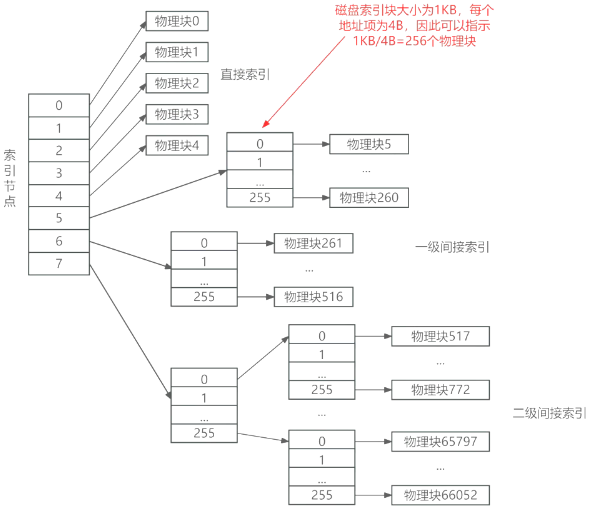
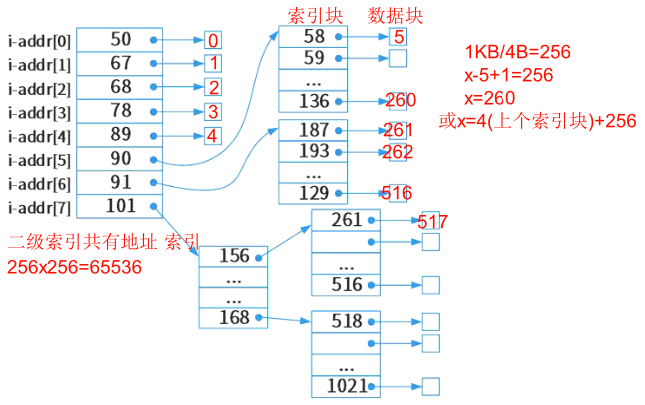
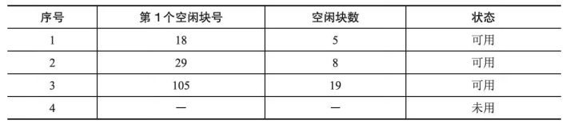
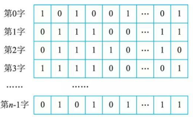
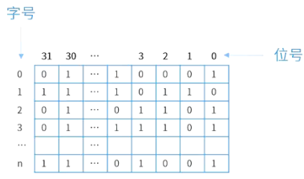
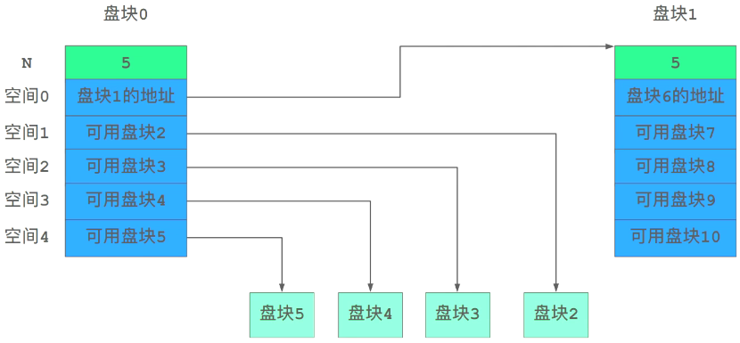

# 文件系统

## 最佳实践

### 题目总结

1. 索引块计算
    1. 计算`地址项个数` = `磁盘索引块大大小`/`地址项大小`, 一般是1KB/4B=256
    2. 计算每个物理块的起始点和结束点
        1. 直接索引, 开始为0, 结束为a
        2. 一级间接索引
            1. 第1个一级间接索引, 开始为a+1, 结束为b = a+256
            2. 第2个一级间接索引, 开始为b+1, 结束为c = b+256
        3. 二级间接索引: 开始为c+1, 结束为c+256*256
    3. 计算文件最大长度 = 磁盘数据块大小(一般给1KB) * 索引的总长度(直接索引+间接索引)

    ✨此类题目的图片左边是物理块, 右边是索引块

2. 位视图字计算
    1. 物理块的个数 = 物理号 + 1(因为物理号从0开始)
    2. 字 = 物理块的个数/字长(字长一般为32)
    3. 字个数 = 物理块个数/字长

3. 位图大小计算
    1. 总页数 = 物理内存/页的大小
    2. 总页数等于比特位数, 转换为字节即可

### 考察问

1. 1个磁盘索引块包含多个地址项, 地址项个数 = `()`/`()`
2. 磁盘索引块的一个地址项对应一个`()`
3. `(左/右)`是索引块(物理块), `(左/右)`是数据块(逻辑块)
    1. 索引块(物理块)地址项的序号是随机的
    2. 数据块(逻辑块)的序号是顺序的, 从0开始
4. 三级索引结构
    1. 一级索引, 一个物理块(索引快)对应`一个`逻辑块(数据块)
    2. 二级索引, 一个物理块(索引块)对应`多个`个逻辑块
    3. 三级索引, 一个物理块(索引块)对应`多个*多个`个逻辑块
5. 位示图
    1. 位号是指(行or列)号
    2. 字号是指(行or列)号
    3. 编号从(0or1)开始

### 考察点

1. 索引结构计算
    1. 1个索引块(节点)包含多个地址项, 地址项个数 = `磁盘索引块大大小`/`地址项大小`
    2. 一个`地址项`对应一个`磁盘数据块`
    3. `左边`是索引块(物理块), `右边`是数据块(逻辑块)
        1. 索引块(物理块)地址项的序号是随机的
        2. 数据块(逻辑块)的序号是顺序的, 从0开始
    4. 三级索引结构
        1. 一级索引, 一个物理块(索引块)对应一个逻辑块(数据块)
        2. 二级索引, 一个物理块(索引块)对应256个逻辑块
        3. 三级索引, 一个物理块(索引块)对应256*256个逻辑块
    5. 序号的计算, 用上一逻辑块的最后一个数据块的序号, 加上1得到该逻辑块对应数据块的开始, 加上256得到该逻辑块对应数据块的结束

    ✨256由1KB/4B计算得来, 题目一般都这样设计
2. 位示图
    1. 位号, 列号
    2. 字号, 行号
    3. 编号从0开始, 可以先+1计算容量更容易理解

## 文件与文件系统

文件 (File) 是具有符号名的、在逻辑上具有完整意义的一组相关信息项的集合，例如，一个源程序、一个目标程序、编译程序、一批待加工的数据和各种文档等都可以各自组成一个文件。一个文件包括文件体和文件说明。文件体是文件真实的内容；文件说明是操作系统为了管理文件所用到的信息，包括文件名、文件内部标识、文件类型、文件存储地址、文件长度、访问权限、建立时间和访问时间等。

文件系统是操作系统中实现文件统一管理的一组软件和相关数据的集合，是专门负责管理和存取文件信息的软件机构。

## 文件的类型

1. 按文件的性质和用途分类可将文件分为系统文件、库文件和用户文件。
2. 按信息保存期限分类可将文件分为临时文件、档案文件和永久文件。
3. 按文件的保护方式分类可将文件分为只读文件、读／写文件、可执行文件和不保护文件。
4. UNIX 系统将文件分为普通文件、目录文件和设备文件(特殊文件)。

目前常用的文件系统类型有 FAT、 VFAT 、 NTFS 、 Ext2 和 HPFS 等。

## 文件的结构和组织

文件的结构是指文件的组织形式。从用户角度看到的文件组织形式称为文件的逻辑结构，从实现的角度看，文件在文件存储器上的存放方式称为文件的物理结构。

1. 文件的逻辑结构

    文件的逻辑结构可分为两大类：一是有结构的记录式文件，它是由一个以上的记录构成的文件；二是无结构的流式文件，它是由一串顺序字符流构成的文件。

2. 文件的物理结构

    文件的物理结构是指文件的内部组织形式，即文件在物理存储设备上的存放方法。绍几种常见的文件物理结构。

    1. 连续结构

        连续结构也称顺序结构，它将逻辑上连续的文件信息(如记录)依次存放在连续编号的物理块上。只要知道文件的起始物理块号和文件的长度，就可以很方便地进行文件的存取。

    2. 链接结构

        链接结构也称串联结构，它是将逻辑上连续的文件信息(如记录)存放在不连续的物理块上，每个物理块设有一个指针指向下一个物理块。因此，只要知道文件的第 1 个物理块号，就可以按链指针查找整个文件。

    3. 索引结构

        在采用索引结构时，将逻辑上连续的文件信息(如记录)存放在不连续的物理块中，系统为每个文件建立一张索引表。索引表记录了文件信息所在的逻辑块号对应的物理块号，并将索引表的起始地址放在与文件对应的文件目录项中。

    4. 多个物理块的索引表

        索引表是在文件创建时由系统自动建立的，并与文件一起存放在同一文件卷上。根据一个文件大小的不同，其索引表占用物理块的个数不等，一般占一个或几个物理块。多个物理块的索引表可以有两种组织方式：链接文件和多重索引方式。

在UNIX文件系统中采用的是三级索引结构，其文件索引表项分4种寻址方式：直接寻址、一级间接寻址、二级间接寻址和三级间接寻址。

🌰三级索引文件结构举例：设文件索引节点中有8个地址项i_addr[0]～i_addr[7]，每个地址项大小为4字节，其中

1. i_addr[0]～i_addr[4]采用直接地址索引
2. i_addr[5]和i_addr[6]采用一级间接地址索引
3. i_addr[7]采用二级间接地址索引，磁盘索引块和磁盘数据块大小均为1KB。

🔒题目:

1. 假设文件系统采用索引节点管理，且索引节点有8个地址项addr[0]~addr[7]，每个地址项大小为4字节，addr[0]~addr[4]采用直接地址索引，addr[5]和addr[6]采用一级间接地址索引，addr[7]采用二级间接地址索引。假设磁盘索引块和磁盘数据块大小均为1KB字节，文件File1的索引节点如下图所示。若用户访问文件File1中逻辑块号为5和261的信息，则对应的物理块号分别为 (  ) ；101号物理块存放的是 (  ) 。

    

    - A. 89和90
    - B. 89和136
    - C. 58和187
    - D. 90和136

    - A. File1的信息
    - B. 直接地址索引表
    - C. 一级地址索引表
    - D. 二级地址索引表

    答案: CD

    1. 磁盘索引块为1KB, 每个地址项为4B, 则该磁盘索引块共有1KB/4B=256个地址项
    2. 直接索引, 开始为0, 结束为4
    3. 一级间接索引
        1. 第1个一级间接索引, 开始为5, 结束为4+256=260. ✨上一个索引的结束编号是4, 本索引共有256个空位
        2. 第2个一级间接索引, 开始为261, 结束为260+256=516.
    4. 二级间接索引: 开始为517, 结束为516+ 256*256 = 516+65536 = 66052

    ✨左边是物理块号, 右边是逻辑块号

2. 某文件系统文件存储采用文件索引节点法。假设磁盘索引块和磁盘数据块大小均为1KB，每个文件的索引节点中有8个地址项iaddr[0]~iaddr[7]，每个地址项大小为4字节，其中iaddr[0]~iaddr[5]为直接地址索引，iaddr[6]是一级间接地址索引，iaddr[7]是二级间接地址索引。如果要访问jicwutil.dll文件的逻辑块号分别为0、260和518，则系统应分别采用(  )。该文件系统可表示的单个文件最大长度是(  )KB。

    - A. 直接地址索引、一级间接地址索引和二级间接地址索引
    - B. 直接地址索引、二级间接地址索引和二级间接地址索引
    - C. 一级间接地址索引、一级间接地址索引和二级间接地址索引
    - D. 一级间接地址索引、二级间接地址索引和二级间接地址索引

    - A. 518
    - B. 1030
    - C. 16514
    - D. 65798

    答案: AD

    1. 0~5直接索引, 对应逻辑块[0, 5]
    2. 6一级间接索引, 对应逻辑块[6, 261], 总长度256
    3. 7二级间接索引, 对应逻辑块[262, ], 总长度256 x 256
    4. 总长度(6+256+65536)x1KB

3. 某文件系统文件存储采用文件索引节点法。每个文件索引节点中有8个地址项，每个地址项大小为4字节，其中5个地址项为直接地址索引，2个地址项是一级间接地址索引，1个地址项是二级间接地址索引。磁盘索引块和磁盘数据块大小均为1KB。若要访问iclsClient.dll文件的逻辑块号分别为1、518，则系统应分别采用(  )。

    - A. 直接地址索引和直接地址索
    - B. 直接地址索引和一级间接地址索引
    - C. 直接地址索引和二级间接地址索
    - D. 一级间接地址索引和二级间接地址索引

    答案：C

    1. 直接地址索引有5个地址项，对应逻辑块号0~4。
    2. 一级间接索引有2个地址项，每个地址项对应1KB/4B = 1024B/4B = 256个物理块，对应逻辑块号范围是5~516。
    3. 二级间接索引有一个地址项，对应256×256 = 65536个物理块，对应逻辑块号范围是517以上。

## 文件存取的方法和存储空间的管理

1. 文件的存取方法

    文件的存取方法是指读／写文件存储器上的一个物理块的方法。通常有顺序存取和随机存取两种方法。

    - 顺序存取方法是指对文件中的信息按顺序依次进行读／写
    - 随机存取方法是指对文件中的信息可以按任意的次序随机地读／写。

2. 文件存储空间的管理

    要将文件保存到外部存储器(简称外存或辅存)上，首先必须知道存储空间的使用情况，即哪些物理块是被“占用”的，哪些是“空闲＂的。

    外存空闲空间管理的数据结构通常称为磁盘分配表(Disk Allocation Table)。常用的空闲空间管理方法有空闲区表、位示图和空闲块链3种。

    1. 空闲区表。将外存空间上的一个连续的未分配区域称为“空闲区＂。操作系统为磁盘外存上的所有空闲区建立一张空闲表，每个表项对应一个空闲区，空闲表中包含序号、空闲区的第 1 块号、空闲块的块数和状态等信息，如下表所示。它适用于连续文件结构。

        

    2. 位示图。这种方法是在外存上建立一张位示图(Bitmap),记录文件存储器的使用情况。每一位对应文件存储器上的一个物理块，取值0和1分别表示空闲和占用。例如，某文件存储器上位示图的大小为n, 物理块依次编号为0, 1, 2, …。假如计算机系统中字长为32位，那么在位示图中的第0个字(逻辑编号)对应文件存储器上的o, 1,  2, … ,31 号物理块；第1个字对应文件存储器上的32, 33,  34, …, 63 号物理块，依此类推.

        

        🔒题目:

        1. 某文件管理系统在磁盘上建立了位示图，记录磁盘的使用情况。若系统的字长为32位，磁盘上的物理块依次编号为：0、1、2、...，那么4096号物理块的使用情况在位示图的第( )个字中描述；若磁盘的容量为200GB，物理块的大小为1MB，那么位示图的大小为( )个字。

            

            - A. 129
            - B. 257
            - C. 513
            - D. 1025

            - A. 600
            - B. 1200
            - C. 3200
            - D. 6400

            答案: AD

            1. 系统的字长为32位，可记录32个物理块
            2. 4096号物理块, 对应的是第4097个物理块,因为编号从0开始
            3. 4097/32=128余1, 所以是在第129子的第1位, 位号为0
            4. 磁盘有200GB/1MB = 204800个物理块，故位示图大小为204800/32 = 6400个字。

        2. (✨2025上)操作系统采用页式存储管理，用位图管理空闲页框，若页大小为4KB，物理内存大小为16GB，则位图所占内存空间大小是( )KB。

            - A. 64
            - B. 512
            - C. 256
            - D. 128

            答案: B

            位示图是利用二进制的一位来表示磁盘中的一个盘块的使用情况。一般把“1”作为盘块已分配的标记，把“0”作为空闲标志。

            1. 物理内存大小为16GB，若页大小为4KB，那么该内存有`16GB/4KB = 4*1024*1024` 个页, 需要`4*1024*1024`个比特位
            2. `4*1024*1024/8/1024 = 512KB`

    3. 空闲块链。每个空闲物理块中有指向下一个空闲物理块的指针，所有空闲物理块构成一个链表，链表的头指针放在文件存储器的特定位置上(如管理块中)，不需要磁盘分配表，节省空间。每次申请空闲物理块只需根据链表的头指针取出第 1 个空闲物理块，根据第一个空闲物理块的指针可找到第 2 个空闲物理块，依此类推。

        

    4. 成组链接法。 UNIX 系统采用该方法。例如，在实现时系统将空闲块分成若干组，每100 个空闲块为一组，每组的第 1 个空闲块登记了下一组空闲块的物理盘块号和空闲块总数。假如某个组的第 1 个空闲块号等千 o, 意味着该组是最后一组，无下一组空闲块。

        

## 文件共享和保护

1. 文件的共享

    1. 硬链接。文件的硬链接是指两个文件目录表目指向同一个索引结点的链接，该链接也称基千索引结点的链接。换句话说，硬链接是指不同文件名与同一个文件实体的链接。文件硬链接不利千文件主删除它拥有的文件，因为文件主要删除它拥有的共享文件，必须首先删除(关闭)所有的硬链接，否则就会造成共享该文件的用户的目录表目指针悬空。

    2. 符号链接。符号链接建立新的文件或目录，并与原来文件或目录的路径名进行映射，当访问一个符号链接时，系统通过该映射找到原文件的路径，并对其进行访问。采用符号链接可以跨越文件系统，甚至可以通过计算机网络连接到世界上任何地方的机器中的文件，此时只须提供该文件所在的地址以及在该机器中的文件路径。

2. 文件的保护

    存取控制，就是规定不同的用户对文件的访问有不同的权限，以防止文件被未经文件主同意的用户访问。

    1. 存取控制矩阵: 理论上，存取控制的方法可用存取控制矩阵实现，它是一个二维矩阵，一维列出计算机的全部用户，另一维列出系统中的全部文件，矩阵中的每个元素$A_{ij}$表示第i个用户对第j个文件的存取权限。通常，存取权限有可读 R、可写 W、可执行 X 以及它们的组合，

        以下是合并后的表格，涵盖所有用户及对应文件权限信息：

        | 文件\用户 | ALPHA | BETA | REPORT | SQRT | … |
        | ---- | ---- | ---- | ---- | ---- | ---- |
        | 张军 | RWX | — | R - X | — | … |
        | 王伟 | — | RWX | R - X | R - X | … |
        | 赵凌 | — | — | — | RWX | … |
        | 李晓钢 | R - X | — | RWX | R - X | … |
        | … | … | … | … | … | … |

    2. 存取控制表: 存取控制矩阵由于太大往往无法实现。一个改进的办法是按用户对文件的访问权力的差别对用户进行分类，由于某一文件往往只与少数几个用户有关，所以这种分类方法可使存取控制表简化。 UNIX 系统就是使用了这种存取控制表方法，它把用户分成三类：文件主、同组用户和其他用户，每类用户的存取权限为可读、可写、可执行以及它们的组合。

    3. 用户权限表: 改进存取控制矩阵的另一种方法是以用户或用户组为单位将用户可存取的文件集中起来存入表中，这称为用户权限表。表中的每个表目表示该用户对应文件的存取权限，这相当千存取控制矩阵一行的简化。

    4. 密码: 在创建文件时，由用户提供一个密码，在文件存入磁盘时用该密码对文件的内容加密。在进行读取操作时，要对文件进行解密，只有知道密码的用户才能读取文件。
