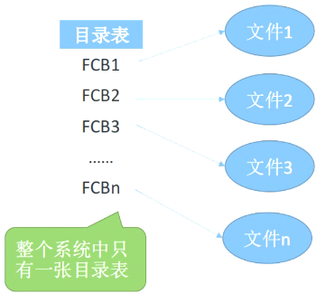

# 目录管理

## 概念

文件目录也是一种数据结构，用于标识系统中的文件及其物理地址，供检索时使用。

## 文件控制块

文件控制块(FCB)是用来存放控制文件需要的各种信息的数据结构，以实现“按名存取”。FCB的有序集合称为文件目录，一个FCB就是一个文件目录项。为了创建一个新文件，系统将分配一个FCB并存放在文件目录中，成为目录项。

文件控制块(FCB)主要包含以下信息：

- 基本信息，如文件名、文件的物理地址、文件的长度和文件块数等。
- 存储控制信息，如文件存取权限等。
- 使用信息，如文件建立时间、修改时间等。 

## 目录结构

常见的目录结构有3种：一级目录结构、二级目录结构和多级目录结构。

- 一级目录结构

    整个系统中只建立一张目录表，每个文件占一个目录项。 

    

- 二级目录结构

    早期的多用户操作系统，采用两级目录结构。分为主文件目录(MFD，MasterFile Directory)和用户文件目录(UFD，UserFlieDirectory)

    

- 多级目录结构

    在多道程序设计系统中常采用多级目录结构，这种目录结构像一棵倒置的有根树，所以也称为树形目录结构。从树根向下，每一个结点是一个目录，叶子结点是文件。Windows、UNIX、MS-DOS等操作系统均采用多级目录结构。

    
