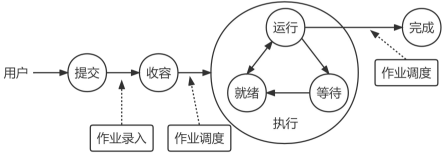

# 作业

## 作业概念

作业是系统为完成一个用户的计算任务(或一次事务处理)所做的工作总和。例如，对用户编写的源程序，需要经过编译、连接、装入以及执行等步骤得到结果，这其中的每一个步骤称为作业步。

作业由程序、数据和作业说明书3个部分组成。

## 作业状态及转换

作业的状态分为4种：提交、后备、执行和完成。其中，执行就是作业调入系统中执行，与进程执行状态类似。实际上，作业调度是比进程调度更加高级的调度。

作业控制块(JCB)：是记录与该作业有关的各种信息的登记表。是作业存在的唯一标志，包括用户名、作业名和状态标志等信息。

## 作业调度

### 作业调度算法

1. 先来先服务算法。按作业到达的先后进行调度，即启动等待时间最长的作业。
2. 短作业优先算法。优先调度运行时间最短的作业。
3. 响应比高优先算法。响应比高的作业优先调度。

    响应比$R_p = \frac{作业响应时间}{作业执行时间}=\frac{作业执行时间 + 作业等待时间}{作业执行时间}=1 + \frac{作业等待时间}{作业执行时间}$

    其中，作业响应时间为作业进入系统后的等待时间与作业的执行时间之和。
4. 优先级调度算法。优先级高的作业优先调度。
5. 均衡调度算法。根据系统的运行情况和作业本身的特性对作业进行分类。作业调度程序从这些不同类别的作业中挑选作业执行。

### 作业调度算法性能的衡量指标

在一个批量处理为主的系统中，通常用平均周转时间或平均带权周转时间来衡量调度性能的优劣。

作业周转时间 = 作业响应时间 = 作业等待时间 + 作业执行时间

作业的带权周转时间 = $\frac{作业响应时间}{作业执行时间}=1 + \frac{作业等待时间}{作业执行时间}$

系统的平均周转时间或平均带权周转时间越小，作业调度算法的性能越好。 

