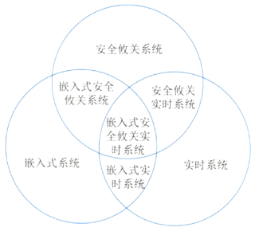

# 嵌入式操作系统(ES)

2. 嵌入式: 
    1. 题型: 单选题
    2. 分值: 3分
    3. 书本: 第2版教材2.4节(放弃)

## 最佳实践

### 考察问

1. 零碎知识
    1. 宿主机与目标机之间不仅需要建立`()`(如通信协议)，还需要`()`(如串口、USB、以太网等)，以实现程序下载、调试信息交互等操作
    2. 宿主机与目标机的通信方式`()`，除串口外，还可采用 USB、以太网(如 SSH、TFTP)、JTAG 调试接口等。
    3. 嵌入式系统的目标机通常架构特殊(如 `()`、MIPS 等)，与宿主机(如 `()` 架构的 PC)不兼容。因此，必须在宿主机上使用`()`编译器(如 arm-linux-gcc)，将源代码编译为目标机架构的可执行代码，才能在目标机上运行。
    4. 调试器(如 GDB)常运行于`()`机，被调试程序运行于`()`机，两者通过调试接口(如 JTAG、串口)连接，实现远程调试。
    5. 硬件抽象层(HAL)的核心功能是`()`，为操作系统和上层软件提供`()`的接口。
    6. 硬件抽象层(HAL)主要负责硬件`()`级的直接操作, 驱动程序属于`()`的一部分, 任务调度是`()`的核心功能建立在 HAL 之上
    7. 嵌入式系统通常面向`()`应用(如工业控制、智能家居等)，需根据硬件平台和功能需求`()`(如去除冗余驱动、协议栈)，并移植到`()`的处理器(如 ARM、RISC-V)。
    8. `()`多任务调度是嵌入式操作系统的核心能力之一
    9. 可靠性高，无需人工干预独立运行，并处理各类事件和故障
    10. 嵌入式系统是以应用为中心，以现代计算机技术为基础，能够根据用户需求`()`、`()`、`()`、`()`和`()`灵活裁剪软硬件模块的专用计算机系统。
    11. 嵌入式实时操作系统与一般操作系统相比，`()`可剪裁性, `()`实时性, `()`可固化性特点, `()`通用性
    12. 大多数嵌入式系统都具备实时特征，其典型架构可概括为`()`模式架构和`()`模式架构两种模型。

### 考察点

1. 零碎知识
    1. 宿主机与目标机之间不仅需要建立`逻辑连接`(如通信协议)，还需要`物理连接`(如串口、USB、以太网等)，以实现程序下载、调试信息交互等操作
    2. 宿主机与目标机的通信方式`多样`，除串口外，还可采用 USB、以太网(如 SSH、TFTP)、JTAG 调试接口等。
    3. 嵌入式系统的目标机通常架构特殊(如 `ARM`、MIPS 等)，与宿主机(如 `x86` 架构的 PC)不兼容。因此，必须在宿主机上使用`交叉`编译器(如 arm-linux-gcc)，将源代码编译为目标机架构的可执行代码，才能在目标机上运行。
    4. 调试器(如 GDB)常运行于`宿主`机，被调试程序运行于`目标`机，两者通过调试接口(如 JTAG、串口)连接，实现远程调试。
    5. 硬件抽象层(HAL)的核心功能是`屏蔽底层硬件差异`，为操作系统和上层软件提供`统一`的接口。
    6. 硬件抽象层(HAL)主要负责硬件`寄存器`级的直接操作, 驱动程序属于`操作系统内核`的一部分, 任务调度是`操作系统内核`的核心功能建立在 HAL 之上
    7. 嵌入式系统通常面向`特定`应用(如工业控制、智能家居等)，需根据硬件平台和功能需求`裁剪内核模块`(如去除冗余驱动、协议栈)，并移植到`不同架构`的处理器(如 ARM、RISC-V)。
    8. `支持`多任务调度是嵌入式操作系统的核心能力之一
    9. 可靠性高，无需人工干预独立运行，并处理各类事件和故障
    10. 嵌入式系统是以应用为中心，以现代计算机技术为基础，能够根据用户需求`功能`、`可靠性`、`成本`、`体积`和`功耗`灵活裁剪软硬件模块的专用计算机系统。
    11. 嵌入式实时操作系统与一般操作系统相比，`具备/不具备`可剪裁性, `具备/不具备`实时性, `具备/不具备`可固化性特点, `具备/不具备`通用性
    12. 大多数嵌入式系统都具备实时特征，其典型架构可概括为`层次化`模式架构和`递归`模式架构两种模型。

## 嵌入式系统概念

嵌入式系统(Embedded System)以应用为中心、以计算机技术为基础，并将可配置与可裁减的软、硬件集成于一体的专用计算机系统，需要满足应用对功能、可靠性、成本、体积和功耗等方面的严格要求。 

嵌入式软件则是指可运行在嵌入式系统中的程序代码和帮助这些软件开发所用的工具或环境软件的总称。 

## 嵌入式系统的组成

一般嵌入式系统由嵌入式处理器、相关支撑硬件、嵌入式操作系统、支撑软件以及应用软件组成。

- 嵌入式处理器：由于嵌入式系统一般是在恶劣的环境条件下工作，与一般处理器相比，嵌入式处理器应可抵抗恶劣环境的影响，比如高温、寒冷、电磁、加速度等环境因素。为适应恶劣环境，嵌入式处理器芯片除满足低功耗、体积小等需求外，根据不同环境需求，其工艺可分为民用、工业和军用等三个档次。
- 相关支撑硬件：相关支撑硬件是指除嵌入式处理器以外的构成系统的其他硬件，包括存储器、定时器、总线、IO接口以及相关专用硬件。 
- 嵌入式操作系统：嵌入式操作系统是指运行在嵌入式系统中的基础软件，主要用于管理计算机资源和应用软件。与通用操作系统不同，嵌入式操作系统应具备实时性、可剪裁性和安全性等特征。 
- 支撑软件：支撑软件是指为应用软件开发与运行提供公共服务、软件开发、调试能力的软件，支撑软件的公共服务通常运行在操作系统之上，以库的方式被应用软件所引用。 
- 应用软件：应用软件是指为完成嵌入式系统的某一特定目标所开发的软件。 

## 嵌入式系统分类

根据不同用途可将嵌入式系统划分为嵌入式实时系统和嵌入式非实时系统两种，而实时系统又可分为强实时系统和弱实时系统。如果从安全性要求看，嵌入式系统还可分为安全攸关系统和非安全攸关系统。

1. 实时系统。实时系统是指能够在指定或者确定的时间内完成系统功能和对外部或内部、同步或异步事件做出响应的系统。
2. 安全攸关系统。安全攸关系统也称为安全关键系统或者安全生命关键系统，是指其不正确的功能或者失效会导致人员伤亡、财产损失等严重后果的计算机系统。 

## 嵌入式系统分层

嵌入式系统分为硬件层、抽象层、操作系统层、中间件层和应用层等5层。

- 硬件层：硬件层主要是为嵌入式系统提供运行支撑的硬件环境，其核心是微处理器、存储器(ROM、SDRAM、Flash等)、I/O接口(A/D、D/A、I/O等)和通用设备以及总线、电源、时钟等。
- 抽象层：在硬件层和软件层之间为抽象层，主要实现对硬件层的硬件进行抽象，为上层应用(操作系统)提供虚拟的硬件资源：板级支持包(Board Support Package，BSP)是一种硬件驱动软件，它是面向硬件层的硬件芯片或电路进行驱动，为上层操作系统提供对硬件进行管理的支持。 
- 操作系统层：操作系统层主要由嵌入式操作系统、文件系统、图形用户接口、网络系统和通用组件等可配置模块组成。 
- 中间件层：中间件层一般位于操作系统之上，管理计算机资源和网络通信，中间件层是连接两个独立应用的桥梁。 
- 应用层：应用层是指嵌入式系统的具体应用，主要包括不同的应用软件。 

## 板级支持包(BSP)

板级支持包(BSP)是介于主板硬件和操作系统中驱动层程序之间的一层，一般认为它属于操作系统一部分，主要是实现对操作系统的支持，为上层的驱动程序提供访问硬件设备寄存器的函数包，使之能够更好的运行于硬件主板。具体功能包括：

1. 单板硬件初始化，主要是CPU的初始化，为整个软件系统提供底层硬件支持；
2. 为操作系统提供设备驱动程序和系统中断服务程序；
3. 定制操作系统的功能，为软件系统提供一个实时多任务的运行环境；
4. 初始化操作系统，为操作系统的正常运行做好准备。

一般来说，BSP主要包括两个方面的内容：引导加载程序BootLoader和设备驱动程序。 

### 引导加载程序BootLoader

引导加载程序BootLoader是嵌入式系统加电后运行的第一段软件代码，是在操作系统内核运行之前运行的一小段程序，通过这段程序，可以初始化硬件设备、建立内存空间的映射图，从而将系统的软硬件环境设置到一个合适的状态，以便为最终调用操作系统内核做好准备。一般包括以下功能：

1. 片级初始化：主要完成微处理器的初始化，包括设置微处理器的核心寄存器和控制寄存器、微处理器的核心工作模式及其局部总线模式等。片级初始化把微处理器从上电时的默认状态逐步设置成系统所要求的工作状态。这是一个纯硬件的初始化过程。
2. 板级初始化：通过正确地设置各种寄存器的内容来完成微处理器以外的其他硬件设备的初始化。例如，初始化LED显示设备、初始化定时器、设置中断控制寄存器、初始化串口通信、初始化内存控制器、建立内存空间的地址映射等。在此过程中，除了要设置各种硬件寄存器以外，还要设置某些软件的数据结构和参数。因此，这是一个同时包含有软件和硬件在内的初始化过程。 
3. 加载内核(系统级初始化)：将操作系统和应用程序的映像从Flash存储器复制到系统的内存当中，然后跳转到系统内核的第一条指令处继续执行。

在一个嵌入式系统当中，设备驱动程序是必不可少的。设备驱动程序，本质就是一组库函数，用来对硬件进行初始化和管理，并向上层软件提供良好的访问接口。

对于不同的硬件设备来说，它们的功能是不一样的，所以它们的设备驱动程序也是不一样的。但是一般来说，大多数的设备驱动程序都会具备以下的一些基本功能：

- 硬件启动：在开机上电或系统重启的时候，对硬件进行初始化。
- 硬件关闭：将硬件设置为关机状态。
- 硬件停用：暂停使用这个硬件。
- 硬件启用：重新启用这个硬件。
- 读操作：从硬件中读取数据。
- 写操作：往硬件中写入数据。

## 嵌入式软件

嵌入式软件是指应用在嵌入式计算机系统当中的各种软件，除了具有通用软件的一般特性，还具有一些与嵌入式系统相关的特点，包括：规模较小、开发难度大、实时性和可靠性要求高、要求固化存储。

### 嵌入式软件的分类

- 系统软件：控制和管理嵌入式系统资源，为嵌入式应用提供支持的各种软件，如设备驱动程序、嵌入式操作系统、嵌入式中间件等。
- 应用软件：嵌入式系统中的上层软件，定义了嵌入式设备的主要功能和用途，并负责与用户交互，一般面向特定的应用领域，如飞行控制软件、手机软件、地图等。 
- 支撑软件：辅助软件开发的工具软件，如系统分析设计工具、在线仿真工具、交叉编译器等。 

### 嵌入式软件的主要特点

1. 可剪裁性。嵌入式软件能够根据系统功能需求，通过工具进行适应性功能的加或减，删除掉系统不需要的软件模块，使得系统更加紧凑。可剪裁性通常采用的设计方法包括静态编译、动态库和控制函数流程实现功能控制等。 
2. 可配置性。嵌入式软件需要具备根据系统运行功能或性能需要而被配置的能力，使得嵌入式软件能够根据系统的不同状态、不同容量和不同流程，对软件工作状况进行能力的扩展、变更和增量服务。可配置通常采用的设计方法包括数据驱动、静态编译和配置表等。
3. 强实时性。嵌入式系统中的大多数都属于强实时性系统，要求任务必须在规定的时限内处理完成，因此，嵌入式软件采用的算法优劣是影响实时性的主要原因。强实时性通常采用的设计方法包括表驱动、配置、静/动态结合、汇编语言等。 
4. 安全性。安全性是指系统在规定的条件下和规定的时间内不发生事故的能力。提高安全性通常采用的设计方法包括编码标准、安全保障机制、FMECA(故障模式、影响及危害性分析)。 
5. 可靠性。可靠性是指系统在规定的条件下和规定的时间周期内程序执行所要求的功能的能力。提高安全性通常采用的设计方法包括容错技术、余度技术和鲁棒性设计等。 
6. 高确定性。嵌入式系统运行的时间、状态和行为是预先设计规划好的，其行为不能随时间、状态的变迁而变化。确保软件确定性通常采用的设计方法包括静态分配资源、越界检查、状态机、静态任务调度等。 

### 嵌入式系统软件架构原理与特征

大多数嵌入式系统都具备实时特征，那么，这种嵌入式系统的典型架构可概括为两种模式，即层次化模式架构和递归模式架构。

### 层次化模式架构

层次化模式架构主要设计思想是：

1. 当一个系统存在高层次的抽象，这些抽象的表现形式是一个个的抽象概念，而这些抽象概念需要具体的低层概念进行实现时，就可采用层次化模式。
2. 分层模式结构只包含了一个主要的元素(域包)和它的接口，以及用来说明模式结构的约束条件。 
3. 层次化模式可以分为两种：封闭型和开放性。封闭型的特征是：一层中的对象只能调用同一层或下一个底层的对象提供的方法。而开放型一层中的对象可以调用同一层或低于该层的任意一层的对象提供的方法。这两种的优缺点在于：开放型的性能较好，但由于破坏了封装，所以移植性不如封闭型的系统。 

### 递归模式架构

递归模式解决的问题是：需要将一个非常复杂的系统进行分解，并且还要确保分解过程是可扩展的，即只要有必要，该分解过程就可以持续下去。
递归模式的实现实际上就是靠重复应用简单的包含关系。在创建这种模式的实例时，通常使用两种相反的工作流程。

1. 自顶向下：自顶向下的工作流从系统层级开始并标识结构对象，这些对象提供实现协作的服务。当开发人员逐步降低抽象层级，向下推进时，容易确保开发者的工作没有偏离用例中所规定的需求。

2. 自底向上：自底向上专注于域的构造——首先确定域中的关键类和关系。这种方法之所以可行是因为：开发者以往有丰富的开发经验，并能将其他领域所获得的知识映射到当前开发所在的域中。通过这种方法，最终开发者会到达子系统级的抽象。 

## 嵌入式操作系统

### 嵌入式操作系统的定义及特点

嵌入式操作系统(Embedded Operating System，EOS)是指用于嵌入式系统的操作系统。与通用操作系统相比，具备以下主要特点：

1. 可剪裁性：支持开放性和可伸缩性的体系结构；
2. 可移植性：操作系统通常可运行在不用体系结构的处理器和开发板上；
3. 强实时性：嵌入式操作系统实时性通常较强，可用于各种设备的控制；
4. 强紧凑性：由于嵌入式系统的资源受限的特点，嵌入式操作系统代码需要紧凑、精炼，不应存在无用代码；
5. 高质量代码：嵌入式系统已被广泛用于安全攸关系统，要求嵌入式操作系统代码质量要可靠，不存在由于代码的缺陷引发重大损失；
6. 强定制性：嵌入式操作系统可根据目标系统的不同需求，进行专业化定制；
7. 标准接口：嵌入式操作系统可提供设备统一的驱动接口； 
8. 强稳定性、弱交互性：嵌入式系统一旦运行就不需要用户过多干预，这就要负责管理的操作系统具有较强的稳定性。EOS的用户接口一般不提供操作命令，它是通过系统的调用命令向用户程序提供服务的；
9. 强确定性：EOS对任务调度和资源管理应能够确保其在规定的时间、规定的容量内不发生任务超时和资源枯竭；
10. 操作简洁、方便：EOS提供友好的图形GUI和图形界面，追求易学易用；
11. 较强的硬件适应性：可适应多种类型的硬件资源。这里有两层意思：其一是代码支持的硬件要有较强的可移植性；其二是可最大限度地发挥硬件处理能力；
12. 可固化性：在嵌入式系统中，嵌入式操作系统和应用软件通常是被固化在计算机系统的ROM中，系统运行时调入内存运行。

### 嵌入式操作系统的分类

嵌入式操作系统通常分为两类，一类是面向控制、通信等领域的嵌入式实时操作系统，如VxWorks、Nucleus等；另一类是面向消费电子产品的非实时嵌入式操作系统，如Android、iOS、WinCE等。 

## 🔒题目

1. 以下关于嵌入式系统开发的叙述，正确的是(  )。

    - A. 宿主机与目标机之间只需要建立逻辑连接
    - B. 宿主机与目标机之间只能采用串口通信方式
    - C. 在宿主机上必须采用交叉编译器来生成目标机的可执行代码
    - D. 调试器与被调试程序必须安装在同一台机器上 

    答案: C

2. 以下关于嵌入式系统硬件抽象层的叙述，错误的是(  )。

    - A. 硬件抽象层与硬件密切相关，可对操作系统隐藏硬件的多样性
    - B. 硬件抽象层将操作系统与硬件平台隔开
    - C. 硬件抽象层使软硬件的设计与调试可以并行
    - D. 硬件抽象层应包括设备驱动程序和任务调度

    答案: D

3. 以下描述中，(  )不是嵌入式操作系统的特点。

    - A. 面向应用，可以进行裁剪和移植
    - B. 用于特定领域，不需要支持多任务
    - C. 可靠性高，无需人工干预独立运行，并处理各类事件和故障
    - D. 要求编码体积小，能够在嵌入式系统的有效存储空间内运行 

    答案: B

4. 嵌入式系统是以应用为中心，以现代计算机技术为基础，能够根据用户需求(  )灵活裁剪软硬件模块的专用计算机系统。
    - A. 功能、可靠性、成本、体积和功耗
    - B. 功能、可靠性、安全、体积和功耗
    - C. 功能、可靠性、实时、体积和功耗
    - D. 功能、可靠性、稳定、体积和功耗

    答案：A

    (教材P47)嵌入式系统是以应用为中心、以计算机技术为基础，并将可配置与可裁减的软、硬件集成于一体的专用计算机系统，需要满足应用对功能、可靠性、成本、体积和功耗等方面的严格要求。 

5. 嵌入式实时操作系统与一般操作系统相比，具备许多特点。以下不属于嵌入式实时操作系统特点的是(  )。
    - A. 可剪裁性  B. 实时性  C. 通用性  D. 可固化性

    答案：C

    嵌入式实时操作系统(Embedded Real-time Operation System，RTOS)。嵌入式系统是“用于控制、监视或者辅助操作机器和设备的装置”，兼具嵌入式OS和实时OS的特点，不是通用OS。 

6. 大多数嵌入式系统都具备实时特征，其典型架构可概括为(  )两种模型。
    - A. 层次化模式架构和代理模式架构
    - B. 层次化模式架构和点对点模式架构
    - C. 层次化模式架构和递归模式架构
    - D. 递归模式架构和点对点模式架构 

    答案: C

    (教材P550)大多数嵌入式系统都具备实时特征，其典型架构可以概括为层次化模式架构和递归模式架构。

7. 某嵌入式实时操作系统采用了某种调度算法，当某任务执行接近自己的截止期(Deadline)时，调度算法将把该任务的优先级调整到系统最高优先级，让该任务获取CPU资源运行。请问此类调度算法是(  )。
    - A. 优先级调度算法 
    - B. 抢占式优先级调度算法
    - C. 最晚截止期调度算法 
    - D. 最早截止期调度算法

    答案：C

    1. 优先级调度算法
    系统为每个任务分配一个相对固定的优先顺序，调度程序根据任务优先级的高低程度，按时间顺序进行高优先级任务优先被调度。
    2. 抢占式优先级调度算法
    在优先级调度算法的基础上，允许高优先级任务抢占低优先级任务而运行。
    3. 最晚截止期调度算法是指系统按每个任务的最接近其截止期末端的时间进行调度，系统根据当前任务截止期的情况，选取最接近截止期的任务运行。 
    4. 最早截止期调度算法是指系统按每个任务的截止期时间，选取最早到截止期的头端时间的任务进行调度。

8. 安全攸关系统在软件需求分析阶段，应提出安全性需求。软件安全性需求是指通过约束软件的行为，使其不会出现(  )。软件安全需求的获取是根据已知的(  )，如软件危害条件等以及其他一些类似的系统数据和通用惯例，完成通用软件安全性需求的裁剪和特定软件安全性需求的获取工作。 
    - A. 不可接受的系统安全的行为
    - B. 有可能影响系统可靠性的行为
    - C. 不可接受的违反系统安全的行为
    - D. 系统不安全的事故

    - A. 系统信息  B. 系统属性  C. 软件属性  D. 代码信息

    答案：C A

9. 基于网络的数据库系统 (Netware Database System，NDB)是基于4G/5G 的移动通信之上，在逻辑上可以把嵌入式设备看作远程服务器的一个客户端。以下有关 NDB 的描述中，不正确的是(  )。
    - A. NDB主要由客户端、通信协议和远程服务器等三部分组成
    - B. NDB的客户端主要负责提供接口给嵌入式程序，通信协议负责规范客户端与远程服务器之间的通信，远程服务器负责维护服务器上的数据库数
    - C. NDB具有客户端小、无需支持可剪裁性、代码可重用等特点
    - D. NDB是以文件方式存储数据库数据。即数据按照一定格式储存在磁盘中，使用时由应用程序通过相应的驱动程序甚至直接对数据文件进行读写

    答案：C 

10. 混成系统是嵌入式实时系统的一种重要的子类。以下关于混成系统的说法中，正确的是(  )

    - A. 混成系统一般由离散分离组件并行组成，组件之间的行为由计算模型进行控制
    - B. 混成系统一般由离散分离组件和连续组件并行或串行组成，组件之间的行为由计算模型进行控制
    - C. 混成系统一般由连续组件串行组成，组件之间的行为由计算模型进行控制
    - D. 混成系统一般由离散分离组件和连续组件并行或串行组成，组件之间的行为由同步 / 异步事件进行管理

    答案：B

    混成系统在工业控制和国防等领域大量存在。同时，现代计算机技术的高速发展和普及应用，为系统的模型化、优化控制和决策问题提供了强有力的技术支持。

    混成系统一般由离散分离组件和连续组件并行或串行组成，组件之间的行为由计算模型进行控制。 

    ✨该题答案不确定

11. 一般说来，SoC称为系统级芯片，也称片上系统，它是一个有专用目标的集成电路产品，以下关于SoC不正确的说法是(  )。
    - A. SoC是一种技术，是以实际的、确定的系统功能开始，到软/硬件划分，并完成设计的整个过程
    - B. SoC是一款具有运算能力的处理器芯片，可面向特定用途进行定制的标准产品
    - C. SoC是信息系统核心的芯片集成，是将系统关键部件集成在一块芯片上，完成信息系统的核心功能
    - D. SoC是将微处理器、模拟IP核、数字IP核和存储器(或片外存储控制接口)集成在单一芯片上，是面向特定用途的标准产品

    答案：B 

    SoC(SystemonChip)自的定义多种多样，由于其内涵丰富、应用范围广，很难给出准确定义。一般说来，SoC称为系统级芯片，也有称片上系统，意指它是一个产品，是一个有专用目标的集成电路，其中包含完整系统并有嵌入软件的全部内容。同时它又是一种技术，用以实现从确定系统功能开始，到软/硬件划分，并完成设计的整个过程。A选项描述正确。

    从狭义角度讲，它是信息系统核心的芯片集成，是将系统关键部件集成在一块芯片上。C选项正确。

    从广义角度讲，SoC是一个微小型系统，如果说中央处理器(CPU)是大脑，那么SoC就是包括大脑、心脏、眼晴和手的系统。国内外学术界一般倾向将SoC定义为将微处理器、模拟IP(IntellectualProperty)核、数字IP核和存储器(或片外存储控制接口)集成在单一芯片上，它通常是客户定制的，或是面向特定用途的标准产品。D选项正确。