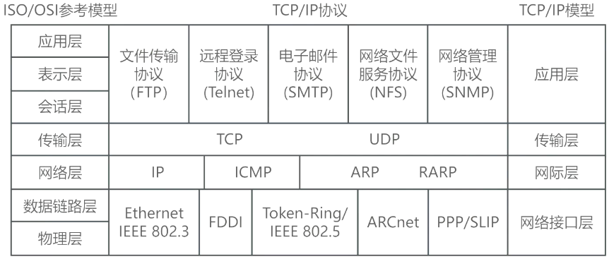

# TCP_IP协议簇

## 最佳实践

### 考察问

1. 协议
    1. IP是(网络层or传输层or应用层), 作用是()
    2. ICMP是(网络层or传输层or应用层), 作用是()
    3. ARP, RARP是(网络层or传输层or应用层), 作用是()
    4. TCP是(网络层or传输层or应用层), 作用是()
    5. UDP是(网络层or传输层or应用层), 作用是()
    6. HTTP是(网络层or传输层or应用层), 作用是()
    7. FTP是(网络层or传输层or应用层), 作用是()
    8. Telnet是(网络层or传输层or应用层), 作用是()
    9. SMTP是(网络层or传输层or应用层), 作用是()
    10. POP3是(网络层or传输层or应用层), 作用是()
2. TCP和UDP区别, 从()和()两方面对比
3. DHCP
    1. 在一个园区网中可以存在`()`台DHCP服务器
    2. 默认情况下，DHCP 客户端通过`()`方式发送 DHCP Discover 报文来寻找 DHCP 服务器，不需要预先指定 DHCP 服务器地址
    3. DHCP 客户端是从 `()`获取 IP 地址，而非自己选择本网段内 IP 作为本地地址
    4. 在 DHCP 服务器上，DHCP 服务功能需要`()`配置开启，并非默认开启 
4. Internet 网络核心采取的交换方式为`()`交换
5. 如果不考虑网络环境，服务器的延迟的主要因素是`()`延迟和`()`延迟。
6. 对等网络(peer - to - peer)中，每一个节点的地位都是对等的，既当服务器，同时也享有其他节点提供的服务，因此P2P网络的延迟与终端数量是`有关`的
7. 由于二层交换机按mac地址寻址，比三层路由器寻址少一层，因而同样速率的交换机比路由器速度更`快`
8. Internet中服务器越多，之间的跳数越多，延迟就越`高`

### 考察点
1. 网络层协议
    1. IP
    2. ICMP
    3. ARP/RARP
2. 传输层协议
    1. TCP
    2. UDP
3. 应用层协议
    1. HTTP
    2. FTP
    3. Telnet
    4. SMTP, POP3
4. TCP和UDP区别, 从`差错校验`和`重传`两方面对比
3. DHCP
    1. 在一个园区网中可以存在`多`台DHCP服务器
    2. 默认情况下，DHCP 客户端通过`广播`方式发送 DHCP Discover 报文来寻找 DHCP 服务器，不需要预先指定 DHCP 服务器地址
    3. DHCP 客户端是从 `DHCP 服务器`获取 IP 地址，而非自己选择本网段内 IP 作为本地地址
    4. 在 DHCP 服务器上，DHCP 服务功能需要`手动`配置开启，并非默认开启 
4. Internet 网络核心采取的交换方式为`分组`交换
5. 如果不考虑网络环境，服务器的延迟的主要因素是`队列`延迟和`磁盘IO`延迟。
6. 对等网络(peer - to - peer)中，每一个节点的地位都是对等的，既当服务器，同时也享有其他节点提供的服务，因此P2P网络的延迟与终端数量是`有关`的
7. 由于二层交换机按mac地址寻址，比三层路由器寻址少一层，因而同样速率的交换机比路由器速度更`快`
8. Internet中服务器越多，之间的跳数越多，延迟就越`高`

## 概览

## 网络层协议

|网际层协议|功能|
| ---- | ---- |
|IP(Internet Protocol)|提供无连接、不可靠的数据传送服务|
|ICMP(Internet Control Message Protocol)|ICMP就是一个专门用于发送差错报文的协议。ICMP定义了五种差错报文(源抑制、超时、目的不可达、重定向和要求分段)和四种信息报文(回应请求、回应应答、地址屏蔽码请求和地址屏蔽码应答)。ping命令就是使用ICMP|
|IGMP(Internet Group Management Protocol)|主要用于组播，主机可以通过IGMP告诉路由器想接收或离开某个网络组播的信息。|
|ARP、RARP(Reverse Address Resolution Protocol)|地址解析协议ARP的作用是将IP地址转换为物理地址(MAC地址)； 反地址解析协议RARP的作用是将物理地址(MAC地址)转换为IP地址。|

由于IP协议是一种尽力传送的通信协议，即传送的数据报可能会丢失、重复、延迟或乱序，因此IP协议需要一种避免差错并在发生差错时报告的机制。MAC地址：是制造商为网络硬件(如无线网卡或以太网卡)分配的唯一代码，占48位。

## 传输层协议

| 比较 | TCP(Transmission Control Protocol)|UDP(User Datagram Protocol)|
| -- | -- | -- |
| 共同点 | 基于IP协议的传输层协议，可以端口寻址  | 基于IP协议的传输层协议，可以端口寻址 |
| 不同点   | 面向连接(连接管理)、三次握手、流量控制、差错校验和重传、IP数据报按序接收(不丢失、不重复)、可靠性强、牺牲通信量、效率低 | 不可靠、无连接、错误检测功能弱，无拥塞控制、无流量控制，有助于提高传输的高速率。不对无序IP数据报重新排序、不负责重传、不消除重复IP数据报、不对已收到的数据报进行确认、不负责建立或终止连接，这些由UDP进行通信的应用程序进行处理。 |
| 相关协议 | HTTP、FTP、Telnet、POP3、SMTP | DNS、DHCP、TFTP、SNMP |

🔒题目

1. 以下关于网络控制的叙述，正确的是(  )。
    - A. 由于 TCP 的窗口大小是固定的，所以防止拥塞的方法只能是超时重发
    - B. 在前向纠错系统中，当接收端检测到错误后就要请求发送端重发出错分组
    - C. 在滑动窗口协议中，窗口的大小以及确认应答使得可以连续发送多个数据
    - D. 在数据报系统中，所有连续发送的数据都可以沿着预先建立的虚通路传送

    答案:C

## 应用层协议

|Internet服务|说明|
| ---- | ---- |
|DNS(Domain Name System)|DNS域名解析协议，域名服务器将域名转换为IP地址，使用UDP端口，端口号为53|
|Telnet(Teletype Network Protocol)|使用TCP端口，端口号为23|
|SMTP(Simple Mail Transfer Protocol)|简单邮件传输协议SMTP(简单邮件发送协议，使用TCP端口，端口号为25)，  POP3(邮件接收协议，使用TCP端口，端口号为110)，  多用途邮件扩充协议MIME、增强私密邮件保护协议PEM|
|POP3(Post Office Protocol - Version 3)|接收邮件的协议
|HTTP|HTTP, 名称：超文本传输协议, 传输方式：明文传输, 端口号：80  HTTPS, 名称：由HTTP协议+SSL证书构建的可进行加密传输、身份认证的网络协议, 传输方式：具有安全性的SSL加密传输协议, 端口号：443 |
|FTP(File Transfer Protocol)|FTP协议，使用TCP端口，有两种TCP连接：  ①控制连接，传输口令和参数，端口号为21；  ②数据连接，传输文件，端口号为20| 
|DHCP(Dynamic Host Configuration Protocol)|动态主机配置协议DHCP，主要用于在局域网内为设备动态分配IP地址，它基于UDP协议，并使用67和68端口进行通信。| 
|NFS(Network File System)|网络文件服务协议NFS，使用UDP端口，端口号为2049，允许客户端可以像本地文件系统一样，访问网络上计算机之间共享的文件和目录。|
|SNMP(Simple Network Management Protocol)|简单网络管理协议SNMP，使用UDP端口，端口号：①用于数据传送与接收的161端口；②用于报警信息接收的162端口。它允许网络管理员监视和管理网络设备、服务器、路由器和其他网络设备的运行状态和性能。|

🔒题目:

1. 电子邮件客户端通过发起对______服务器的______端口的TCP连接来进行邮件发送。

    - A. POP3
    - B. SMTP
    - C. HTTP
    - D. IMAP

    - A. 23
    - B. 25
    - C. 110
    - D. 143

    答案：B B
    解析：SMTP，邮件发送协议，端口号25；POP3，邮件接收协议，端口号110；HTTP，超文本传输协议，端口号80；IMAP，交互式邮件存取协议，端口号143。 

2. 以下关于HTTPS和HTTP协议的描述中， 不正确的(  )。
    - A. HTTPS协议使用加密传输
    - B. HTTPS协议默认服务端口号是443
    - C. HTTP协议默认服务端口是80
    - D. 电子支付类网站应使用HTTP协议

    答案：D
    解析：HTTP协议是一种使用明文数据传输的网络协议， 缺省端口80。HTTPS协议是在HTTP的基础上增加了具有安全性的SSL加密传输协议， 缺省端口443。 

3. 以下关于DHCP服务的说法中，正确的是( )。
    - A.在一个园区网中可以存在多台DHCP服务器
    - B.默认情况下，客户端要使用DHCP服务需指定DHCP服务器地址
    - C.默认情况下，DHCP客户端选择本网段内的IP地址作为本地地址
    - D.在DHCP服务器上，DHCP服务功能默认开启

    答案: A

4. Internet 网络核心采取的交换方式为()。
    - A. 分组交换
    - B. 电路交换
    - C. 虚电路交换
    - D. 消息交换

    答案：A, 答案解析：Internet 网络核心协议是 TCP/IP 协议，而 TCP/IP 协议是一种分组交换的协议，分组交换也叫包(Packet)交换，它将所接收的分组先进行存储再进行转发。

5. 下面关于网络延迟的说法中，正确的是( )。
    - A.在对等网络中，网络的延迟大小与网络中的终端数量无关
    - B.使用路由器进行数据转发所带来的延迟小于交换机
    - C.使用 Internet 服务能够最大限度地减小网络延迟
    - D.服务器延迟的主要影响因素是队列延迟和磁盘IO延迟

    答案：D

    造成网络延迟的因素有很多，比如物理线路的带宽、网络之间的跳数、排队时延、服务器的处理性能(如队列、数据的读写、磁盘IO等)，如果不考虑网络环境，服务器的延迟的主要因素是队列延迟和磁盘IO延迟。

    对等网络(peer - to - peer)中，每一个节点的地位都是对等的，既当服务器，同时也享有其他节点提供的服务，因此P2P网络的延迟与终端数量是有关的，排除A选项；
    由于二层交换机按mac地址寻址，比三层路由器寻址少一层，因而同样速率的交换机比路由器速度更快，排除B；
    Internet中服务器越多，之间的跳数越多，延迟就越高，排除C。 
