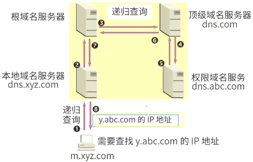
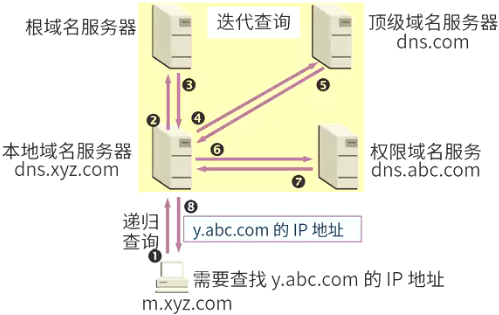
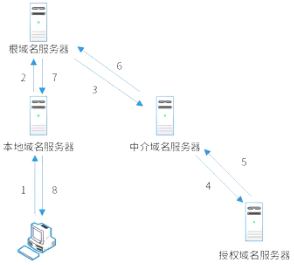

# 网络地址

## 最佳实践

### 考察问

1. DNS
    1. 主机向本地域名服务器采用`()`查询, 本地域名服务器必须回答该域名对应的IP
    2. 本地域名向根域名服务器采用`()`查询, 根域名可以返回其他域名服务器地址

### 考察点
1. DNS
    1. `主机`向`本地域名`服务器采用`递归`查询, 本地域名服务器必须回答该域名对应的IP
    2. `本地域名`向`根域名`服务器采用`迭代`查询, 根域名可以返回其他域名服务器地址

2. IPv4
3. IPv6
4. MAC

## 网络地址的分类

Internet地址有两种书写形式：域名形式和IP地址形式。

## 域名

### 概念

一个完整、通用的层次性主机域名由4个部分组成：计算机主机名.本地名.组名.最高层域名。常用域名后缀：com(商业组织、公司)，top(顶级、高端、适用于任何商业、公司、个人)，edu(教育机构)。 例如：

1. www.dzkjdx.edu.cn ，cn是地理性顶级域名，表示“中国”。
2. www.263.net ，net是组织性顶级域名，表示“网络技术组织机构” 。

### 域名系统(DNS，Domain Name System)

域名查询方法:

- 递归查询：服务器必需回答目标IP与域名的映射关系。`主机向本地域名服务器`的查询采用递归查询。

    

- 迭代查询：服务器收到一次迭代查询回复一次结果，这个结果不一定是目标IP与域名的映射关系，也可以是其它DNS服务器的地址。 `本地域名服务器向根域名服务器`的查询通常采用迭代查询。

    

DNS流程:

1. 浏览器输入域名：HOSTS→本地DNS缓存→本地DNS服务器→根域名服务器→顶级域名服务器→权限域名服务器。
2. 主域名服务器收到域名请求：本地缓存记录→区域记录→转发域名服务器→根域名服务器。

🔒题目:

1. 主机PC对某个域名进行查询，最终由该域名的授权域名服务器解析并返回结果，查询过程如下图所示。这种查询方式中不合理的是(  )。

    

    - A.根域名服务器采用递归查询，影响了性能
    - B.根域名服务器采用迭代查询，影响了性能
    - C.中介域名服务器采用迭代查询，加重了根域名服务器负担
    - D.中介域名服务器采用递归查询，加重了根域名服务器负担

    答案: A

2. Web页面访问过程中，在浏览器发出HTTP请求报文之前不可能执行的操作是(  )。
    - A 查询本机DNS缓存，获取主机名对应的IP地址
    - B 发起DNS请求，获取主机名对应的IP地址
    - C 送请求信息，获取将要访问的Web应用
    - D 发送ARP协议广播数据包，请求网关的MAC地址

    答案: C

3. 在Linux系统中，DNS的配置文件是(  )，它包含了主机的域名搜索顺序和DNS服务器的地址。

    - A. /etc/hostname
    - B. /dev/host.conf
    - C. /etc/resolv.conf
    - D. /dev/name.conf 

    答案: C

## IPv4

Internet中的主机地址是用IP地址来标识的。这是因为因特网使用的网络协议是TCP/IP协议，因此每个主机必须用IP地址来标识。

IP地址(IPv4)由4个8位的二进制数来表示，共32位。为了便于使用，通常将二进制“翻译”成十进制，数字之间用“.”分开。

|二进制IP地址|十进制IP地址|对应域名|
| ---- | ---- | ---- |
|11111111.00000000.00000000.00000001|127.0.0.1|localhost|

域名与IP地址是一一对应的，域名更容易记忆。要访问某台计算机时，我们只需要使用域名，域名服务器(DNS)会帮助我们将域名转换成IP地址。 

### 各类地址分配方案

在IP地址中，主机号全0代表的是本网络，全1代表的是广播地址。

|类别|点分十进制|  |二进制(网络地址+主机地址)|
| ---- | ---- | ---- | ---- |
|A类|0.0.0.0|最低|00000000 00000000 00000000 00000000|
|A类|127.255.255.255|最高|01111111 11111111 11111111 11111111|
|B类|128.0.0.0|最低|10000000 00000000 00000000 00000000|
|B类|191.255.255.255|最高|10111111 11111111 11111111 11111111|
|C类|192.0.0.0|最低|11000000 00000000 00000000 00000000|
|C类|223.255.255.255|最高|11011111 11111111 11111111 11111111|
|D类组播|224.0.0.0|最低|11100000 00000000 00000000 00000000|
|D类组播|239.255.255.255|最高|11101111 11111111 11111111 11111111|
|E类保留|240.0.0.0|最低|11110000 00000000 00000000 00000000|
|E类保留|255.255.255.255|最高|11111111 11111111 11111111 11111111| 

### 子网划分

采用子网划分的方法来划分网络，即自定义网络号位 数，根据主机个数来划分最合适的方案，避免资源的浪费。

将主机号拿出几位作为子网号，就可以划分出多个子网，此时IP地址组成为：网络号+子网号+主机号。

子网掩码：网络号、子网号均为1+主机号均为0。 

### 无分类编址

无分类编址自定义网络号位 数，格式为：IP地址/网络号位数，例如：220.112.145.32/22，其网络号占22位，主机号占32 - 22 = 10位。

### 常见的特殊IP地址

|特殊地址|说明|
| ---- | ---- |
|主机号全0|本网络|
|主机号全1|广播地址|
|网络号全0|本网络中的某个主机(主机号非全0或1)|
|0.0.0.0|任意地址|
|127.0.0.0 - 127.255.255.255|环回地址|
|A类：10.0.0.0 - 10.25.255.255 B类：172.16.0.0 - 172.31.0.0 C类：192.168.0.0 - 192.168.255.255|私网地址(局域网内使用)|
|169.254.0.0/24|在设置DHCP功能自动获得一个IP地址时，若DHCP服务器发生故障或响应时间太长，Windows会为你分配一个这样的地址| 

## IPV6

IPv6是设计用于替代现行版本IP协议(IPv4)的下一代IP协议。

1. 寻址能力方面的扩展。IPv6地址长度为128位，地址空间增大了2⁹⁶倍；
2. 灵活的IP报文头部格式。使用一系列固定格式的扩展头部取代了IPv4中可变长度的选项字段。IPv6中选项部分的出现方式也有所变化，使路由器可以简单路过选项而不做任何处理，加快了报文处理速度；
3. IPv6简化了报文头部格式，字段只有8个，加快报文转发，提高了吞吐量；
4. 提高安全性。身份认证和隐私权是IPv6的关键特性；
5. 支持更多的服务类型；
6. 允许协议继续演变，增加新的功能，使之适应未来技术的发展；

IPV4 点分十进制
IPV6 冒分十六进制

IPv6地址由8个16进制字段构成。例如：2001:0db8:85a3:0000:1319:8a2e:0370:7344

IPv6地址的省略写法：上述IP地址等价于2001:0db8:85a3::1319:8a2e:0370:7344 。

遵循这些规则，如果因省略出现两个以上的冒号，则可压缩为一个，但零压缩在地址中只能出现一次。例如：

1. 2001:0DB8:0000:0000:0000:0000:1428:57ab
2. 2001:0DB8:0:0:0:0:1428:57ab
3. 2001:0DB8::1428:57ab
4. 2001:DB8::1428:57ab

以上都是合法且等价的地址。同时前导的零可以省略，例如2001:0DB8:02de::0e13等价于2001:DB8:2de::e13。

1. 高位0可省略，且能多次进行该操作。
2. 一段中的0可以只用1个0来表示，同样可多次这样处理。
3. 连续的多段0可以用省略符“::”来表示，但这种表示在一个IPv6地址中仅能出现1次 。

- 单播地址(Unicast)：用于标识单个接口，适用于传统点对点通信。
- 组播地址(Multicast)：即多播地址，支持一点对多点通信，数据包会发送到一组计算机中的每一台。在IPv6中没有“广播”术语，将广播视为多播的特例。
- 任播地址(Anycast)：也叫泛播地址，是IPv6新增类型。任播的目标是一组计算机，但数据包仅交付给其中一个，通常是距离最近的那一个 。

IPv6规定每个网卡最少有3个IPv6地址，分别是链路本地地址、全球单播地址和回送地址(站点本地地址已弃用，此处表述可能有误 )。

IPv6将自动IP地址配置作为标准功能，计算机联网即可自动分配IP地址，分为以下两种方式：

- 全状态自动配置(Stateful Auto-Configuration)：IPv6继承了IPv4的动态主机配置协议(DHCP)这种自动配置服务。
- 无状态自动配置(Stateless Auto-Configuration)：
    - 主机先将网卡MAC地址附加在链路本地地址前缀1111 1110 10之后，生成一个链路本地地址，接着发出ICMPv6邻居发现请求，验证地址唯一性。若不唯一，则使用随机接口ID组成新的链路本地地址。
    - 主机以链路本地地址为源地址，向本地链路中所有路由器组播ICMPv6路由器请求报文，路由器返回包含可聚合全球单播地址前缀的公告报文响应。主机将该地址前缀加上自己的接口ID，自动配置一个全球单播地址。使用无状态自动配置，无需用户手动干预就能改变主机的IPv6地址。

IPv4/IPv6过渡技术有：

1. 双协议栈技术：节点支持IPv4和IPv6双协议栈，以此实现两种业务共存。
2. 隧道技术：在IPv4网络中部署隧道，承载IPv6业务，保障业务共存与过渡。包含6to4隧道、6over4隧道、ISATAP隧道。
3. NAT-PT技术：利用网关设备连接IPv6和IPv4网络。当IPv4与IPv6节点相互访问时，NAT-PT网关进行两种协议的转换翻译和地址映射 。

🔒问题

1. 以下关于IPv6的论述中，正确的是(  )。
    - A. IPv6数据包的首部比IPv4复杂
    - B. IPv6的地址分为单播、广播和任意播3种
    - C. IPv6的地址长度为128比特
    - D. 每个主机拥有唯一的IPv6地址

    答案: C

## MAC地址

🔒问题

1. 以下关于IP地址和MAC地址说法错误的是()。

    - A. IP地址长度32或128位，MAC地址的长度48位
    - B. IP地址工作在网络层，MAC地址工作在数据链路层
    - C. IP地址的分配是基于网络拓扑，MAC地址的分配是基于制造商
    - D. IP地址具有唯一性，MAC地址不具有唯一性

    答案：D
    
    解析：MAC地址：是制造商为网络硬件(如无线网卡或以太网网卡)分配的唯一代码，占48位。 

