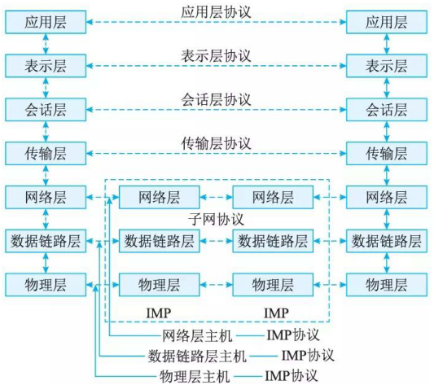
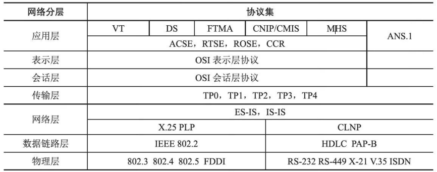
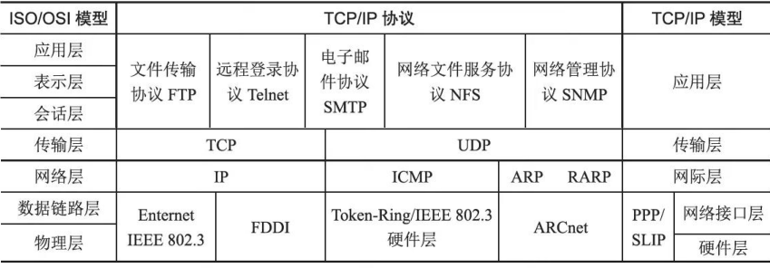

# 组网技术

## 网络设备及其工作层级

网络设备是连接到网络中的物理实体。基本的网络设备有集线器、中继器、网桥、交换机、路由器和防火墙等.

l. 集线器: 在集线器中，从一个端口收到的数据被转送到所有其他端口，无论与端口相连的系统是否准备好。集线器还有一个端口被指定为上联端口，用来将该集线器连接到其他集线器或路由设备等以便形成更大的网络。

2. 中继器: 中继器是局域网互连设备，工作于 OSI 体系结构的物理层，它接收并识别网络信号，然后再生信号，将其发送到网络的其他分支上。
3. 网桥: 网桥工作千 OSI 体系的数据链路层。网桥包含了中继器的功能和特性，不仅可以连接多种介质，还能连接不同的物理分支，如以太网、令牌网，能将数据包在更大的范围内进行传送。

4. 交换机: 交换机是一种工作在 OSI 七层协议中的数据链路层，为接入交换机的任意两个网络结点提供独享的转发通路，将从一个端口接收的数据通过内部处理转发到指定端口。

5. 路由器: 路由器工作在 OSI 体系结构中的网络层，它可以在多个网络上交换和路由数据包。路由器可通过在相互独立网络中交换路由信息以生成路由表来达到数据包的路径选择。路由表包含网络地址、连接信息、路径信息和发送代价等属性。路由器通常用千广域网或广域网与局域网的互连。

6. 防火墙 (Firewall): 。在网络中通常采用硬件防火墙。硬件防火墙是指把防火墙程序做到芯片里面，由硬件执行这些功能，能减少 CPU 的负担，使路由更稳定。

## 网络协议

### 开放系统互连模型
OSI/RM是一种分层的体系结构，参考模型共有 7 层，分层的基本想法是每一层都在它的下层提供的服务基础上提供更高级的增值服务，而最高层提供能运行分布式应用程序的服务。由低层至高层分别为物理层 (Physical Layer) 、数据链路层 (Datali nk Layer) 、网络层 (Network Layer) 、传输层 (Transport Layer) 、会话层 (Sessi onLayer) 、表示层 (Presentation Layer) 和应用层 (App l i cation Layer) 。

### OSI 协议集

国际标准化组织除了定义开放系统互连 (Open System Interconnection, OSI) 参考模型，还开发了实现7个功能层次的各种协议和服务标准，通称为 OSI 协议。

### 7层网络模型(Open System Interconnection, OSI)

ISO/OSI的参考模型一共有7层，由低层到高层分别为：

1. 物理层：负责通过物理介质(如网线、光纤 )传输比特流，规定电平、速度、电缆针脚等。像 A 公司把合同数据转化为电信号或光信号。传输的数据单位是比特。
2. 数据链路层：在物理层基础上，把网络层传来的数据报组装成帧 ，并进行差错控制、流量控制等。传输的数据单位是帧。
3. 网络层：负责通过 IP 寻址建立节点间连接，进行路由选择，实现不同网络间路径选择。传输的数据单位是数据包。 
4. 传输层：为会话层提供透明、可靠的端到端的数据传输服务。其功能有数据分段、数据传输、数据组装、差错控制、流量/拥塞控制等。传输的数据单位报文。
5. 会话层：为表示层提供建立、维护和结束会话连接的功能，提供会话管理功能。传输的数据单位是报文。 
6. 表示层：提供格式化的表示和转换数据服务，如数据的压缩、解压缩、加密和解密等。 
7. 应用层：面向用户服务，提供网络与用户应用软件之间的接口服务，如文件传输、电子邮件、远程登录等。 

各层所需的传输设备:

|协议层|互连设备|作用|
| ---- | ---- | ---- |
|物理层|中继器、集线器|①中继器：信号在介质里传输的过程中会有衰减和噪声，使用中继器进行放大和去噪； ②集线器：是一种特殊的多路中继器。|
|数据链路层|网桥、交换机|①网桥：连接两个局域网，检查帧的源地址和目的地址，若两者在同一网络段上，则不转发，否则转发到另一个网络段上； ②交换机：检查以太网帧的目的地址MAC，在自己的地址表(端口号-MAC)中进行查找并转发。|
|网络层|路由器|用于连接多个逻辑上分开的网络，最主要的功能是选择路由路径。|
|应用层|网关|将协议进行转换，将数据重新分组，以便在两个不同类型的网络系统之间进行通信。| 

### TCP/IP 协议集
TCP/IP  (Transm ission  Con trol  Pro tocol  /Internet Protocol) IP是个协议族，主要包括因特网协议 (IP) 、传输控制协议 (TCP) 、用户数据报协议 (UDP) 、虚拟终端协议 (TELNET) 、文件传输协议 (FTP) 、电子邮件传输协议 (SMTP) 、网上新闻传输协议 (NNTP) 和超文本传送协议 (HTTP) 等 8 个。

### ISO/OSI 模型与 TCP/IP 模型的对比

## 交换技术

交换机功能包括：

1. 集线功能。提供大量可供线缆连接的端口达到部署星状拓扑网络的目的。
2. 中继功能。在转发帧时重新产生不失真的电信号。
3. 桥接功能。在内置的端口上使用相同的转发和过滤逻辑。
4. 隔离冲突域功能。将部署好的局域网分为多个冲突域，而每个冲突域都有自己独立的带宽，以提高交换机整体宽带利用效率。

基本交换原理: 

交换机可以“学习 “MAC 地址，并把其存放在内部地址表中，通过在数据帧的始发者和目标接收者之间建立临时的交换路径，使数据帧直接由源地址到达目的地址，交换机需要实现的功能如下所述。

1. 转发路径学习。根据收到数据帧中的源 MAC 地址建立该地址同交换机端口的映射，写入 MAC 地址表中。
2. 数据转发。如果交换机根据数据帧中的目的 MAC 地址在建立好的 MAC 地址表中查询到了，就向对应端口进行转发。
3. 数据泛洪。如果数据帧中的目的 MAC 地址不在 MAC 地址表中，则向所有端口转发，也就是泛洪。广播帧和组播帧向所有端口(不包括源端口)进行转发。
4. 链路地址更新。 MAC 地址表会每隔一定时间(如 300s) 更新一次。

## 路由技术

### 路由原理

路由器工作在 OSI 七层协议中的第 3 层，即网络层。其主要任务是接收来源于一个网络接口的数据包，通常根据此数据包的目地址决定待转发的下一个地址(即下一跳地址)。路由器中维持着数据转发所需的路由表，所有数据包的发送或转发都通过查找路由表来实现。这个路由表可以静态配置，也可以通过动态路由协议自动生成。

### 路由器协议

路由协议 (Routing Protocol) 是一种指定数据包转送方式的协议。路由协议是运行在路由器上的协议，可以让路由器自动学习到其他路由器的网络，并且在网络拓扑发生改变后自动更新其维护的路由表。

