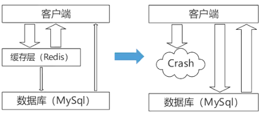
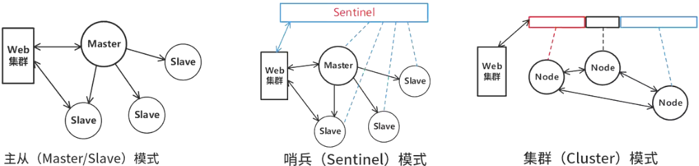
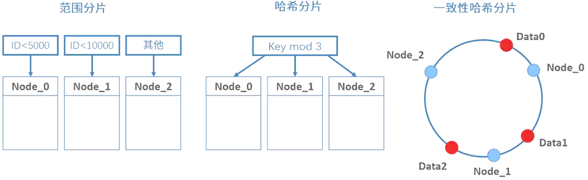

# Redis与缓存

## 最佳实践

### 考察问

1. 🟡🟨💛redis的5种数据类型: (), (), (), (), ()
2. 🟡🟨💛redis的持久化方式: (), (), ()

    |对比维度|RDB持久化|AOF持久化|
    | ---- | ---- | ---- |
    |备份量|`()`备份，保存整个数据库|轻量级`()`备份，一次只保存一个修改命令|
    |保存间隔时间|保存间隔时间`()`|保存间隔时间`()`|
    |还原速度|数据还原速度`()`|数据还原速度`()`|
    |阻塞情况|save会阻塞，但bgsave或者自动不会阻塞|无论是平时还是AOF重写，都不会阻塞|
    |数据体积|`()`|`()`|
    |安全性|`()`|`()`|
    |数据一致性|`()`|`()`|

3. 🟡🟨💛数据淘汰策略
    1. ()淘汰
    2. (), ()空间
    3. (), (), (), ()
4. 🟡🟨💛缓存常见问题: (), (), ()
5. 🟡🟨💛redis分布式存储方案: (), (), ()
6. 🟡🟨❤️redis集群切片方式: (), (), ()


### 考察点

1. redis的数据类型:
    1. String: 任何类型(二进制形式保存)
        1. 命令: set(nx), del, get, incr, decr, expire
        2. 场景：计数器, 分布式锁
    2. Hash:  
    3. List: 有序列表
        1. 命令: l/rpush, l/rpop, bl/brpop, ltrim, lrange
        2. 场景: 消息队列, 历史记录, 最新动态
    4. Set: 无序, 唯一
        1. 命令: sadd, srem, smembers, sismember, sinter, sunion, sdiff
        2. 场景: 点赞关注, 共同点赞关注, 标签, 唯一访客统计
    5. ZSet: 有序, 唯一
        1. 命令: zadd, zrange, zrank, zscore, zrem
2. redis持久化方式: RDB, AOF, 混合

    |对比维度|RDB持久化|AOF持久化|
    | ---- | ---- | ---- |
    |备份量|`全量`备份，保存整个数据库|轻量级`增量`备份，一次只保存一个修改命令|
    |保存间隔时间|保存间隔时间`长`|保存间隔时间`短`|
    |还原速度|数据还原速度`快`|数据还原速度`慢`|
    |阻塞情况|save会阻塞，但bgsave或者自动不会阻塞|无论是平时还是AOF重写，都不会阻塞|
    |数据体积|`小`|`大`|
    |安全性|`低`|`高`|
    |数据一致性|`低`|`高`|

3. redis数据淘汰

    - 不淘汰：
        - noeviction: `不会淘汰`数据，当使用的内存空间超过max memory值时，再有写请求来时返回错误。
    - `过期时间的键空间`：
        - volatile-random：`随机`移除某个key
        - volatile-lru：优先移除`最近未使用的key`
        - volatile-lfu，优先移除`访问频率最低的key` 
        - volatile-ttl ：优先移除`到期时间小的key`
    - `全键空间`：
        - allkeys-random：`随机`移除某个key
        - allkeys-lru：优先移除`最近未使用的key`
        - allkeys-lfu，优先移除`最不经常使用的key`
        - allkeys-ttl ：优先移除`到期时间小的key`
4. 缓存常见问题:
    1. 缓存`击穿`
    2. 缓存`雪崩`
    3. 缓存`穿透`
5. Redis分布时存储方案: 主从, 哨兵, 集群
6. Redis集群切片方式: 客户端, 中间件, 客户端服务器写作分片


## Redis 数据类型

|类型|特点|示例|
| ---- | ---- | ---- |
|String|存储二进制，可存任何类型数据，最大512MB|缓存，计数，共享Session|
|Hash|无序字典，由数组+链表构成，适合存对象，Key对应一个HashMap，针对一组数据|存储、读取、修改用户属性|
|List|双向链表，有序，增删速度快，查询较慢|消息队列，文章列表，记录前N个最新登录的用户ID列表|
|Set|键值对无序且唯一，增删查复杂度均为O(1)，支持交、并、差集操作|独立IP，共同爱好，标签|
|Sorted Set|键值对有序且唯一，自带按权重排序效果|排行榜|


### String

key-value 结构, 值可以是字符串、数字或者二进制数据，最大能存储 512MB。

1. 基本操作:

    ```sh
    # 基本操作
    set key lin  # 给键设置值
    setnx key value  # 不存在就设置值, SET if Not eXists
    get key  # 获得键对应的值
    del key  # 删除键
    exists key  # 判断键存在
    # 计数器
    set key 0  # 设置
    incr key  # 加1, increment
    incrby key 10  # 加10
    decr key  # 减1, decrement
    decrby key 10  # 减10
    # 过期(默认永不过期)
    expire key  60  # 60秒后过期
    ```

2. 应用场景

    1. 缓存数据

        ```sh
        # 直接缓存整个对象的 JSON
        set user:1 '{"name":"hangge", "age":18}'
        ```

    2. 计数器：将字符串作为计数器的值，用于记录点击量、用户数量等。

        ```sh
        # 设置 key-value 类型的值
        set number 0
        # 将 key 中储存的数字值增一
        incr number
        # 将 key 中储存的数字值减一
        decr number
        ```

    3. 分布式锁：使用字符串作为锁的值，实现分布式环境下的互斥操作。

        SET 命令有个 NX 参数可以实现“key 不存在才插入”，可以用它来实现分布式锁。一般而言，还会对分布式锁加上过期时间，避免客户端发生异常而无法释放锁。并且使用 SET 命令设置锁变量值时，每个客户端设置的值是一个唯一值，用于标识客户端：
        1. 如果 key 不存在，则显示插入成功，可以用来表示加锁成功
        2. 如果 key 存在，则会显示插入失败，可以用来表示加锁失败


        ```sh
        # lock_key 就是 key 键；
        # unique_value 是客户端生成的唯一的标识；
        # NX 代表只在 lock_key 不存在时，才对 lock_key 进行设置操作；
        # PX 10000 表示设置 lock_key 的过期时间为 10s，这是为了避免客户端发生异常而无法释放锁。
        SET lock_key unique_value NX PX 10000
        ```


2. Hash: 哈希类型是指 v（值）本身又是一个键值对（k-v）结构。

    1. 常用命令

        ```sh
        # 存储一个哈希表 key 的键值
        hset key field value  
        # 获取哈希表 key 对应的 field 键值
        hget key field
        ```

    2. 应用场景使用样例

        和SET一样


3. List: 有序列表

    1. 常用命令

        ```sh
        lpush list value [value ...] # 将一个或多个值插入到列表头部。
        rpush list value [value ...] # 将一个或多个值插入到列表尾部。
        lpop list # 移除并返回列表的第一个元素。
        rpop list # 移除并返回列表的最后一个元素。
        blpop list [list ...] timeout # 阻塞式地从列表头部弹出一个或多个元素
        brpop list [list ...] timeout # 阻塞式地从列表尾部弹出一个或多个元素
        ltrim list start stop #修剪列表，只保留指定范围内的元素
        lrange list start stop #返回列表中指定范围内的元素
        lindex list index  #获取列表指定角标的元素
        lset list index value  #修改列表中指定角标的元素
        ```

        配合使用:

        1. lpush + lpop = Stack（栈）
        2. lpush + rpop = Queue（队列）
        4. lpush + brpop = Message Queue（消息队列）
        3. lpush + ltrim = Capped Collection（有限集合）


    2. 应用场景

        1. 消息队列：将待处理的消息添加到列表的一端，从另一端读取并处理。

            ```sh
            lpush queue:messages "message1"
            lpop queue:messages
            ```

        2. 历史记录：将用户操作记录存储在列表中，以便回放或生成报告。

            ```sh
            lpush user:1234:history "action1"
            lrange user:1234:history 0 -1
            ```

        3. 最新动态：将最新的动态内容添加到列表的一端，提供实时更新。

            ```sh
            lpush newsfeed:user1234 "New post by user1234"
            lrange newsfeed:user1234 0 9
            ```

4. Set: Set 类型和 List 类型的区别如下：1. List 可以存储重复元素，Set 只能存储非重复元素；2. List 是按照元素的先后顺序存储元素的，而 Set 则是无序方式存储元素的。

    1. 常用命令

        ```sh
        sadd set_ member [member ...] # 向集合中添加一个或多个成员
        srem set_ member [member ...]  # 从集合 set_ 中删除元素
        smembers set_ # 返回集合中的所有成员
        sismember set_ member  # 判断一个成员是否属于集合
        scard set_ #返回集合的基数（元素数量）
        spop set_ [count]  # 随机移除并返回集合中的一个或多个元素
        srandmember set_ [count] # 返回集合中一个或多个随机元素，不会从集合中移除
        sinter set_ [set_ ...] # 返回多个集合的交集
        sunion set_ [set_ ...] # 返回多个集合的并集
        sdiff set_ [set_ ...] # 返回多个集合的差集
        ```

    2. 常用场景

        1. 点赞：Set 类型可以保证一个用户只能点一个赞，例如 set_ 是文章 id，value 是用户 id。

            ```sh
            # uid:1 用户对文章 article:1 点赞
            SADD article:1 uid:1
            
            # uid:2 用户对文章 article:1 点赞
            SADD article:1 uid:2
            
            # uid:3 用户对文章 article:1 点赞
            SADD article:1 uid:3
            
            # uid:1 取消了对 article:1 文章点赞。
            SREM article:1 uid:1
            
            # 获取 article:1 文章所有点赞用户
            SMEMBERS article:1
            
            # 获取 article:1 文章的点赞用户数量
            SCARD article:1
            
            # 判断用户 uid:1 是否对文章 article:1 点赞了（返回 0 说明没点赞，返回 1 则说明点赞了）
            SISMEMBER article:1 uid:1
            ```

        2. 共同关注：Set 类型支持交集运算，所以可以用来计算共同关注的好友、公众号等。例如 set_ 可以是用户 id，value 则是已关注的公众号的 id


            ```sh
            # uid:1 用户关注公众号 id 为 5、6、7、8、9
            SADD uid:1 5 6 7 8 9
            
            # uid:2  用户关注公众号 id 为 7、8、9、10、11
            SADD uid:2 7 8 9 10 11
            
            # 获取共同关注
            SINTER uid:1 uid:2
            
            # 给 uid:2 推荐 uid:1 关注的公众号：
            SDIFF uid:1 uid:2
            
            # 验证某个公众号是否同时被 uid:1 或 uid:2 关注（返回 1 说明关注了；返回 0 说明没关注）
            SISMEMBER uid:1 5
            ```

        3. 标签系统：将标签与相关内容的 ID 存储在集合中，用于快速检索和过滤。


            ```sh
            sadd post:1001:tags "redis" "database"
            sinter post:1001:tags post:1002:tags
            ```

        4. 唯一访客统计：将访问网站的用户 IP 地址存储在集合中，统计唯一访客数量。

            ```sh
            sadd site:visitors "192.168.0.1"
            scard site:visitors
            ```

        5. 抽奖活动：存储某活动中中奖的用户名 ，Set 类型因为有去重功能，可以保证同一个用户不会中奖两次。


            ```sh
            # set_ 为抽奖活动名，value 为员工名称，把所有员工名称放入抽奖箱
            SADD lucky Tom Jerry John Sean Marry Lindy Sary Mark
            
            #如果允许重复中奖，可以使用 SRANDMEMBER 命令。
            # 抽取 1 个一等奖：
            SRANDMEMBER lucky 1
            # 抽取 2 个二等奖：
            SRANDMEMBER lucky 2
            # 抽取 3 个三等奖：
            SRANDMEMBER lucky 3
            
            #如果不允许重复中奖，可以使用 SPOP 命令。
            # 抽取一等奖 1 个
            SPOP lucky 1
            # 抽取二等奖 2 个
            SPOP lucky 2
            # 抽取三等奖 3 个
            SPOP lucky 3
            ```

5. zset: 已排序的字符串集合，同时元素不能重复
    
    1. 常用命令

        ```sh
        zadd set_ score1 member1 [score2 member2 ...] # 向有序集合添加一个或多个成员，以及其分数（权重）
        zrange set_ start stop [withscores] # 返回有序集合中指定范围内的成员和分数（从低分到高分）
        zrevrange set_ start stop [withscores] # 返回有序集合中指定范围内的成员和分数（从高分到高分低分）
        zrangebyscore set_ min max [withscores] # 返回有序集合中指定分数范围内的成员和分数
        zrank set_ member # 返回有序集合中指定成员的排名（从低分到高分）
        zrevrank set_ member # 返回有序集合中指定成员的排名（从高分到低分）
        zscore set_ member # 返回有序集合中指定成员的分数
        zrem set_ member [member ...] # 移除有序集合中一个或多个成员
        zcard set_  # 返回有序集合 set_ 中元素个数
        zincrby set_ increment member  # 为有序集合 set_ 中元素 member 的分值加上 increment
        # 返回指定成员区间内的成员，按字典正序排列, 分数必须相同。
        zrangelex set_ min max [LIMIT offset count]
        # 返回指定成员区间内的成员，按字典倒序排列, 分数必须相同
        zrevrangelex set_ max min [LIMIT offset count]
        ```

    2. 应用场景
        1. 排行榜：将用户的得分与其 ID 存储在有序集合中，用于排行榜的展示和更新。


            ```sh
            # 用户 Jay 上传一个视频，获得 6 个赞，可以这样：
            zadd user:ranking:2021-03-03 Jay 6
            # 过了一段时间，再获得一个赞，可以这样：
            zincrby user:ranking:2021-03-03 Jay 1
            # 如果某个用户 John 作弊，需要删除该用户：
            zrem user:ranking:2021-03-03 John
            # 展示获取赞数最多的 3 个用户
            zrevrange user:ranking:2021-03-03 0 2 withscores
            ```

        2. 时间线：将事件的时间戳与内容 ID 存储在有序集合中，用于生成时间线或时间序列数据。

            ```sh
            zadd timeline 1622640000 event1 1622650000 event2 1622660000 event3
            zrangebyscore timeline 1622640000 1622660000
            ```

        3. 范围查询：将元素的分数作为排序依据，进行范围查询或排名检索。

            ```sh
            zadd prices 1.99 product1 2.99 product2 0.99 product3
            zrangebyscore prices 0.99 2.99
            ```


        4. 电话、姓名排序：使用有序集合的 ZRANGEBYLEX 或 ZREVRANGEBYLEX 可以帮助我们实现电话号码或姓名的排序，我们以 ZRANGEBYLEX （返回指定成员区间内的成员，按 set_ 正序排列，分数必须相同）为例。


            ```sh
            # 电话排序样例：我们可以将电话号码存储到 SortSet 中，然后根据需要来获取号段：
            ZADD phone 0 13100111100 0 13110114300 0 13132110901
            ZADD phone 0 13200111100 0 13210414300 0 13252110901
            ZADD phone 0 13300111100 0 13310414300 0 13352110901
            # 获取所有号码
            ZRANGEBYLEX phone - +
            # 获取 132 号段的号码：
            ZRANGEBYLEX phone [132 (133
            #获取 132、133 号段的号码：
            ZRANGEBYLEX phone [132 (134
            
            # 姓名排序
            zadd names 0 Toumas 0 Jake 0 Bluetuo 0 Gaodeng 0 Aimini 0 Aidehua
            # 获取所有人的名字:
            ZRANGEBYLEX names - +
            # 获取名字中大写字母 A 开头的所有人：
            ZRANGEBYLEX names [A (B
            # 获取名字中大写字母 C 到 Z 的所有人：
            ZRANGEBYLEX names [C [Z

            ```

        5. 延迟队列：可以通过使用有序集合来实现。有序集合的成员是任务，分数是任务的执行时间戳。利用有序集合的特性，可以按照任务的执行时间进行排序。以下是一个基本的实现思路：

            将任务信息作为有序集合的成员，任务的执行时间戳作为分数。
            使用一个定时器，定期检查有序集合中是否有任务的执行时间到了。
            如果发现有任务的执行时间到了，就从有序集合中取出该任务，并将任务放入待执行队列。

6. BitMap: Bitmap，即位图，是一串连续的二进制数组（0 和 1），可以通过偏移量（offset）定位元素。


    1. 常用命令

        ```sh
        # 设置值，其中 value 只能是 0 和 1
        SETBIT key offset value
        
        # 获取值
        GETBIT key offset
        
        # 获取指定范围内值为 1 的个数（start 和 end 以字节为单位）
        BITCOUNT key start end
        
        # BitMap 间的运算
        # operations 位移操作符，枚举值
        #  AND 与运算 &
        #  OR 或运算 |
        #  XOR 异或 ^
        #  NOT 取反 ~
        # result 计算的结果，会存储在该 key 中
        # key1 … keyn 参与运算的 key，可以有多个，空格分割，not 运算只能一个 key
        # 当 BITOP 处理不同长度的字符串时，较短的那个字符串所缺少的部分会被看作 0。
        # 返回值是保存到 destkey 的字符串的长度（以字节 byte 为单位），和输入 key 中最长的字符串长度相等。
        BITOP [operations] [result] [key1] [keyn…]
        
        # 返回指定 key 中第一次出现指定 value(0/1）的位置
        BITPOS [key] [value]
        ```


    2. 应用场景
        1. 签到统计：在签到打卡的场景中，我们只用记录签到（1）或未签到（0），所以它就是非常典型的二值状态。每个用户一天的签到用 1 个 bit 位就能表示，一个月（假设是 31 天）的签到情况用 31 个 bit 位就可以，而一年的签到也只需要用 365 个 bit 位


            ```sh
            # 假设我们要统计 ID 100 的用户在 2022 年 6 月份的签到情况
            # 记录该用户 6 月 3 号已签到。
            SETBIT uid:sign:100:202206 2 1
            
            # 检查该用户 6 月 3 日是否签到。
            GETBIT uid:sign:100:202206 2
            
            # 统计该用户在 6 月份的签到次数。
            BITCOUNT uid:sign:100:202206
            
            # 获取该用户在 2022 年 6 月份首次打卡日期
            BITPOS uid:sign:100:202206 1
            ```

        2. 判断用户登陆态：Bitmap 提供了 GETBIT、SETBIT 操作，通过一个偏移值 offset 对 bit 数组的 offset 位置的 bit 位进行读写操作，需要注意的是 offset 从 0 开始。只需要一个 key = login_status 表示存储用户登陆状态集合数据， 将用户 ID 作为 offset，在线就设置为 1，下线设置 0。通过 GETBIT 判断对应的用户是否在线。 5000 万用户只需要 6 MB 的空间。

            ```sh
            # 假如我们要判断 ID = 10086 的用户的登陆情况：
            # 执行以下指令，表示用户已登录。
            SETBIT login_status 10086 1
            
            # 检查该用户是否登陆，返回值 1 表示已登录。
            GETBIT login_status 10086
            
            #登出，将 offset 对应的 value 设置成 0。
            SETBIT login_status 10086 0
            ```


        3. 连续签到用户总数：假设我们需要统计出这连续 7 天连续打卡用户总数

            1. 我们把每天的日期作为 Bitmap 的 key，userId 作为 offset，若是打卡则将 offset 位置的 bit 设置成 1。
            2. key 对应的集合的每个 bit 位的数据则是一个用户在该日期的打卡记录。
            3. 一共有 7 个这样的 Bitmap，如果我们能对这 7 个 Bitmap 的对应的 bit 位做 『与』运算。同样的 UserID offset 都是一样的，当一个 userID 在 7 个 Bitmap 对应对应的 offset 位置的 bit = 1 就说明该用户 7 天连续打卡。
            4. 结果保存到一个新 Bitmap 中，我们再通过 BITCOUNT 统计 bit = 1 的个数便得到了连续打卡 7 天的用户总数了。
            5. Redis 提供了 BITOP operation destkey key [key ...] 这个指令用于对一个或者多个 key 的 Bitmap 进行位元操作。
            6. operation 可以是 and、OR、NOT、XOR。当 BITOP 处理不同长度的字符串时，较短的那个字符串所缺少的部分会被看作 0 。空的 key 也被看作是包含 0 的字符串序列。

            ```sh
            # 假设要统计 3 天连续打卡的用户数，则是将三个 bitmap 进行 AND 操作，并将结果保存到 destmap 中
            # 接着对 destmap 执行 BITCOUNT 统计，如下命令：
            # 与操作
            BITOP AND destmap bitmap:01 bitmap:02 bitmap:03
            # 统计 bit 位 =  1 的个数
            BITCOUNT destmap
            ```

## Redis数据淘汰

- 不淘汰：
    - noeviction: `不会淘汰`数据，当使用的内存空间超过max memory值时，再有写请求来时返回错误。
- `过期时间的键空间`：
    - volatile-random：`随机`移除某个key
    - volatile-lru：优先移除`最近未使用的key`
    - volatile-lfu，优先移除`访问频率最低的key` 
    - volatile-ttl ：优先移除`到期时间小的key`
- `全键空间`：
    - allkeys-random：`随机`移除某个key
    - allkeys-lru：优先移除`最近未使用的key`
    - allkeys-lfu，优先移除`最不经常使用的key`
    - allkeys-ttl ：优先移除`到期时间小的key`


## Redis的持久化主要有两种方式：RDB和AOF

- RDB(Redis Database Snapshot)：借鉴了传统数据库中快照的思想，按照指定时间间隔对数据进行快照存储。
- AOF(Append Only File)：采用传统数据库中日志的思想，将每条改变数据集的命令追加到AOF文件末尾。当出现问题时，可通过重新执行AOF文件中的命令来重建数据集。
- 混合持久化: 首先以 RDB 格式保存当前数据状态，然后继续以 AOF 格式记录新的写操作，确保数据完整性并优化恢复速度。


|对比维度|RDB持久化|AOF持久化|
| ---- | ---- | ---- |
|备份量|`全量`备份，保存整个数据库|轻量级`增量`备份，一次只保存一个修改命令|
|保存间隔时间|保存间隔时间`长`|保存间隔时间`短`|
|还原速度|数据还原速度`快`|数据还原速度`慢`|
|阻塞情况|save会阻塞，但bgsave或者自动不会阻塞|无论是平时还是AOF重写，都不会阻塞|
|数据体积|`小`|`大`|
|安全性|`低`|`高`|
|数据一致性|`低`|`高`|


### 缓存中的常见问题

1. 缓存击穿: 热点的Key失效, 大量针对一个key的请求像剑一样刺向数据库；

    热点数据（访问频率高的数据 ）对应的缓存失效（如过期、被删除 ）时，大量并发请求同时访问该数据，由于缓存中无对应数据，这些请求会直接穿透缓存，涌向后端数据库，使数据库瞬间承受巨大压力，可能导致数据库性能下降、响应变慢甚至崩溃 。比如电商大促时热门商品信息是热点数据，若其缓存过期，大量用户同时请求该商品详情，就会引发缓存击穿。

    解决办法有:

    1. 加锁：如使用分布式锁，缓存失效时，只允许一个请求获取锁去访问数据库并更新缓存，其他请求等待锁释放后从缓存获取数据，能避免大量请求同时冲击数据库，但高并发下线程等待会影响系统响应速度 。

    2. 提前预加载与动态调整过期时间：提前将热点数据存入缓存并适当延长缓存时长；或实时监控数据热度，动态调整热门数据缓存过期时间，防止缓存突然失效 。

2. 缓存雪崩: 大量key没了，请求像雪崩一样打到数据库；

    

    缓存中大量数据在同一时间失效或过期 ，或缓存服务器故障导致缓存数据不可用，使得大量原本由缓存处理的请求直接涌向数据库或后端服务，造成系统负载剧增，甚至引发系统宕机或崩溃 。

    解决办法有:

    1. 设置不同过期时间：为缓存设置随机或分散的过期时间，避免大量缓存同时失效。比如在原本过期时间基础上加上随机的分钟数。
    2. 采用分布式缓存：将缓存数据分布到多个缓存节点，部分节点故障时，仍可从其他节点获取数据，降低雪崩风险，如 Redis Cluster 。
    3. 构建多级缓存架构：结合本地缓存（如 Ehcache ）和分布式缓存（如 Redis ），分布式缓存失效时，本地缓存可暂挡部分请求 。
    4. 缓存持久化：将部分缓存数据持久化到磁盘，缓存服务重启时能快速恢复数据 。

3. 缓存穿透: 数据库里也没这个数据, 穿透了缓存和数据库

    用户请求的数据在缓存层和数据库层都不存在 。正常情况下，请求先到缓存，缓存无数据再查数据库，数据库有则更新缓存并返回结果，没有则返回空。但缓存穿透时，因为数据根本不存在，每次请求都穿透缓存直接查数据库，大量此类无效请求会使数据库压力剧增。

    解决办法有:

    1. 使用布隆过滤器：它是一种概率型数据结构，能快速判断数据是否存在。将数据库中已有的数据提前存入布隆过滤器，请求到来时先经布隆过滤器判断，不存在则直接返回，无需查数据库。但布隆过滤器存在一定误判率，不过可通过调整参数降低误判概率。
    2. 缓存空对象：当查询数据库发现数据不存在时，也在缓存中存入一个特殊标识的空对象，并设置较短过期时间。后续相同请求先到缓存，命中空对象直接返回，避免重复查询数据库。但这会占用一定缓存空间，且要注意过期时间设置，防止脏数据长期存在。
    3. 加强参数校验：在应用层对用户输入参数进行严格校验，如格式、取值范围等，过滤掉明显无效的请求，阻止非法请求进入缓存和数据库查询流程。


4. 缓存预热

    含义：系统上线后，将相关需要缓存的数据直接添加到缓存系统中。

    解决方案:
    1. 编写一个缓存刷新页面，在上线时进行手工操作。
    2. 数据量不大时，可在项目启动时自动加载缓存。
    3. 定时刷新缓存。

5. 缓存更新

    除了Redis系统自带的缓存失效策略外，常见的缓存更新方式有以下两种：

    1. 定时清理过期的缓存数据。
    2. 当用户请求到达时，判断该请求所使用的缓存是否过期。若已过期，就从底层系统获取新数据，并更新缓存。

6. 缓存降级

    缓存降级的目的在于确保核心服务的可用性，即便有所损失。同时，部分服务是不能进行降级操作的，例如电商的购物流程。在实施降级前，需要对系统进行全面梳理，明确哪些服务必须保护，哪些服务可以降级 。

### Redis分布式存储方案

|分布式存储方案|核心特点|
| ---- | ---- |
|主从（Master/Slave）|一主多从，读写分离, 故障时需手动切换|
|哨兵（Sentinel）|带有哨兵的一主多从架构，主节点发生故障时能自动选择新的主节点|
|集群（Cluster）|分节点对等集群，划分slots，不同slots的信息存储到不同节点|




### Redis集群切片的常见方式

Redis 分片集群是一种将 Redis 数据库分散到多个节点上的方式


|集群切片方式|核心特点|
| ---- | ---- |
|客户端分片|在客户端通过key的hash值对应到不同的服务器。|
|中间件实现分片|客户端将请求发送给代理，然后代理决定去哪个节点写数据或者读数据，例如Twemproxy、Codis等，由中间件实现服务到后台Redis节点的路由分派。|
|客户端服务端协作分片|Redis Cluster模式，客户端可采用一致性哈希，服务端提供错误节点的重定向服务slot上。不同的slot对应到不同服务器。|

分片方案:

|分片方案|分片方式|说明|
| ---- | ---- | ---- |
|范围分片|按数据范围值来做分片|例：按用户编号分片，0 - 999999映射到实例A；1000000 - 1999999映射到实例B。|
|哈希分片|通过对key进行hash运算分片|可以把数据分配到不同实例，这类似于取余操作，余数相同的，放在一个实例上。|
|一致性哈希分片|哈希分片的改进|可以有效解决重新分配节点带来的无法命中问题。|




### Redis与Memcache的差别

MemCache：是一个高性能的分布式的内存对象缓存系统，用于动态Web应用以减轻数据库负载。Memcache通过在内存里维护一个统一的巨大的Hash表，它能够用来存储各种格式的数据，包括图像、视频、文件以及数据库检索的结果等。


1. 数据类型方面。Redis和Memcache都是将数据存放在内存中，都是内存数据库。他们都支持Key - Value数据类型。同时Memcache还可用于缓存其他东西，如图片、视频等（仍是key/value缓存），Redis还支持List、Set、Hash等数据结构的存储。

2. 内存管理机制方面。在Redis中，并不是所有的数据都一直存储在内存中的，这是和Memcache相比一个最大的区别。当物理内存用完时，Redis可以将一些很久没用到的Value交换到磁盘。而在Memcached中，数据都是缓存在内存中。

3. 数据持久化方面。Redis支持内存数据的持久化（定期保存到磁盘），而且提供两种主要的持久化策略：RDB快照和AOF日志。Memcached不支持数据持久化操作。Redis支持数据的备份，即master - slave模式的数据备份。Memcache宕机后，数据不可恢复，Redis数据丢失后可以通过AOF恢复。

|特征|Redis|Memcache|
| ---- | ---- | ---- |
|数据类型|丰富的数据结构|简单key/value结构|
|持久性|支持|不支持|
|分布式存储|多种方式，主从、Sentinel(哨兵)、Cluster等|客户端哈希分片/一致性哈希分片|
|多线程支持|不支持|支持|
|内存管理|无|私有内存池/内存池|
|事务支持|有限支持|不支持|


### 🔒问题

1. (6分)填写Redis命令，基于ZSet。(2024上)

    - 存入秒杀的分数命令：ZADD
    - 获取分数范围的命令：ZRANGE
    - 获取分数：ZSCORE

2. 该系统采用了 Redis 来实现某些特定功能（如当前热销药品排名等），同时将药品关系数据放到内存以提高商品查询的性能，但必然会造成 Redis 和 MySQL 的数据实时同步问题。
    1. Redis 的数据类型包括 String、Hash、List、Set 和 ZSet 等，请说明实现当前热销药品排名的功能应该选择使用哪种数据类型。(2021下)

        选择ZSet数据类型。

        - String：基本类型。可用于缓存层或计数器，如视频播放量、文章浏览量等。
        - Hash：代替string类型，节省空间。描述用户信息较为方便。
        - Set：无序集合，每个值不能重复。可用于去重、抽奖、初始化用户池等。 
        - List：双向链表结构，可以模拟栈、队列等形式。可用于回复评论、点赞。 
        - ZSet：有序集合、每个元素有一个分数。如首页推荐10个最热门的帖子。

    2. 请用 200 字以内的文字解释说明解决 Redis 和 MySQL 数据实时同步问题的常见方案。(2021下) 


        1. 引用Mysql的事务，因为事务有一致性保证，事务提交成功后再更新缓存；
        2. 在缓存里面引用一些访问控制位，数据库数据变化后，同步变更对应的访问控制位，然后从缓存查询时，率先判断该访问控制位，有变化就从数据库查，无变化直接从缓存返回数据；
        3. 通过数据库中间件产品保证缓存和数据库数据时时同步。

3. 某初创企业的主营业务是为用户提供高度个性化的商品订购业务，其业务系统支持PC端、手机APP等多种访问方式。系统上线后受到用户普遍欢迎，在线用户数和订单数量迅速增长，原有的关系数据库服务器不能满足高速并发的业务要求。

    为了减轻数据库服务器的压力，该企业采用了分布式缓存系统，将应用系统经常使用的数据放置在内存，降低对数据库服务器的查询请求，提高了系统性能。在使用缓存系统的过程中，企业碰到了一系列技术问题。

    1. （11分）该系统使用过程中，由于同样的数据分别存在于数据库和缓存系统中，必然会造成数据同步或数据不一致性的问题。该企业团队为解决这个问题，提出了如下解决思路：

    应用程序读数据时，首先读缓存，当该数据不在缓存时，再读取数据库；应用程序写数据时，先写缓存，成功后再写数据库；或者先写数据库，再写缓存。

    王工认为该解决思路并未解决数据同步或数据不一致性的问题，请用100字以内的文字解释其原因。

    王工给出了一种可以解决该问题的数据读写步骤如下：

    读数据操作的基本步骤：

    2. 根据key读缓存；
    3. 读取成功则直接返回；
    4. 若key不在缓存中时，根据key（a） ；
    5. 读取成功后，（b） ；
    6. 成功返回。

    写数据操作的基本步骤：

    7. 根据key值写（c） ；
    8. 成功后（d） ；
    9. 成功返回。

    请填写完善上述步骤中（a）~（d）处的空白内容。(2019下)

    在高并发条件下存在不同线程间网络延迟不同的情况，且缓存和数据库数据不同写入请求的速度也存在差异，并且缓存和数据库删除和写入均存在失败的可能性，这些会导致解决思路无法解决数据同步和不一致性问题。
    (a)读数据库，
    (b)写缓存
    (c)数据库
    (d)更新缓存key值/删除缓存key值/使缓存key值失效。

    2. （8分）缓存系统一般以key/value形式存储数据，在系统运维中发现，部分针对缓存的查询，未在缓存系统中找到对应的key，从而引发了大量对数据库服务器的查询请求，最严重时甚至导致了数据库服务器的宕机。

        经过运维人员的深入分析，发现存在两种情况：

        （1）用户请求的key值在系统中不存在时，会查询数据库系统，加大了数据库服务器的压力；

        （2）系统运行期间，发生了黑客攻击，以大量系统不存在的随机key发起了查询请求，从而导致了数据库服务器的宕机。

        经过研究，研发团队决定，当在数据库中也未查找到该key时，在缓存系统中为key设置空值，防止对数据库服务器发起重复查询。

        请用100字以内文字说明该设置空值方案存在的问题，并给出解决思路。(2019下)

        存在问题：空值缓存需要更多的键，浪费内存空间。
        解决思路：查询缓存前，对key值进行过滤，只允许系统中存在的key进行后续操作（例如采用key的bitmap进行过滤）。

    3. （6分）缓存系统中的key一般会存在有效期，超过有效期则key失效；有时也会根据LRU算法将某些key移出内存。当应用软件查询key时，如key失效或不在内存，会重新读取数据库，并更新缓存中的key。

        运维团队发现在某些情况下，若大量的key设置了相同的失效时间，导致缓存在同一时刻众多key同时失效，或者瞬间产生对缓存系统不存在key的大量访问，或者缓存系统重启等原因，都会造成数据库服务器请求瞬时爆量，引起大量缓存更新操作，导致整个系统性能急剧下降，进而造成整个系统崩溃。

        请用100字以内文字，给出解决该问题的两种不同思路。 (2019下)

        1. 搭建高可用Redis集群，正式部署前提前进行数据预热，在大并发访问前加载缓存键并尽量均匀分布缓存过期时间；
        2. 将热点数据设置为永不过期，开启Redis的持久化功能，当Redis启动时，从磁盘恢复数据到缓存中。

4. 某企业是为城市高端用户提供高品质蔬菜生鲜服务的初创企业，创业初期为快速开展业务，该企业采用轻量级的开发架构(脚本语言 + 关系型数据库)研制了一套业务系统。业务开展后受到用户普遍欢迎，用户数和业务数量迅速增长，原有的数据库服务器已不能满足高度并发的业务要求。为此，该企业成立了专门的研发团队来解决该问题。

    张工建议重新开发整个系统，采用新的服务器和数据架构，解决当前问题的同时为日后的扩展提供支持。但是，李工认为张工的方案开发周期过长，投入过大，当前应该在改动尽量小的前提下解决该问题。李工认为访问量很大的只是部分数据，建议采用缓存工具 MemCache 来减轻数据库服务器的压力，这样开发量小，开发周期短，比较适合初创公司，同时将来也可以通过集群进行扩展。然而，刘工又认为李工的方案中存在数据可靠性和一致性问题，在宕机时容易丢失交易数据，建议采用 Redis 来解决问题。经过充分讨论，该公司最终决定采用刘工的方案。

    1. (9 分)在李工和刘工的方案中，均采用分布式数据库缓存技术来解决问题。请用 100 字以内的文字解释说明分布式数据库缓存的基本概念。(2018下)

    表 4 - 1 中对 MemCache 和 Redis 两种工具的优缺点进行了比较，请补充完善表 4 - 1 中的空(1)~(6)。

    |  | Memcache | Redis |
    | ---- | ---- | ---- |
    | 数据类型 | 简单 key/value 结构 | （1） |
    | 持久性 | （2） | 支持 |
    | 分布式存储 | （3） | 多种方式，主从、Sentinel、Cluster 等 |
    | 多线程支持 | 支持 | （4） |
    | 内存管理 | （5） | 无 |
    | 事务支持 | （6） | 有限支持 |

    分布式数据库缓存指的是在高并发环境下，为了减轻数据库压力和提高系统响应时间，在数据库系统和应用系统之间增加的独立缓存系统。
    (1)丰富/多种数据结构；
    (2)不支持；
    (3)客户端哈希分片/一致性哈希；
    (4)不支持；
    (5)私有内存池/内存池；
    (6)不支持。

    2. (8 分)刘工认为李工的方案存在数据可靠性和一致性的问题，请用 100 字以内的文字解释说明。
    为避免数据可靠性和一致性的问题，刘工的方案采用 Redis 作为数据库缓存，请用 200 字以内的文字说明基本的 Redis 与原有关系数据库的数据同步方案。

        李工采用的方案中，采用 MemCache 作为缓存系统，但 MemCache 无法进行持久化，数据不能备份，只能用于缓存使用，数据全部存在于内存，一旦重启数据会全部丢失。刘工的方案中，采用 Redis 作为数据库缓存，解决了该问题。

        刘工的方案中，保留原关系数据库，将 Redis 仅作为缓存，即热点数据缓存存 Redis 中，核心业务的结构化数据存储在原关系数据库中。需要解决热点数据在原关系数据库和 Redis 的数据同步问题，由于 Redis 只作为缓存，因此给出原关系数据库到 Redis 的同步方案即可。该方案的基本操作如下。

        1. 读操作。读缓存 Redis，如果数据不存在，从原关系数据库中读数据，并将读取后的数据值写入到 Redis；
        2. 写操作。写原关系数据库，写成功后，更新或者失效掉缓存 Redis 中的值。

    3. (8 分)请用 300 字以内的文字，说明 Redis 分布式存储的两种常见方案，并解释说明 Redis 集群切片的几种常见方式。

        Redis 分布式存储的常见方案有：
        1. 主从(Master/Slave)模式；
        2. 哨兵(Sentinel)模式
        3. 集群(Cluster)模式。

        Redis 集群切片的常见方式有：
        4. 客户端实现分片。分区逻辑在客户端实现，采用一致性哈希来决定 Redis 节点。
        5. 中间件实现分片。在应用软件和 Redis 中间，例如 Twemproxy、Codis 等，由中间件实现服务到后台 Redis 节点的路由分派。
        6. 客户端服务端协作分片。Redis Cluster模式，客户端可采用一致性哈希，服务端提供错误节点的重定向服务。

1. 某互联网文化发展公司因业务发展，需要建立网上社区平台，为用户提供一个对网络文化产品（如互联网小说、电影、漫画等）进行评论、交流的平台。该平台的部分功能如下：

    （a）用户帖子的评论计数器；
    （b）支持粉丝列表功能； 
    （c）支持标签管理；
    （d）支持共同好友功能等；
    （e）提供排名功能，如当天最热前10名帖子排名、热搜榜前5排名等；
    （f）用户信息的结构化存储；
    （g）提供好友信息的发布/订阅功能。

    该系统在性能上需要考虑高性能、高并发，以支持大量用户的同时访问。开发团队经过综合考虑，在数据管理上决定采用Redis+数据库（缓存+数据库）的解决方案。

    1. 💛（10分）Redis支持丰富的数据类型，并能够提供一些常见功能需求的解决方案。请选择题干描述的（a）~（g）功能选项，填入表4 - 1中（1）~（5）的空白处。 (2020下)

        |数据类型|存储的值|可实现的业务功能|
        | ---- | ---- | ---- |
        |STRING|字符串、整数或浮点数|（1）|
        |LIST|列表|（2）|
        |SET|无序集合|（3）|
        |HASH|包括键值对的无序散列表|（4）|
        |ZSET|有序集合|（5）| 

        (1)a(2)b、g(3)c、d(4)f(5)e

        - string：最基本的数据类型，二进制安全的字符串，可以包含任何数据（图片或序列化对象），最大512M。应用场景：缓存、计数器、共享用户session、分布式锁、分布式系统的全局序列号等；
        - list：按照添加顺序保持顺序的字符串列表，应用场景：栈、队列、阻塞队列、最新列表等；
        - set：无序的字符串集合，不存在重复的元素，应用场景：用户标签、好友/关注/粉丝/感兴趣的人集合、随机展示、黑/白名单、抽奖小程序等；
        - sortedset：已排序的字符串集合，不允许重复，应用场景：标签、共同好友/喜好、统计网站的独立IP、统计点赞/取消点赞、排行榜； 
        - hash：key-value对的一种集合，特别适合用于存储对象，应用场景：存储对象、电商购物车等； 
        - bitmap：更细化的一种操作，以bit为单位； 
        - hyperloglog：基于概率的数据结构。为V2.8.9新增； 
        - geo：地理位置信息储存起来，并对这些信息进行操作，为#V3.2新增； 
        - stream：流，相当于消息队列的topic，为V5.0新增。 

    2. ❤️（7分）该网上社区平台需要为用户提供7×24小时的不间断服务。同时在系统出现宕机等故障时，能在最短时间内通过重启等方式重新建立服务。为此，开发团队选择了Redis持久化支持。Redis有两种持久化方式，分别是RDB（Redis Data Base）持久化方式和AOF（Append Only File）持久化方式。开发团队最终选择了RDB方式。 请用200字以内的文字，从磁盘更新频率、数据安全、数据一致性、重启性能和数据文件大小五个方面比较两种方式，并简要说明开发团队选择RDB的原因。(2020下)

        1. 磁盘更新频率：RDB更新频率比AOF低。
        2. 数据安全：AOF可以保证数据不丢失，比RDB更安全。 
        3. 数据一致性：RDB间隔一段时间存储，可能发生数据丢失和不一致；AOF通过append模式写文件，即使发生服务器宕机，也可通过redis-check-aof工具解决数据一致性问题。 
        4. 重启性能：RDB比AOF更高。 
        5. 数据文件大小：RDB文件比AOF小。

        由于RDB数据恢复更快，能在最短时间内重新建立服务，因此团队最终选择了RDB。 

    3. ❤️（8分）缓存中存储当前的热点数据，Redis为每个KEY值都设置了过期时间，以提高缓存命中率。为了清除非热点数据，Redis选择“定期删除+惰性删除”策略。如果该策略失效，Redis内存使用率会越来越高，一般应采用内存淘汰机制来解决。请用100字以内的文字简要描述该策略的失效场景，并给出三种内存淘汰机制。 (2020下)

        1. 定期删除策略: 每隔一段时间，主动遍历部分过期键并删除其中已过期的键。
        2. 惰性删除策略: 不主动删除过期键，而是在访问键时（如读取、修改操作），临时检查键是否过期，若过期则删除并返回空结果。

        有两种场景：

        1. 不管定期删除还是惰性删除，都是一种不完全精确的删除策略，始终还是会存在已经过期的key无法被删除的场景；
        2. 内存被挤满了。

        Redis内存淘汰机制：

        - volatile-lru，针对设置了过期时间的key，使用LRU（Least Recently Used，最近很少使用）算法进行淘汰。
        - volatile-lfu，针对设置了过期时间的key，使用LRU（Least Frequently Used，最不经常使用）算法进行淘汰。 
        - volatile-random，从所有设置了过期时间的key中使用随机淘汰的方式进行淘汰。 
        - volatile-ttl，针对设置了过期时间的key，越早过期的越先被淘汰。 
        - allkeys-lru，针对所有key使用LRU算法进行淘汰。 
        - allkeys-lfu，针对所有key使用LRU算法进行淘汰。 
        - allkeys-random，针对所有的key使用随机淘汰机制进行淘汰。 
        - noeviction，不会淘汰任何数据，当使用的内存空间超过max memory值时，再有写请求来时返回错误。 


## 参考

1. https://www.hangge.com/blog/cache/detail_3444.html
2. https://www.cnblogs.com/xiaolincoding/p/16370783.html
3. https://zhuanlan.zhihu.com/p/686875689
4. https://www.cnblogs.com/xiaokang-coding/articles/18531836
5. https://www.cnblogs.com/gabin/p/13547417.html
6. https://www.cnblogs.com/gabin/p/13547417.html