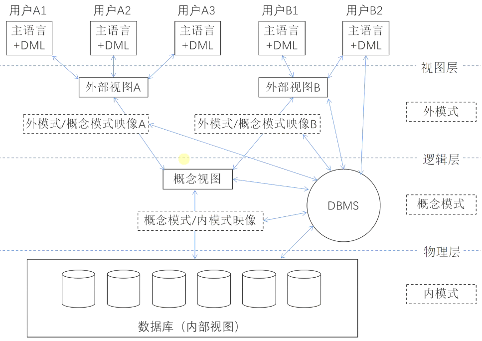

# 数据库的三级模式

## 最佳实践

### 考察问

1. 🟡🟩💚3级模式分别是(), (), (). 物理结构对应(), 逻辑结构对应(). 物理文件对应(), 表对应(), 视图对应().
2. 🟡🟩💚()对()的映射保证了物理独立性, ()对()的映射保证逻辑独立性.
3. 🟡🟩❤️视图的定义: (), (), ()
4. 🟡🟩❤️视图的优点: (), (), (), ()

### 考察点

1. 三级模式
    1. 内模式(物理结构, 物理文件)
    2. 模式(逻辑结构, 表)
    3. 外模式(视图, 视图)
2. 两级映射
    1. 模式/内模式映射保证物理独立性
    2. 模式/外模式映射保证逻辑独立性
3. 视图:
    1. 定义: `虚拟表`, 视图并`没有存储`这些数据，而是通过`查询动态生成`所需要的数据。
    2. 优点:
        1. 视图能`简化操作`
        2. 视图对重构数据库提供了一定程度的`逻辑独立性`
        3. 视图可以对机密数据提供`安全`保护
        4. 视图使用户能以`多种角度`看待同一数据

## 三级模式

1. 内模式
    `存储模式`，是数据`物理结构`和存储方式的描述，是数据在数据库内部的表示方式，定义所有的内部记录类型、索引和文件的组织方式以及数据控制方面的细节。一个数据库只有`一个`内模式。对应数据库中的`物理存储文件`。
2. 模式
    `概念模式`，是数据库中全部数据的`逻辑结构`和特征的描述。一个数据库只有`一个`概念模式。对应数据库中的`基本表`。
3. 外模式
    也称`用户模式`或子模式，是用户与数据库系统的接口，是用户用到的那部分数据的描述。一个数据库可以有`多个`外模式。对应数据库中的`视图`。

## 两级映像

1. 模式/内模式映像：实现了概念模式和内模式间的相互转换，是表和数据的物理存储之间的映射，保证了数据的物理独立性。

    物理独立性。物理独立性是指用户的应用程序与存储在磁盘上的数据库中的数据是相互独立的。当数据的物理存储改变时，应用程序不需要改变。物理独立性存在于概念模式和内模式之间的映射转换，说明物理组织发生变化时应用程序的独立程度。

2. 外模式/模式映像：实现了外模式和概念模式间的相互转换，是表和视图之间的映射，保证数据的逻辑独立性。

    逻辑独立性。逻辑独立性是指用户的应用程序与数据库中的逻辑结构是相互独立的。当数据的逻辑结构改变时，应用程序不需要改变。逻辑独立性存在于外模式和概念模式之间的映射转换，说明概念模式发生变化时应用程序的独立程度。

🔒题目:

1. 💚在数据库系统中，数据库的视图、基本表和存储文件的结构分别与( )对应；数据的物理独立性和数据的逻辑独立性是分别通过修改( )来完成的。

    - A.模式、外模式、内模式
    - B.模式、内模式、外模式
    - C.外模式、模式、内模式
    - D.外模式、内模式、模式

    - A.模式与内模式之间的映像、外模式与模式之间的映像
    - B.外模式与内模式之间的映像、外模式与模式之间的映像
    - C.外模式与模式之间的映像、模式与内模式之间的映像
    - D.外模式与内模式之间的映像、模式与内模式之间的映像

    答案: CA

## 视图

数据库视图：它是一个虚拟表（逻辑上的表），其内容由查询定义（仅保存SQL查询语句）。同真实的表一样，视图包含一系列带有名称的列和行数据。但是，视图并`没有`真正`存储`这些数据，而是通过`查询`原始表`动态生成`所需要的数据。

视图的优点：

1. 视图能`简化`用户`操作`
2. 视图使用户能以多种角度看待同一数据
3. 视图对重构数据库提供了一定程度的`逻辑独立性`
4. 视图可以对机密数据提供`安全`保护

🔒题目:

1. 某软件企业开发一套类似于淘宝网上商城业务的电子商务网站，该系统涉及多种用户角色，包括购物用户、商铺管理员、系统管理员等。

    在数据库设计中，该系统数据库的核心关系包括：

    - 产品（产品编码，产品名称，产品价格，库存数量，商铺编码）
    - 商铺（商铺编码，商铺名称，商铺地址，商铺邮箱，服务电话）
    - 用户（用户编码，用户名，用户地址，联系电话）
    - 订单（订单编码，订单日期，用户编码，商铺编码，产品编码，产品数量，订单总价）

    不同用户角色有不同的数据需求，为此该软件企业在基本数据库关系模式的基础上，定制了许多视图。其中，有很多视图涉及到多表关联和聚集函数运算。

    1. 💛(8分)商铺用户需要实时统计本商铺的货物数量和销售情况，以便及时补货，或者为商铺调整销售策略。为此专门设计了可实时查看当天商铺中货物销售情况和存货情况的视图，商铺产品销售情况日报表（商铺编码，产品编码，日销售产品数量，库存数量，日期）。数据库运行测试过程中，发现针对该视图查询性能比较差，不满足用户需求。请说明数据库视图的基本概念及其优点，并说明本视图设计导致查询性能较差的原因。

        1. 视图是虚表，是从一个或几个基本表（或视图）中导出的表，在系统的数据字典中仅存放了视图的定义，不存放视图对应的数据。

        2. 视图的优点：
            1. 视图能简化用户的操作。
            2. 视图机制可以使用户以不同的方式查询同一数据。
            3. 视图对数据库重构提供了一定程度的逻辑独立性。
            4. 视图可以对机密的数据提供安全保护。

        3. 查询性能较差的原因是视图中 “日销售产品数量” 需要针对订单表做统计分析，订单表中有数量庞大的历史销售记录，所以这种操作极为耗时。

    2. 💛(8分)为解决该视图查询性能比较差的问题，张工建议为该数据建立单独的商品当天货物销售、存货情况的关系表。但李工认为张工的方案造成了数据不一致的问题，必须采用一定的手段来解决。

        1. 说明张工方案是否能够对该视图查询性能有所提升，并解释原因。

            张工方案能够对该视图查询性能有所提升，因为这样做能极大的减少统计分析的数据量，对小数据量进行统计，性能能得以保障。

        2. 解释说明李工指出的数据不一致问题产生的原因。

            由于当日订单数据既存储在订单表中，又存储在单独的当天货物销售、存货情况表中。同一数据存储了两份，一旦出现修改，未同步修改，则会造成数据不一致。

    3. ❤️(9分)针对李工提出的问题，常见的解决手段有应用程序实现，触发器实现和物化视图实现等，请用300字以内的文字解释说明这三种方案。

        1. `应用程序`实现：在进行订单的添加、修改、删除操作时，从应用程序中，控制对两个数据表都进行相关操作，以保障数据的一致性。

        2. `触发器`实现：在应用程序中，只对订单表进行操作。但写触发器，当订单表发生变化时，把当日订单内容同步更新到当天货物销售、存货情况表中。

        3. `物化视图`实现：建立 “当天货物销售、存货情况” 的物化视图，物化视图会把相应的数据物理存储起来，而且在订单表发生变化时，会自动更新。
