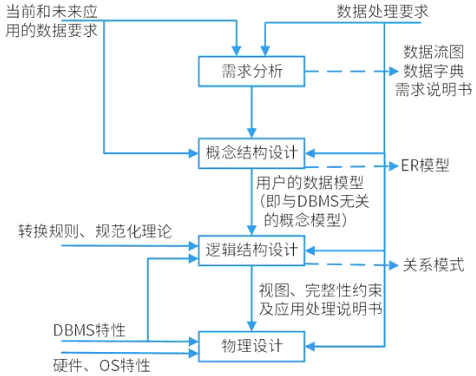

# 数据库设计

## 最佳实践

### 考察问

1. 🟡🟩💚数据库设计的4个步骤: (), (), (), ()
2. 需求分析阶段的产出包含: (), ()
3. 概念结构设计的产出是: ()
4. 逻辑结构设计的产出是: ()
5. 物理结构设计的产出是: ()

### 考察点

数据设计步骤:

1. 需求分析(数据流图, 数据字典)
2. 概念结构设计(E-R图)
3. 逻辑结构设计(关系模式)
4. 物理结构设计(物理分布)

## 设计六步

1. 用户需求分析。

    即分析数据存储的要求，产出物有`数据流图、数据字典、需求说明书`。获得用户对系统的三个要求：信息要求、处理要求、系统要求

2. 概念结构设计

    就是设计E-R图，也即实体-联系图。工作步骤包括：选择局部应用、逐一设计分E-R图、E-R图合并。分E-R图进行合并时，它们之间存在的冲突主要有以下3类。

    - 属性冲突。在图书馆管理分 E-R 图中，图书的价格属性可能以 “人民币元” 为单位；而在学校财务系统的分 E-R 图中，图书价格属性可能以 “分” 为单位。
    - 命名冲突。在一个分 E-R 图中，学生的学号属性被命名为 “student_id”，而在另一个分 E-R 图中，该属性被命名为 “student_number”，但它们都表示学生的唯一标识，意义相同。
    - 结构冲突。
        - 同一实体在不同的分E-R图中有不同的属性

            在学校的教学管理分 E-R 图中，“课程” 实体可能包含课程名称、课程编号、学分、授课教师等属性；而在学校的在线学习系统分 E-R 图中，“课程” 实体除了包含上述部分属性外，还可能有课程视频链接、在线测试题目等属性。

        - 同一对象在某一分E-R图中被抽象为实体而在另一分E-R图中又被抽象为属性。

            在学校的设备管理分 E-R 图中，“电脑” 被抽象为实体，有型号、配置、购买时间等属性；而在学校的资产管理分 E-R 图中，“电脑” 可能作为 “固定资产” 实体的一个属性，固定资产包含资产编号、类别（电脑、桌椅等）、数量等属性。

3. 逻辑结构设计

    将E-R图，转换成`关系模式`。工作步骤包括：确定数据模型、将E-R图转换成为指定的数据模型、确定完整性约束和确定用户视图。

4. 物理结构设计

    步骤包括确定数据分布、存储结构和访问方式。

5. 数据库实施阶段

    根据逻辑设计和物理设计阶段的结果建立数据库，编制与调试应用程序，组织数据入库，并进行试运行。

6. 数据库运行和维护阶段

    数据库应用系统经过试运行即可投入运行，但该阶段需要不断地对系统进行评价、调整与修改。

🔒题目:

1. 💚在数据库设计的（  ）阶段进行关系规范化。

    - A. 需求分析
    - B. 概念设计
    - C. 逻辑设计
    - D. 物理设计

    答案: C

2. 💚在数据库设计的需求分析阶段应完成包括（  ）在内的文档。
    - A. E-R图
    - B. 关系模式
    - C. 数据字典和数据流图
    - D. 任务书和设计方案

    答案: C
