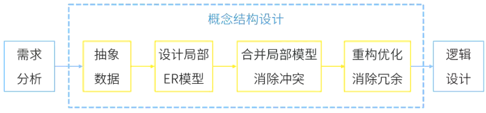

# E-R模型

## 最佳实践

### 考察问

1. 🔴🟩❤️ER图组成包含`()`, `()`, `()`
2. 🔴🟩💚派生属性概念: `()`
3. 🔴🟩💚E-R图集成冲突, 包含:`()`, `()`, `()`
    1. 属性冲突: 属性`()`和属性`()`
    2. 命名冲突：包括`()`和`()`
    3. 结构冲突: 同一实体`()`; 实体是属性, 属性是实体

### 考察点

1. E-R图的组成

    1. 实体(集): 矩形
    2. 联系: 菱形

        1. 一对一(1:1): 体集A中的一个实体最多只与实体集B中的一个实体相联系，反之亦然。
        2. 一对多(1:n): 集A中的一个实体可与实体集B中的多个实体相联系。
        3. 多对多(n:n): 体集A中的多个实体可与实体集B中的多个实体相联系。多对多的联系会产生一个新的关系模式.

    3. 属性: 椭圆

        派生属性：派生属性可以从其他属性`推导`得来。

2. E-R图集成产生的冲突
    1. 属性冲突: 属性`域`和属性`取值`
    2. 命名冲突：包括`同名异义`和`异名同义`
    3. 结构冲突: 同一实体`不同属性`; 实体是属性, 属性是实体

## E-R模型概念

`实体-联系`(`Entity-Relationship, ER`)模型，用来描述现实世界的概念模型（接近于人的思维方式，容易理解），其中有三个主要的概念：实体、联系和属性。

形状|说明
--|--
矩形|实体
菱形|联系集
椭圆|属性
线段|关系

1. 实体

    用`矩形`表示，每个实体由一组属性表示，包括`候选键、主键、外键`。`实体集`是指具有相同属性的实体集合。

2. 联系

    用`菱形`表示，实体集之间的对应关系称为联系，分为`一对一（1:1）`, `一对多（1:n或1:*）`, `多对多（m:n或*:*）`。

    

    1. 一对一(1:1): 体集A中的一个实体最多只与实体集B中的一个实体相联系，反之亦然。
    2. 一对多(1:n): 集A中的一个实体可与实体集B中的多个实体相联系。
    3. 多对多(n:n): 体集A中的多个实体可与实体集B中的多个实体相联系。

        多对多的联系会产生一个新的关系模式，此关系模式的属性由联系的两个实体的主键以及自己的特有属性所组成。

3. 属性

    用椭圆表示，是实体某方面的特性。E-R模型中的属性分为：

    1. 简单和复合属性：简单属性是原子的、不可再分的，复合属性可以划分为多个子属性，如通信地址。
    2. 单值和多值属性：对于一个特定的实体都只 有一个单独的值（单值属性）。例如，对于一个特定的员工，只对应一个员工号、员工姓名。而员工可能有0个、1个或多个亲属，那么员工的亲属姓名可能有多个，这样的属性称为多值属性。
    3. NULL属性：某个属性没有值或属性值未知时，使用NULL值，表示无意义或不知道。
    4. `派生属性`：派生属性可以从其他属性`推导`得来。例如，职工实体集中有“参加工作时间”和“工作年限”属性，那么“工作年限”的值可以由当前时间和参加工作时间得到。“工作年限”就是一个派生属性。

        🔒题目:

        1. 💚通常在设计关系模式时，派生属性不会作为关系中的属性来存储。按照这个原则，假设原设计的学生关系模式为Students（学号，姓名，性别，出生日期，年龄，家庭地址），那么该关系模式正确的设计应为（ ）。

            - A. Students（学号，性别，出生日期，年龄，家庭地址）
            - B. Students（学号，姓名，性别，出生日期，年龄）
            - C. Students（学号，姓名，性别，出生日期，家庭地址）
            - D. Students（学号，姓名，出生日期，年龄，家庭地址）

            答案：C

## E-R图集成方法

1. 集成的方法：
    1. 多个局部E-R图一次集成。
    2. 逐步集成，用累加的方式一次集成两个局部E-R图。
2. 集成产生的冲突及解决办法：
    1. 属性冲突：包括属性域冲突和属性取值冲突。

        在图书馆管理分 E-R 图中，图书的价格属性可能以 “人民币元” 为单位；而在学校财务系统的分 E-R 图中，图书价格属性可能以 “分” 为单位。

    2. 命名冲突：包括同名异义和异名同义。

        1. 同名异义: 在一个分 E-R 图中，“姓名” 属性代表学生的姓名；而在另一个分 E-R 图中，“姓名” 属性可能代表教师的姓名。即相同的名称在不同的分 E-R 图中代表不同的对象属性。

        2. 异名同义: 在一个分 E-R 图中，学生的学号属性被命名为 “student_id”，而在另一个分 E-R 图中，该属性被命名为 “student_number”，但它们都表示学生的唯一标识，意义相同。

    3. 结构冲突：

        1. 同一实体在不同的分E-R图中有不同的属性

            在学校的教学管理分 E-R 图中，“课程” 实体可能包含课程名称、课程编号、学分、授课教师等属性；而在学校的在线学习系统分 E-R 图中，“课程” 实体除了包含上述部分属性外，还可能有课程视频链接、在线测试题目等属性。

        2. 同一对象在某一分E-R图中被抽象为实体而在另一分E-R图中又被抽象为属性。

            在学校的设备管理分 E-R 图中，“电脑” 被抽象为实体，有型号、配置、购买时间等属性；而在学校的资产管理分 E-R 图中，“电脑” 可能作为 “固定资产” 实体的一个属性，固定资产包含资产编号、类别（电脑、桌椅等）、数量等属性。

🔒题目:

1. 💚某企业开发信息管理系统平台进行 E - R 图设计，人力部门定义的是员工实体具有属性：员工号、姓名、性别、出生日期、联系方式和部门，培训部门定义的培训师实体具有属性：培训师号、姓名和职称，其中职称={初级培训师，中级培训师，高级培训师}，这种情况属于 （ ） ，在合并 E - R 图时，解决这一冲突的方法是 （ ） 。

    - A. 属性冲突  
    - B. 结构冲突  
    - C. 命名冲突  
    - D. 实体冲突

    - A. 员工实体和培训师实体均保持不变
    - B. 保留员工实体、删除培训师实体
    - C. 员工实体中加入职称属性，删除培训师实体
    - D. 将培训师实体所有属性并入员工实体，删除培训师实体

    答案: BC, 没有实体冲突, 只有结构冲突

