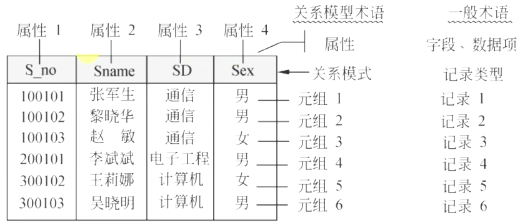
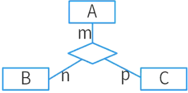

# 关系模型

## 最佳实践

### 考察问

1. 🔴🟩💚关系模型就是常说的()
2. 🔴🟩💚候选键的概念: ()()()
3. 🔴🟩💚主键的概念: ()
4. 🔴🟩💚外键的概念: ()
5. 🔴🟩💚关系模式的概念: (), 公式为()
6. 🔴🟩💚E-R图转关系模式两步: (), ()
7. 🔴🟩💚联系转关系的三种情况:
    1. 一对一: (), ()
    2. 一对多: (), ()
    3. 多对多: ()
8. 🔴🟩💚完整性约束
    1. 实体完整性(主键约束): ()
    2. 参照完整性(外键约束): (), ()
    3. 自定义完整性: ()

### 考察点

1. 关系模式就是指`数据表`
2. 候选码(Candidate Key)：（候选键）能`唯一标识``一行元组`的`属性集`。
3. 主码(Primary Key)：（主键）从`候选键中选一个`作为主键。
4. 外码(Foreign Key)：（外键）在`另一个关系模式中充当主键`的`该关系模式的属性`。
5. 关系的`描述`称为关系模式(Relation Schema)，可以形式化地表示为：$R(U, D, dom, F)$
6. 🔴🟨❤️E-R图转关系模式
    1. 一个实体型必须转换为一个关系模式
    2. 联系转关系模式：
        1. 一对一联系的转换有两种方式。
            - `独立的关系模式`：并入两端主键及联系自身属性。（主键：任一端主键）
            - `归并（任意一端）`：并入另一端主键及联系自身属性。（主键：保持不变）
        2. 一对多联系的转换有两种方式。
            - `独立的关系模式`：并入两端主键及联系自身属性。（主键：多端主键）
            - `归并（多端）`：并入另一端主键及联系自身属性。（主键：保持不变）
        3. 多对多联系的转换只有一种方式
            - `独立的关系模式`：并入两端主键及联系自身属性。（主键：两端主键的组合键）
7. 完整性约束
    1. 实体完整性(主键约束): 主属性不能为空
    2. 参照完整性(外键约束): 外键的值或者为空, 或者必须等于对应关系的主键值
    3. 自定义完整性: 用户自定义的约束

## 属性和域

一个现实中的实体（事物）常用若干特征来描述，这些特征称为属性。每个属性的取值范围对应的集合称为该属性的域。

例如：员工（员工号，姓名，性别，参加工作时间，部门号）

## 关系的相关名词

1. 候选码(Candidate Key)：（候选键）能`唯一标识一行元组`的`属性集`。
2. 主码(Primary Key)：（主键）从`候选键中选一个`作为主键。
3. 外码(Foreign Key)：（外键）在`另一个关系模式中充当主键`的`该关系模式的属性`。
4. 目或度：关系模式中属性的个数。
5. 全码（ALL-Key）：关系模式的所有属性组是这个关系的候选码。
6. 主属性(Non-Key attribute)：包含在任何候选码中的诸属性称为主属性。不包含在任何候选码中的属性称为非码属性。

员工（员工号，姓名，性别，参加工作时间，部门号），部门（部门号，名称，电话，负责人）

## 关系的三种类型

1. 基本关系。通常又称为基本表，它是实际存在的表，是实际存储数据的逻辑表示。
2. 查询表。查询表是查询结果对应的表。
3. 视图表。视图表是由基本表或其他视图表导出的表。由于它本身不独立存储在数据库中，数据库中只存放它的定义，所以常称为虚表。

## 关系数据库模式

关系的描述称为关系模式(Relation Schema)，可以形式化地表示为：$R(U, D, dom, F)$, 其中，

1. `R`表示关系名
2. `U`(Unified Attributes Set)是组成该关系的属性名集合
3. `D`(Domain)是属性的域
4. dom是属性向域的映像集合
5. `F`(Functional Dependency Set)为属性间数据的依赖关系集合。

✨记R`(U, D, F)`就行

通常将关系模式简记为：$R(U)$或$R(A_1, A_2, \cdots, A_n)$ 其中，

1. R为关系名，
2. $A_1, A_2, \cdots, A_n$为属性名或域名，
3. 属性向域的映像常常直接说明属性的类型、长度。通常在关系模式主属性上加下划线表示该属性为主码属性。

举例: 员工（员工号，姓名，性别，参加工作时间，部门号）

## E-R图转换为关系模式

1. 一个实体型必须转换为一个关系模式
2. 联系转关系模式：

    1. 一对一联系的转换有两种方式。
        - `独立的关系模式`：并入两端主键及联系自身属性。（主键：任一端主键）
        - `归并（任意一端）`：并入另一端主键及联系自身属性。（主键：保持不变）
    2. 一对多联系的转换有两种方式。
        - `独立的关系模式`：并入两端主键及联系自身属性。（主键：多端主键）
        - `归并（多端）`：并入另一端主键及联系自身属性。（主键：保持不变）
    3. 多对多联系的转换只有一种方式
        - `独立的关系模式`：并入两端主键及联系自身属性。（主键：两端主键的组合键）

🔒题目:

1. 💚在数据库逻辑结构的设计中，将E-R模型转换为关系模型应遵循相关原则。对于三个不同实体集和它们之间的多对多联系m∶n∶p，最少可转换为( )个关系模式。

    

    - A.2
    - B.3
    - C.4
    - D.5

    答案: C

2. 💚某企业工程项目管理数据库的部分关系模式如下所示，其中带实下划线的表示主键，虚下划线的表示外键。

    - 供应商 (供应商号_实，名称，地址，电话，账号)
    - 项目 (项目号_实，负责人_虚，开工日期)
    - 零件 (零件号_实，零件名，规格)
    - 供应 (项目号_实虚，零件号_实虚，供应商号_实虚，供应量)
    - 员工 (员工号_实，姓名，性别，出生日期，职位，联系方式)

    其中供应关系是（  ）的联系。若一个工程项目可以有多个员工参加，每个员工可以参加多个项目，则项目和员工之间是 (  ) 联系。对项目和员工关系进行设计时，（  ）设计成一个独立的关系模式。

    - A 2个实体之间的1∶n
    - B 2个实体之间的n∶m
    - C 3个实体之间的1∶n∶m
    - D 3个实体之间的k∶n∶m

    - A 1∶1
    - B 1∶n
    - C n∶m
    - D n∶1

    - A 多对多的联系在向关系模型转换时必须
    - B 多对多的联系在向关系模型转换时无须
    - C 只需要将一端的码并入多端，所以无须
    - D 不仅需要将一端的码并入多端，而且必须

    答案: DCA

3. 💚E-R模型向关系模型转换时，两个实体$E_1$和$E_2$之间的多对多联系R应该转换为一个独立的关系模式，且该关系模式的关键字由(  )组成。

    - A.联系R的属性
    - B.$E_1$或$E_2$的关键字
    - C.$E_1$和$E_2$的关键字
    - D.$E_1$和$E_2$的关键字加上R的属性

    答案：C

4. 💚通常在设计关系模式时，派生属性不会作为关系中的属性来存储。按照这个原则，假设原设计的学生关系模式为Students（学号，姓名，性别，出生日期，年龄，家庭地址），那么该关系模式正确的设计应为_____。

    - A.Students（学号，性别，出生日期，年龄，家庭地址）
    - B.Students（学号，姓名，性别，出生日期，年龄）
    - C.Students（学号，姓名，性别，出生日期，家庭地址）
    - D.Students（学号，姓名，出生日期，年龄，家庭地址）

    答案：C

5. 某企业委托软件公司开发一套包裹信息管理系统，以便于对该企业通过快递收发的包裹信息进行统一管理。在系统设计阶段，需要对不同快递公司的包裹单信息进行建模，其中，邮政包裹单如图2 - 1所示。

    

    1. 💛（14分）请说明关系型数据库开发中，逻辑数据模型设计过程包含哪些任务？该包裹单的逻辑数据模型中应该包含哪些实体？并给出每个实体的主键属性。(2020下)

        逻辑模型设计也称为逻辑结构设计，其任务是将概念模型转化为某个特定的DBMS上的逻辑模型。设计逻辑结构时，首先为概念模型选定一个合适的逻辑模型（例如，关系模型、网状模型或层次模型），然后将其转化为由特定DBMS支持的逻辑模型，最后对逻辑模型进行优化。逻辑设计的目的是将概念设计阶段设计好的E-R图转换为与选用的具体机器上的DBMS所支持的数据模型相符合的逻辑结构。

        该包裹单包含三类实体：收件人（主键：电话）、寄件人（主键：电话）、包裹单（主键：包裹单编号）。

    2. 💛（6分）请说明什么是超类实体？结合图中包裹单信息，试设计一种超类实体，给出完整的属性列表。(2020下)

        某个实体类型中所有实体同时也是另一个实体类型中的实体，此时称前一实体为子类实体，后一实体为超类实体。本题的超类实体为：包裹单（包裹单编号、收件人、寄件人）。

    3. 💚（5分）请说明什么是派生属性，并结合图2 - 1的包裹单信息说明哪个属性是派生属性。(2020下)

        实体的某个属性可以从其他属性或其他数据`推导`出来，那么这个属性就是派生属性。本题中，资费总计=资费+挂号费+保价费+回执费，因此资费总计是一个派生属性。

## 完整性约束

完整性规则提供了一种手段来`保证`当用户对数据库做修改时不会破坏数据的`一致性`，防止对数据的意外破坏。关系模型的完整性规则是对关系的某种约束条件。关系的完整性分为三类：

1. `实体完整性`：`主属性`不能取空。
2. `参照完整性`：`外键的值`或者为`空`，或者必须`等于对应关系中的主键值`。
    员工（<u>员工号</u>，姓名，性别，参加工作时间，部门号），部门（<u>部门号</u>，名称，电话，负责人）
3. `用户定义完整性`：根据语义要求所`自定义的约束条件`。

🔒题目:

1. 💚某数据库中有
    1. 员工关系E（员工号，姓名，部门，职称，月薪）
    2. 产品关系P（产品号，产品名称，型号，尺寸，颜色）
    3. 仓库关系W（仓库号，仓库名称，地址，负责人）
    4. 库存关系I（仓库号，产品号，产品数量）。

    若数据库设计中要求：

    1. 仓库关系W中的“负责人”引用员工关系的员工号
    2. 库存关系I中的“仓库号，产品号”唯一标识I中的每一个记录
    3. 员工关系E中的职称为“工程师”的月薪不能低于3500元

    则123依次要满足的完整性约束是（  ）。
    - A 实体完整性、参照完整性、用户定义完整性
    - B 参照完整性、实体完整性、用户定义完整性
    - C 用户定义完整性、实体完整性、参照完整性
    - D 实体完整性、用户定义完整性、参照完整性

    答案: B

