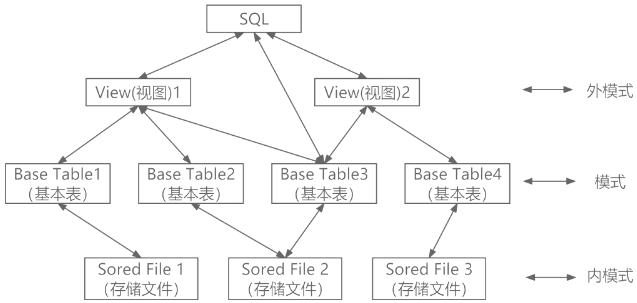

# SQL语句

## 最佳实践

1. 索引改变的是内模式

## SQL与三级模式

1. SQL是结构化查询语言的简称，是关系数据库中最普遍使用的语言，包括数据查询、数据操纵、数据定义和数据控制，是一种通用的、功能强大的关系数据库标准语言。

2. SQL语言支持关系数据库的三级模式。基本表和视图都是表，基本表是存储在数据库中的表，而视图是虚表，是从基本表或其他视图导出的表。数据库中只存放视图的定义，不存放视图的数据。用户可用SQL语言对视图或表进行查询等操作。 

## 索引建立与删除

数据库中索引的作用：

1. 通过创建唯一性索引，保证数据记录的唯一性
2. 大大加快数据的检索速度
3. 加速表与表之间的连接
4. 在使用Order By和Group By子句中进行检索数据时，可以显著减少查询中分组和排序的时间
5. 使用索引可以在检索数据的过程中使用优化隐藏器，提高系统性能

索引分为聚簇索引和非聚簇索引。聚簇索引是指索引表中索引项的顺序与表中记录的物理顺序一致的索引。 

🔒💚采用三级模式结构的数据库系统中，如果对一个表创建聚簇索引，那么改变的是数据库的______。

- A. 外模式
- B. 模式
- C. 内模式
- D. 用户模式

答案：C

对于内模式，又称存储模式，对应文件级，是数据物理结构和存储方式的描述，是数据在数据库内部的表示方法，定义所有内部的记录类型、索引和文件的组织方式，以及数据控制方面的细节。例如：B+树结构存储、Hash方法存储和聚簇索引等。聚簇索引是指索引表中索引项的顺序与表中记录的物理顺序一致的索引，所以需要改变的是数据库的内模式。 