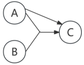
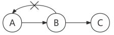
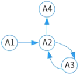
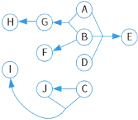
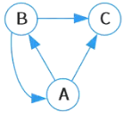

# 函数依赖

## 最佳实践

### 考察问

1. 🟡🟩💚函数依赖的3种分类: (), (), ()
2. 🟡🟩💚图示法函数依赖求候选键:
    1. 找出所有入度为()的属性, 如果能遍历所有节点, 则该入度为()属性集为候选键
    2. 若无法遍历, 则加入能遍历所有节点的最少的(), 入度为()属性和()属性集为候选键
3. 🟡🟩❤️Armstrong公理系统
    1. (): 集合能推出子集
    2. (): 添加相同属性, 依赖关系不变
    3. (): 传递
    4. (): $X \to Y$，$X \to Z$，则$X \to YZ$
    5. (): $X \to Y$，$Z \subseteq Y$，则$X \to Z$
    6. (): $X \to Y$，$WY \to Z$，则$XW \to Z$. 结合传递律记忆

### 考察点

1. R(U): $X \to Y$. R是表(关系); U是属性集合; X, Y是具体的属性集合(字段)
2. F={A1→A2，A3→A2，A2→A3，A2→A4}. F是关系, A1,...,A4是属性(字段)

3. 🟡🟨💚函数依赖的分类
    1. 函数依赖: X决定Z. Z依赖于X
    2. 部分函数依赖: (X, Y)决定Z, X决定Z. Z部分依赖于(X, Y)
    3. 传递依赖: X决定Y, Y决定Z, X决定Z. Z传递依赖X

4. 🟡🟨💚图示法函数依赖求候选键. 
    1. 有向图表示依赖关系
    2. 找出所有入度为0的属性, 如果能遍历所有节点, 则该L(入度为0)属性集为候选键
    3. 第2步, 无法遍历, 则加入能遍历所有节点的最少M(中间节点), 入度为0属性和M(中间节点)属性集为候选键
    4. R(出度为0)的属性不可能是候选键
5. 🟡🟨❤️Armstrong公理系统
    1. 自反律: 
        1. $X = \{学号, 姓名\}$，$Y = \{姓名\}$(既$Y \subseteq X$)
        2. $\{学号, 姓名\} \rightarrow \{姓名\}$(既$X \to Y$)
    2. ❤️增广律: 
        1. $\{学号\} \rightarrow \{姓名\}$(既$X \to Y$)，$Z = \{年龄\}$(既$Z \subseteq U$)
        2. $\{学号, 年龄\} \rightarrow \{姓名, 年龄\}$(既$XZ \to YZ$)
    3. 传递律: $X \to Y$，$Y \to Z$, 则有$X \to Z$
    4. ❤️合并律: 
        1. $\{学号\} \rightarrow \{姓名\}$，$\{学号\} \rightarrow \{年龄\}$(既$X \to Y$，$X \to Z$)
        2. $\{学号\} \rightarrow \{姓名, 年龄\}$(既$X \to YZ$)
    5. ❤️分解律: 
        1. $\{学号\} \rightarrow \{姓名, 年龄\}$, $Z = \{年龄\}$(既$X \to Y$, $Z \subseteq Y$)
        2. $\{学号\} \rightarrow \{姓名\}$(既$X \to Z$)
    6. ❤️伪传递律: 
        1. $\{学号\} \rightarrow \{课程号\}$，$\{课程号, 学期\} \rightarrow \{成绩\}$(既$X \to Y$，$WY \to Z$)
        2. $\{学号, 学期\} \rightarrow \{成绩\}$(既$XW \to Z$)

## 概念

关系数据库设计的方法之一就是设计满足合适范式的模式。关系数据库规范化理论主要包括数据依赖、范式和模式设计方法。其中核心基础是数据依赖，数据依赖中最重要、最基本的就是函数依赖。

## 函数依赖分类

1. `函数依赖`

    设R(U)是属性集U上的关系模式，X、Y是U的子集。若对R(U)的任何一个可能的关系r，r中不可能存在两个元组在X上的属性值相等，而在Y上的属性值不等，则称X函数决定Y或Y函数依赖于X，记作$X \to Y$。

    1. “学号 -> 系号”
    2. “系号 -> 系名”

2. `部分函数依赖`

    如果$X \to Y$，但Y不完全函数依赖于X，则称Y对X部分函数依赖。

    (A,B)能确定C，A也能确定C，即(A,B)属性集中的部分属性（A）就可以确定C，则C部分函数依赖于(A,B)。 

    

3. `传递函数依赖`

    在$R(U,F)$中，如果$X \to Y$，$Y \nsubseteq X$，$Y \to Z$，则称Z对X传递依赖。其中，U：属性集，F：是U上的一组函数依赖。
    例子：若$A \to B$，$B \to C$，则$A \to C$（B不能$\to A$，防止直接$A \to C$），则称C传递函数依赖A。

    

## 图示法函数依赖求候选键

求候选键最稳妥的办法是图示法。图示法求候选键的过程如下：

1. 将关系的函数依赖关系用`有向图`的方式表示。
2. 找出所有`入度为0`的属性，并以该属性集合为起点，尝试遍历有向图，若能正常`遍历`图中`所有结点`，则该属性集即为关系模式的`候选键`。此种情况:
    1. `入度为0的`, 必然是`候选键集合的元素`, 因为只有自己可以找到自己
    2. 不能添加中间节点, 因为会有冗余
3. 若入度为0的属性集`不能遍历图中所有结点`，则需要尝试性的将一些`中间结点`（既有入度，也有出度的结点）并入度为0的属性集中，直至该属性集合能遍历所有结点，则该属性集合为候选键。此种情景:
    1. `入度为0的`, `必然是候选键集合的元素`, 因为只有自己可以找到自己
    2. 然后添加足以`遍历全部节点`的`中间节点`

🔒题目:

1. 💛给定关系R(A1，A2，A3，A4)上的函数依赖集F={A1→A2，A3→A2，A2→A3，A2→A4}，R的候选关键字为(  )。

    

    - A. A1
    - B. A1A3
    - C. A1A3A4
    - D. A1A2A3

    答案: A

    L: A1
    M: A2 A3(不需要, 因为A1可以唯一确定, 加入A2或A3冗余)
    R: A4

2. 💛关系模式P (A，B，C，D，E，F，G，H，I，J)满足下列函数依赖：FD={ABD→E，AB→G，B→F，C→J，CJ→I，G→H}，求候选码?

    

    L: ABCD

3. 💛关系R (A，B，C) 满足下列函数依赖：F {B→C，B→A，A→BC} ，关系R的候选关键字为(  )。

    

    - A. AB
    - B. A和B
    - C. A和BC
    - D. AC和AB

    答案: B

    M: A B
    R: C

## 函数依赖的公理系统(Armstrong公理系统)

设关系模式$R(U,F)$，其中$U$为属性集，$F$是$U$上的一组函数依赖，$X$, $Y$, $Z$表示属性集, 那么有以下推理规则：

- 自反律(Reflexivity)：如Y是X的子集, 则Y依赖于X. 若$Y \subseteq X \subseteq U$，则$X \to Y$为$F$所蕴涵。

    这里的 $U$ 是关系模式 $R$ 的属性集，$X$ 和 $Y$ 是 $U$ 的子集。也就是说，如果 $Y$ 是 $X$ 的子集，那么 $X$ 函数决定 $Y$。这是一个平凡的函数依赖，因为一个属性集总能决定它的任何子集。

    假设有一个学生关系模式 $R(学号, 姓名, 性别, 年龄)$，设 $X = \{学号, 姓名\}$，$Y = \{姓名\}$，因为 $Y$ 是 $X$ 的子集，根据自反律，有 $\{学号, 姓名\} \rightarrow \{姓名\}$

- 增广律(Augmentation)：添加相同属性, 函数依赖不变. 若$X \to Y$为$F$所蕴涵，且$Z \subseteq U$，则$XZ \to YZ$为$F$所蕴涵。 

    $XZ$ 表示 $X \cup Z$。即在函数依赖的两边可以同时增加相同的属性。

    在学生关系模式 $R$ 中，已知 $\{学号\} \rightarrow \{姓名\}$，设 $Z = \{年龄\}$，根据增广律，就有 $\{学号, 年龄\} \rightarrow \{姓名, 年龄\}$。

- 传递律(Transitivity)：若$X \to Y$，$Y \to Z$为$F$所蕴涵，则$X \to Z$为$F$所蕴涵。

    在学生选课关系模式 $R(学号, 课程号, 教师号)$ 中，已知 $\{学号\} \rightarrow \{课程号\}$（一个学生选的课程是确定的），$\{课程号\} \rightarrow \{教师号\}$（一门课程由固定的教师教授），根据传递律，可得 $\{学号\} \rightarrow \{教师号\}$

根据以上三条推理规则，又可推出三条推理规则：

- 合并规则(Union Rule)： 若$X \to Y$，$X \to Z$，则$X \to YZ$为$F$所蕴含。

    合并律 = 传递 + 增广

    在学生关系模式 $R$ 中，已知 $\{学号\} \rightarrow \{姓名\}$，$\{学号\} \rightarrow \{年龄\}$，根据合并规则，可得 $\{学号\} \rightarrow \{姓名, 年龄\}$

- 分解规则(Decomposition Rule)： 若$X \to Y$，$Z \subseteq Y$，则$X \to Z$为$F$所蕴含。 

    伪传递律 = 传递 + 自反（约等于废话）

    已知在学生关系模式 $R$ 中 $\{学号\} \rightarrow \{姓名, 年龄\}$，根据分解规则，可得 $\{学号\} \rightarrow \{姓名\}$ 和 $\{学号\} \rightarrow \{年龄\}$

- 伪传递规则(Pseudo - Transitivity)： 若$X \to Y$，$WY \to Z$，则$XW \to Z$为$F$所蕴含。 

    伪传递律 = 传递 + 增广 

    在学生选课关系模式 $R$ 中，已知 $\{学号\} \rightarrow \{课程号\}$，$\{课程号, 学期\} \rightarrow \{成绩\}$，设 $X = \{学号\}$，$Y = \{课程号\}$，$W = \{学期\}$，$Z = \{成绩\}$，根据伪传递规则，可得 $\{学号, 学期\} \rightarrow \{成绩\}$

✨"为$F$所蕴涵"的意思就是"成立"

🔒题目:

1. 🔴设关系模式R(U,F)，其中U为属性集，F是U上的一组函数依赖，那么函数依赖的公理系统（Armstrong公理系统）中的合并规则是指（  ）为F所蕴涵。

    - A. 若A→B，B→C，则A→C
    - B. 若Y⊆X⊆U，则X→Y
    - C. 若A→B，A→C，则A→BC
    - D. 若A→B，C⊆B，则A→C

    答案: C

2. 🔴给定关系模式$R(U, F)$，其中$U$为属性集，$F$是$U$上的一组函数依赖，那么函数依赖的公理系统（Armstrong公理系统）中的分解规则是指______为$F$所蕴涵。

    - A. 若$X→Y$，$Y→Z$，则$X→Z$
    - B. 若$Y⊆X ⊆U$，则$X→Y$
    - C. 若$X→Y$，$Z⊆Y$，则$X→Z$
    - D. 若$X→Y$，$Y→Z$，则$X→YZ$

    答案：C

3. 🔴给出关系$R(U, F)$，$U = \{A, B, C, D, E\}$，$F = \{A→B, D→C, BC→E, AC→B\}$，求属性闭包的等式成立的是（  ）。$R$的候选关键字为（  ）。

    - A. $(A)_F^+= U$  
    - B. $(B)_F^+= U$  
    - C. $(AC)_F^+= U$  
    - D. $(AD)_F^+= U$

    - A. $AD$  
    - B. $AB$  
    - C. $AC$  
    - D. $BC$

    答案: D  A

    设$X$是函数依赖集，被$X$逻辑蕴涵的函数依赖全体构成的集合，称为函数依赖集$X$的闭包。简言之，闭包本质上就是这些属性能直接或间接推出的属性集的集合。

    不难求出，$(A)=AB$，$(B)=B$，$(AC)=ABC$，$(AD)=ABCDE$，因此$D$选项正确。
    $AD$能推出$U$的所有属性，因此$AD$即为$R$的候选关键字。 