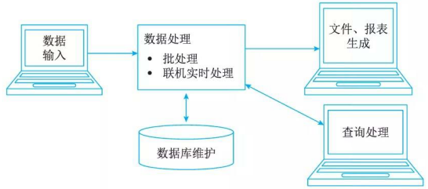

# 业务处理系统

## 业务处理系统的概念

业务处理系统 (Transacti on Processing System, TPS) 又可称为电子数据处理系统 (Electronic Data Processing System, EDP)，就是针对管理中具体的事务(如财会、销售、库存等)来辅助管理人员将所发生的数据进行记录、传票、记账、统计和分类，并制成报表等活动，为经营决策提供有效信息的基千计算机的信息系统。

TPS 是服务千组织管理层次中最低层、最基础的信息系统。这些系统通常是一种分离式单独处理某一项具体事务的系统，如账务处理系统、工资管理系统、物料进出库管理系统、合同管理系统等。各个子系统有自己专有的软、硬件和专有的数据文件，它们之间一般不交流、不共享某些专用数据库文件。

## 业务处理系统的功能

TPS 的数据处理周期由以下 5 个阶段构成：数据输入、数据处理、数据库的维护、文件报表的生成和查询处理。

1. 数据输入: 常见的数据输入方式有 3 种，即人工、自动(POS机)及二者结合。
2. 数据处理: TPS 中常见的数据处理方式有两种，一种是批处理方式；另一种是联机事务处理方式。
    1. 批处理 (Batch Processing) : 一个典型的例子就是银行每日的账目处理，银行总是将白天的所有账目储存成批，等到白天的对外营业停止后再进行一次性处理，这样每个储户的银行平衡表就是每天修改一次，并产生相关的报表:

        1. 批处理方式的优点是：当有大量的事务数据需要处理时，使用批处理是一种较经济的方式，因为它可以缩减因频繁修改数据库所需的费用。这种方式适合千在事务发生时无须即时修改数据库以及只须定期产生文件、报表的应用。例如，在每周发放工资的情况下，员工的考勤数据及其他有关的工资数据就可以收集成批之后每周处理一次。
        2. 批处理方式的缺点是：在定期事务处理的间隔期，主文件易过时而且也无法满足实时的查询需求。
    2. 联机事务处理 (OnLine Transaction Process ing,  OLTP): 又可称为实时处理，即能对所发生的事务数据进行立即处理，并将处理结果提供给终端用户。事务数据一旦产生，则无须积累成批，也无须经过分类，就直接从联机的终端上输入到计算机系统中并进行处理。
        1. OLIP 方式的优点是当事务数据产生时能即时更新有关的文件和数据库，并能立刻响应终端用户的查询请求。
        2. 其缺点是成本高，由于是对数据库进行联机直接存取，为防止数据被非法存取或被偶然破坏，需要有一定授权机制。同时为保证实时处理不被中断，要采用有关的容错技术，这也需要额外的开支。但是，在某些清况下，以费用换取速度、效率和更优质的服务是值得的。

3. 数据库的维护: 数据库是一个企业的数据资源，能为支待中、高层管理人员决策的管理信息系统、决策支持系统和专家系统等提供有用的基础信息。对数据库的访问形式基本有 4 种：检索、修改、存入和删除。

4. 文件报表的产生: TPS 的输出就是为终端用户提供所需的有关文件和报表，这些文件和报表根据其用途不同可分为以下几类。

    1. 行动文件 (Action Documents)  :即该文件的接收者持有文件后可进行某项事务处理，例如，采购订单交给采购员，采购员即可向有关的供应商购货；工资支票交给银行后，银行便向员工支付工资等。
    2. 信息文件(Information Documents)  :该类文件向其持有者表明某项业务已发生了，例如订单确认书及客户发票向购货方表明供货方已供货了。这类文件有时也可作为控制文件使用。
    3. 周转文件 (Turnaround Documents)  :这类文件交给接受者之后通常还要返回到发送者手中，故称为周转文件。例如计算机印制的发票(多联)交给客户，客户必须将付款凭证与其中一联发票再一起交回，因此这类文件的信息可通过自动数据录入装置输入到计算机系统中。

5. 查询处理

