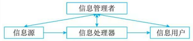
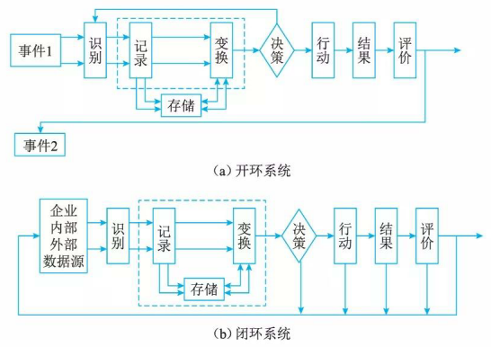
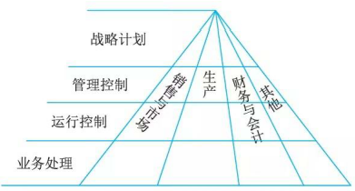
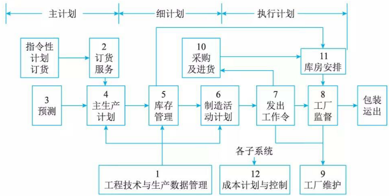
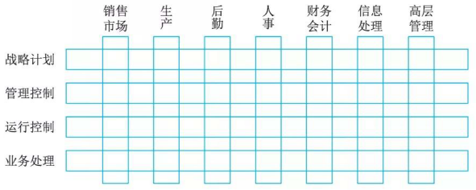
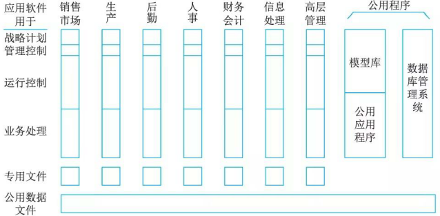

# 管理信息系统

管理信息系统 (Manage Information System, MIS) 是由业务处理系统发展而成的，是在TPS基础上引进大量管理方法对企业整体信息进行处理，并利用信息进行预测、控制、计划、辅助企业全面管理的信息系统。

## 管理信息系统的概念

管理信息系统由四大部件组成，即信息源、信息处理器、信息用户和信息管理者

根据各部件之间的联系可分为开环和闭环。开环结构是在执行一个决策的过程中不收集外部信息，不根据信息情况改变决策，直至产生本次决策的结果，事后的评价只供以后的决策作参考。闭环结构是在决策过程中不断收集信息，不断发送给决策者，不断调整决策。事实上最后执行的决策已不是当初设想的决策

根据处理的内容及决策的层次来看，我们可以把管理信息系统看成一个金字塔式的结构，

明管理信息系统能实现哪些管理功能。职能的完成往往是通过“过程”实现，过程是逻辑上相关活动的集合，因而往往把管理信息系统的功能结构表示成功能－过程结构:

这个系统标明了企业各种功能子系统怎样互相联系并形成一个全企业的管理系统，是企业各种管理过程的一个缩影。整个流程自左至右展开，这里的企业主生产计划 4 是根据指令性计划、订货服务以及预测的结果来制订的。通过库存管理决定需要多少原料、半成品、外购件以及资金，而且确定物料的到达时间及库存水平。要产生这些信息用到的产品数据由系统 l 得到，根据系统 5 的安排，系统 10 决定何时进行采购和订货手续；系统 11 决定何时何地接收货物；系统 6 决定何时何车间进行何种生产工作；系统 6 所安排的只是一个计划，只有通过系统 7 发出命令，一切工作才见行动；系统 11 在整个工作开始后，不断监视各种工作的完成情况，并进行调整和应急计划安排；最后进行包装并运出。图 3-8 中的工厂维护系统 9 的功能是安排大修，系统 12 是进行成本计划与控制。

## 管理信息系统的组成

一个管理系统可用一个功能／层次矩阵表示:

1. 销售市场子系统。它包括销售和推销，在运行控制方面包括雇用和训练销售人员、销售和推销的日常调度，还包括按区域、产品、顾客销售数量的定期分析等。在管理控制方面，包含总的成果和市场计划的比较，它所用的信息有顾客、竞争者、竞争产品和销售力量要求等。在战略计划方面包含新市场的开发和战略，它使用的信息包含顾客分析、竞争者分析、顾客评价、收入预测、入口预测和技术预测等。
2. 生产子系统。它包括产品设计、生产设备计划、生产设备的调度和运行、生产人员的雇用和训练、质量控制和检查等。典型的业务处理是生产订货、装配订货、成品票、废品票和工时票等。运行控制要求将实际进度与计划相比较，发现问题环节；管理控制要求进行总进度、单位成本和工事消耗的计划比较；战略计划要考虑加工方法和自动化的方法。
3. 后勤子系统。它包括采购、收货、库存控制和分发。典型的业务包括采购的征收、采购订货、制造订货、收货报告、库存票、运输票和装货票、脱库项目、超库项目、库营业额报告、卖主性能总结、运输单位性能分析等。管理控制包括每一后勤工作的实际与计划的比较，如库存水平、采购成本、出库项目和库存营业额等；战略分析包括信息的分配战略分析、对卖主的新政策、＂做或买”的战略、新技术信息、分配方案等。
4. 人事子系统。它包括雇用、培训、考核记录、工资和解雇等。其典型的业务有雇用需求的说明、工作岗位责任说明、培训说明、人员基本情况数据、工资变化、工作小时和离职说明等。运行控制关心的是雇佣、培训、终止、变化工资率、产生效果。管理控制主要进行实情与计划的比较，包括雇用数、招募费用、技术库存成分、培训费用、支付工资、工资率的分配和政府要求符合的情况。战略计划包括雇用战略和方案评价、工资、训练、收益、建筑位置及对留用人员的分析等，把本国的人员流动、工资率、教育情况和世界的情况进行比较。
5. 财务和会计子系统。按原理说财务和会计有不同的目标，财务的目标是保证企业的财务要求，并使其花费尽可能的低；会计则是把财务业务分类、总结，填入标准财务报告，准备预算、成本数据的分析与分类等。运行控制关心每天的差错和异常情况报告、延迟处理的报告和未处理业务的报告等；管理控制包括预算和成本数据的分析比较，如财务资源的实际成本，处理会计数据的成本和差错率等，战略计划关心的是财务保证的长期计划、减少税收影响的长期计划，成本会计和预算系统的计划。
6. 信息处理子系统。该系统的作用是保证企业的信息需要。典型的任务是处理请求、收集数据、改变数据和程序的请求、报告硬件和软件的故障及规划建议等。运行控制的内容包括日常任务调度、差错率、设备故障。对于新项目的开发还应当包括程序员的进展和调试时间。管理控制关心计划和实际的比较，如设备成本、全体程序员的水平、新项目的进度和计划的对比等。战略计划关心功能的组织是分散还是集中、信息系统总体计划、硬件软件的总体结构。办公室自动化也可算作与信息处理分开的一个子系统或者是合一的系统。当前办公室自动化主要的作用是支持知识工作和文书工作，如字符处理、电子信件、电子文件和数据与声音通信。
7. 高层管理子系统。每个组织均有一个最高领导层，如公司总经理和各职能域的副总经理组成的委员会，这个子系统主要为他们服务。其业务包括查询信息和支持决策，编写文件和信件便笺，向公司其他部门发送指令。运行控制层的内容包括会议进度、控制文件、联系文件。管理控制层要求各功能子系统执行计划的总结和计划的比较等。战略计划层关心公司的方向和必要的资源计划。高层战略计划要求广泛而综合的外部信息和内部信息，这里可能包括特级数据检索和分析以及决策支持系统。它所需要的外部信息可能包括：竞争者的信息、区域经济指数、顾客的喜好、提供的服务质量等。

对应千这个管理系统，在管理信息系统中的软件系统或模块组成一个软件结构, 中每个方块是一段程序块或是一个文件，每一个纵行是支持某一管理领域的软件系统。

