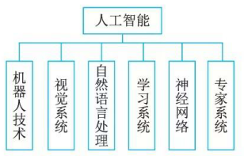
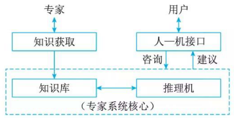

# 专家系统(Expert System, ES)

## 专家系统的概念

### 专家系统

专家系统的能力来自于它所拥有的专家知识，知识的表示及推理的方法则提供了应用的机理。因此这种基千知识的系统设计是以知识库和推理机为中心而展开的。

知识＋推理＝系统

而传统的软件的结构是：

数据结构＋算法＝程序

专家系统是一种智能的计算机程序，该程序使用知识与推理过程，求解那些需要资深专家的专门知识才能解决的高难度问题。

专家系统既不同千传统的应用程序，也不同千其他类型的人工智能问题求解程序。不同点主要表现在以下 5 个方面。

1. 专家系统属千人工智能范畴，其求解的问题不是传统程序求解的结构化问题，而是半结构化或非结构化问题，需要应用启发法或弱方法来解决，它不同于传统应用程序的算法。
2. 传统应用程序通过建立数学模型去模拟问题领域，而专家系统模拟的是人类专家在问题领域的推理，而不是模拟问题领域本身。从模拟对象的不同，足可以区分出专家系统与传统的应用程序。
3. 专家系统由 3 个要素组成：描述问题状态的综合数据库、存放启发式经验知识的知识库和对知识库的知识进行推理的推理机。三要素分别对应数据级、知识库级和控制级三级知识，而传统应用程序只有数据和程序两级结构。它将描述算法的过程性计算信息与控制性判断信息合而为一地编码在程序中，缺乏专家系统的灵活性。
4. 专家系统处理的问题属千现实世界中必须具备人类专家的大量专门知识才能解决的问题，它必须可靠地工作，并在合理的时间内对求解的问题给出可用的解答。所以它面对的往往是实际的问题，而不是纯学术的问题。
5. 从求解手段来看，专家系统的高性能是通过将问题领域局限在相对狭窄的特定领域内，它更强调该领域中人类专家的专门知识的应用。专家系统所拥有的这种启发式知识的数量和质量，将决定专家系统的性能和效率。从这个方面讲，专家系统的问题求解的通用性是较差的。

### 人工智能

人工智能(Artifi ci al Intelligence,  AI) 旨在利用机械、电子、光电或生物器件等制造的装置或机器模仿人类的智能。人工智能是一个极为广泛的领域， AI 的主要分支有专家系统、机器人技术、视觉系统、自然语言处理、学习系统和神经网络等

## 专家系统的特点

1. 超越时间限制
2. 操作成本低廉
3. 易千传递与复制
4. 处理手段一致
5. 善千克服难题
6. 适用特定领域

## 专家系统的组成

1. 知识库: 知识库中的知识可分成两类一类为事实性知识；另一类是启发性知识。这些知识可以从书籍中或亲身实践中获得。事实通常指的是公共定义的或已经发生的具体事件。事实性知识尽管相对容易获得，但在求解问题时是不可或缺的。启发性知识是领域专家在长期的工作中获得的经验总结，一般条例性差，较难理解，且适用范围窄，但对求解问题却十分有效，它使专家系统的决策在领域中具有专家的水平。

2. 综合数据库: 综合数据库是专家系统在执行与推理过程中用以存放所需要和产生的各种信息的工作存储器，通常包括欲解决问题的初始状态描述、中间结果、求解过程的记录、用户对系统提问的回答等信息，因此，综合数据库又叫动态知识库，其内容在系统运行过程中是不断变化的。相应地把专家系统的知识库称为静态知识库，因为它在一次推理中其内容是保持不变的，只有领域专家或知识工程师通过知识获取模块或系统通过自学习功能才能改变它的内容。可以认为，综合数据库和知识库一起才构成专家系统的完整知识库。

3. 推理机: 专家系统中常用的推理方式有 3 种：正向推理或前向推理、反向推理或逆向推理、双向推理或混合推理。正向推理又称数据驱动策略，即从条件出发推出结论。反向推理又称目标驱动策略，即先假设结论正确，再去验证条件是否满足，若诸条件都满足，则证明结论正确；否则，再由另一个假设去推断结论。正向推理适用千目标解空间很大的问题。反向推理适用千解空间较小的问题。双向推理是正向推理和反向推理同时进行，以期在某一时刻使正、反向推理过程达到某种一致状态而获得问题的解。在双向推理中，常常用正向推理来确定各种假设证实的先后次序，一旦确定后，又用反向推理验证假设是否成立。

4. 知识获取: 知识获取模块主要有两方面功能：一是知识的编辑和求精；二是知识自学习。。知识的编辑与求精，可使领域专家的经验或书本上的知识转化为系统所需的内部形式，作为新知识移入知识库，同时也可以使领域专家方便地修改知识库。自学习功能可以根据系统运行过程中积累的经验自动地修改和补充知识库的知识，发现求解问题的规律，提高系统的性能和处理效率。

5. 解释程序: 解释程序的实现方法大多是在推理过程中，把每步推理所用的数据和知识按推理的顺序连接起来，一旦需要解释时，就把这个推理链一步一步地显示给用户，以此作为对用户提问的回答。

6. 人机接口: 人—机接口通常包括两部分：一部分是专家系统与用户的接口；另一部分是专家系统与领域专家和知识工程师的接口。与用户的接口可直接处理用户的操作命令和提出的问题，通过对命令的解释和对问题的分析，将结果传送到推理机、综合数据库和知识库，以启动系统的问题求解过程，同时也将系统对用户的提问以及对问题求解过程的跟踪解释传递给用户，使用户对专家系统的执行动态有所了解。与领域专家和知识工程师的接口可接受领域专家或知识工程师的知识，使领域专家或知识工程师了解系统的性能，并进一步改善和提高系统求解问题的能力。
