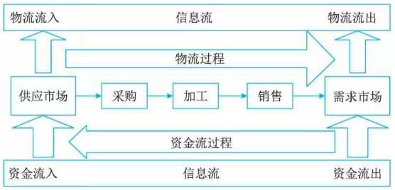
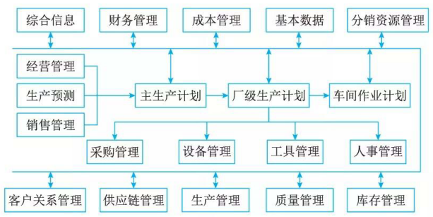

# 企业资源规划(Enterprise Resource Planning, ERP)

## 最佳实践

### 考察问

1. ERP管理`()`(物流管理)、`()`(财务管理)和`()`(生产控制管理). 一般认为`()`(人力资源管理)是企业第四大资源。
2. 在ERP系统中，`()`管理模块主要是对企业物料的进、出、存进行管理。

### 题目总结

1. ERP管理`物流`(物流管理)、`资金流`(财务管理)和`信息流`(生产控制管理). 一般认为`人力资源`(人力资源管理)是企业第四大资源。
2. 在ERP系统中，`库存`管理模块主要是对企业物料的进、出、存进行管理。

## 企企业资源规划的概念

企业资源规划(Enterprise Resource Planning，ERP)是建立在信息技术基础上，利用现代企业的先进管理思想，全面地集成了企业的所有资源信息，并为企业提供决策、计划、控制与经营业绩评估的全方位和系统化的管理平台。 

企业的所有资源包括三大流：物流(物流管理)、资金流(财务管理)和信息流(生产控制管理)。现在一般认为人力资源(人力资源管理)是企业第四大资源。

🔒题目:

- (✨2025上19).ERP中的企业资源包括企业的“三流”资源，即( )。
    - A.税务流资源、资金流资源和信息流资源
    - B.物流资源、税务流资源和信息流资源
    - C.物流资源、资金流资源和信息流资源
    - D.物流资源、资金流资源和税务流资源

    答案: C

1. ERP(Enterprise Resource Planning)是建立在信息技术的基础上，利用现代企业的先进管理思想，对企业的物流、资金流和______流进行全面集成管理的管理信息系统，为企业提供决策、计划、控制与经营业绩评估的全方位和系统化的管理平台。在ERP系统中，______管理模块主要是对企业物料的进、出、存进行管理。
    - A.产品
    - B.人力资源
    - C.信息
    - D.加工

    - A.库存
    - B.物料
    - C.采购
    - D.销售

    答案：C A 

## 企业资源规划的结构

1. 生产预测

    市场需求是企业生存的基础，在 ERP 中首先需要对市场进行较准确的预测。预测主要用于计划，在 ERP 的 5 个层次的计划中，前 3 个层次计划，即经营计划、生产计划大纲和主生产计划的编制都离不开预测。常用的预测方法有德尔菲 (Delphi)方法、移动平移法、指数平滑法和非线性最小二乘曲线拟合法。

2. 销售管理(计划)

    企业销售部门是企业与市场连接的桥梁，其主要职能是为客户和最终用户提供服务，从而使企业获得利润，实现其经济和社会价值。

3. 经营计划(生产计划大纲)

    生产计划大纲( Production Planning,  PP) 是根据经营计划的生产目标制定的，是对企业经营计划的细化，用以描述企业在可用资源的条件下，在一定时期中的产量计划。生产计划大纲在企业决策层的 3 个计划中有承上启下的作用，一方面它是企业经营计划和战略规划的细化，另一方面它又用于指导企业编制主生产计划，指导企业有计划地进行生产。

4. 主生产计划

    主生产计划 (Master Production  Schedule,  MPS) 是对企业生产计划大纲的细化，说明在一定时期内的下计划：生产什么，生产多少和什么时候交货。主生产计划的编制以生产大纲为准，其汇总结果应当等同千生产计划大纲，同时，主生产计划又是其下一层计划-物料需求计划的编制依据。

5. 物料需求计划

    物料需求计划是对主生产计划的各个项目所需的全部制造件和全部采购件的网络支持计划和时间进度计划。它根据主生产计划对最终产品的需求数量和交货期，推导出构成产品的零部件及材料的需求数量和需求时期，再导出自制零部件的制作订单下达日期和采购件的采购订单发送日期，并进行需求资源和可用能力之间的进一步平衡。物

6. 能力需求计划

    能力需求计划( Capac ity Requirements Planning,  CRP) 是对物料需求计划所需能力进行核算的一种计划管理方法。旨在通过分析比较 MRP 的需求和企业现有生产能力，及早发现能力的瓶颈所在，为实现企业的生产任务而提供能力方面的保障。

7. 车间作业计划

    车间作业计划 (Production Activity Control,  PAC) 是在 M阳节斤产生的加工制造订单(即自制零部件生产计划)的基础上，按照交货期的前后和生产优先级选择原则以及车间的生产资源情况(如设备、人员、物料的可用性、加工能力的大小等)，将零部件的生产计划以订单的形式下达给适当的车间。

8. 采购与库存管理

    采购与库存管理是 ERP 的基本模块，其中采购管理模块是对采购工作，即从采购订单产生至货物收到的全过程进行组织、实施与控制，库存管理 (Inventory Management,  IM) 模块则是对企业物料的进、出、存进行管理。

9. 质量与设备管理

    质量管理贯穿于企业管理的始终。企业经营活动中的各环节、各项工作以及各种产品都离不开质量，都要讲究质量。全面质量管理 (Total Quality Management,  TQM) 是质量管理的主要实施模式，它要求对企业的全过程进行质量管理，而且明确指出执行质量职能是企业全体人员的责任。

10. 财务管理

    会计工作是企业管理的重要组成部分，是以货币的形式反映和监督企业的日常经济活动，并对这些经济业务的数据进行分类、汇总，以便为企业管理和决策提供必要的信息支持。企业财务管理是企业会计工作和活动的统称，财务管理是一种综合性的管理，它渗透在企业全面的经济活动之中，哪里有经济活动，哪里就有资金运动，哪里就有财务管理。

11. ERP 有关扩展应用模块

    与 ERP 有关的扩展应用模块，如客户关系管理、分销资源管理、供应链管理和电子商务等。这几个扩展模块本身也是一个独立的系统，在市场上它们常作为独立的软件产品进行出售和实施。

