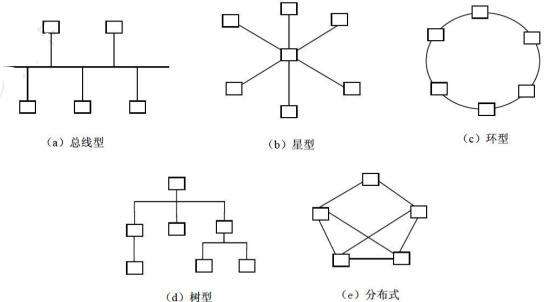

# 计算机网络基本概念

## 最佳实践

### 考察问

1. 🟡🟩💚局域网英文缩写(), 广域网英文缩写()

### 考察点

1. 局域网英文缩写lan, 广域网英文缩写wan

## 计算机网络分类

按通信距离可将计算机网络分为`局域网`、`城域网`和`广域网`

|网络分类|缩写|分布距离|计算机分布范围|传输速率范围|
| ---- | ---- | ---- | ---- | ---- |
|局域网|LAN|10m左右|房间|4Mbps~1Gbps|
|局域网|LAN|100m左右|楼宇|4Mbps~1Gbps|
|局域网|LAN|1000m左右|校园|4Mbps~1Gbps|
|城域网|MAN|10km|城市|50Kbps~100Mbps|
|广域网|WAN|100km以上|国家或全球|9.6Kbps~45Mbps|

## 网络的拓扑结构

网络拓扑结构是指网络中通信线路和结点的几何排序，用于表示整个网络的结构外貌，反映各结点之间的结构关系。常用的网络拓扑结构有：

- 总线型(利用率低、干扰大、价格低)
- 星型(交换机形成的局域网、中央单元负荷大)
- 环型(流动方向固定、效率低扩充难)
- 树型(总线型的扩充、分级结构)
- 分布式(任意节点连接、管理难成本高)

## 通信技术

计算机网络是利用通信技术将数据从一个结点传送到另一结点的过程。

### 信道

信道可分为物理信道和逻辑信道。

1. 物理信道由传输介质和设备组成，根据传输介质的不同，分为无线信道和有线信道。
2. 逻辑信道是指在数据发送端和接收端之间存在的一条虚拟线路，可以是有连接的或无连接的。逻辑信道以物理信道为载体。

### 发信机与发信机

发信机进行的信号处理包括信源编码、信道编码、交织、脉冲成形和调制。相反地，收信机进行的信号处理包括解调、采样判决、去交织、信道译码和信源译码。

### 复用技术和多址技术

如果同时传递多路数据就需要复用技术和多址技术。

1. 复用技术是指在一条信道上同时传输多路数据的技术，如TDM时分复用、FDM频分复用和CDM码分复用等。
2. 多址技术是指在一条线上同时传输多个用户数据的技术，在接收端把多个用户的数据分离（TDMA时分多址、FDMA频分多址和CDMA码分多址）。

### 5G通信网络

作为新一代的移动通信技术，5G特征体现在以下方面：

1. 基于OFDM优化的波形和多址接入
2. 实现可扩展的OFDM间隔参数配直
3. OFDM加窗提高多路传输效率
4. 灵活框架设计
5. 大规模MIMO:最多256根天线
6. 毫米波：频率大于24GHz以上的频段
7. 频谱共享
8. 先进的信道编码设计
9. 5G网络的主要特征：服务化架构、网络切片。

## 网络地址转换NAT

NAT是用于在本地网络中使用私有地址，在连接互联网时转而使用全局IP地址的技术。NAT实际上是为解决IPv4地址短缺而开发的技术。NAT通常部署在一个组织的网络出口位置，通过将内部网络IP地址替换为出口的IP地址提供公网可达性和上层协议的连接能力。

## 默认网关

一台主机可以有多个网关。默认网关的意思是一台主机如果找不到可用的网关，就把数据包发给默认指定的网关，由这个网关来处理数据包。现在主机使用的网关，一般指的是默认网关。默认网关的IP地址必须与本机IP地址在同一个网段内，即同网络号。

## 虚拟局域网VLAN

VLAN(Virtual Local Area Network)是一组逻辑上的设备和用户，这些设备和用户并不受物理位置的限制，可以根据功能、部门及应用等因素将它们组织起来，相互之间的通信就好像它们在同一个网段中一样。

虚拟局域网VLAN工作在OSI参考模型的第2层和第3层，一个VLAN就是一个广播域，VLAN之间的通信是通 过第3层的路由器来完成的。

与传统的局域网技术相比较，VLAN技术更加灵活，它具有以下优点：网络设备的移动、添加和修改的管理开销减少；可以控制广播活动；可提高网络的安全性。

## 虚拟专用网VPN

虚拟专用网VPN(Virtual Private Network, VPN)是在公用网络上建立专用网络的技术。其之所以称为虚拟网，主要是因为整个VPN网络的任意两个节点之间的连接并没有传统专网所需的端到端的物理链路，而是架构在公用网络服务商所提供的网络平台，如Internet、ATM(异步传输模式)、Frame Relay (帧中继)等之上的逻辑网络，用户数据在逻辑链路中传输。

## 冲突域和广播域

路由器可以阻断广播域和冲突域，交换机只能阻断冲突域，因此一个路由器下可以划分多个广播域和多个冲突域；一个交换机下整体是一个广播域，但可以划分多个冲突域；而物理层设备集线器下整体可以作为一个冲突域和一个广播域。
