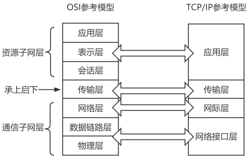

# OSI网络模型

## 7层网络模型(Open System Interconnection, OSI)

ISO/OSI的参考模型一共有7层，由低层到高层分别为：

1. 物理层：负责通过物理介质（如网线、光纤 ）传输比特流，规定电平、速度、电缆针脚等。像 A 公司把合同数据转化为电信号或光信号。传输的数据单位是比特。
2. 数据链路层：在物理层基础上，把网络层传来的数据报组装成帧 ，并进行差错控制、流量控制等。传输的数据单位是帧。
3. 网络层：负责通过 IP 寻址建立节点间连接，进行路由选择，实现不同网络间路径选择。传输的数据单位是数据包。 
4. 传输层：为会话层提供透明、可靠的端到端的数据传输服务。其功能有数据分段、数据传输、数据组装、差错控制、流量/拥塞控制等。传输的数据单位报文。
5. 会话层：为表示层提供建立、维护和结束会话连接的功能，提供会话管理功能。传输的数据单位是报文。 
6. 表示层：提供格式化的表示和转换数据服务，如数据的压缩、解压缩、加密和解密等。 
7. 应用层：面向用户服务，提供网络与用户应用软件之间的接口服务，如文件传输、电子邮件、远程登录等。 

各层所需的传输设备:

|协议层|互连设备|作用|
| ---- | ---- | ---- |
|物理层|中继器、集线器|①中继器：信号在介质里传输的过程中会有衰减和噪声，使用中继器进行放大和去噪； ②集线器：是一种特殊的多路中继器。|
|数据链路层|网桥、交换机|①网桥：连接两个局域网，检查帧的源地址和目的地址，若两者在同一网络段上，则不转发，否则转发到另一个网络段上； ②交换机：检查以太网帧的目的地址MAC，在自己的地址表（端口号-MAC）中进行查找并转发。|
|网络层|路由器|用于连接多个逻辑上分开的网络，最主要的功能是选择路由路径。|
|应用层|网关|将协议进行转换，将数据重新分组，以便在两个不同类型的网络系统之间进行通信。| 

## 信号传输介质

传输介质是信号传输的媒介。常用的传输介质有有线介质和无线介质。

|介质类型|介质|说明|
| ---- | ---- | ---- |
|有线介质|双绞线、同轴电缆、光纤|①双绞线：分为3类、4类和5类、6类、7类双绞线，常用的是5类非屏蔽双绞线，频率带宽为100MHz，最大长度为100m； ②同轴电缆：分为基带同轴电缆和宽带同轴电缆； ③光纤：光导纤维，多模光纤使用发光二极管作为光源，价格便宜，传播距离短，带宽小；而单模光纤使用激光作为光源，价格昂贵、传播距离长、带宽大。|
|无线介质|微波、红外线和激光、卫星|①微波：使用无线电波通信，受天气、环境、地形影响大； ②红外线和激光：把传输信号转换成红外光信号和激光信号，在空间传播，受环境气候影响大； ③卫星：以人造卫星作为微波中继站，容量大、距离远，但延迟高。| 
