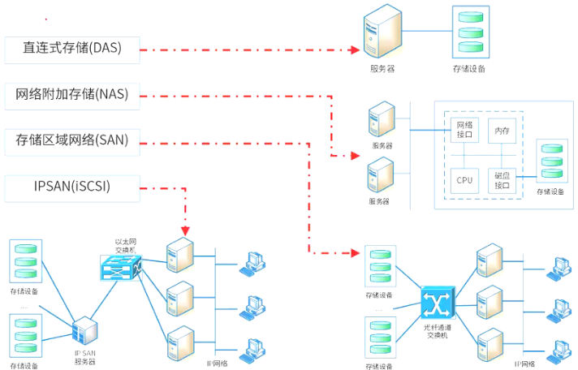
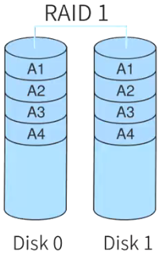
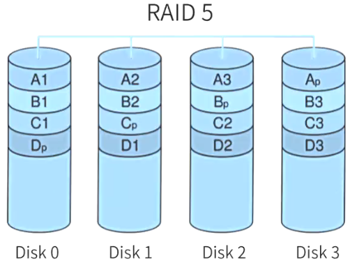

# 网络存储技术

## 最佳实践

### 考察问

1. 🟡🟨❤️网络存储技术分类
    1. `()`式存储（DAS，Direct Attached Storage）
    2. `()`式存储（NAS，Network Attached Storage）
    3. `()`（SAN，Storage Area Network）
        1. 以太网（IP SAN）
        2. 光纤通道（FC SAN）
2. 🟡🟨❤️磁盘阵列
    1. Raid0: `()`
    2. Raid1: `()`
    3. Raid0+1: 两个Raid0
    4. Raid1+0: 两个Raid1
    5. Raid3: `()`
    6. Raid5: `()`
    7. Raid6: `()`

### 考察点

1. 🟡🟨❤️网络存储技术分类
    1. `直连`式存储（DAS，Direct Attached Storage）
    2. `网络`式存储（NAS，Network Attached Storage）
    3. `存储区域网络`（SAN，Storage Area Network）
        1. 以太网（IP SAN）
        2. 光纤通道（FC SAN）
2. 🟡🟨❤️磁盘阵列
    1. Raid0: `1`
    2. Raid1: `1/2`
    3. Raid0+1: 两个Raid0
    4. Raid1+0: 两个Raid1
    5. Raid3: `N+1`
    6. Raid5: `N+1`
    7. Raid6: `N+2`

## 网络存储技术分类

- 直连式存储（DAS，Direct Attached Storage）：通过SCSI连接到服务器，是硬件堆叠，无操作系统；存储器需直连应用服务器，不能跨平台共享文件，各系统平台文件分别存储。
- 网络式存储（NAS，Network Attached Storage）：通过网络接口与网络直连，用户经网络访问（支持多种TCP/IP协议）；设备有自己的OS，类似专用文件服务器，存储信息常用RAID管理，即插即用 。
- 存储区域网络（SAN，Storage Area Network）：用专用高速网络连接一个或多个网络存储设备和服务器的专用存储系统，以数据块方式存储数据和信息；目前主要用以太网（IP SAN）和光纤通道（FC SAN）环境 。 
- 网络小型计算机系统接口（iSCSI，Internet Small Computer System Interface）：基于IP网络，设备成本低、配置技术简单，可共享和使用大容量存储空间 。   

                                                                        |
🔒问题

1. 以下关于网络存储的叙述，正确的是（  ）。
    - A. DAS支持完全跨平台文件共享，支持所有的操作系统
    - B. NAS通过SCSI连接至服务器，通过服务器网卡在网络上传输数据
    - C. FC SAN的网络介质为光纤通道，而IP SAN使用标准的以太网
    - D. SAN设备有自己的文件管理系统，NAS中的存储设备没有文件管理系统

    答案: C

## 磁盘阵列

磁盘阵列（RAID，Redundant Arrays of Independent Disk）

1. Raid0(条块化)：性能最高，并行处理，无冗余，损坏无法恢复, 磁盘利用率100%

    

2. Raid1(镜像结构)：可用性、可修复性好，仅有50%利用率

    

3. Raid0+1(Raid1+0)：Raid0与Raid1长处的结合，高效也可靠
    1. RAIDO+1(是两个RAIDO，若一个磁盘损坏，则当前RAID0无法工作，即有一半的磁盘无法工作);
    2. RAID1+0(是两个RAID1，不允许同一组中的两个磁盘同时损坏)与RAID1原理类似，磁盘利用率都只有50%，但安全性更高。

    

4. Raid3(奇偶校验并行传送)：N+1模式，有固定的校验盘，坏一个盘可恢复
5. Raid5(分布式奇偶校验的独立磁盘)：N+1模式，无固定的校验盘，坏一个盘可恢复 . 磁盘利用率(n-1)/n, 取最小的磁盘容量

    

6. Raid6(两种存储的奇偶校验)：N+2模式，无固定的校验盘，坏两个盘可恢复

🔒问题

1. 💛假如有3块容量是80G的硬盘做RAID 5阵列，则这个RAID 5的容量是（  ）；而如果有2块80G的盘和1块40G的盘，此时RAID 5的容量是（  ）。
    - A 240G  B 160G  C 80G  D 40G
    - A 40G  B 80G  C 160G  D 200G

    答案: BB

    ✨利用率 = (n-1)/n, 取最小的磁盘容量

