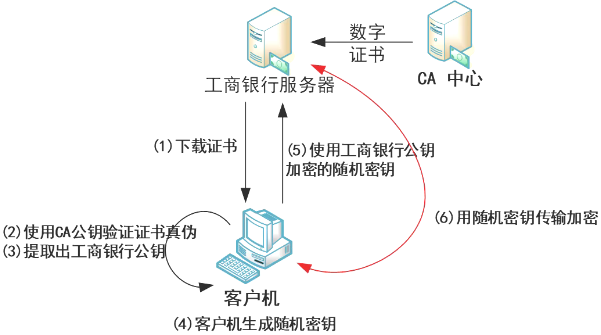

# 密钥管理技术

## 最佳实践

### 考察问

3. 公钥基础设施PKI

    1. 终端实体(用户)从认证权威机构CA申请、撤销和更新数字证书的流程: 终端 - `()` - `()`
    2. 注册机构(RA)的功能包含: `()`, `()`, `()`
    3. 认证全为机构(CA)的功能: `()`
    4. 某Web网站向CA申请了数字证书。用户登录过程中可通过验证`()`，确认该数字证书的有效性，以`()`。

### 考察点

3. 公钥基础设施PKI

    1. 终端实体(用户)从认证权威机构CA申请、撤销和更新数字证书的流程: 终端 - `注册机构(RA)` - `认证权威机构(CA)`
    2. 注册机构(RA)的功能包含: `认证注册信息的合法性`, `批准证书的申请`, `拒绝证书的申请`
    3. 认证全为机构(CA)的功能: `签发证书`
    4. 某Web网站向CA申请了数字证书。用户登录过程中可通过验证`CA的签名`，确认该数字证书的有效性，以`验证该网站的真伪`。

## 对称密钥的分配与管理

密钥分配一般要解决两个问题：一是引进自动分配密钥机制，以提高系统的效率；二是尽可能减少系统中驻留的密钥量。

## 公钥加密体制的密钥管理

1. 公开发布

    公开发布是指用户将自己的公钥发给每一其他用户，或向某一团体广播。有一个非常大的缺点：任何人都可以伪造密钥公开发布。如果某个用户假装是用户 A, 并以 A 的名义向另一用户发送或广播自己的公开钥，则在 A 发现假冒者以前，这一假冒者可解读所有发向 A 的加密消息，甚至还能用伪造的密钥获得认证。

2. 公用目录表

    公用目录表指一个公用的公钥动态目录表，由某个可信的实体或组织(公用目录的管理员)承担该共用目录表的建立、维护以及公钥的分布等。管理员为每个用户在目录表中建立一个目录，其中包括用户名和用户的公开钥两个数据项，并且定期公布和更新目录表。每个用户都亲自或以某种安全的认证通信在管理者那里注册自己的公开钥，可通过电子手段访问目录表，还可随时替换新密钥。但是，这种公用目录表的管理员秘密钥一旦被攻击者获取，同样面临被假冒的危险。

3. 公钥管理机构

    与公用目录表类似的，不过用公钥管理机构来为各用户建立、维护动态的公钥目录. 例如：当用户 A 向公钥管理机构发送一个请求时，该机构对请求作出应答，并用自己的秘密钥 SKAu 加密后发送给 A, A 再用机构的公开钥解密。
    它的缺点在于因为每一用户要想和他人联系都须求助于管理机构，所以容易使管理机构成为系统的瓶颈，并且管理机构维护的公钥目录表也容易被敌手窜扰。

4. 公钥证书

    公钥证书可以从一定程度上解决以上策略存在的一些不足之处。公钥证书是由证书管理机构 CA(Certificate Authority)为用户建立的，其中的数据项有与该用户的秘密密钥相匹配的公开钥及用户的身份和时戳等，所有的数据项经 CA 用自己的秘密钥签字后就形成证书，即证书的形式为 $CA = ESK_{CA}[T, \text{ID}_A, \text{PK}_A]$。$T$ 是当前的时戳，$\text{ID}_A$ 是用户 A 的身份，$\text{PK}_A$ 是 A 的公钥，$\text{SK}_{CA}$ 是 CA 的秘密钥，CA 则是用户 A 产生的证书。

    用户将自己的公开钥通过公钥证书发给另一用户，而接受方则可用 CA 的公钥 $\text{PK}_{CA}$ 对证书加以验证。这样通过证书交换用户之间的公钥而无须再与公钥管理机构联系，从而避免了由统一机构管理所带来的不便和安全隐患。

## 拓展: 公钥基础设施PKI

公钥基础设施(Public Key Infrastructure，PKI)：是以非对称加密技术为基础，以数据机密性、完整性、身份认证和行为不可抵赖性为安全目的，来实施和提供安全服务的具有普适性的安全基础设施。

1. 数字证书

    一个数据结构，是一种由一个可信任的权威机构签署的信息集合。在不同的应用中有不同的证书。如X.509证书必须包含下列信息：(1)版本号(2)序列号(3)签名算法标识符(4)认证机构(5)有效期限(6)主题信息(7)认证机构的数字签名(8)公钥信息。

    公钥证书主要用于确保公钥及其与用户绑定关系的安全。这个公钥就是证书所标识的那个主体的合法的公钥。任何一个用户只要知道签证机构的公钥，就能检查对证书签名的合法性。如果检查正确，那么用户就可以相信那个证书所携带的公钥是真实的，而且这个公钥就是证书所标识的那个主体合法的公钥。例如驾照。

2. 签证机构CA

    负责签发证书、管理和撤销证书。是所有注册用户所信赖的权威机构，CA在给用户签发证书时要加上自己的数字签名，以保证证书信息的真实性。任何机构可以用CA的公钥来验证该证书的合法性。

    1. RA(Registration Authority)：注册审批机构
    2. 证书受理点
    3. 密钥管理中心-KMC 

🔒问题

1. 公钥基础设施(PublicKeyInfrastructure，PKl)引l入数字证书的概念，用来表示用户的身份。下图简要地描述了终端实体(用户)从认证权威机构CA申请、撤销和更新数字证书的流程。请为中间框空白处选择合适的选项(  )

    终端 - () - 认证权威机构(CA)

    - A.证书库
    - B.RA
    - C.OCSP
    - D.CRL库

    答案: B

2. 在PKI体系中，注册机构RA的功能不包括(  )。

    - A. 签发证书
    - B. 认证注册信息的合法性
    - C. 批准证书的申请
    - D. 拒绝证书的申请

    答案: A

3. 某Web网站向CA申请了数字证书。用户登录过程中可通过验证(  )，确认该数字证书的有效性，以(  )。

    - A. CA的签名  B. 网站的签名  C. 会话密钥  D. DES密码
    - A. 向网站确认自己的身份  B. 获取访问网站的权限 C. 和网站进行双向认证  D. 验证该网站的真伪

    答案: AD

