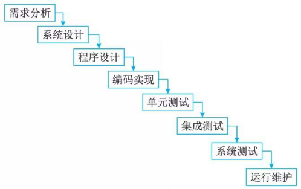
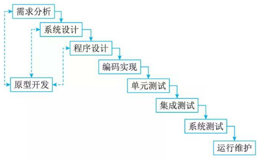
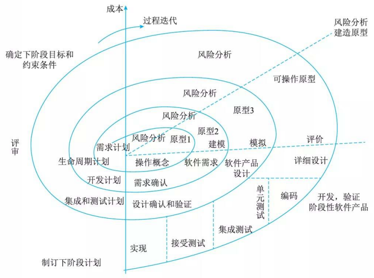
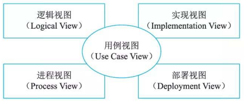
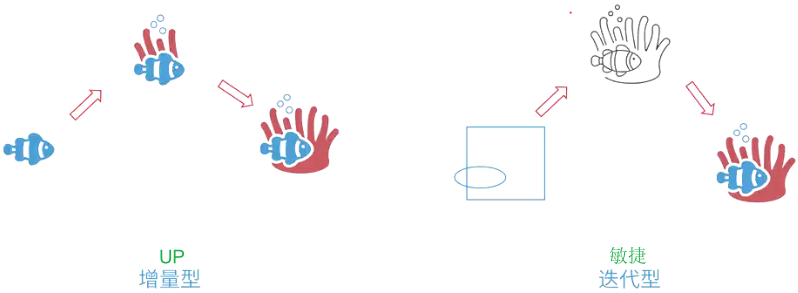
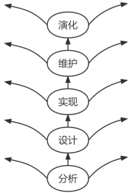
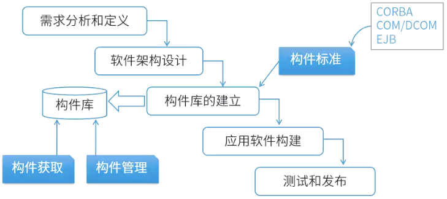
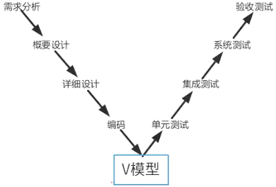

# 软件工程

## 最佳实践

### 题目总结

1. 软件过程(开发)模型:

    1. 瀑布模型: 各阶段`固定`, 适用于需求`明确`, `大`项目, `无`风险分析
    2. 原型模型: 快速构建原型交付, 需求`不明确`, `小`项目, `无`风险分析
    3. 螺旋模型: 瀑布模型+原型模型, 需求`不明确`, `大`项目, `有`风险分析
    4. 敏捷模型: 不断`迭代`, 优化已有
    5. 统一过程模型(RUP): `用例`驱动, 以`架构`为中心, `迭代增量`开发模式

2. RUP的生命周期, 9个核心工作流: 

    1. `业务建模`(Business Modeling)
    2. `需求`(Requirements)
    3. `分析与设计`(Analysi s & Design)
    4. `实现`( Implementation)
    5. `测试`(Test)
    6. `部署`(Deployment)
    7. `配置与变更管理` (Configuration &  ChangeManagement)
    8. `项目管理` (Project Management) 
    9. `环境`(Environment)

3. RUP 把软件开发生命周期划分为多个循环(Cycle), 每个循环生成产品的一个新的版本，每个循环依次由4个连续的阶段 (Phase) 组成。这 4 个阶段如下。

    1. `初始`(inception) 阶段：定义最终产品视图和业务模型，并确定系统范围。
    2. `细化`(elaboration) 阶段：设计及确定系统的体系结构，制订工作计划及资源要求。
    3. `构造`(construction) 阶段：构造产品并继续演进需求、体系结构、计划直至产品提交。
    4. `移交`(transition) 阶段：把产品提交给用户使用。

    ✨粗细够交(需求->设计->开发->交付)

4. “4+1"视图模型:✨和UML之间的关系??
    1. 分析人员和测试人员关心的是系统的行为，会侧重于`用例`视图；
    2. 最终用户关心的是系统的功能，会侧重于`逻辑`视图；
    3. 程序员关心的是系统的配置、装配等问题，会侧重于`实现`视图；
    4. 系统集成人员关心的是系统的性能、可伸缩性、吞吐率等问题，会侧重于`进程`视图；
    5. 系统工程师关心的是系统的发布、安装、拓扑结构等问题，会侧重于`部署`视图。

    ✨用例实现逻辑求进步

5. 能力成熟度模型集成(CMMI)
    1. `初始`级：过程不可预测且缺乏控制。
    2. 已`管理`级：过程为项目服务。
    3. 已`定义`级：过程为组织服务。
    4. `定量`管理级：过程已`度量`和控制。
    5. `优化`级：集中过程`改进`。

    ✨初始缺乏管理项目的义务组织, 定量对度量, 优化对改进.

### 考察问

### 考察点

1. 软件过程(开发)模型:

    1. 瀑布模型: 各阶段`固定`, 适用于需求`明确`, `大`项目, `无`风险分析
    2. 原型模型: 快速构建原型交付, 需求`不明确`, `小`项目, `无`风险分析
    3. 螺旋模型: 瀑布模型+原型模型, 需求`不明确`, `大`项目, `有`风险分析
    4. 敏捷模型: 不断`迭代`, 优化已有
    5. 统一过程模型(RUP): `用例`驱动, 以`架构`为中心, `迭代``增量`开发模式

2. RUP的生命周期, 9个核心工作流: 

    1. `业务建模`(Business Modeling)
    2. `需求`(Requirements)
    3. `分析与设计`(Analysi s & Design)
    4. `实现`( Implementation)
    5. `测试`(Test)
    6. `部署`(Deployment)
    7. `配置与变更管理` (Configuration &  ChangeManagement)
    8. `项目管理` (Project Management) 
    9. `环境`(Environment)

3. RUP 把软件开发生命周期划分为多个循环(Cycle), 每个循环生成产品的一个新的版本，每个循环依次由4个连续的阶段 (Phase) 组成，每个阶段完成确定的任务。这 4 个阶段如下。

    1. `初始`(inception) 阶段：定义最终产品视图和业务模型，并确定系统范围。
    2. `细化`(elaboration) 阶段：设计及确定系统的体系结构，制订工作计划及资源要求。
    3. `构造`(construction) 阶段：构造产品并继续演进需求、体系结构、计划直至产品提交。
    4. `移交`(transition) 阶段：把产品提交给用户使用。

4. “4+1"视图模型:
    1. 分析人员和测试人员关心的是系统的行为，会侧重于用例视图；
    2. 最终用户关心的是系统的功能，会侧重于逻辑视图；
    3. 程序员关心的是系统的配置、装配等问题，会侧重于实现视图；
    4. 系统集成人员关心的是系统的性能、可伸缩性、吞吐率等问题，会侧重于进程视图；
    5. 系统工程师关心的是系统的发布、安装、拓扑结构等问题，会侧重于部署视图。

5. 能力成熟度模型集成(CMMI)
    1. `初始`级：过程不可预测且缺乏控制。
    2. 已`管理`级：过程为项目服务。
    3. 已`定义`级：过程为组织服务。
    4. `定量`管理级：过程已度量和控制。
    5. `优化`级：集中过程改进。

✨初始不可预测, 管理项目, 定义组织, 定量和优化都可通过关键字判断

5. 其他
    6. 增量模型: 不断地`增加`新功能(拓展)
    7. V模型: `测试`贯穿始终(拓展)
    8. 构件是可以独立部署的单元，通过复用构件可以提高软件的可靠性和易维护性

    ✨螺旋 = 瀑布 + 原型; RUP = 增量 + 敏捷

## 软件开发生命周期(拓展)

- 软件定义时期：包括可行性研究和详细需求分析过程，任务是确定软件开发工程必须完成的总目标，具体可分成问题定义、可行性研究、需求分析等。
- 软件开发时期：就是软件的设计与实现，可分成概要设计、详细设计、编码、测试等。
- 软件运行和维护：就是把软件产品移交给用户使用。

## 软件系统文档(拓展)

软件系统文档可以分为用户文档和系统文档两类，用户文档主要描述系统功能和使用方法，并不关心

## 软件设计(拓展)

软件设计包括四个既独立又相互联系的活动，即数据设计、软件结构设计、人机界面设计和过程设计。

## 软件工程定义

软件工程是应用计算机科学、数学、逻辑学及管理科学等原理，开发软件的工程。

1. P(Plan)—软件规格说明。规定软件的功能及其运行时的限制。
2. D(Do)—软件开发。开发出满足规格说明的软件。
3. C(Check)—软件确认。确认开发的软件能够满足用户的需求。
4. A(Action)—软件演进。软件在运行过程中不断改进以满足客户新的需求。

## 软件过程模型

软件要经历从需求分析、软件设计、软件开发、运行维护，直至被淘汰这样的全过程，这个全过程称为软件的生命周期。

为了使软件生命周期中的各项任务能够有序地按照规程进行，需要一定的工作模型对各项任务给予规程约束，这样的工作模型被称为软件过程模型，有时也称之为软件生命周期模型。

### 瀑布模型(Waterfall Model)

瀑布模型 (Waterfall Model) ，包含一系列活动。这些活动从一个阶段到另一个阶段逐次下降，它的工作流程在形式上很像瀑布，因此被称为瀑布模型.

瀑布模型的特点是每一个阶段都是建筑在前一个阶段正确实施的结果之上。每一个阶段工作完成后都伴随
着一个里程碑(一组检查条件)，对该阶段的工作进行审查和确认。

瀑布模型的优点: 有利于人员的组织管理，有利千软件开发方法和工具的研究。

瀑布模型的缺点: 

1. 软件需求的完整性、正确性等很难确定，甚至是不可能和不现实的。因为用户不理解计算机和软件系统，无法回答目标系统“做什么“，对系统将来的改变也难以确定，往往用“我不能准确地告诉你“回答开发人员。
2. 瀑布模型是一个严格串行化的过程模型，使得用户和软件项目负责人要相当长的时间才能得到一个可以看得见的软件系统。如果出现与用户的期望不一致，或者出现需求变更，将会带来巨大的损失(例如人力、财力、时间等)。
3. 瀑布模型的基本原则是在每个阶段一次性地完全解决该阶段的工作，不会出现遗漏、错误等情况，而实际上这是不现实或不可能的。

### 原型化模型(Prototype Model)

原型模型 (Prototype Model) 又称快速原型。由于瀑布型的缺点，人们借鉴建筑师、工程师建造原型的经验，提出了原型模型。

原型模型主要有以下两个阶段。

1. 原型开发阶段。软件开发人员根据用户提出的软件系统的定义，快速地开发一个原型。该原型应该包含目标系统的关键问题和反映目标系统的大致面貌，展示目标系统的全部或部分功能、性能等。

2. 目标软件开发阶段。在征求用户对原型的意见后对原型进行修改完善，确认软件系统的需求并达到一致的理解，进一步开发实际系统。但是，在实际工作中，由于各种原因，大多数原型都废弃不用，仅仅把建立原型的过程当作帮助定义软件需要的一种手段。原型模型的使用应该注意以下内容。

按照原型的作用不同，出现了抛弃型原型和演化性原型。抛弃型原型是将原型作为需求确认的手段，在需求确认结束后，原型就被抛弃不用，重新采用一个完整的瀑布模型进行开发。演化性原型是在需求确认结束后，不断补充和完善原型，直至形成一个完整的产品。原型的概念也被后续出现的过程模型采纳，如螺旋模型和敏捷方法。

### 螺旋模型(SpiralModel)

螺旋模型(Spiral Model) 是在快速原型的基础上扩展而成。也有人把螺旋模型归到快速原型，实际上，它是生命周期模型(瀑布模型)与原型模型的结合，加入两种模型均忽略的风险分析。如图所示。这种模型把整个软件开发流程分成多个阶段，每一个阶段都由 4 部分组成，它们是：

1. 目标设定。为该项目进行需求分析，定义和确定这一个阶段的专门目标，指定对过程和产品的约束，并且制订详细的管理计划。
2. 风险分析。对可选方案进行风险识别和详细分析，制定解决办法，采取有效措施避免这些风险。
3. 开发和有效性验证。风险评估后，可以为系统选择开发模型，并且进行原型开发，即开发软件产品。
4. 评审。对项目进行评审，以确定是否需要进入螺旋线的下一次回路，如果决定继续，就要制订下一阶段计划。

螺旋模型的软件开发过程实际是上述 4 个部分的迭代过程，每迭代一次，螺旋线就增加一圈，软件系统就生成一个新版本，这个新版本实际上是对目标系统的一个逼近。经过若干次的迭代后，系统应该尽快地收敛到用户允许或可以接受的目标范围内，否则也有可能中途夭折。

该模型支持大型软件开发，适用于面向规格说明、面向过程和面向对象的软件开发方法，也适用于几种开发方法的组合。

### 敏捷模型(Agile Model)

软件开发在 20 世纪 90 年代受到两个大的因素影响：对内，面向对象编程开始取代面向过程编程；对外，互联网泡沫导致快速投向市场以及公司的快速发展成为关键商业因素。快速变化的需求需要短的产品交付周期，这与传统软件开发流程并不兼容。

####  敏捷方法的特点

1. 敏捷型方法是“适应性 ”(adaptive) 而非“预设性”(predictive) 的。重型方法试图对一个软件开发项目在很长的时间跨度内做出详细的计划，然后依计划进行开发。这类方法在计划制订完成后拒绝变化，而敏捷型方法欢迎变化。其实，敏捷的目的就是成为适应变化的过程，甚至能允许改变自身来适应变化。

2. 敏捷型方法是“面向人的 "(People-ori ented) 而非“面向过程的 "(Process-ori ented) 。它们试图使软件开发工作能够充分发挥人的创造能力。它们强调软件开发应当是一项愉快的活动。

#### 敏捷方法的核心思想

敏捷方法的核心思想主要有下面 3 点。

1. 敏捷方法是适应型，而非可预测型。与传统方法不同，敏捷方法拥抱变化，也可以说它的初衷就是适应变化的需求，利用变化来发展，甚至改变自己，最后完善自己。
2. 敏捷方法是以人为本，而非以过程为本。传统方法以过程为本，强调充分发挥人的特性，不去限制它。并且软件开发在无过程控制和过千严格烦琐的过程控制中取得一种平衡，以保证软件的质量。
3. 迭代增量式的开发过程。敏捷方法以原型开发思想为基础，采用迭代增量式开发，发行版本小型化。它根据客户需求的优先级和开发风险，制订版本发行计划，每一发行版都是在前一成功发行版的基础上进行功能需求扩充，最后满足客户的所有功能需求。

#### 主要敏捷方法简介

1. 极限编程 (Extreme Programing, XP) 。在所有的敏捷型方法中， XP 是最引人瞩目的。极限编程是一个轻量级的、灵巧的软件开发方法；同时它也是一个非常严谨和周密的方法。它的基础和价值观是交流、朴素、反馈和勇气，即任何一个软件项目都可以从 4 个方面入手进行改善：加强交流；从简单做起；寻求反馈；勇于实事求是。

    XP 是一种近螺旋式的开发方法，它将复杂的开发过程分解为一个个相对比较简单的小周期；通过积极的交流、反馈以及其他一系列的方法，开发人员和客户可以非常清楚开发进度、变化、待解决的问题和潜在的困难等，并根据实际情况及时地调整开发过程。

2. 水晶系列方法。水晶系列方法是由 Alistair Cockburn 提出的敏捷方法系列。它与 XP方法一样，都有以人为中心的理念，但在实践上有所不同。其目的是发展一种提倡“机动性的”方法，包含具有共性的核心元素，每个都含有独特的角色、过程模式、工作产品和实践。Crystal 家族实际上是一组经过证明、对不同类型项目非常有效的敏捷过程，它的发明使得敏捷团队可以根据其项目和环境选择最合适的 Crystal 家族成员。

3. Scrum 。该方法侧重于项目管理。 Scrum 是迭代式增量软件开发过程，通常用于敏捷软件开发。 Scrum 包括了一系列实践和预定义角色的过程骨架(是一种流程、计划、模式，用千有效率地开发软件)。

    在 Scrum 中，使用产品 Backlog来管理产品的需求，产品 Backlog是一个按照商业价值排序的需求列表。根据 Backlog的内容，将整个开发过程被分为若干个短的迭代周期 (Sprint)。在 Sprint中， Scrum 团队从产品 Backlog中挑选最高优先级的需求组成 Sprint backlog。在每个迭代结束时， Scrum 团队将递交潜在可交付的产品增量。当所有 Sprint结束时，团队提交最终的软件产品。

4. 特征驱动开发方法 (Feature Driven  Development,  FDD) 。 FDD 是由Jeff De  Luca 和大师 Pet er Coad 提出来的。 FDD 是一个迭代的开发模型。 FDD 认为有效的软件开发需要 3 个要素：人、过程和技术。

    FDD 定义了 6 种关键的项目角色：项目经理、首席架构设计师、开发经理、主程序员、程序员和领域专家。根据项目大小，部分角色可以重复。

    FDD 有 5 个核心过程：开发整体对象模型、构造特征列表、计划特征开发、特征设计和特征构建。其中，计划特征开发根据构造出的特征列表、特征间的依赖关系进行计划，设计出包含特征设计和特征构建过程组成的多次迭代。

🔒题目:

1. 下列关于敏捷方法的叙述中，错误的是(  )。

    - A.与传统方法相比，敏捷方法比较适合需求变化大或者开发前期对需求不是很清晰的项目
    - B.敏捷方法尤其适合于开发团队比较庞大的项目
    - C.敏捷方法的思想是适应性，而不是预设性
    - D.敏捷方法以原型开发思想为基础，采用迭代式增量开发

    答案: B

2. (  )适用于程序开发人员在地域上分布很广的开发团队。(  )中，编程开发人员分成首席程序员和“类”程序员。
    - A.水晶系列(Crystal)开发方法
    - B.开放式源码(Open source)开发方法
    - C.SCRUM开发方法
    - D.功用驱动开发方法(FDD)

    - A.自适应软件开发(ASD)
    - B.极限编程(XP)开发方法
    - C.开放统一过程开发方法(Open UP)
    - D.功用驱动开发方法(FDD)

    答案: BD

3. 以下关于软件敏捷开发方法的核心思想说法错误的是(  )。

    - A.敏捷方法遵循迭代增量式开发过程
    - B.敏捷方法以原型开发思想为基础
    - C.敏捷方法是适应型、可预测型
    - D.敏捷方法以人为本而非以过程为本

    答案：C

### 统一过程模型 (RUP)

软件统一过程(Rational Unified Process, RUP) 是Rational软件公司创造的软件工程方法。RUP描述了如何有效地利用商业的、可靠的方法开发和部署软件，是一种重量级过程。 RUP类似一个在线的指导者，它可以为所有方面和层次的程序开发提供指导方针、模版以及事例支持。

#### RUP的生命周期

RUP软件开发生命周期是一个二维的软件开发模型，RUP中有9个核心工作流: 

1. 业务建模(Business Modeling):理解待开发系统所在的机构及其商业运作，确保所有参与人员对待开发系统所在的机构有共同的认识，评估待开发系统对所在机构的影响。
2. 需求(Requirements):定义系统功能及用户界面，使客户知道系统的功能，使开发人员理解系统的需求，为项目预算及计划提供基础。
3. 分析与设计(Analysi s & Design):把需求分析的结果转化为分析与设计模型。
4. 实现( Implementation):把设计模型转换为实现结果，对开发的代码做单元测试，将不同实现人员开发的模块集成为可执行系统。
5. 测试(Test) :检查各子系统之间的交互、集成，验证所有需求是否均被正确实现，对发现的软件质量上的缺陷进行归档，对软件质量提出改进建议。
6. 部署(Deployment) :打包、分发、安装软件，升级旧系统；培训用户及销售人员，并
提供技术支待。
7. 配置与变更管理 (Configuration &  ChangeManagement)  :跟踪并维护系统开发过程中产生的所有制品的完整性和一致性。
8. 项目管理 (Project Management)  :为软件开发项目提供计划、人员分配、执行、监控等方面的指导，为风险管理提供框架。
9. 环境(Environment) :为软件开发机构提供软件开发环境，即提供过程管理和工具的支持。

RUP 把软件开发生命周期划分为多个循环(Cycle), 每个循环生成产品的一个新的版本，每个循环依次由4个连续的阶段 (Phase) 组成，每个阶段完成确定的任务。这 4 个阶段如下。

1. 初始(inception) 阶段：定义最终产品视图和业务模型，并确定系统范围。
2. 细化(elaboration) 阶段：设计及确定系统的体系结构，制订工作计划及资源要求。
3. 构造(construction) 阶段：构造产品并继续演进需求、体系结构、计划直至产品提交。
4. 移交(transition) 阶段：把产品提交给用户使用。

#### RUP 中的核心概念

RUP 中定义了如下一些核心概念，理解这些概念对于理解 RUP 很有帮助。

1. 角色(Role): Who 的问题。角色描述某个人或一个小组的行为与职责。 RUP 预先定义了很多角色，如体系结构师 (Architect)、设计人员 (Des ig ner) 、实现人员(Implementer) 、测试员(tester) 和配置管理人员 (Configuration Manager) 等，并对每一个角色的工作和职责都做了详尽的说明。
2. 活动 (Activity) : How 的问题。活动是一个有明确目的的独立工作单元。
3. 制品(Artifact) : What的问题。制品是活动生成、创建或修改的一段信息。也有些书把Artifact翻译为产品、工件等，和制品的意思差不多。
4. 工作流(Workflow) : When的问题。工作流描述了一个有意义的连续的活动序列，每个工作流产生一些有价值的产品，并显示了角色之间的关系。

#### RUP 的特点

RUP 是用例驱动的、以体系结构为中心的、迭代和增量的软件开发过程。

1. 用例驱动, 即需求分析、设计、实现和测试等活动都是用例驱动的。
2. 以体系结构为中心

    软件体系结构的设计和代码设计无关，也不依赖千具体的程序设计语言。

    体系结构的设计需要考虑多方面的问题：在功能性特征方面要考虑系统的功能；在非功能性特征方面要考虑系统的性能、安全性和可用性等；与软件开发有关的特征要考虑可修改性、可移植性、可重用性、可集成性和可测试性等；与开发经济学有关的特征要考虑开发时间、费用、系统的生命期等。当然，这些特征之间有些是相互冲突的，一个系统不可能在所有的特征上都达到最优，这时就需要系统体系结构设计师在各种可能的选择之间进行权衡。

    对千一个软件系统，不同人员所关心的内容是不一样的。因此，软件的体系结构是一个多维的结构，也就是说，会采用多个视图 (View) 来描述软件体系结构。 RUP 采用“4+1" 视图模型来描述软件系统的体系结构。

    在 “4+1" 视图模型中，
    1. 分析人员和测试人员关心的是系统的行为，会侧重于用例视图；
    2. 最终用户关心的是系统的功能，会侧重于逻辑视图；
    3. 程序员关心的是系统的配置、装配等问题，会侧重于实现视图；
    4. 系统集成人员关心的是系统的性能、可伸缩性、吞吐率等问题，会侧重于进程视图；
    5. 系统工程师关心的是系统的发布、安装、拓扑结构等问题，会侧重于部署视图。

    

3. 迭代与增量

    RUP 强调采用迭代和增量的方式来开发软件，把整个项目开发分为多个迭代过程。在每次迭代中，只考虑系统的一部分需求，进行分析、设计、实现、测试和部署等过程；每次迭代是在已完成部分的基础上进行的，每次增加一些新的功能实现，以此进行下去，直至最后项目的完成。

🔒题目:

1. RUP(Rational Unified Process)软件开发生命周期是一个二维的软件开发模型，其中，RUP的9个核心工作流中不包括(  )。

    - A.业务建模
    - B.配置与变更管理
    - C.成本
    - D.环境

    答案：C

2. (✨2025上)RUP把软件开发生命周期划分为多个循环，每个循环生成产品的一个新的版本，每个循环依次由多个连续的阶段组成。其中，设计及确定系统的体系结构、制定工作计划及资源要求是( )阶段主要活动。
    - A.初始
    - B.构造
    - C.移交
    - D.细化

    答案: D

## 软件能力成熟度模型

软件能力成熟度模型 (Capability Maturity Model for Software, CMM) 是一个概念模型，模型框架和表示是刚性的，不能随意改变，但模型的解释和实现有一定弹性。

CMMI(Capability Maturity Model Integration for Software, 软件能力成熟度模型集成)是在CMM的基础上发展而来的。 主要用千指导软件开发过程的改进和进行软件开发能力的评估。

CMMI 提供了一个软件能力成熟度的框架，它将软件过程改进的步骤组织成5个成熟度等级，共包括18个关键过程域，52个过程目标，3168种关键时间，它为软件过程不断改进奠定了一个循序渐进的基础。

1. Levell 初始级: 过程不可预测且缺乏控制。
    处千成熟度级别 1 级时，过程通常是随意且混乱的。这些组织的成功依赖于组织内人员的能力与英雄主义。成熟度 1 级的组织也常常能产出能用的产品与服务，但它们经常超出在计划中记录的预算与成本。
2. Level 2 己管理级: 过程为项目服务。
    在该等级下，意味着组织要确保策划、文档化、执行、监督和控制项目级的过程，并且需要为过程建立明确的目标，并能实现成本、进度和质量目标等。
3. Level 3 已定义级: 过程为组织服务。
    在这一等级，企业能够根据自身的特殊情况定义适合自己企业和项目的标准流程，将这套管理体系与流程予以制度化，同时企业开始进行项目积累，企业资产的收集。
4. Level 4 量化管理级: 过程已度量和控制。
    在成熟度 4 级，组织建立了产品质量、服务质量以及过程性能的定量目标。成熟度级别 3级与 4 级的关键区别在于对过程性能的可预测。
5. Level 5 优化级: 集中过程改进。
    在优化级水平上，企业的项目管理达到了最高的境界。成熟度级别 5 级关注千通过增量式的与创新式的过程与技术改进，不断地改进过程性能。处千成熟度 5 级时，组织使用从多个项目收集来的数据对整体的组织级绩效进行关注。

🔒题目

1. (✨2025上)CMMI(Capability Maturity Model Integraton)提供了一个软件能力成熟度模型，它将软件过程改进的步骤组织成( )个成熟度等级。

    - A.3  
    - B.4  
    - C.5  
    - D.6

    答案: C

## 其他(拓展)

### 增量模型(Incremental Model)

增量模型将需求分段为一系列产品，每一个增量都可以分别开发。

优点：第一个可交付的版本成本和时间很少；降低了适应用户需求变更的成本；具有瀑布模型所有的优点。

缺点：若没有对用户的变更要求进行规划，那么产生的初始增量可能会造成后来增量的不稳定；由于并不是从系统整体角度规划各个模块，因此不利于模块划分。难点在于如何将客户需求划分为多个增量。与原型不同的是增量模型的每一次增量版本都可作为独立可操作的产品，而原型的构建一般是为了演示。

### 喷泉模型(Fountain Model)

喷泉模型是以用户需求为动力、以对象为驱动的模型，适用于面向对象的开发方法。它克服了瀑布模型不支持软件重用和多项开发活动集成的局限性。喷泉模型使开发过程具有迭代性和无间隙性。

优点：各个阶段没有明显的界线，开发人员可以同步进行；可以提高软件项目的开发效率，节省开发时间。迭代, 无间隙

缺点：由于在各个开发阶段是重叠的，在开发过程中需要大量的开发人员，不利于项目的管理；要求严格管理文档，使得审核的难度加大。

### 基于构件的软件模型(Component-based Software Model)

基于构件的开发模型是指利用预先包装的构件来构造应用系统。构件可以是组织内部开发的构件，也可以是商品化成品软件构件。特点是增强了复用性，在系统开发过程中，会构建一个构件库，供其他系统复用，因此可以提高可靠性，节省时间和成本。

构件是面向软件体系架构的可复用软件模块。构件(component)是可复用的软件组成成份，可被用来构造其他软件。它可以是被封装的对象类、功能模块、软件框架(framework)、软件构架、文档、设计模式等。

### 形式化方法模型(Formal Methods Model)

形式化方法是建立在严格数学基础上的一种软件开发方法，主要活动是生成计算机软件形式化的数学规格说明。

### V模型(V-Model)

测试贯穿始终

## 🔒题目

1. (  )把整个软件开发流程分成多个阶段，每一个阶段都由目标设定、风险分析、开发和有效性验证以及评审构成。
    - A. 原型模型
    - B. 瀑布模型
    - C. 螺旋模型
    - D. V模型

    答案: C

2. 基于RUP的软件过程是一个迭代过程。一个开发周期包括初始、细化、构建和移交四个阶段，每次通过这四个阶段就会产生一代软件，其中建立完善的架构是(   )阶段的任务。采用迭代式开发，(  )。

    - A 初始
    - B 细化
    - C 构建
    - D 移交

    - A 在每一轮迭代中都要进行测试与集成
    - B 每一轮迭代的重点是对特定的用例进行部分实现
    - C 在后续迭代中强调用户的主动参与
    - D 通常以功能分解为基础

    答案: BA

3. 与瀑布模型相比，(  )降低了实现需求变更的成本，更容易得到客户对于已完成开发工作的反馈意见，并且客户可以更早地使用软件并从中获得价值。

    - A.快速原型模型
    - B.敏捷开发
    - C.增量式开发
    - D.智能模型

    答案：C

4. 应用系统开发中可以采用不同的开发模型，其中，() 将整个开发流程分为目标设定、风险分析、开发和有效性验证、评审四个部分；()则通过重用来提高软件的可靠性和易维护性，程序在进行修改时产生较少的副作用。
    - A. 瀑布模型
    - B. 螺旋模型
    - C. 构件模型
    - D. 对象模型

    - A. 瀑布模型
    - B. 螺旋模型
    - C. 构件模型
    - D. 对象模型

    答案：B C, 常见的软件开发模型有瀑布模型、演化模型、原型模型、螺旋模型、喷泉模型、V模型和基于可重用构件的模型、RAD模型、统一过程、敏捷方法等。螺旋模型将整个开发流程分为目标设定、风险分析、开发和有效性验证、评审四个过程；构件是可以独立部署的单元，通过复用构件可以提高软件的可靠性和易维护性。 
