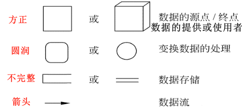

# 结构化分析

## 最佳实践

### 考察问

- 数据流图的组成
    - `()`: 描述数据的流向, 使用`()`表示
    - `()`: 对数据的处理, 使用`()`表示
    - `()`: 数据的起点或终点, 一般是数据的提供者和使用者, 使用`()`表示
    - `()`: 暂时存储的数据, 使用`()`表示

- 数据流图的附加符号
    - `()` 表示数据流之间是“与”关系（同时存在）
    - `()` 表示“或”关系
    - `()` 号表示只能从中选一个（互斥的关系）

- 数据流图的层次结构

    1. 顶层图: 只有`()`加工，突出表明了数据的`()`和`()`。
    2. `()`层图: 细化
    3. `()`层图: 细化

- 数据流图的平衡原则

    - `()`之间的平衡: 指任何一张DFD子图边界上的输入/输出数据流必须与其父图中对应加工的输入/输出数据流保持一致。
    - `()`平衡: 对于图内的每一个加工，要求既要有输入数据流，也要有输出数据流，避免出现黑洞、奇迹、灰洞。

        `()`：加工有输入但没输出
        `()`：加工没输入但有输出
        `()`：加工输入不足以产生输出

### 题目总结

- 数据流图的组成
    - `数据流`: 描述数据的流向, 使用`箭头`表示
    - `处理/加工`: 对数据的处理, 使用`圆角矩形或椭圆`表示
    - `外部项`: 数据的起点或终点, 一般是数据的提供者和使用者, 使用`矩形`表示
    - `数据存储`: 暂时存储的数据, 使用`双横线`表示

- 数据流图的附加符号
    - `*` 表示数据流之间是“与”关系（同时存在）
    - `+` 表示“或”关系
    - `⊕` 号表示只能从中选一个（互斥的关系）

- 数据流图的层次结构

    1. 顶层图: 只有`一个`加工，突出表明了数据的`源点`和`终点`。
    2. `0`层图: 细化
    3. `1`层图: 细化

- 数据流图的平衡原则

    - `父图与子图`之间的平衡: 指任何一张DFD子图边界上的输入/输出数据流必须与其父图中对应加工的输入/输出数据流保持一致。
    - `子图内`平衡: 对于图内的每一个加工，要求既要有输入数据流，也要有输出数据流，避免出现黑洞、奇迹、灰洞。

        `黑洞`：加工有输入但没输出
        `奇迹`：加工没输入但有输出
        `灰洞`：加工输入不足以产生输出

### 🔒题目

- (✨2025上)64.数据流图中表示数据加工和转换的组件是( )。
    - A.外部实体
    - B.处理
    - C.数据流
    - D.数据存储

    答案: B

- (✨2025上)42.在数据流图中，数据流A经过处理后可以生成数据流B或者数据流C，但不能同时生成数据流B和数据流C，那么B和C之间用( )关系表示。
    - A.⊕
    - B.×
    - C.○
    - D.+

    答案: A

- (✨2025上)57.数据流图中表示“异或”(互斥关系)的符号是( )。
    - A. ⊕
    - B. +
    - C. *
    - D. ○

    答案: A

- (✨2025上)52.结构化分析的特点是( )。
    - A.自底向上
    - B.非直接耦合
    - C.数据耦合
    - D.面向数据流

    答案: D

1. 在结构化分析方法中，用(  )表示功能模型，用(  )表示行为模型。

- A. ER图
- B. 用例图
- C. DFD
- D. 对象图

- A. 通信图
- B. 顺序图
- C. 活动图
- D. 状态转换图

答案: CD

2. 信息建模方法是从数据的角度对现实世界建立模型，模型是现实系统的一个抽象，信息建模方法的基本工具是()。
    - A. 流程图
    - B. 实体联系图
    - C. 数据流图
    - D. 数据字典

    参考答案：B
    
    答案解析：业务流程图(TFD)是分析和描述现有系统的传统工具，是业务流程调查结果的图形化表示。实体联系图(E-R图)它是描述概念世界，建立概念模型的实用工具。
    数据流图(DFD)是表达系统内数据的流动并通过数据流描述系统功能的一种方法。
    数据字典(DD)是在DFD的基础上，对DFD中出现的所有命名元素都加以定义，使得每个图形元素的名字都有一个确切的解释。 

1. 煤炭生产是国民经济发展的主要领域之一，其煤矿的安全非常重要。某能源企业拟开发一套煤矿建设项目安全预警系统，以保护煤矿建设项目从业人员生命安全。本系统的主要功能包括如下(a)~(h)所述。

    (a)项目信息维护
    (b)影响因素录入
    (c)关联事故录入
    (d)安全评价得分
    (e)项目指标预警分析
    (f)项目指标填报
    (g)项目指标审核
    (h)项目指标确认

    1. (9分)王工根据煤矿建设项目安全预警系统的功能要求，设计完成了系统的数据流图，如图所示。请使用题干中描述的功能(a)~(h)，补充完善空(1)~(6)处的内容，并简要介绍数据流图在分层细化过程中遵循的数据平衡原则。(2022下)

        [alt text](软件工程/28.png)

        (1)f(2)g(3)h(4)d(5)b(6)e

        数据流图在分层细化过程中遵循的数据平衡原则包括：
        1. 层间平衡：子图的输入/输出数据流必须与父图中对应加工的输入/输出数据流一致。
        2. 图内平衡：每个加工必须既有输入数据流，又有输出数据流，且输入输出数据流要与加工的处理逻辑相关。

        ✨首先确认外部实体和数据存储对应的加工

    2. (9分)请根据【问题1】中数据流图表示的相关信息，补充完善煤矿建设项目安全预警系统总体E - R图中实体(1) - (6)的具体内容，将正确答案填在答题纸上。(2022下)

        [alt text](软件工程/29.png)

        (1)项目管理员 (2)项目经理 (3)项目指标 (4)项目信息 (5)影响因素 (6)关联事故。

        结合问题2，安全员填报的是项目指标表，因此(3)应该就是项目指标；又因为项目指标表由项目经理确认，因而(2)为项目经理；项目管理员需要维护三类信息，即项目信息、关联事故、影响因素参数，推知(1)为项目管理员，(4)、(5)、(6)为项目信息、关联事故、影响因素参数，注意此三者次序无关。

    3. (7分)请简要说明数据流图和数据字典在该系统开发的需求分析和设计阶段所起的作用。(2022下)

        - 数据流图：在需求分析阶段建立系统的功能模型，完成需求分析。在设计阶段为模块划分与模块之间接口设计提供依据。
        - 数据字典：在需求分析阶段为数据流图中的每个数据流、文件、加工，以及组成数据流或文件的数据项做出说明。在设计阶段根据数据字典中的数据存储描述来建立数据库设计。

2. 某软件企业为快餐店开发一套在线订餐管理系统，主要功能包括：
    
    1. 在线订餐：已注册客户通过网络在线选择快餐店所提供的餐品种类和数量后提交订单，系统显示订单费用供客户确认，客户确认后支付订单所列各项费用。
    2. 厨房备餐：厨房接收到客户已付款订单后按照订单餐品列表选择各类食材进行餐品加工。
    3. 食材采购：当快餐店某类食材低于特定数量时自动向供应商发起采购信息，包括食材类型和数量，供应商接收到采购信息后按照要求将食材送至快餐店并提交已采购的食材信息，系统自动更新食材库存。
    4. 生成报表：每个周末和月末，快餐店经理会自动收到系统生成的统计报表，报表中详细列出了本周或本月订单的统计信息以及库存食材的统计信息。

    现采用数据流图对上述订餐管理系统进行分析与设计，系统未完成的0层数据流图如图所示。  

    [alt text](数据库/image_21.png)

    5. (8分)根据订餐管理系统功能说明，请在图所示数据流图中给出外部实体E1～E4和加工P1~P4的具体名称。(2019下)

        1. E1客户，E2厨房，E3快餐店经理，E4供应商；
        2. P1订餐，P2备餐，P3生成报表，P4采购食材

    6. (8分)根据数据流图规范和订餐管理系统功能说明，请说明在图2 - 1中需要补充哪些数据流可以构造出完整的0层数据流图。(2019下)

        1. E1->P1 餐品订单
        2. P1->P2 餐品订单
        3. D1->P3 订单汇总
        4. P3->E3 统计报表

    7. (9分)根据数据流图的含义，请说明数据流图和系统流程图之间有哪些方面的区别。 (2019下)

        1. 数据流图中的处理过程可并行；系统流程图在某个时间点只能处于一个处理过程。
        2. 数据流图展现系统的数据流；系统流程图展现系统的控制流。
        3. 数据流图展现全局的处理过程，过程之间遵循不同的计时标准；系统流程图中处理过程遵循一致的计时标准。

3. 某公司欲建设一个房屋租赁服务系统，统一管理房主和租赁者的信息，提供快捷的租赁服务。本系统的主要功能描述如下：

    1. 登记房主信息。记录房主的姓名、住址、身份证号和联系电话等信息，并写入房主信息文件。
    2. 登记房屋信息。记录房屋的地址、房屋类型(如平房、带阳台的楼房、独立式住宅等)、楼层、租金及房屋状态(待租赁、已出租)等信息，并写入房屋信息文件。一名房主可以在系统中登记多套待租赁的房屋。
    3. 登记租赁者信息。记录租赁者的个人信息，包括：姓名、性别、住址、身份证号和电话号码等，并写入租赁者信息文件。
    4. 安排看房。已经登记在系统中的租赁者，可以从待租赁房屋列表中查询待租赁房屋信息。租赁者可以提出看房请求，系统安排租赁者看房。对于每次看房，系统会生成一条看房记录并将其写入看房记录文件中。
    5. 收取手续费。房主登记完房屋后，系统会生成一份费用单，房主根据费用单交纳相应的费用。
    6. 变更房屋状态。当租赁者与房主达成租房或退房协议后，房主向系统提交变更房屋状态的请求。系统将根据房主的请求，修改房屋信息文件。

    问题:

    7. (12 分)若采用结构化方法对房屋租赁服务系统进行分析，得到如图所示的顶层 DFD。使用题干中给出的词语，给出图中外部实体 E1～E2、加工 P1～P6 以及数据存储 D1～D4 的名称。(2018下)

        [alt text](软件架构设计/83.png)

        1. 外部实体：E1：房主 E2：租赁者
        2. 顶层加工：P1：登记房主信息 P2：登记房屋信息 P3：登记租赁者信息 P4：查询待租赁房屋信息 P5：安排租赁者看房 P6：变更房屋状态
        3. 数据存储：D2：租赁者信息文件 D1：房主信息文件 D3：房屋信息文件 D4：看房记录文件

    8. (5 分)若采用信息工程(Information Engineering)方法对房屋租赁服务系统进行分析，得到如图 所示的 ERD。请给出图中实体(1)~(5)的名称。 (2018下)

        [alt text](软件架构设计/84.png)

        (1)房主
        (2)房屋
        (3)房屋类型
        (4)租赁者
        (5)看房安排

    9. (8 分)
        (1)信息工程方法中的“实体(entity)”与面向对象方法中的“类(class)”之间有哪些不同之处?
        (2)在面向对象方法中通常采用用例(Use Case)来捕获系统的功能需求。用例可以按照不同的层次来进行划分，其中的 Essential Use Cases 和 Real Use Cases 有哪些区别?
        请用 100 字以内文字解释说明上述两个问题。 (2018下)

        1. 信息工程方法中的“实体”描述的是数据以及该数据的相关属性。面向对象方法中的“类”是数据和行为的封装体。
        2. Essential Use Cases 和 Real Use Cases 是按照开发阶段来进行划分的。
            1. Essential Use Cases 是在面向对象分析阶段使用的，Real Use Cases 是在面向对象设计阶段使用的。
            2. Essential Use Cases 描述的是用例的本质属性，它与如何实现这个用例无关，独立于实现该用例的软硬件技术。
            3. Real Use Cases 描述的是用例的实现方式，表达了设计和实现该用例时所采用的方法和技术。

## 结构化分析
一般利用图形表达用户需求，使用的手段主要有数据流图、数据字典、结构化语言、判定表以及判定树等。

结构化分析的步骤如下：

1. 分析业务情况，做出反映当前物理模型的数据流图(Data Flow Diagram, DFD)
2. 推导出等价的逻辑模型的DFD
3. 设计新的逻辑系统，生成数据字典和基元描述
4. 建立人机接口，提出可供选择的目标系统物理模型的DFD
5. 确定各种方案的成本和风险等级，据此对各种方案进行分析
6. 选择一种方案
7. 建立完整的需求规约

结构化分析的常用手段是数据流图(DFD)和数据字典。

## 数据流图(Data Flow Diagram, DFD)

DFD建模方法的核心是数据流，从应用系统的数据流着手以图形方式刻画和表示一个具体业务系统中的数据处理过程和数据流。

数据流图的优点：

- 在数据流图中没有任何具体的物理元素，它只是描绘信息在软件中流动和被处理的情况。
- 因为数据流图是系统逻辑功能的图形表示，即使不是专业的计算机技术人员也容易理解它，所以是分析员与用户之间极好的沟通工具。
- 设计数据流图时只需考虑系统必须完成的基本逻辑功能，完全不需考虑怎样具体地实现这些功能，因此，它也是今后进行软件设计很好的出发点。
- 数据流图可以在任何抽象层次上被用来表示系统或软件。事实上，数据流图可以被分层次地画，层次越低（在数据流图中1层比0层的层次更等）表现出的信息流细节和功能细节也越多。数据流图既提供了功能建模机制、也提供了信息流建模机制。

### 数据流图的组成

DFD方法由4种基本元素(模型对象)组成：数据流、处理／加工、数据存储和外部项。

|元素|说明|图例|
| ---- | ---- | ---- |
|数据流(Data Flow)| 数据流用一个箭头描述数据的流向，箭头上标注的内容可以是信息说明或数据项。|箭头|
|处理/加工(Process)|表示对数据进行的加工和转换. |圆形或圆角矩形|
|外部项(External Entity)|也称为数据源或者数据终点。描述系统数据的提供者或者数据的使用者，如教师、学生、采购员、某个组织或部门或其他系统|矩形|
|数据存储(Data Store)|用来表示暂时存储的数据。|双横线|

## 数据流图的附加符号

- `*` 表示数据流之间是“与”关系（同时存在）
- `+` 表示“或”关系
- `⊕` 号表示只能从中选一个（互斥的关系）

### 数据流图的层次结构

一个复杂的软件系统可能涉及上百个加工或数据流，过于复杂且不易理解。于是根据`自顶向下逐层分解`的思想，将数据流图进行分层。

1. 顶层图: 只有`一个`加工，突出表明了数据的`源点`和`终点`。

    

2. 0层图: 顶层数据流图太抽象了，从这张图上所能了解到的信息非常有限。下一步应该把基本系统模型细化，描绘系统的主要功能。

    给处理和数据存储都加了编号，这样做的目的是便于引用和追踪。

    

3. 1层图: 接下来应该对功能级数据流图中描绘的系统主要功能进一步细化

    

## 数据流图的`平衡原则`:

- `父图与子图`之间的`平衡`: 指任何一张DFD子图边界上的输入/输出数据流必须与其父图中对应加工的输入/输出数据流保持一致。
- `子图内`平衡: 对于图内的每一个`加工`，要求既要有`输入`数据流，也要有`输出`数据流，避免出现黑洞、奇迹、灰洞。

    `黑洞`：加工有输入但没输出。
    `奇迹`：加工没输入但有输出；
    `灰洞`：加工输入不足以产生输出。

    

- 根数据流相关原则: 数据流必须与加工有关。外部实体与外部实体之间不存在数据流；外部实体与数据存储之间不存在数据流；数据存储与数据存储之间不存在数据流。

### 数据字典

数据字典(Data Dictionary)的作用是给数据流图上每个元素加以定义和说明。换句话说，数据流图上所有元素的定义和解释的文字集合就是数据字典。数据字典各部分的描述如下。

1. 数据项：数据流图中数据块的数据结构中的数据项说明。数据项是不可再分的数据单位。对数据项的描述通常包括以下内容：

    数据项描述＝｛数据项名，数据项含义说明，别名，数据类型，长度，取值范围，取值含义，与其他数据项的逻辑关系｝

    其中“取值范围”“与其他数据项的逻辑关系”定义了数据的完整性约束条件，是设计数据检验功能的依据。若干个数据项可以组成一个数据结构。

2. 数据结构：数据流图中数据块的数据结构说明。数据结构反映了数据之间的组合关系。

    一个数据结构可以由若干个数据项组成，也可以由若干个数据结构组成，或由若干个数据项和数据结构混合组成。对数据结构的描述通常包括以下内容：

    数据结构描述＝｛数据结构名，含义说明，组成： ｛数据项或数据结构｝｝

3. 数据流：数据流图中流线的说明。数据流是数据结构在系统内传输的路径。对数据流的描述通常包括以下内容：

    数据流描述＝｛数据流名，说明，数据流来源，数据流去向，组成： ｛数据结构｝，平均流量，高峰期流量｝

    其中“数据流来源”是说明该数据流来自哪个过程，即数据的来源。“数据流去向“是说明该数据流将到哪个过程去，即数据的去向。“平均流量”是指在单位时间(每天、每周、每月等)里的传输次数。“高峰期流量”则是指在高峰时期的数据流量。

4. 数据存储：数据流图中数据块的存储特性说明。数据存储是数据结构停留或保存的地方，也是数据流的来源和去向之一。对数据存储的描述通常包括以下内容：

    数据存储描述＝｛数据存储名，说明，编号，流入的数据流，流出的数据流，组成： ｛数据结构｝，数据量，存取方式｝

    其中“数据量”是指每次存取多少数据，每天(或每小时、每周等)存取几次等信息。“存取方式”包括是批处理，还是联机处理；是检索还是更新；是顺序检索还是随机检索等。另外“流入的数据流”要指出其来源，“流出的数据流”要指出其去向。

5. 处理过程：数据流图中功能块的说明。数据字典中只需要描述处理过程的说明性信息，通常包括以下内容：

    处理过程描述＝｛处理过程名，说明，输入： ｛数据流｝，输出： ｛数据流｝，处理： ｛简要说明｝｝

## 参考
- https://blog.csdn.net/I_r_o_n_M_a_n/article/details/121309525
- https://www.visual-paradigm.com/cn/guide/data-flow-diagram/what-is-data-flow-diagram/
- https://cloud.tencent.com/developer/article/2039273

