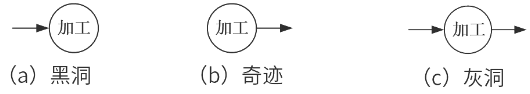

# 结构化方法

## 最佳实践

### 考察问

1. 数据流图(DFD)

    1. 数据流图的元素
        1. `()`: 箭头, 数据存储(读写), 外部实体(输入输出), 加工(进出对应)
        2. `()`: 圆形或圆角矩形, 表示对数据操作. 根据输入输出流的对应关系, 可分为黑洞, 奇迹, 灰洞.
        3. `()`: 双横线, 缓存文件, 和数据存储相关的数据流表示读写, 可以没有名字
        4. `()`: 矩形, 系统外的人员或组织, 和外部实体相关的数据流, 表示输入输出
    2. 数据流的层次结构
        1. `()`: `()`个加工, 描述了`()`与`()`的数据流。
        2. `()`: `()`中的加工经`()`的图称为0层图。
    3. 数据流图的平衡原则:
        1. `()`平衡: 子图`()`上的输入输出数据流必须与其父中对应`()`的输入输出数据流保持`一致`。
        2. `()`平衡: 对于图内的每一个`()`，要求既要有`()`数据流，也要有`()`数据流，避免出现黑洞、奇迹、灰洞。
2. 数据字典(DD): 为`()`中的每个数据流、文件、加工，以及组成数据流或文件的数据项`()`。

### 考察点

1. 数据流图(DFD)

    1. 数据流图的元素
        1. `数据流`: 箭头, 数据存储(读写), 外部实体(输入输出), 加工(进出对应)
        2. `加工`: 圆形或圆角矩形, 表示对数据操作. 根据输入输出流的对应关系, 可分为黑洞, 奇迹, 灰洞.
        3. `数据存储`: 双横线, 缓存文件, 和数据存储相关的数据流表示读写, 可以没有名字
        4. `外部实体`: 矩形, 系统外的人员或组织, 和外部实体相关的数据流, 表示输入输出
    2. 数据流的层次结构
        1. `顶层图`: 只有`一个`加工, 描述了`软件系统`与`外部实体`的数据流。
        2. `0层图`: `顶层图`中的加工经`分解后`的图称为0层图。
    3. 数据流图的平衡原则:
        1. `父图与子图`的平衡: 子图`边界`上的`输入/输出`数据流必须与其`父图`中对应`加工`的`输入/输出`数据流保持`一致`。
        2. `子图内`平衡: 对于图内的每一个`加工`，要求既要有`输入`数据流，也要有`输出`数据流，避免出现黑洞、奇迹、灰洞。根
2. 数据字典(DD): 为`数据流图`中的每个数据流、文件、加工，以及组成数据流或文件的数据项`做出说明`。

## 结构化方法

结构化方法，即 SASD (S tructured Analysis and  Structured Design)方法，也可称为面向功能的软件开发方法或面向数据流的软件开发方法。针对软件生存周期各个不同的阶段，它有构化分析(Structured Analysis, SA)、结构化设计(Structured Design, SD)和结构化编程(Structured Programming, SP)等方法。

## 结构化分析

一般利用图形表达用户需求，使用的手段主要有数据流图、数据字典、结构化语言、判定表以及判定树等。

结构化分析的步骤如下：

1. 分析业务情况，做出反映当前物理模型的数据流图 (Data Flow Diagram,  DFD); 
2. 推导出等价的逻辑模型的 DFD;
3. 设计新的逻辑系统，生成数据字典和基元描述；
4. 建立人机接口，提出可供选择的目标系统物理模型的 DFD;
5. 确定各种方案的成本和风险等级，据此对各种方案进行分析；
6. 选择一种方案；
7. 建立完整的需求规约。

结构化分析的常用手段是数据流图 (DFD) 和数据字典。

### 数据流图(Data Flow Diagram, DFD)

DFD 建模方法的核心是数据流，从应用系统的数据流着手以图形方式刻画和表示一个具体业务系统中的数据处理过程和数据流。

DFD 方法由 4 种基本元素(模型对象)组成：数据流、处理／加工、数据存储和外部项。

1. 数据流(Data Flow) 。数据流用一个箭头描述数据的流向，箭头上标注的内容可以是信息说明或数据项。
2. 处理 (Process) 。表示对数据进行的加工和转换，在图中用矩形框表示。指向处理的数据流为该处理的输入数据，离开处理的数据流为该处理的输出数据。
3. 数据存储。表示用数据库形式(或者文件形式)存储的数据，对其进行的存取分别以指向或离开数据存储的箭头表示。
4. 外部项。也称为数据源或者数据终点。描述系统数据的提供者或者数据的使用者，如教师、学生、采购员、某个组织或部门或其他系统，在图中用圆角框或者平行四边形框表示。

|元素|说明|图例|
| ---- | ---- | ---- |
|数据流|从一个加工流向另一个加工；从加工流向数据存储(写)；从数据存储流向加工(读)；从外部实体流向加工(输入)；从加工流向外部实体(输出)|箭头|
|处理/加工|描述了输入数据流到输出数据流之间的变换. “黑洞”：加工有输入但没输出。“奇迹”：加工没输入但有输出；“灰洞”：加工输入不足以产生输出。|圆形或圆角矩形|
|外部项|指存在于软件系统外的人员或组织|矩形|
|数据存储|用来表示暂时存储的数据。流向文件的数据流表示写文件，流出的表示读文件|双横线|

数据流图的层次结构

一个复杂的软件系统可能涉及上百个加工或数据流，过于复杂且不易理解。于是根据`自顶向下逐层分解`的思想，将数据流图进行分层。

1. 顶层图

    `顶层图`也称上下文数据流图，只有`一个加工`，代表整个软件系统，该加工描述了`软件系统`与`外部实体`的数据流。

2. 0层图

    顶层图中的加工(即系统)经分解后的图称为0层图。

    
    

数据流图的`平衡原则`:

- `父图与子图`之间的`平衡`: 指任何一张DFD子图边界上的输入/输出数据流必须与其父图中对应加工的输入/输出数据流保持一致。
- `子图内`平衡: 对于图内的每一个`加工`，要求既要有`输入`数据流，也要有`输出`数据流，避免出现黑洞、奇迹、灰洞。根数据流相关原则: 数据流必须与加工有关。外部实体与外部实体之间不存在数据流；外部实体与数据存储之间不存在数据流；数据存储与数据存储之间不存在数据流。

建立 DFD 图的目的是描述系统的功能需求。具体的建模过程及步骤如下。 

1. 明确目标，确定系统范围。

    首先要明确目标系统的功能需求，并将用户对目标系统的功能需求完整、准确、一致地描述出来，然后确定模型要描述的问题域。

2. 建立顶层 DFD 图。

    顶层 DFD 图表达和描述了将要实现的系统的主要功能，同时也确定了整个模型的内外关系，表达了系统的边界及范围，也构成了进一步分解的基础。

3. 构建第一层 DFD 分解图。

    根据应用系统的逻辑功能，把顶层 DFD 图中的处理分解成多个更细化的处理。

4. 开发 DFD 层次结构图。

    对第一层 DFD 分解图中的每个处理框作进一步分解，在分解图中要列出所有的处理及其相关信息，并要注意分解图中的处理与信息包括父图中的全部内容。

5. 检查确认 DFD 图。

### 数据字典

数据字典 (Data Dictionary)的作用是给数据流图上每个元素加以定义和说明。换句话说，数据流图上所有元素的定义和解释的文字集合就是数据字典。数据字典各部分的描述如下。

1. 数据项：数据流图中数据块的数据结构中的数据项说明。数据项是不可再分的数据单位。对数据项的描述通常包括以下内容：

    数据项描述＝｛数据项名，数据项含义说明，别名，数据类型，长度，取值范围，取值含义，与其他数据项的逻辑关系｝

    其中“取值范围”“与其他数据项的逻辑关系”定义了数据的完整性约束条件，是设计数据检验功能的依据。若干个数据项可以组成一个数据结构。

2. 数据结构：数据流图中数据块的数据结构说明。数据结构反映了数据之间的组合关系。

    一个数据结构可以由若干个数据项组成，也可以由若干个数据结构组成，或由若干个数据项和数据结构混合组成。对数据结构的描述通常包括以下内容：

    数据结构描述＝｛数据结构名，含义说明，组成： ｛数据项或数据结构｝｝

3. 数据流：数据流图中流线的说明。数据流是数据结构在系统内传输的路径。对数据流的描述通常包括以下内容：

    数据流描述＝｛数据流名，说明，数据流来源，数据流去向，组成： ｛数据结构｝，平均流量，高峰期流量｝

    其中“数据流来源”是说明该数据流来自哪个过程，即数据的来源。“数据流去向“是说明该数据流将到哪个过程去，即数据的去向。“平均流量”是指在单位时间(每天、每周、每月等)里的传输次数。“高峰期流量”则是指在高峰时期的数据流量。

4. 数据存储：数据流图中数据块的存储特性说明。数据存储是数据结构停留或保存的地方，也是数据流的来源和去向之一。对数据存储的描述通常包括以下内容：

    数据存储描述＝｛数据存储名，说明，编号，流入的数据流，流出的数据流，组成： ｛数据结构｝，数据量，存取方式｝

    其中“数据量”是指每次存取多少数据，每天(或每小时、每周等)存取几次等信息。“存取方式”包括是批处理，还是联机处理；是检索还是更新；是顺序检索还是随机检索等。另外“流入的数据流”要指出其来源，“流出的数据流”要指出其去向。

5. 处理过程：数据流图中功能块的说明。数据字典中只需要描述处理过程的说明性信息，通常包括以下内容：

    处理过程描述＝｛处理过程名，说明，输入： ｛数据流｝，输出： ｛数据流｝，处理： ｛简要说明｝｝

## 🔒问题

1. 在结构化分析方法中，用(  )表示功能模型，用(  )表示行为模型。

- A. ER图
- B. 用例图
- C. DFD
- D. 对象图

- A. 通信图
- B. 顺序图
- C. 活动图
- D. 状态转换图

答案: CD

2. 信息建模方法是从数据的角度对现实世界建立模型，模型是现实系统的一个抽象，信息建模方法的基本工具是()。
    - A. 流程图
    - B. 实体联系图
    - C. 数据流图
    - D. 数据字典

    参考答案：B
    答案解析：业务流程图(TFD)是分析和描述现有系统的传统工具，是业务流程调查结果的图形化表示。实体联系图(E-R图)它是描述概念世界，建立概念模型的实用工具。
    数据流图(DFD)是表达系统内数据的流动并通过数据流描述系统功能的一种方法。
    数据字典(DD)是在DFD的基础上，对DFD中出现的所有命名元素都加以定义，使得每个图形元素的名字都有一个确切的解释。 

1. 煤炭生产是国民经济发展的主要领域之一，其煤矿的安全非常重要。某能源企业拟开发一套煤矿建设项目安全预警系统，以保护煤矿建设项目从业人员生命安全。本系统的主要功能包括如下(a)~(h)所述。

    (a)项目信息维护
    (b)影响因素录入
    (c)关联事故录入
    (d)安全评价得分
    (e)项目指标预警分析
    (f)项目指标填报
    (g)项目指标审核
    (h)项目指标确认

    1. (9分)王工根据煤矿建设项目安全预警系统的功能要求，设计完成了系统的数据流图，如图所示。请使用题干中描述的功能(a)~(h)，补充完善空(1)~(6)处的内容，并简要介绍数据流图在分层细化过程中遵循的数据平衡原则。(2022下)

        

        (1)f(2)g(3)h(4)d(5)b(6)e

        数据流图在分层细化过程中遵循的数据平衡原则包括：
        1. 层间平衡：子图的输入/输出数据流必须与父图中对应加工的输入/输出数据流一致。
        2. 图内平衡：每个加工必须既有输入数据流，又有输出数据流，且输入输出数据流要与加工的处理逻辑相关。

        ✨首先确认外部实体和数据存储对应的加工

    2. (9分)请根据【问题1】中数据流图表示的相关信息，补充完善煤矿建设项目安全预警系统总体E - R图中实体(1) - (6)的具体内容，将正确答案填在答题纸上。(2022下)

        

        (1)项目管理员 (2)项目经理 (3)项目指标 (4)项目信息 (5)影响因素 (6)关联事故。

        结合问题2，安全员填报的是项目指标表，因此(3)应该就是项目指标；又因为项目指标表由项目经理确认，因而(2)为项目经理；项目管理员需要维护三类信息，即项目信息、关联事故、影响因素参数，推知(1)为项目管理员，(4)、(5)、(6)为项目信息、关联事故、影响因素参数，注意此三者次序无关。

    3. (7分)请简要说明数据流图和数据字典在该系统开发的需求分析和设计阶段所起的作用。(2022下)

        - 数据流图：在需求分析阶段建立系统的功能模型，完成需求分析。在设计阶段为模块划分与模块之间接口设计提供依据。
        - 数据字典：在需求分析阶段为数据流图中的每个数据流、文件、加工，以及组成数据流或文件的数据项做出说明。在设计阶段根据数据字典中的数据存储描述来建立数据库设计。

2. 某软件企业为快餐店开发一套在线订餐管理系统，主要功能包括：
    
    1. 在线订餐：已注册客户通过网络在线选择快餐店所提供的餐品种类和数量后提交订单，系统显示订单费用供客户确认，客户确认后支付订单所列各项费用。
    2. 厨房备餐：厨房接收到客户已付款订单后按照订单餐品列表选择各类食材进行餐品加工。
    3. 食材采购：当快餐店某类食材低于特定数量时自动向供应商发起采购信息，包括食材类型和数量，供应商接收到采购信息后按照要求将食材送至快餐店并提交已采购的食材信息，系统自动更新食材库存。
    4. 生成报表：每个周末和月末，快餐店经理会自动收到系统生成的统计报表，报表中详细列出了本周或本月订单的统计信息以及库存食材的统计信息。

    现采用数据流图对上述订餐管理系统进行分析与设计，系统未完成的0层数据流图如图所示。  

    

    5. (8分)根据订餐管理系统功能说明，请在图所示数据流图中给出外部实体E1～E4和加工P1~P4的具体名称。(2019下)

        1. E1客户，E2厨房，E3快餐店经理，E4供应商；
        2. P1订餐，P2备餐，P3生成报表，P4采购食材

    6. (8分)根据数据流图规范和订餐管理系统功能说明，请说明在图2 - 1中需要补充哪些数据流可以构造出完整的0层数据流图。(2019下)

        1. E1->P1 餐品订单
        2. P1->P2 餐品订单
        3. D1->P3 订单汇总
        4. P3->E3 统计报表

    7. (9分)根据数据流图的含义，请说明数据流图和系统流程图之间有哪些方面的区别。 (2019下)

        1. 数据流图中的处理过程可并行；系统流程图在某个时间点只能处于一个处理过程。
        2. 数据流图展现系统的数据流；系统流程图展现系统的控制流。
        3. 数据流图展现全局的处理过程，过程之间遵循不同的计时标准；系统流程图中处理过程遵循一致的计时标准。

3. 某公司欲建设一个房屋租赁服务系统，统一管理房主和租赁者的信息，提供快捷的租赁服务。本系统的主要功能描述如下：

    1. 登记房主信息。记录房主的姓名、住址、身份证号和联系电话等信息，并写入房主信息文件。
    2. 登记房屋信息。记录房屋的地址、房屋类型(如平房、带阳台的楼房、独立式住宅等)、楼层、租金及房屋状态(待租赁、已出租)等信息，并写入房屋信息文件。一名房主可以在系统中登记多套待租赁的房屋。
    3. 登记租赁者信息。记录租赁者的个人信息，包括：姓名、性别、住址、身份证号和电话号码等，并写入租赁者信息文件。
    4. 安排看房。已经登记在系统中的租赁者，可以从待租赁房屋列表中查询待租赁房屋信息。租赁者可以提出看房请求，系统安排租赁者看房。对于每次看房，系统会生成一条看房记录并将其写入看房记录文件中。
    5. 收取手续费。房主登记完房屋后，系统会生成一份费用单，房主根据费用单交纳相应的费用。
    6. 变更房屋状态。当租赁者与房主达成租房或退房协议后，房主向系统提交变更房屋状态的请求。系统将根据房主的请求，修改房屋信息文件。

    问题:

    7. (12 分)若采用结构化方法对房屋租赁服务系统进行分析，得到如图所示的顶层 DFD。使用题干中给出的词语，给出图中外部实体 E1～E2、加工 P1～P6 以及数据存储 D1～D4 的名称。(2018下)

        

        1. 外部实体：E1：房主 E2：租赁者
        2. 顶层加工：P1：登记房主信息 P2：登记房屋信息 P3：登记租赁者信息 P4：查询待租赁房屋信息 P5：安排租赁者看房 P6：变更房屋状态
        3. 数据存储：D2：租赁者信息文件 D1：房主信息文件 D3：房屋信息文件 D4：看房记录文件

    8. (5 分)若采用信息工程(Information Engineering)方法对房屋租赁服务系统进行分析，得到如图 所示的 ERD。请给出图中实体(1)~(5)的名称。 (2018下)

        

        (1)房主
        (2)房屋
        (3)房屋类型
        (4)租赁者
        (5)看房安排

    9. (8 分)
        (1)信息工程方法中的“实体(entity)”与面向对象方法中的“类(class)”之间有哪些不同之处?
        (2)在面向对象方法中通常采用用例(Use Case)来捕获系统的功能需求。用例可以按照不同的层次来进行划分，其中的 Essential Use Cases 和 Real Use Cases 有哪些区别?
        请用 100 字以内文字解释说明上述两个问题。 (2018下)

        1. 信息工程方法中的“实体”描述的是数据以及该数据的相关属性。面向对象方法中的“类”是数据和行为的封装体。
        2. Essential Use Cases 和 Real Use Cases 是按照开发阶段来进行划分的。
            1. Essential Use Cases 是在面向对象分析阶段使用的，Real Use Cases 是在面向对象设计阶段使用的。
            2. Essential Use Cases 描述的是用例的本质属性，它与如何实现这个用例无关，独立于实现该用例的软硬件技术。
            3. Real Use Cases 描述的是用例的实现方式，表达了设计和实现该用例时所采用的方法和技术。

## 结构化设计

结构化设计(Structured Design, SD) 是一种面向数据流的设计方法，它以SRS和SA阶段所产生的数据流图和数据字典等文档为基础，是一个自顶向下、逐步求精和模块化的过程。分为概要设计和详细设计两个阶段，其中概要设计的主要任务是确定软件系统的结构，对系统进行模块划分，确定每个模块的功能、接口和模块之间的调用关系；详细设计的主要任务是为每个模块设计实现的细节。

### 模块结构

人们在解决复杂问题时使用的一个很重要的原则，就是将它分解成多个小问题分别处理，在处理过程中，需要根据系统总体要求，协调各业务部门的关系。在 SD 中，这种功能分解就是将系统划分为模块，模块是组成系统的基本单位，它的特点是可以自由组合、分解和变换，系统中任何一个处理功能都可以看成一个模块。

1. 信息隐藏与抽象。

    信息隐藏原则要求采用封装技术，将程序模块的实现细节(过程或数据)隐藏起来，对千不需要这些信息的其他模块来说是不能访问的，使模块接口尽量简单。

2. 模块化。

    在描述一个模块时，必须按模块的外部特性与内部特性分别描述。模块的外部特性是指模块的模块名、参数表和给程序乃至整个系统造成的影响，而模块的内部特性则是指完成其功能的程序代码和仅供该模块内部使用的数据。对千模块的外部环境(例如，需要调用这个模块的上级模块)来说，只需要了解这个模块的外部特性就足够了，不必了解它的内部特性。而软件设计阶段，通常是先确定模块的外部特性，然后再确定它的内部特性。

3. 耦合。

    耦合表示模块之间联系的程度。

    |耦合类型|描述|
    | ---- | ---- |
    |非直接耦合|两个模块之间没有直接关系，它们之间的联系完全是通过上级模块的控制和调用来实现的|
    |数据耦合|一组模块借助参数表传递简单数据|
    |标记耦合|一组模块通过参数表传递记录等复杂信息(数据结构)|
    |控制耦合|模块之间传递的信息中包含用于控制模块内部逻辑的信息|
    |通信耦合|一组模块共用了一组输入信息，或者它们的输出需要整合以形成完整数据，即共享了输入或输出|
    |公共耦合|多个模块都访问同一个公共数据环境，公共的数据环境可以是全局数据结构、共享的通信区、内存的公共覆盖区等|
    |内容耦合|一个模块直接访问另一个模块的内部数据；一个模块不通过正常入口转到另一个模块的内部；两个模块有一部分程序代码重叠；一个模块有多个入口等|

4. 内聚。

    内聚表示模块内部各代码成分之间联系的紧密程度，是从功能角度来度量模块内的联系，一个好的内聚模块应当恰好做目标单一的一件事情。

    |内聚类型|描述|
    | ---- | ---- |
    |功能内聚|完成一个单一功能，各个部分协同工作，缺一不可|
    |顺序内聚|处理元素相关，而且必须顺序执行|
    |通信内聚|所有处理元素集中在一个数据结构的区域上|
    |过程内聚|处理元素相关，而且必须按特定的次序执行|
    |时间内聚|所包含的任务必须在同一时间间隔内执行|
    |逻辑内聚|完成逻辑上相关的一组任务|
    |偶然内聚|完成一组没有关系或松散关系的任务|

    遵循“高内聚、低耦合”的设计原则。

🔒题目:

1. 软件设计过程中，可以用耦合和内聚两个定性标准来衡量模块的独立程度，耦合衡量不同模块彼此间互相依赖的紧密程度，应采用以下设计原则______，内聚衡量一个模块内部各个元素彼此结合的紧密程度，以下属于高内聚的是______。

    - A.尽量使用内容耦合、少用控制耦合和特征耦合、限制公共环境耦合的范围、完全不用数据耦合
    - B.尽量使用数据耦合、少用控制耦合和特征耦合、限制公共环境耦合的范围、完全不用内容耦合
    - C.尽量使用控制耦合、少用数据耦合和特征耦合、限制公共环境耦合的范围、完全不用内容耦合
    - D.尽量使用特征耦合、少用数据耦合和控制耦合、限制公共环境耦合的范围、完全不用内容耦合

    - A.偶然内聚
    - B.时间内聚
    - C.功能内聚
    - D.逻辑内聚
    答案：B C

### 系统结构图

系统结构图 (Structure Chart,  SC) 又称为模块结构图. 详细设计的主要任务是设计每个模块的实现算法、所需的局部数据结构。详细设计的目标有两个：实现模块功能的算法要逻辑上正确和算法描述要简明易懂。详细设计必须遵循概要设计来进行。详细设计方案的更改，不得影响到概要设计方案；如果需要更改概要设计，必须经过项目经理的同意。详细设计，应该完成详细设计文档，主要是模块的详细设计方案说明。

详细设计的表示工具有图形工具、表格工具和语言工具。

1. 图形工具。

    具体的图形有业务流图、程序流程图、PAD  (Problem Analysis Di agram) 图、 NS 流程图(由 Nassi和 Shnei derman 开发，简称 NS) 等。

    程序流程图(Program Flow Diagram，PFD)又称为程序框图，是使用最广泛然的一种描述程序逻辑结构的工具。它用方框表示一个处理步骤，菱形表示一个逻辑条件，箭头表示控制流向。其优点是：结构清晰，易于理解，易于修改。缺点是：只能描述执行过程而不能描述有关的数据。

    NS 流程图，也称为盒图，是一种强制使用结构化构造的图示工具，也称为方框图。其具有以下特点：功能域明确、不可能任意转移控制、很容易确定局部和全局数据的作用域、很容易表示嵌套关系及模板的层次关系。

    PAD 图是一种改进的图形描述方式，可以用来取代程序流程图，相比程序流程图更直观，结构更清晰。最大的优点是能够反映和描述自顶向下的历史和过程。 PAD 提供了 5 种基本控制结构的图示，并允许递归使用。 PAD 的特点如下：

2. 表格工具。

    可以用一张表来描述过程的细节，在这张表中列出了各种可能的操作和相应的条件。

3. 语言工具。

    用某种高级语言来描述过程的细节，例如伪码和 PDL (Program Design Language) 等。

## 结构化编程

结构化程序设计 (Structured Programing,  SP) 的程序设计方法即结构化程序设计方法，是“面向过程”方法的改进，结构上将软件系统划分为若干功能模块，各模块按要求单独编程，再组合构成相应的软件系统。

🔒题目:

1. 使用模型驱动的软件开发方法，软件系统被表示为一组可以被自动转换为可执行代码的模型。其中，()在不涉及实现的情况下对软件系统进行建模。
    - A. 平台无关模型
    - B. 计算无关模型
    - C. 实现相关模型
    - D. 平台相关模型

    答案： A

    答案解析：按抽象到具体的次序， 软件建模的三个层面：
    (1) 计算无关模型(CIM)：Computational Independent Model；
    (2) 平台无关模型(PIM)：Platform Independent Model；
    (3) 平台相关模型(PSM)：Platform Dependent Model，又称平台特定模型。

## 数据库设计

数据库设计的内容包括：需求分析、概念结构设计、逻辑结构设计、物理结构设计、数据库的实施和数据库的运行和维护。本小节主要讨论数据库的概念结构设计，其他内容详见数据库章节。

### 概念结构设计

通常采用实体－联系图(Entity Relationship Diagram,  E-R 图)来表示。E-R 图提供了表示实体类型、属性和联系的方法，用来描述现实世界的概念模型。

在 E-R 图中有如下成分：矩形框表示实体；菱形框表示联系；椭圆形框表示实体或联系的属性，对千主属性名，则在其名称下画一条下画线。

1. 实体。一般认为，客观上可以相互区分的事物就是实体，实体可以是具体的人和物，也可以是抽象的概念与联系。关键在千一个实体能与另一个实体相区别，具有相同属性的实体具有相同的特征和性质。用实体名及其属性名集合来抽象和刻画同类实体。在 E-R 图中用矩形表示，矩形框内写明实体名；比如学生张三、学生李四都是实体对象。
2. 属性。实体所具有的某一特性，一个实体可由若干个属性来刻画。属性不能脱离实体，属性是相对实体而言的。在 E-R 图中用椭圆形表示，并用无向边将其与相应的实体连接起来；比如学生的姓名、学号、性别都是属性。如果是多值属性的话，在椭圆形外面再套实线椭圆。如果是派生属性则用虚线椭圆表示。
3. 联系。联系也称关系，信息世界中反映实体内部或实体之间的关联。实体内部的联系通常是指组成实体的各属性之间的联系；实体之间的联系通常是指不同实体集之间的联系。在E-R 图中用菱形表示，菱形框内写明联系名，并用无向边分别与有关实体连接起来，同时在无向边旁标上联系的类型(1 :  I,  1  :  n 或 m: n) 。比如老师给学生授课存在授课关系，学生选课存在选课关系。如果是弱实体的联系则在菱形外面再套菱形。

E-R 图中的联系存在 3 种一般性约束：一对一约束(联系)、一对多约束(联系)和多对多约束(联系)，它们用来描述实体集之间的数量约束。

1. 一对一联系 (1 :  1) 。

    对于两个实体集 A 和 B, 若 A 中的每一个值在 B 中至多有一个实体值与之对应，反之亦然，则称实体集 A 和 B 具有一对一的联系。一个学校只有一个正校长，而一个校长只在一个学校中任职，则学校与校长之间具有一对一联系。

2. 一对多联系(1 :  N) 。

    对于两个实体集 A 和 B, 若 A 中的每一个值在 B 中有多个实体值与之对应，反之 B 中每一个实体值在 A 中至多有一个实体值与之对应，则称实体集 A 和 B 具有一对多的联系。例如，某校教师与课程之间存在一对多的联系“教”，即每位教师可以教多门课程，但是，每门课程只能由一位教师来教，教师与课程之间具有一对多联系。一个专业中有若干名学生，而每个学生只在一个专业中学习，专业与学生之间具有一对多联系。

3. 多对多联系 (M :  N) 。

    对千两个实体集 A 和 B, 若 A 中每一个实体值在 B 中有多个实体值与之对应，反之亦然，则称实体集 A 与实体集 B 具有多对多联系。实际上，一对一联系是一对多联系的特例，而一对多联系又是多对多联系的特例。

例如，表示学生与课程间的联系”选修”是多对多的，即一个学生可以学多门课程，而每门课程可以有多个学生来学。

联系也可能有属性。例如，学生”选修“某门课程所取得的成绩，既不是学生的属性也不是课程的属性。由于“成绩“既依赖于特定学生又依赖于某门特定的课程，所以它是学生与课程之间的联系”选修”的属性。

## 最佳实践

### 考察问

1. 软件设计体系(拓展)
    1. `()`设计：人机交互
    2. `()`设计：`部件之间的关系`
    3. `()`设计：将`模型`转换成`数据结构`的定义
    4. `()`设计：系统结构`部件`转换成`软件`的过程描述
2. 软件建模方法(拓展)
    1. `()`法: 自顶向下，逐步分解求精；严格分阶段，阶段产出标准化；应变能力差。
    2. `()`方法: 自底向上；阶段界限不明；更好应变、更好复用；符合人们的思维习惯 。
    3. `()`方法: 粗粒度、松耦合；标准化和构件化；抽象级别：操作【低】->服务【中】->业务流程【高】 。
3. 软件设计模式(拓展)
    1. ()模式：软件设计中的`高层`决策
    2. ()模式：与具体的实现语言`无`关
    3. ()法：是`最低层`的模式，与具体的实现语言`有`关
4. 概要设计详细设计(拓展): 

    概要设计也称为高层设计或总体设计，即将`()`需求转化为`()`和软件的`()`；详细设计也称为低层设计，即对结构图进行细化，得到详细的数据结构与算法。

### 考察点

1. 软件设计包括(拓展)
    1. `接口`设计：`人机交互`
    2. `结构`设计：`部件之间的关系`
    3. `数据`设计：将`模型`转换成`数据结构`的定义
    4. `过程`设计：系统结构`部件`转换成`软件`的过程描述
2. 软件建模方法(拓展)
    1. `结构化`法: 自顶向下，逐步分解求精；严格分阶段，阶段产出标准化；应变能力差。
    2. `面向对象`方法: 自底向上；阶段界限不明；更好应变、更好复用；符合人们的思维习惯 。
    3. `面向服务`的方法: 粗粒度、松耦合；标准化和构件化；抽象级别：操作【低】->服务【中】->业务流程【高】 。

3. 设计模式(拓展)
    1. `架构`模式：软件设计中的`高层`决策，例如C/S结构就属于架构模式，架构模式反映了开发软件系统过程中所作的基本设计决策
    2. `设计`模式：与具体的实现语言`无`关
    3. `惯用`法：是`最低层`的模式，与具体的实现语言`有`关

4. 概要设计和详细设计(拓展)

    概要设计也称为高层设计或总体设计，即将`软件需求`转化为`数据结构`和软件的`系统结构`；详细设计也称为低层设计，即对结构图进行细化，得到详细的`数据结构`与`算法`。

## 其他(拓展)

### 设计模式

1. 架构模式：软件设计中的`高层`决策，例如C/S结构就属于架构模式，架构模式反映了开发软件系统过程中所作的基本设计决策
2. 设计模式：主要关注软件系统的设计，`与具体的实现语言无关`
3. 惯用法：是`最低层`的模式，关注软件系统的设计与实现，实现时通过某种特定的程序设计语言来描述构件与构件之间的关系。每种编程语言都有它自己特定的模式，即语言的惯用法。例如引用-计数就是C++语言中的一种惯用法

问题🔒

1. (  )的选择是开发一个软件系统时的基本设计决策；(  )是最低层的模式，关注软件系统的设计与实现，描述了如何实现构件及构件之间的关系。引用一计数是C++管理动态资源时常用的一种(  )。

    - A．架构模式  
    - B．惯用法
    - C．设计模式  
    - D．分析法

    - A．架构模式  
    - B．惯用法
    - C．设计模式  
    - D．分析法

    - A．架构模式  
    - B．惯用法
    - C．设计模式  
    - D．分析法

    答案: ABB

### 概要设计和详细设计

从工程管理角度来看，软件设计可分为概要设计和详细设计两个阶段。概要设计也称为高层设计或总体设计，即将软件需求转化为数据结构和软件的系统结构；详细设计也称为低层设计，即对结构图进行细化，得到详细的数据结构与算法。 

🔒问题

1. 软件概要设计将软件需求转化为软件设计的( )和软件的( )。

    - A. 算法流程
    - B. 数据结构
    - C. 交互原型
    - D. 操作接口

    - A. 系统结构
    - B. 算法流程
    - C. 内部接口
    - D. 程序流程

    参考答案：B A

## 软件设计概念

系统设计的目标是根据系统分析的结果，完成系统的构建过程。其主要目的是绘制系统的蓝图，权衡和比较各种技术和实施方法的利弊，合理分配各种资源，构建新系统的详细设计方案和相关模型，指导系统实施工作的顺利开展。

系统设计的主要内容包括概要设计和详细设计。其中概要设计的主要任务是确定软件系统的结构，对系统进行模块划分，确定每个模块的功能、接口和模块之间的调用关系；详细设计的主要任务是为每个模块设计实现的细节。

1. 结构化法: 自顶向下，逐步分解求精；严格分阶段，阶段产出标准化；应变能力差。
2. 面向对象方法: 自底向上；阶段界限不明；更好应变、更好复用；符合人们的思维习惯 。
3. 面向服务的方法: 粗粒度、松耦合；标准化和构件化；抽象级别：操作【低】->服务【中】->业务流程【高】 。

🔒题目

1. 软件方法学是以软件开发方法为研究对象的学科。其中，(  )是先对最高层次中的问题进行定义、设计、编程和测试，而将其中未解决的问题作为一个子任务放到下一层次中去解决。(  )是根据系统功能要求，从具体的器件、逻辑部件或者相似系统开始，通过对其进行相互连接、修改和扩大，构成所要求的系统。(  )是建立在严格数学基础上的软件开发方法。

    - A. 面向对象开发方法
    - B. 形式化开发方法
    - C. 非形式化开发方法
    - D. 自顶向下开发方法

    - A. 自底向上开发方法
    - B. 形式化开发方法
    - C. 非形式化开发方法
    - D. 原型开发方法

    - A. 自底向上开发方法
    - B. 形式化开发方法
    - C. 非形式化开发方法
    - D. 自顶向下开发方法

    答案: DAB

## 软件设计体系

软件设计包括体系结构设计、接口设计、数据设计和过程设计。

- 接口设计(人机界面设计)：软件内部，软件和操作系统间以及软件和人之间如何通信。
- 结构设计：定义软件系统各主要部件之间的关系。
- 数据设计：将模型转换成数据结构的定义。好的数据设计将改善程序结构和模块划分，降低过程复杂性。
- 过程设计：系统结构部件转换成软件的过程描述。

🔒问题

1. 软件设计包括了四个既独立又相互联系的活动：高质量的(  )将改善程序结构和模块划分，降低过程复杂性；(  )的主要目标是开发一个模块化的程序结构，并表示出模块间的控制关系；(  )描述了软件与用户之间的交互关系。

    - A. 程序设计  B. 数据设计  C. 算法设计  D. 过程设计
    - A. 软件结构设计  B. 数据结构设计  C. 数据流设计  D. 分布式设计
    - A. 数据架构设计  B. 模块化设计  C. 性能设计  D. 人机界面设计

    答案: BAD

## 人机界面设计

1. 置于用户控制之下

    - 以不强迫用户进入不必要的或不希望的动作的方式来定义交互方式
    - 提供灵活的交互
    - 允许用户交互可以被中断和撤销
    - 当技能级别增加时可以使交互流水化并允许定制交互
    - 使用户隔离内部技术细节
    - 设计应允许用户和出现在屏幕上的对象直接交互

2. 减少用户的记忆负担
    - 减少对短期记忆的要求
    - 建立有意义的缺省
    - 定义直觉性的捷径
    - 界面的视觉布局应该基于真实世界的隐喻
    - 以不断进展的方式揭示信息

3. 保持界面的一致性
    - 允许用户将当前任务放入有意义的语境
    - 在应用系列内保持一致性
    - 如过去的交互模型已建立起了用户期望，除非有迫不得已的理由，不要改变它

🔒问题

1. 下列关于用户界面设计的叙述中，错误的是(  )。

    - A. 界面交互模型应经常进行修改
    - B. 界面的视觉布局应该尽量与真实世界保持一致
    - C. 所有可视信息的组织需要按照统一的设计标准
    - D. 确保用户界面操作和使用的一致性

    答案: A