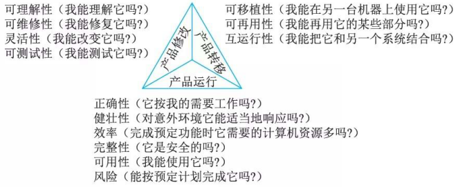
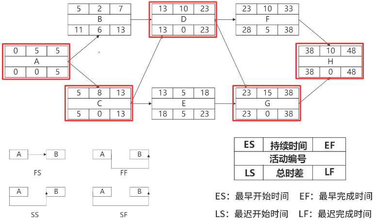
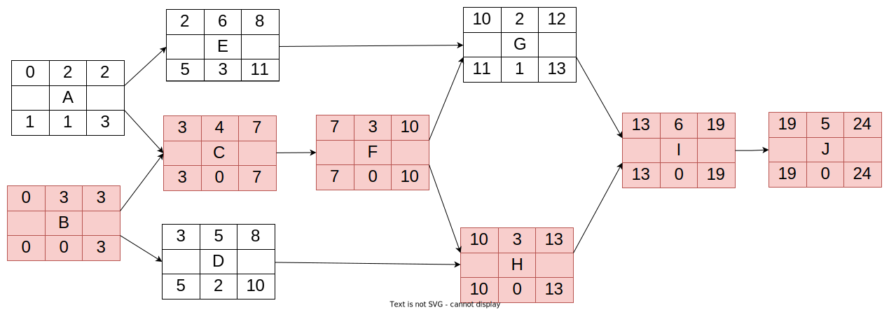
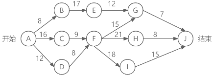
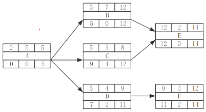

# 软件项目管理

## 最佳实践

### 评估

### 题目总结

1. 项目活动图(PERT)

    - 顶点表示`里程碑`，边表示`活动`，边上的数字表示完成该活动所需要的`时间`。
    - 关键路径：
        - 关键路径: 从开始里程碑到结束里程碑之间`距离(时间)最长`的一条路径。遍历所有路径, 获取.
        - `最短工期`: 关键路径上的时间长度就是完成整个工程项目的`最短工期`
    - 松弛时间: 可以延误多久而不影响总工期. 计算公式为: 松弛时间 = 最迟开始时间-最早开始时间.
        - 关键路径上的活动的松弛时间均为0
        - 其他路径:
            - 最迟开始时间 = 关键路径时间 - 该`活动`到项目活动图的`结束`的`最长`长度
            - 最早开始时间 = 项目活动图的`开始`到`该活动前一个活动`的`最长`长度.

2. 单代号网络图(PDM)

    - `节点`表示`任务`, `箭头`表示任务的`依赖关系`
    - 计算步骤
        1. `从前到后`, 计算每个活动的最早开始时间和最早结束时间(活动的最`上`面一行)
            1. 最早开始时间
                1. 开始的活动为`0`
                2. 中间的活动为前一个活动的`最早结束`时间. 如果依赖多个活动, 则取`最大`的最早结束时间.
            2. 最早结束时间 = 最早开始时间 + 活动的持续时间
        2. `从后到前`, 计算每个活动的最晚开始时间和最晚结束时间(活动的最`下`面一行)
            1. 最晚结束时间
                1. 最后一个活动的最晚结束时间 = 最`早`结束时间
                2. 中间的活动为后一个活动的`最晚开始`时间. 如果依赖多个活动, 则取最`小`的最晚开始时间.
            2. 最晚开始时间 = 最晚结束时间 - 活动的持续时间
            3. 松弛时间 = 最迟开始-最早开始或最迟完成和最早完成(竖向计算). 松弛时间为0的, 标记为关键路径.

## 软件进度管理

所谓进度，指的是对执行活动和里程碑所制定的工作计划，而进度管理指的是为了确保项目按期完成所需要的管理过程。

### 工作分解结构

工作分解结构 (Work Breakdown Structure, WBS)，就是把一个项目，按一定的原则分解成任务，任务再分解成一项项工作，再把一项项工作分配到每个人的日常活动中，直到分解不下去为止。即：项目->任务->工作->日常活动。

任务分解的基本要求。

1. WBS的工作包是可控和可管理的，不能过于复杂。
2. 任务分解也不能过细，一般原则WBS的树形结构不超过6层。
3. 每个工作包要有一个交付成果。
4. 每个任务必须有明确定义的完成标准。
5. WBS必须有利于责任分配。

WBS分解包进度管理(拓展):

进度管理：为了确保项目按期完成所需要的管理过程。

- 活动定义
- 活动排序
- 活动资源估算: 同一个活动, 可以多个人参与
- 活动历时估算: 活动总时间除以参与人数

    - 专家判断法
    - 三点估算法:

        $E = \frac{O + 4\times M + P}{6}$

        其中：
        - $E$ 表示期望时间；
        - $O$ 表示乐观时间；
        - $M$ 表示最可能时间；
        - $P$ 表示悲观时间 。

    - 功能点估算法
    - 自上而下的估算
    - 自下而上的估算

- 制定进度计划
- 进度控制

    - 是否为关键活动
    - 偏差是否大于总时差
    - 偏差是否大于自由时差
    - 赶工：增加资源
    - 快速跟进：活动并行执行

🔒问题

1. 项目进度管理中的过程包括(  )。

    - A. 活动定义、活动排序、活动的资源估算和工作进度分解
    - B. 活动定义、活动排序、活动的资源估算、活动历时估算、制定计划和进度控制
    - C. 项目章程、项目范围管理计划、组织过程资产和批准的变更申请
    - D. 生产项目计划、项目可交付物说明、信息系统要求说明和项目度量标准

    答案: B

### 任务活动图

活动定义是指确定完成项目的各个交付成果所必须进行的各项具体活动，需要明确每个活动的前驱、待续时间、必须完成日期、里程碑或交付成果。前驱指的是该活动开始之前必须发生的事件或事件集；持续时间是指完成该活动的时间长度(一般单位为天或周)；必须完成日期指的是该活动必须完成的具体日期；里程碑指的是判定该活动完成的一组条件。

## 软件配置管理

软件配置管理(Software Configuration  Management, SCM) 是一种标识、组织和控制修改的技术。软件配置管理应用于整个软件工程过程。在软件建立时变更是不可避免的，而变更加剧了项目中软件开发者之间的混乱。 

SCM活动的目标就是为了标识变更、控制变更、确保变更正确实现并向其他有关人员报告变更。

1. 版本控制(Version Control) 。版本控制是指对软件开发过程中各种程序代码、配置文件及说明文档等文件变更的管理。版本控制最主要的功能就是追踪文件的变更。它将什么时候、什么人更改了文件的什么内容等信息忠实地记录下来。每一次文件的改变，文件的版本号都将增加。除了记录版本变更外，版本控制的另一个重要功能是并行开发。

2. 变更控制(Change Control) 。变更控制的目的并不是控制变更的发生，而是对变更进行管理，确保变更有序进行。

🔒题目:

1. 项目配置管理中，产品配置是指一个产品在其生命周期各个阶段所产生的各种形式和各种版本的文档、计算机程序、部件及数据的集合。该集合中的每一个元素称为该产品配置中的一个配置项，(  )不属于产品组成部分工作成果的配置项。

    - A. 需求文档
    - B. 设计文档
    - C. 工作计划
    - D. 源代码

    答案: C

## 产品配置(拓展)

产品配置是指一个产品在其生命周期各个阶段所产生的各种形式(机器可读或人工可读)和各种版本的文档、计算机程序、部件及数据的集合。该集合中的每一个元素称为该产品配置中的一个配置项(Configuration Item，CI)，配置项主要有以下两大类。

1. 属于产品组成部分的工作成果，如需求文档、设计文档、源代码和测试用例等。
2. 属于项目管理和机构支撑过程域产生的文档，如工作计划、项目质量报告、项目跟踪报告等。这些文档虽然不是产品的组成部分，但是值得保存。

🔒问题

1. 产品配置是指一个产品在其生命周期各个阶段所产生的各种形式(机器可读或人工可读)和各种版本的()的集合。

    - A. 需求规格说明、设计说明、测试报告
    - B. 需求规格说明、设计说明、计算机程序
    - C. 设计说明、用户手册、计算机程序
    - D. 文档、计算机程序、部件及数据

    参考答案：D

## 软件质益管理

软件质量是软件符合明确地叙述的功能和性能需求、文档中明确描述的开发标准以及所有专业开发的软件都应具有的隐含特征的程度。

从管理角度出发，可以将影响软件质量的因素划分为 3 组，分别反映用户在使用软件产品时的 3 种不同倾向和观点。

### 软件质量保证

软件质量保证(Software Quality Assurance, SQA) 是建立一套有计划，有系统的方法，来向管理层保证拟定出的标准、步骤、实践和方法能够正确地被所有项目所采用。

软件质量保证的主要任务是以下3个方面。

1. SQA审计与评审。SQA 审计包括对软件工作产品、软件工具和设备的审计，评价这几项内容是否符合组织规定的标准。 SQA评审的主要任务是保证软件工作组的活动与预定的软件过程一致，确保软件过程在软件产品的生产中得到遵循。
2. SQA报告。 SQA人员应记录工作的结果，并写入到报告之中，发布给相关的人员。SQA 报告的发布应遵循三条原则： SQA和高级管理者之间应有直接沟通的渠道； SQA报告必须发布给软件工程组，但不必发布给项目管理人员；在可能的情况下向关心软件质量的人发布SQA报告。
3. 处理不符合问题。这是SQA的一个重要的任务， SQA人员要对工作过程中发现的问题进行处理及时向有关人员及高级管理者反映。

### 软件质呈认证

目前国内软件企业主要采用的是 ISO 9000 和能力成熟度模型 (Cap abi l ity Maturity Model,  CMM) 。

### 软件风险管理

风险管理的主要目标是预防风险。软件项目风险是指在软件开发过程中遇到的预算和进度等方面的问题以及这些问题对软件项目的影响。

1. 风险识别。当识别出已知风险和可预测风险后，项目管理者首先要做的是尽可能回避这些风险，在必要时控制这些风险。风险因素可以定义为：性能风险、成本风险、支持风险、进度风险。
2. 风险预测。风险预测又称为风险估计，它试图从两个方面评估一个风险：风险发生的可能性或概率；风险发生后所产生的后果。
3. 风险评估。一种对风险评估很有用的技术就是定义风险参考水准。对于大多数软件项目来说，成本、进度和性能就是3种典型的风险参考水准。
4. 风险控制。应对风险最好的办法是主动地避免风险，即在风险发生前分析引起风险的原因，然后采取措施避免风险的发生。

🔒题目:

1. 软件系统质量属性(Quality Attribute)是一个系统的可测量或者可测试的属性，它被用来描述系统满足利益相关者需求的程度，其中，______关注的是当需要修改缺陷、增加功能、提高质量属性时，定位修改点并实施修改的难易程度，______关注的是当用户数和数据量增加时， 软件系统维持高服务质量的能力。

    - A.可靠性
    - B.可测试性
    - C.可维护性
    - D.可重用性

    - A.可用性
    - B.可扩展性
    - C.可伸缩性
    - D.可移植性

    答案：C C

## 盈亏平衡(拓展)

- **正常情况下**：销售额 = 固定成本 + 可变成本 + 税费 + 利润
- **盈亏平衡时**：销售额 = 固定成本 + 可变成本 + 税费

**例题**：希赛网去年卖了20000台电脑，每台售价2500元，固定成本240万，可变成本3000万，税率16%。请计算卖多少台开始盈利。
当前情况分析：2500*20000(销售额) = 2400000 + 30000000 +(2500*20000)*16% + 利润 。

盈亏平衡时的成本与税费分析

- 固定成本 = 240万元
- 可变成本占销售额比例：
    - 可变成本 = (30000000/(2500*20000))销售额 = 0.6销售额
- 税费 = 0.16销售额

设盈亏平衡时销售的台数为A台，可得等式：
2500 *A = 2400000 + (2500* A) *0.6 + (2500* A) * 0.16
求解得出：A = 4000 。

## 软件工具(拓展)

### 软件工具分类介绍

按软件过程活动，软件工具可分为以下几类：

- **软件开发工具**：包含需求分析工具、设计工具、编码与排错工具、测试工具。
- **软件维护工具**：有版本控制工具(如VSS、CVS、SCCS、SVN )、文档分析工具、开发信息库工具、逆向工程工具、再工程工具。
- **软件管理和软件支持工具**：包括项目管理工具、配置管理工具、软件评价工具、软件开发工具的评价和选择。

🔒题目

软件系统工具的种类繁多，通常可以按照软件过程活动将软件工具分为(  )。

- A. 需求分析工具、设计工具和软件实现工具
- B. 软件开发工具、软件维护工具、软件管理工具和软件支持工具
- C. 需求分析工具、设计工具、编码与排错工具和测试工具
- D. 设计规范工具、编码工具和验证工具

答案: B

## 进度安排的常用图形描述方法(拓展)

进度安排的常用图形描述方法有甘特图(GanttChart)和项目计划评审技术图(Program Evaluation and Review Technique Chart, PERT)。

1. 甘特图

    优点：能清晰地描述每个任务从何时开始，到何时结束，任务的进展情况以及各个任务之间的并行性。

    缺点：不能清晰地反映出各任务之间的依赖关系，难以确定整个项目的关键所在，也不能反映计划中有潜力的部分。

2. 项目活动图(PERT)

    软件项目的活动图(Program Evaluation and Review Technique, PERT)，顶点表示里程碑，连接顶点的边表示活动，边上的数字表示完成该活动所需要的时间(天)。

    

    1. 关键路径：从开始顶点到结束顶点之间`距离(时间)最长`的一条路径。关键路径上的时间长度就是完成整个工程项目的`最短工期`。因为活动图中的所有活动都要完成.如

        从A点出发,

        1. 先找最大值AC=5, 到终点ACFHKL=19
        2. 找AE=4, 由于GHKL>GJL和GJKL, 所以AEGHKL=20
        3. 找AB=3, 由于BDI>BD, 又JL=JKL 所有ABDIJL=20

        20为最大路径.

    2. 松弛时间: 可以延误多久而不影响总工期. 计算公式为: 松弛时间 = 最迟开始时间-最早开始时间.
        - 关键路径上的活动的松弛时间均为0
        - 其他路径:

            1. 最迟开始时间 = `关键路径长度`-该活动到项目活动图的`结束`的`最长`长度. 如F-H的最迟开始时间 = 20 - (1+4+6) = 9
            2. 最早开始时间 = 项目活动图的`开始`到`该活动前一个活动`的`最长`长度. 如F-H的最早开始时间 = 5 + 3 = 8
            3. 松弛时间 = 最迟开始时间 - 最早开始时间 = 9 - 8 = 1

3. 单代号网络图

    单代号网络图(Precedence Diagramming Method, PDM)方法沿着项目进度网络路线进行正向与反向分析，从而计算出所有计划活动理论上的最早开始与完成日期、最迟开始与完成日期，且不考虑任何资源限制。

    

    `节点`表示`任务`, `箭头`表示任务的`依赖关系`(注意PERT, 节点表示的里程碑, 箭头表示活动时间)

    1. 节点:
        1. 最早开始时间(Early Start, ES): 上左, 所有依赖前趋任务的最晚开始时间
        2. 持续时间(Duration): 上中, 活动的持续时间
        3. 最早完成时间(Early Finish, EF): 上右, 最早开始时间+本任务的时间
        4. 最晚开始时间(Late Start, LS): 下左, 最晚完成时间 - 本任务的时间
        5. 浮动时间(Total Float, TF): 下中, 又称松弛时间, 在不影响项目完成时间的前提下，某个活动可以推迟的最长时间。最迟开始-最早开始或最迟完成和最早完成.
        6. 最晚完成时间(Late Finish, LF):下右, 为了使项目按时完成，某项活动必须完成的最迟时间。

    2. 箭头:
        1. FS (Finish-to-Start): 前导任务完成后，后续任务才能开始(最常用)
        2. SS (Start-to-Start): 前导任务开始后，后续任务才能开始
        3. FF (Finish-to-Finish): 前导任务完成后，后续任务才能完成
        4. SF (Start-to-Finish): 前导任务开始后，后续任务才能完成(较少使用)

    计算步骤:

    1. 计算每个活动的最早开始时间和最早结束时间(活动的最上面一行), 从前到后
        1. 最早开始时间
            1. 开始的活动为0, 如活动A的最早开始时间为0
            2. 中间的活动为前一个活动的最早结束时间. 如果依赖多个活动, 则取最大的最早结束时间, 如活动D, 依赖于活动BC, C的最早结束时间大, 所以将C的最早结束时间作为活动D的最早开始时间
        2. 最早结束时间 = 最早开始时间 + 活动的持续时间
    2. 计算每个活动的最晚开始时间和最晚结束时间(活动的最下面一行), 从后到前
        1. 最晚开始时间 = 最晚结束时间 - 活动的持续时间
        2. 最晚结束时间
            1. 最后一个活动的最晚结束时间 = 最早结束时间
            2. 中间的活动为后一个活动的最晚开始时间. 如果依赖多个活动, 则取最小的最晚开始时间, 如活动D, 依赖于活动FG, G的最晚开始时间效, 所以将D的最晚开始时间作为活动D的最晚结束时间
        3. 松弛时间 = 最迟开始-最早开始或最迟完成和最早完成(竖向计算). 松弛时间为0的, 标记为关键路径.

🔒题目:

- (✨2025上)51.以下( )增加了风险评估环节。
    - A.瀑布模型
    - B.螺旋模型
    - C.V 模型
    - D.增量模型

    答案: B

1. (✨2025上)某工程项目包括10个作业A~J，各作业所需的时间及其衔接关系如下表:

    | 作业 | A | B | C | D | E | F | G | H | I | J |
    | --- | --- | --- | --- | --- | --- | --- | --- | --- | --- | --- |
    | 紧前作业 | -- | -- | A、B | B | A | C | E、F | D、F | G、H | I |
    | 工期(天) | 2 | 3 | 4 | 5 | 6 | 3 | 2 | 3 | 6 | 5 |

    如果作业D推迟3天开始，其他因素都不变，整个工程工期将推迟( )天完成。
    - A.3
    - B.0
    - C.1
    - D.2

    

    答案:C, D活动的松弛时间是2, 所以3-2=1

2. 下图是一个软件项目的活动图，其中顶点表示项目里程碑，连接顶点的边表示包含的活动，边上的数字表示完成该活动所需要的天数。则关键路径长度为(  )。若在实际项目进展中，在其他活动都能正常进行的前提下，活动(  )一旦延期就会影响项目的进度。

    

    - A.34
    - B.47
    - C.54
    - D.58

    - A.A→B
    - B.C→F
    - C.D→F
    - D.F→H

    答案：D B
    解析：关键路径为ACFIJ，长度为58。关键路径上活动的松弛时间为0，不能延迟。

    | 里程碑 | 里程碑 | 里程碑 | 里程碑 | 里程碑 | 关键路径 |
    | ---- | ---- | ---- | ---- | ---- | ---- |
    | A | B | E | G | J | 44 |
    |  | C | F | G | J | 47 |
    |  |  |  | H | J | 54 |
    |  |  |  | I | J | 58 |
    |  | D | F | G | J | 42 |
    |  |  |  | H | J | 49 |
    |  |  |  | I | J | 53 |

3. 某工程项目包括六个作业A~F，各个作业的衔接关系以及所需时间见下表。作业D最多能拖延()天，而不会影响该项目的总工期。

    |作业|A|B|C|D|E|F|
    | ---- | ---- | ---- | ---- | ---- | ---- | ---- |
    |紧前作业| - |A|A|A|B，C|D|
    |时间/天|5|7|3|4|2|3|

    - A.0
    - B.1
    - C.2
    - D.3

    答案:C, 根据题干给出的依赖关系，可以画出单代号进度网络图，并分析其各活动的最早开始和完成时间、最晚开始和完成时间，以及总时差。结果如下：

    

    本题考查的D活动能够延迟的时间，就是其总时差，即可以延迟2天不会影响项目总工期。

2. 某工程包含A、B、C、D四个作业，其衔接关系、正常进度下所需天数和所需直接费用、赶工进度下所需的最少天数和每天需要增加的直接费用见相关表格。该工程的间接费用为每天5万元。据此，可以估算出完成该工程最少需要费用(  )万元，以此最低费用完成该工程需要(  )天。

    

    - A. 106
    - B. 108
    - C. 109
    - D. 115

    - A. 7
    - B. 9
    - C. 10
    - D. 12

    答案: AA

    画出各个结点的依赖关系图:

    

    通过结点依赖图，结合题目中正常进度所需天数，很容易确定ACD为关键路径，关键路径长度是12天。但这并非是最短工期与最少花费。因为题目表明间接费用是每天5万元，而赶工每天增加的费用仅2 - 4万元。这种情况下，赶工完成部分任务，既能缩短工期，又能降低费用，是合适的解决办法。经过分析，赶工方案为：A赶工2天，B赶工1天，D赶工3天。此时关键路径长度变为7天，总花费为106万。
