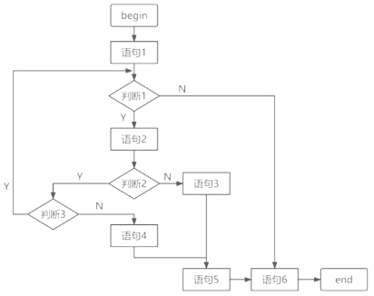

# 软件度量

## 最佳实践

### 考察问

1. McCabe方法
    1. 可能路径是`()`
    2. 复杂度是`()`+`()`
2. 软件源码复杂度度量方法主要有三种

    - `代码行`方法：是一种最简单的方法，该方法认为，`()`越多，软件越容易产生漏洞。
    - `Helstead` 方法：思路是根据程序中可执行代码行的`()`和`()`的数量来计算程序的复杂性。操作符和操作数的量越大，程序结构就越复杂。 
    - `McCabe` 方法：`()`复杂度用来定量度量程序的逻辑复杂度。

### 考察点

1. McCabe方法
    1. 可能路径是`走到终点的路径的个数`
    2. 复杂度是`封闭空间数`+`1`
2. 软件源码复杂度度量方法主要有三种

    - `代码行`方法：是一种最简单的方法，该方法认为，`代码行`越多，软件越容易产生漏洞。
    - `Helstead` 方法：思路是根据程序中可执行代码行的`操作符`和`操作数`的数量来计算程序的复杂性。操作符和操作数的量越大，程序结构就越复杂。 
    - `McCabe` 方法：`环路`复杂度用来定量度量程序的逻辑复杂度。

## 软件度量
软件的两种属性：外部属性指面向管理者和用户的属性，可直接测量，一般为性能指标。内部属性指软件产品本身的属性，如可靠性等，只能间接测量。

软件度量用于对产品及开发产品的过程进行度量，如成本、效益、开发人员的生产率、可靠性、可维护性等。

软件源码复杂度度量方法主要有三种：代码行、Helstead 方法、McCabe 方法(环形复杂度)。

- 代码行方法：是一种最简单的方法，该方法认为，代码行越多，软件越容易产生漏洞。
- Helstead 方法：思路是根据程序中可执行代码行的操作符和操作数的数量来计算程序的复杂性。操作符和操作数的量越大，程序结构就越复杂。 
- McCabe 方法：环路复杂度用来定量度量程序的逻辑复杂度。

🔒问题
2. 软件复杂性度量中，()可以反映原代码结构的复杂度。

    - A. 模块数  
    - B. 环路数  
    - C. 用户数  
    - D. 对象数

    参考答案： B

## McCabe

软件复杂性度量是指理解和处理软件的难易程度。典型的程序复杂性度量是McCabe环路复杂性度量。

McCabe度量法是一种基于程序控制流的环路复杂性度量方法，以图论为工具，先画出程序图(退化的程序流程图)，然后用该图的环路数作为程序复杂性的度量值。 

- 在一个强连通的有向图$G$中，环的个数$V(G)$由以下公式给出：

    $V(G) = m - n + 2p$

    其中，$V(G)$是有向图$G$中的环路数，$m$是图$G$中弧的个数，$n$是图$G$中的结点数，$p$是$G$中的强连通分量个数。

- McCabe环路复杂性度量定量给出了程序的逻辑复杂度，还可以用下述3种方法中的任何一种来计算环路复杂度：
    1. 程序图$G$中的区域数等于环路复杂度(封闭区域数 + 1(一个非封闭区域))。
    2. 程序图$G$的环形复杂度$V(G)=E - N + 2$，其中，$E$是程序图中边的条数，$N$是结点数。 
    3. 程序图$G$的环形复杂度$V(G)=P + 1$，其中，$P$是程序图中判定结点(有2条输出弧)的数目。有$n$($n>2$)条输出弧的判定结点对应程序中的$n - 1$个判断。 

    

🔒题目

1. 以下流程图中，至少需要______个测试用例才能覆盖所有路径。采用McCabe方法计算程序复杂度为______。
    

    - A.3 
    - B.4 
    - C.5 
    - D.6
    
    - A.2 
    - B.3 
    - C.4 
    - D.5

    答案：B C, 图中所有可能的路径为4条。程序图G的环路复杂度等于封闭区域数+1，即3+1=4。

