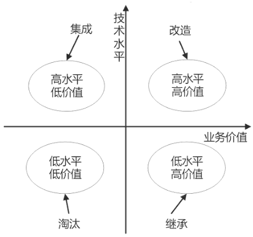
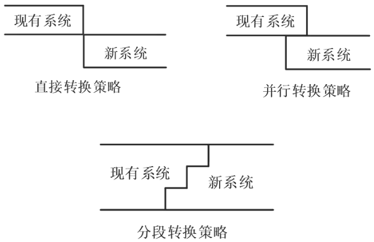

# 软件维护

## 考察问

1. 🔴🟨❤️遗留系统的处理:纵坐标`()`, 横坐标`()`. 13象限`()`和`()`, 24象限`()`和`()`. 记忆技巧, 继承在下方一般都在下方, 对角是集成音相似. 淘汰好记.

## 考察点

1. 遗留系统的处理:纵坐标`技术`, 横坐标`业务`. 13象限`改造`和`淘汰`, 24象限`集成`和`继承`. 记忆技巧, 继承在下方一般都在下方, 对角是集成音相似. 淘汰好记.

## 遗留系统

遗留系统（Legacy System）是指任何基本上不能进行修改和演化以满足新的变化了的业务需求的信息系统。遗留系统的特点：

1. 系统虽然完成企业中许多重要的业务管理工作，但仍不能完全满足要求。一般实现业务处理电子化及部分企业管理功能，很少涉及经营决策。
2. 系统在性能上已经落后，采用的技术已经过时。例如，软件使用汇编语言或第三代程序设计语言的早期版本开发，使用文件系统而不是数据库。
3. 通常是大型的软件系统，已经融入企业的业务运作和决策管理机制之中，维护工作十分困难。
4. 没有使用现代信息系统建设方法进行管理和开发，现在基本上已经没有文档，很难理解。

✨纵坐标技术, 横坐标业务. 13象限改造和淘汰, 24象限集成和继承. 记忆技巧, 继承在下方一般都在下方, 对角是集成音相似. 淘汰好记.

🔒问题

1. 💛在对遗留系统进行评估时，对于技术含量较高、业务价值较低且仅能完成某个部门的业务管理的遗留系统，一般采用的遗留系统演化策略是（）策略。
    - A. 淘汰
    - B. 继承
    - C. 集成
    - D. 改造

    答案：C 

## 系统转换

- 系统转换是指新系统开发完毕，投入运行，取代现有系统的过程。新旧系统之间有三种转换方法：
  
    1. 直接转换。现有系统被新系统直接取代，风险很大，适用于新系统不复杂，或者现有系统已经不能使用的情况。优点是节省成本。

    2. 并行转换。新旧系统并行工作一段时间，新系统经过试运行后再取代旧系统。若新系统在试运行过程中有问题，也不影响现有系统的运行，风险极小，在试运行过程中还可以比较新旧系统的性能。适用于较复杂的大型系统。缺点是耗费人力和时间资源，难以控制两个系统间的数据转换。

    3. 分段转换。分期分批逐步转换，是直接转换和并行转换的结合。将大型系统分为多个子系统，依次试运行每个子系统，成熟一个子系统，就转换一个子系统。同样适用于大型项目，只是更耗时，而且现有旧系统和新系统间混合使用，需要协调好接口等问题。在新系统全部正式运行前，一部分一部分地替代旧系统。既保证了可靠性，又不至于费用太大。

    

- 数据转换与迁移：将数据从旧数据库迁移到新数据库中。有三种方法：系统切换前通过工具迁移、系统切换前采用手工录入、系统切换后通过新系统生成。

## 系统维护

系统维护是在软件已经交付使用之后为了改正错误或满足新的需求而修改软件的过程。系统的可维护性可以定义为维护人员理解、改正、改动和改进这个软件的难易程度。文档是软件可维护性的决定因素。

### 系统可维护性的评价指标

1. 可理解性：是指通过阅读源代码和相关文档，了解软件的功能和如何运行的容易程度。
2. 可测试性：是指验证软件程序正确的难易程度。可测试性好的软件，通常意味着软件设计简单，复杂性低。因为软件的复杂性越大，测试的难度也就越大。
3. 可修改性：是指修改软件的难易程度。
4. 可靠性：一个软件的可靠性越高，需要维护的概率就会越低。
5. 可移植性：是指将软件从一个环境移植到新的环境下正确运行的难易程度。

### 软件维护类型

1. 正确性维护：改正在系统开发阶段已发生而系统测试阶段尚未发现的错误。修正BUG、错误。
2. 适应性维护：使应用软件适应环境变化（外部环境、数据环境）而进行的修改。应变。
3. 完善性维护：为扩充功能和改善性能而进行的修改。占整个维护工作的50%~60%。新需求。
4. 预防性维护：为适应未来的软/硬环境的变化，应主动增加预防性的新功能，以使应用系统适应各类变化而不被淘汰。针对未来。

🔒题目

1. 💚软件的维护并不只是修正错误。为了满足用户提出的增加新功能、修改现有功能以及一般性的改进要求和建议，需要进行(  )，它是软件维护工作的主要部分；软件测试不可能揭露出旧系统中所有潜在的错误，所以这些程序在使用过程中还可能发生错误，诊断和更正这些错误的过程称为 (  )；为了改进软件未来的可维护性或可靠性，或者为了给未来的改进提供更好的基础而对软件进行修改，这类活动称为 (  ) 。
  
    - A. 完善性维护  B. 适应性维护  C. 预防性维护  D. 改正性维护
    - A. 完善性维护  B. 适应性维护  C. 预防性维护  D. 改正性维护
    - A. 完善性维护  B. 适应性维护  C. 预防性维护  D. 改正性维护

    答案: ADC
