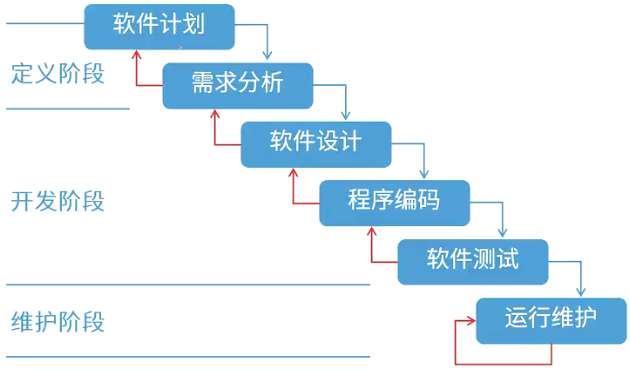
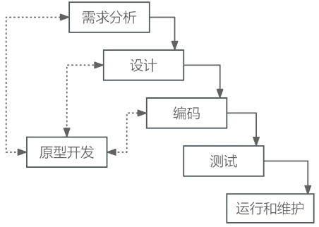
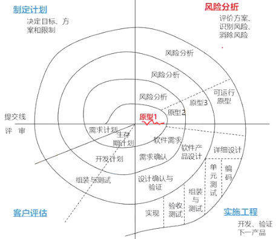
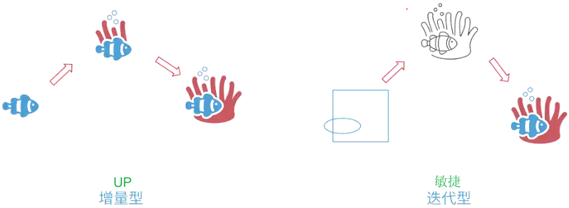
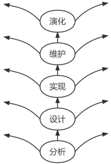
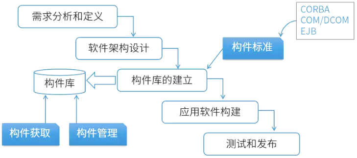
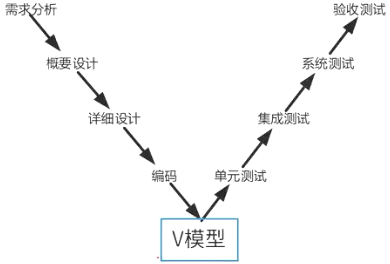
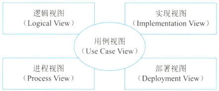

# 软件过程模型

## 最佳实践

### 考察问

🟡🟨💛软件过程(开发)模型:

1. 瀑布模型: 各阶段`()`, 适用于需求(明确/不明确), (大/小)项目, (有/无)风险分析
2. 原型模型: 快速构建原型交付, 需求(明确/不明确), (大/小)项目, (有/无)风险分析
3. 螺旋模型: 瀑布模型+原型模型, 需求(明确/不明确), (大/小)项目, (有/无)风险分析
4. 增量模型: 不断地()新功能
5. 敏捷模型: 不断`()`, 优化已有
6. 统一过程模型(RUP): `()`驱动、以`()`为中心的`()``()`开发模式
7. V模型: ()贯穿始终
8. 构件是可以独立部署的单元，通过复用构件可以提高软件的可靠性和易维护性。 

✨() = 瀑布 + 原型; () = 增量 + 敏捷

### 考察点

软件过程(开发)模型:

1. 瀑布模型: 各阶段`固定`, 适用于需求`明确`, `大`项目, `无`风险分析
2. 原型模型: 快速构建原型交付, 需求`不明确`, `小`项目, `无`风险分析
3. 螺旋模型: 瀑布模型+原型模型, 需求`不明确`, `大`项目, `有`风险分析
4. 增量模型: 不断地`增加`新功能
5. 敏捷模型: 不断`迭代`, 优化已有
6. 统一过程模型(RUP): `用例`驱动、以`架构`为中心的`迭代``增量`开发模式
7. V模型: `测试`贯穿始终
8. 构件是可以独立部署的单元，通过复用构件可以提高软件的可靠性和易维护性

✨螺旋 = 瀑布 + 原型; RUP = 增量 + 敏捷

## 软件过程模型概念

软件过程模型习惯上称为`软件开发模型`，它是软件开发全部过程、活动和任务的结构框架。典型的软件过程模型有瀑布模型、增量模型、演化模型（原型模型、螺旋模型）、喷泉模型、基于构件的开发模型、形式化方法模型和统一过程模型等。

## 瀑布模型(Waterfall Model)

瀑布模型将软件生命周期中的各个活动规定为依据线性顺序连接的若干阶段的模型，包括需求分析、设计、编码、测试、运行与维护。如同瀑布流水逐级下落。瀑布模型以项目的阶段性评审和文档控制为手段有效地对整个开发过程进行指导，所以它是以文档作为驱动、适合软件需求很明确的软件项目的开发。

优点：容易理解、成本低、强调开发的阶段性早期计划及需求调查和产品测试。

缺点：客户必须能完整、正确和清晰地表达需求；难以评估项目进度状态；项目快结束时，出现大量的集成与测试工作；需求或设计的错误往往只有到了项目后期才能被发现，对项目风险的控制能力较弱，通常会导致项目延期，开发费用超出预算。

## 原型模型（Prototype Model）

原型模型（Prototype Model），又称快速原型模型，通过快速构建原型并交付用户使用，收集客户反馈意见，目的是明确当前系统的需求。原型模型适用于用户需求不明确、需求经常变化且系统规模不太大、不太复杂的软件项目。原型应该具备以下特点：

1. 实际可行
2. 具有最终系统的基本特征
3. 构造方便、快速，造价低。原型法的特点在于原型法对用户的需求是动态响应、逐步纳入的

## 螺旋模型型（SpiralModel）

螺旋模型型（Spiral Model），是在快速原型的基础上扩展而成。对于一个复杂的大项目，开发一个原型往往达不到要求。

螺旋模型将生命周期模型（瀑布模型）和原型模型结合起来，加入两种模型均忽略的风险分析。

螺旋模型中的每个螺旋周期分为四个步骤：目标设定、风险分析、开发和有效性验证和评审。

螺旋模型强调风险分析，与瀑布模型相比，支持用户需求的动态变化。

螺旋模型适合用于庞大、复杂且具有高风险的系统。

## 增量模型(Incremental Model)

增量模型将需求分段为一系列产品，每一个增量都可以分别开发。

优点：第一个可交付的版本成本和时间很少；降低了适应用户需求变更的成本；具有瀑布模型所有的优点。

缺点：若没有对用户的变更要求进行规划，那么产生的初始增量可能会造成后来增量的不稳定；由于并不是从系统整体角度规划各个模块，因此不利于模块划分。难点在于如何将客户需求划分为多个增量。与原型不同的是增量模型的每一次增量版本都可作为独立可操作的产品，而原型的构建一般是为了演示。

## 敏捷模型(Agile Model)

### 敏捷开发宣言

个体和交互胜过过程和工具、可以工作的软件胜过面面俱到的文档、客户合作胜过合同谈判、响应变化胜过遵循计划。

### 敏捷方法的特点

1. 是“适应性”而非“预设性”。
2. 是“面向人的”而非“面向过程的”。

12条过程实践规则:

1. 简单设计
2. 测试驱动
3. 代码重构
4. 结对编程
5. 持续集成
6. 现场客户
7. 发行版本小型化
8. 系统隐喻
9. 代码集体所有制
10. 规划策略
11. 规范代码
12. 40小时工作机制

## 敏捷方法的核心思想

1. 敏捷方法是适应型，而非可预测型。拥抱变化，适应变化。
2. 敏捷方法是以人为本，而非以过程为本。发挥人的特性。
3. 迭代增量式的开发过程。以原型开发思想为基础，采用迭代增量式开发，发行版本小型化。

## 主要的敏捷方法

1. 极限编程（XP）：四大价值观：交流、朴素、反馈和勇气。即任何一个软件项目都可以从4个方面入手进行改善：加强交流；从简单做起；寻求反馈；勇于实事求是。
2. 水晶法（Crystal）：与XP方法一样，都有以人为中心的理念，但在实践上有所不同。其目的是发展一种提倡“机动性的”方法，包含具有共性的核心元素，每个都含有独特的角色、过程模式、工作产品和实践。
3. 并列争球法（Scrum）：一种迭代的增量化过程，把每段时间(如30天)一次的迭代称为一个“冲刺”(Sprint)，并按需求的优先级别来实现产品，多个自组织和自治的小组并行地递增实现产品。
4. 特征驱动开发方法（FDD）：是一个迭代的开发模型。FDD认为有效的软件开发需要3个要素：人、过程和技术。FDD有5个核心过程：开发整体对象模型，构造特征列表、计划特征开发、特征设计和特征构建。
5. 开放式源码：程序开发人员地域分布广泛，区别于其他强调集中办公的方法。
6. ASD方法：核心是猜测、合作与学习三个非线性且重叠的开发阶段 。

🔒题目:

1. 💛下列关于敏捷方法的叙述中，错误的是（  ）。

    - A.与传统方法相比，敏捷方法比较适合需求变化大或者开发前期对需求不是很清晰的项目
    - B.敏捷方法尤其适合于开发团队比较庞大的项目
    - C.敏捷方法的思想是适应性，而不是预设性
    - D.敏捷方法以原型开发思想为基础，采用迭代式增量开发

    答案: B

2. ❤️（  ）适用于程序开发人员在地域上分布很广的开发团队。（  ）中，编程开发人员分成首席程序员和“类”程序员。
    - A.水晶系列（Crystal）开发方法
    - B.开放式源码（Open source）开发方法
    - C.SCRUM开发方法
    - D.功用驱动开发方法（FDD）

    - A.自适应软件开发（ASD）
    - B.极限编程（XP）开发方法
    - C.开放统一过程开发方法（Open UP）
    - D.功用驱动开发方法（FDD）

    答案: BD

3. 💚以下关于软件敏捷开发方法的核心思想说法错误的是(  )。

    - A.敏捷方法遵循迭代增量式开发过程
    - B.敏捷方法以原型开发思想为基础
    - C.敏捷方法是适应型、可预测型
    - D.敏捷方法以人为本而非以过程为本

    答案：C

## 喷泉模型(Fountain Model)

喷泉模型是以用户需求为动力、以对象为驱动的模型，适用于面向对象的开发方法。它克服了瀑布模型不支持软件重用和多项开发活动集成的局限性。喷泉模型使开发过程具有迭代性和无间隙性。

优点：各个阶段没有明显的界线，开发人员可以同步进行；可以提高软件项目的开发效率，节省开发时间。迭代, 无间隙

缺点：由于在各个开发阶段是重叠的，在开发过程中需要大量的开发人员，不利于项目的管理；要求严格管理文档，使得审核的难度加大。

## 基于构件的软件模型(Component-based Software Model)

基于构件的开发模型是指利用预先包装的构件来构造应用系统。构件可以是组织内部开发的构件，也可以是商品化成品软件构件。特点是增强了复用性，在系统开发过程中，会构建一个构件库，供其他系统复用，因此可以提高可靠性，节省时间和成本。

构件是面向软件体系架构的可复用软件模块。构件（component）是可复用的软件组成成份，可被用来构造其他软件。它可以是被封装的对象类、功能模块、软件框架（framework）、软件构架、文档、设计模式等。

## 形式化方法模型(Formal Methods Model)

形式化方法是建立在严格数学基础上的一种软件开发方法，主要活动是生成计算机软件形式化的数学规格说明。

## V模型(V-Model)

测试贯穿始终

## 统一过程模型(Rational Unified Process, RUP)

统一过程模型RUP描述了如何有效地利用商业的、可靠的方法开发和部署软件，是一种重量级过程。RUP类似一个在线的指导者，它可以为所有方面和层次的程序开发提供指导方针、模版以及事例支持。

### RUP的生命周期

RUP软件开发生命周期是一个二维的软件开发模型，RUP中有9个核心工作流，这9个核心工作流如下。

- 业务建模(Business Modeling)：理解待开发系统所在的机构及其商业运作，确保所有参与人员对待开发系统所在的机构有共同的认识，评估待开发系统对所在机构的影响。
- 需求(Requirements)：定义系统功能及用户界面，使客户知道系统的功能，使开发人员理解系统的需求，为项目预算及计划提供基础。
- 分析与设计(Analysis & Design)：把需求分析的结果转化为分析与设计模型。
- 实现(Implementation)：把设计模型转换为实现结果，对开发的代码做单元测试，将不同实现人员开发的模块集成为可执行系统。
- 测试(Test)：检查各子系统之间的交互、集成，验证所有需求是否均被正确实现，对发现的软件质量上的缺陷进行归档，对软件质量提出改进建议。
- 部署(Deployment)：打包、分发、安装软件，升级旧系统；培训用户及销售人员，并提供技术支持。
- 配置与变更管理(Configuration & Change Management)：跟踪并维护系统开发过程中产生的所有制品的完整性和一致性。
- 项目管理(Project Management)：为软件开发项目提供计划、人员分配、执行、监控等方面的指导，为风险管理提供框架。
- 环境(Environment)：为软件开发机构提供软件开发环境，即提供过程管理和工具的支持。

统一过程模型RUP把软件开发生命周期划分为多个循环，每个循环生成产品的一个新的版本，每个循环依次由4个连续的阶段组成，每个阶段完成确定的任务。这4个阶段如下：

1. 初始阶段：定义最终产品视图和业务模型，并确定系统范围。
2. 细化阶段：设计及确定系统的体系结构，制订工作计划及资源要求。
3. 构造阶段：构造产品并继续演进需求、体系结构、计划直至产品提交。
4. 移交阶段：把产品提交给用户使用。

### RUP中的核心概念

RUP中定义了如下一些核心概念，理解这些概念对于理解RUP很有帮助。

1. 角色（Role）：Who的问题。角色描述某个人或一个小组的行为与职责。RUP预先定义了很多角色，如体系结构师（Architect ）、设计人员（Designer）、实现人员(Implementer) 、测试员（tester）和配置管理人员（Configuration Manager）等，并对 每一个角色的工作和职责都做了详尽的说明。
2. 活动（Activity）：How的问题。活动是一个有明确目的的独立工作单元。
3. 制品（Artifact）：What的问题。制品是活动生成、创建或修改的一段信息。也有些书把Artifact翻译为产品、工件等，和制品的意思差不多。
4. 工作流（Workflow）：When的问题。工作流描述了一个有意义的连续的活动序列，每个工作流产生一些有价值的产品，并显示了角色之间的关系。

### RUP的特点

RUP是用例驱动、以体系结构为中心、迭代和增量的软件开发过程。其特点为：

1. 用例驱动：需求分析、设计、实现和测试等活动都是用例驱动的。
2. 以体系结构为中心：包括系统的总体组织和全局控制、通信协议等。是一个多维的结构，会采用多个视图来描述。在典型的4+1视图模型中：
    1. 分析人员和测试人员关心的是系统的行为，会侧重于用例视图；
    2. 最终用户关心的是系统的功能，会侧重于逻辑视图；
    3. 程序员关心的是系统的配置、装配等问题，会侧重于实现视图；
    4. 系统集成人员关心的是系统的性能、可伸缩性、吞吐率等问题，会侧重于进程视图；
    5. 系统工程师关心的是系统的发布、安装、拓扑结构等问题，会侧重于部署视图。

    

3. 迭代与增量。把整个项目开发分为多个迭代过程。在每次选代中，只考虑系统的一部分需求，进行分析、设计、实现、测试和部署等过程；每次迭代是在已完成部分的基础上进行的，每次增加一些新的功能实现，以此进行下去，直至最后项目的完成。

🔒题目:

1. 🟡RUP（Rational Unified Process）软件开发生命周期是一个二维的软件开发模型，其中，RUP的9个核心工作流中不包括(  )。

    - A.业务建模
    - B.配置与变更管理
    - C.成本
    - D.环境

    答案：C

## 🔒题目

1. 🟡(  )把整个软件开发流程分成多个阶段，每一个阶段都由目标设定、风险分析、开发和有效性验证以及评审构成。
    - A. 原型模型
    - B. 瀑布模型
    - C. 螺旋模型
    - D. V模型

    答案: C

2. ❤️基于RUP的软件过程是一个迭代过程。一个开发周期包括初始、细化、构建和移交四个阶段，每次通过这四个阶段就会产生一代软件，其中建立完善的架构是（   ）阶段的任务。采用迭代式开发，（  ）。

    - A 初始
    - B 细化
    - C 构建
    - D 移交

    - A 在每一轮迭代中都要进行测试与集成
    - B 每一轮迭代的重点是对特定的用例进行部分实现
    - C 在后续迭代中强调用户的主动参与
    - D 通常以功能分解为基础

    答案: BA

3. ❤️与瀑布模型相比，(  )降低了实现需求变更的成本，更容易得到客户对于已完成开发工作的反馈意见，并且客户可以更早地使用软件并从中获得价值。

    - A.快速原型模型
    - B.敏捷开发
    - C.增量式开发
    - D.智能模型

    答案：C

4. ❤️应用系统开发中可以采用不同的开发模型，其中，() 将整个开发流程分为目标设定、风险分析、开发和有效性验证、评审四个部分；()则通过重用来提高软件的可靠性和易维护性，程序在进行修改时产生较少的副作用。
    - A. 瀑布模型
    - B. 螺旋模型
    - C. 构件模型
    - D. 对象模型

    - A. 瀑布模型
    - B. 螺旋模型
    - C. 构件模型
    - D. 对象模型

    答案：B C答案解析：常见的软件开发模型有瀑布模型、演化模型、原型模型、螺旋模型、喷泉模型、V模型和基于可重用构件的模型、RAD模型、统一过程、敏捷方法等。螺旋模型将整个开发流程分为目标设定、风险分析、开发和有效性验证、评审四个过程；构件是可以独立部署的单元，通过复用构件可以提高软件的可靠性和易维护性。 