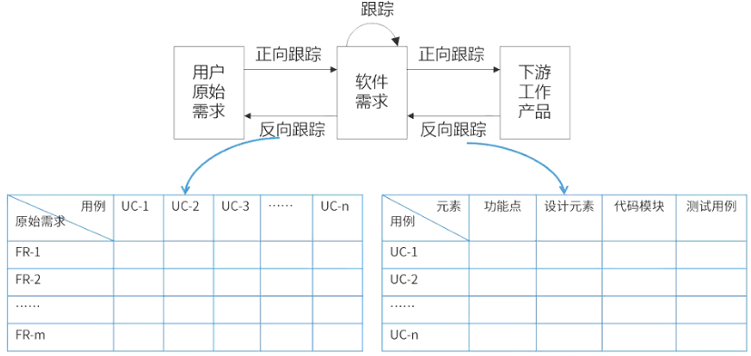

# 需求工程

## 最佳实践

### 考察问

1. 🟡🟩💚需求定义
    1. 严格定义法: `()`需求都能够被预先定义。
    2. 原型法: `()`的需求都能在开发前被准确的说明。
2. 🟡🟩❤️需求工程的5个阶段
    1. 需求`()`
    2. 需求`()`
    3. 需求`()`
    4. 需求`()`
    5. 需求`()`(变更控制、版本控制、需求跟踪、需求状态跟踪，需求管理是对需求基线进行管理)
3. 零碎知识
    1. 软件需求开发的最终文档经过评审批准后，就定义了开发工作的`()`, 它在客户和开发者之间构筑了产品功能需求和非功能需求的一个`()`，是需求开发和需求管理之间的桥梁。
    2. `()`包括编制`每个需求`同`系统元素`之间的联系文档，这些元素包括其他需求、体系结构、其他设计部件、源代码模块、测试、帮助文件和文档等。

### 考察点

1. 需求定义
    1. 严格定义法: `所有`需求都能够被预先定义。
    2. 原型法: `并非所有`的需求都能在开发前被准确的说明。
2. 需求工程的5个阶段
    1. 需求`获取`
    2. 需求`分析`
    3. 需求`规格`
    4. 需求`确认与验证`
    5. 需求`管理`(变更控制、版本控制、需求跟踪、需求状态跟踪，需求管理是对需求基线进行管理)

    ✨获取, 分析, 文档(规格), 确认, 管理

3. 零碎知识

    1. 软件需求开发的最终文档经过评审批准后，就定义了开发工作的`需求基线`, 它在客户和开发者之间构筑了产品功能需求和非功能需求的一个`需求约定`，是需求开发和需求管理之间的桥梁。
    2. `需求跟踪`包括编制每个`需求`同`系统元素`之间的联系文档，这些元素包括其他需求、体系结构、其他设计部件、源代码模块、测试、帮助文件和文档等。
    

## 软件需求

软件需求是指用户对系统在功能、行为、性能、设计约束等方面的期望。是指用户解决问题或达到目标所需的条件或能力，是系统或系统部件要满足合同、标准、规范或其他正式规定文档所需具有的条件或能力，以及反映这些条件或能力的文档说明。

## 需求的定义

- 严格定义法：
    - 所有需求都能够被预先定义。
    - 开发人员与用户之间能够准确而清晰地交流。
    - 采用图形/文字可以充分体现最终系统。
- 原型法：
    - 并非所有的需求都能在开发前被准确的说明。
    - 项目参加者之间通常都存在交流上的困难。
    - 需要实际的、可供用户参与的系统模型。
    - 有合适的系统开发环境。
    - 反复是完全需要和值得提倡的，需求一旦确定，就应遵从严格的方法。 

🔒问题

1. 💚通常有两种常用的需求定义方法：严格定义方法和原型方法。下述的各种假设条件中，“（  ）”不适合使用严格定义方法进行需求定义。

- A. 所有需求都能够被预先定义
- B. 开发人员与用户之间能够准确而清晰地交流
- C. 需求不能在系统开发前被完全准确地说明
- D. 采用图形（或文字）充分体现最终系统

答案: C

## 软件需求的不同的层次

软件需求包括3个不同的层次：

1. 业务需求：反映了组织机构或客户对系统高层次的目标要求，通常来自项目投资人、客户、市场营销部门或产品策划部门。通过业务需求可以确定项目视图和范围。
2. 用户需求：描述了用户使用产品必须要完成的任务，是用户对该软件产品的期望。通常采取用户访谈和问卷调查等方式，对用户使用的场景进行整理，从而建立用户需求。 按期望程度分（QFD ）：

    1. 基本需求（明示，常规需求）
    2. 期望需求（隐含）
    3. 兴奋需求（多余）

3. 系统需求：定义了开发人员必须实现的软件功能，使得用户能完成他们的任务，从而满足业务需求。是从系统的角度来说明软件的需求，包括功能需求、非功能需求和设计约束等。

    1. 功能需求：也称为行为需求，规定了开发人员必须在系统中实现的软件功能，用户利用这些功能来完成任务，满足业务需要。
    2. 非功能需求：指系统必须具备的属性或品质，又可以细分为软件质量属性(如可维护性、可靠性、效率等)和其他非功能需求。
    3. 设计约束：也称为限制条件或补充规约，通常是对系统的一些约束说明，例如必须采用国有自主知识产权的数据库系统，必须运行在UNIX操作系统之下等。

## 需求工程概念

需求工程（Requirement Engineering，RE）是指应用已证实有效的原理、方法，通过合适的工具和记号，系统地描述待开发系统及其行为特征和相关约束。

需求工程的活动包括5个阶段：

1. 需求获取
2. 需求分析
3. 形成需求规格，形成软件需求规格说明书SRS。
4. 需求确认与验证，形成需求基线（经过评审的SRS）。 
5. 需求管理，包括变更控制、版本控制、需求跟踪、需求状态跟踪，需求管理是对需求基线进行管理。 

🔒问题

1. 💛下列关于软件需求管理或需求开发的叙述中，正确的是（  ）。

    - A. 所谓需求管理是指对需求开发的管理
    - B. 需求管理包括：需求获取、需求分析、需求定义和需求验证
    - C. 需求开发是将用户需求转化为应用系统成果的过程
    - D. 在需求管理中，要求维持对用户原始需求和所有产品构件需求的双向跟踪

    答案: D, 需求管理包括需求开发管理, 还包括需求变更管理、需求跟踪等其他活动

### 需求获取

需求获取是开发者、用户之间为了定义新系统而进行的交流，需求获取是获得系统必要的特征，或者是获得用户能接受的、系统必须满足的约束。常见的需求获取方法：

|方法|特点|
| ---- | ---- |
|用户面谈|是理解用户需求最有效的方法。1对1 - 3个有代表性的用户，了解其主观想法，成本高，需要有领域知识支撑|
|需求专题讨论会|在短暂而紧凑的时间段内将相关涉众集中在一起集体讨论，与会者可以在应用需求上达成共识，对操作过程尽快取得统一的意见|
|问卷调查|适用于用户多，无法一一访谈，成本低|
|现场观察|针对较为复杂的流程和操作，全面了解需求细节|
|原型化方法（情节串联板）|通过开发系统原型以及与用户的多次迭代反馈，解决在早期阶段需求不确定的问题|
|头脑风暴法|针对新业务，一群人发散思维，不断产生新的观点，从而确定具体的需求|
|抽样调查/采样|从种群中系统地选出有代表性的样本集的过程。样本数量=0.25*(可信度因子/错误率)²|
|联合需求计划(JRP)|通过联合各个关键用户代表、系统分析师、开发团队代表一起，通过有组织的会议来讨论需求| 

### 需求的验证

1. 需求评审
2. 需求测试(设计场景和用例, 假设验证)

### 需求变更

1. 变更控制过程

    变更控制过程用来跟踪已建议变更的状态，需求变更管理过程如下：
    1. `问题分析和变更描述`：当提出一份变更提议后，需要对该提议做进一步的问题分析，检查它的有效性，从而产生一个更明确的需求变更提议。
    2. `变更分析和成本计算`：当接受该变更提议后，需要对需求变更提议进行影响分析和评估。 
    3. `变更实现`：当确定执行该变更后，需要根据该变更的影响范围，按照开发的过程模型执行相应的变更。 

2. 常见的需求变更策略
    1. 所有需求变更必须遵循变更控制过程。
    2. 对于未获得批准的变更，不应该做设计和实现工作。
    3. 变更应该由项目变更控制委员会（CCB）决定实现哪些变更。
    4. 项目风险承担者应该能够了解变更的内容。
    5. 绝不能从项目配置库中删除或者修改变更请求的原始文档。
    6. 每一个集成的需求变更必须能跟踪到一个经核准的变更请求，以保持水平可追踪性。

3. 变更控制委员会

    变更控制委员会（Change Control Board, CCB）是项目所有者权益代表，负责裁定接受哪些变更。CCB是决策机构，不是作业机构。 

🔒问题

1. ❤️需求变更管理是需求管理的重要内容。需求变更管理的过程主要包括问题分析和变更描述、（  ）、变更实现。具体来说，在关于需求变更管理的描述中，（  ）是不正确的 。

    - A. 变更调研
    - B. 变更判定
    - C. 变更定义
    - D. 变更分析和成本计算

    - A. 需求变更要进行控制，严格防止因失控而导致项目混乱，出现重大风险
    - B. 需求变更对软件项目开发有利无弊
    - C. 需求变更通常按特定的流程进行
    - D. 在需求变更中，变更审批由CCB负责审批 

    答案: DB

### 需求状态管理

### 需求跟踪

1. 需求跟踪包括编制每个需求同系统元素之间的联系文档，这些元素包括其他需求、体系结构、其他设计部件、源代码模块、测试、帮助文件和文档等。

2. 需求跟踪有两种方式：
    - 正向跟踪。是指检查《产品需求规格说明书》（SRS）中的每个需求是否都能在后继工作成果中找到对应点。
    - 反向跟踪。也称为逆向跟踪，是指检查设计文档、代码、测试用例等工作成果是否都能在《产品需求规格说明书》SRS中找到出处。 

## 🔒问题

1. 💛软件需求开发的最终文档经过评审批准后，就定义了开发工作的(), 它在客户和开发者之间构筑了产品功能需求和非功能需求的一个()，是需求开发和需求管理之间的桥梁。
    - A. 需求基线
    - B. 需求标准
    - C. 需求用例
    - D. 需求分析

    - A. 需求用例
    - B. 需求管理标准
    - C. 需求约定
    - D. 需求变更

    答案：A C, 软件需求开发的最终文档经过评审批准后，则定义了开发工作的需求基线（baseline）。这个基线在客户和开发者之间构筑了计划产品功能需求和非功能需求的一个约定（agreement）。需求约定是需求开发和需求管理之间的桥梁。