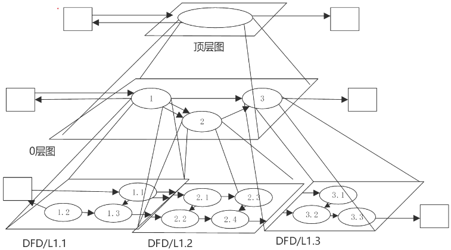

# 系统分析与设计

## 最佳实践

### 考察问

1. 🔴🟩💛数据流图(DFD)

    1. 数据流图的元素
        1. `()`: 箭头, 数据存储(读写), 外部实体(输入输出), 加工(进出对应)
        2. `()`: 圆形或圆角矩形, 表示对数据操作. 根据输入输出流的对应关系, 可分为黑洞, 奇迹, 灰洞.
        3. `()`: 双横线, 缓存文件, 和数据存储相关的数据流表示读写, 可以没有名字
        4. `()`: 矩形, 系统外的人员或组织, 和外部实体相关的数据流, 表示输入输出
    2. ❤️数据流的层次结构
        1. `()`: `()`个加工, 描述了`()`与`()`的数据流。
        2. `()`: `()`中的加工经`()`的图称为0层图。
    3. 数据流图的平衡原则:
        1. `()`平衡: 子图`()`上的输入输出数据流必须与其父中对应`()`的输入输出数据流保持`一致`。
        2. `()`平衡: 对于图内的每一个`()`，要求既要有`()`数据流，也要有`()`数据流，避免出现黑洞、奇迹、灰洞。
2. 🔴🟩💛数据字典(DD): 为`()`中的每个数据流、文件、加工，以及组成数据流或文件的数据项`()`。

### 考察点

1. 数据流图(DFD)

    1. 数据流图的元素
        1. `数据流`: 箭头, 数据存储(读写), 外部实体(输入输出), 加工(进出对应)
        2. `加工`: 圆形或圆角矩形, 表示对数据操作. 根据输入输出流的对应关系, 可分为黑洞, 奇迹, 灰洞.
        3. `数据存储`: 双横线, 缓存文件, 和数据存储相关的数据流表示读写, 可以没有名字
        4. `外部实体`: 矩形, 系统外的人员或组织, 和外部实体相关的数据流, 表示输入输出
    2. 数据流的层次结构
        1. `顶层图`: 只有`一个`加工, 描述了`软件系统`与`外部实体`的数据流。
        2. `0层图`: `顶层图`中的加工经`分解后`的图称为0层图。
    3. 数据流图的平衡原则:
        1. `父图与子图`的平衡: 子图`边界`上的`输入/输出`数据流必须与其`父图`中对应`加工`的`输入/输出`数据流保持`一致`。
        2. `子图内`平衡: 对于图内的每一个`加工`，要求既要有`输入`数据流，也要有`输出`数据流，避免出现黑洞、奇迹、灰洞。根
2. 数据字典(DD): 为`数据流图`中的每个数据流、文件、加工，以及组成数据流或文件的数据项`做出说明`。

## 系统分析

系统分析阶段基本任务是系统分析师和用户在充分了解用户需求的基础上，把双方对新系统的理解表达为`系统需求规格说明书`。

## 结构化分析

结构化开发方法也称面向数据流或功能的开发方法，包括结构化分析（Structured Analysis, SA）、结构化设计（Structured Design, SD）和结构化编程（Structured Programming, SP）。结构化方法总的指导思想是自顶向下、逐层分解，它的基本原则是功能的分解与抽象。

结构化分析方法（Structured Analysis, SA）给出一组帮助系统分析人员产生功能规约的原理与技术。主包包括数据流图、数据字典、结构化语言、判定表以及判定树等。使用三大模型：功能模型(数据流图)、行为模型(状态转换图)、数据模型(E-R图)以及数据字典。

## 数据流图(Data Flow Diagram, DFD)

数据流图的元素

|元素|说明|图例|
| ---- | ---- | ---- |
|数据流|从一个加工流向另一个加工；从加工流向数据存储(写)；从数据存储流向加工(读)；从外部实体流向加工(输入)；从加工流向外部实体(输出)|箭头|
|加工|描述了输入数据流到输出数据流之间的变换. “黑洞”：加工有输入但没输出。“奇迹”：加工没输入但有输出；“灰洞”：加工输入不足以产生输出。|圆形或圆角矩形|
|外部实体|指存在于软件系统外的人员或组织|矩形|
|数据存储（文件）|用来表示暂时存储的数据。流向文件的数据流表示写文件，流出的表示读文件|双横线|

数据流图的层次结构

一个复杂的软件系统可能涉及上百个加工或数据流，过于复杂且不易理解。于是根据`自顶向下逐层分解`的思想，将数据流图进行分层。

1. 顶层图

    `顶层图`也称上下文数据流图，只有`一个加工`，代表整个软件系统，该加工描述了`软件系统`与`外部实体`的数据流。

2. 0层图

    顶层图中的加工(即系统)经分解后的图称为0层图。

    
    

数据流图的`平衡原则`:

- `父图与子图`之间的`平衡`: 指任何一张DFD子图边界上的输入/输出数据流必须与其父图中对应加工的输入/输出数据流保持一致。
- `子图内`平衡: 对于图内的每一个`加工`，要求既要有`输入`数据流，也要有`输出`数据流，避免出现黑洞、奇迹、灰洞。根数据流相关原则: 数据流必须与加工有关。外部实体与外部实体之间不存在数据流；外部实体与数据存储之间不存在数据流；数据存储与数据存储之间不存在数据流。

## 数据字典(Data Dictionary, DD)

1. 相关概念

    为`数据流图`中的每个数据流、文件、加工，以及组成数据流或文件的数据项`做出说明`。

    |符号|含义|举例说明|
    | ---- | ---- | ---- |
    |`=`|被定义为| |
    |`+`|与|`x=a+b`，表示x由a和b组成|
    |`[……]或[…\|…]`|或|`x=[a,b]，x=[a\|b]`，表示由a或b组成|
    |`{…}`|重复|`x={a}`，表示x由0个或多个a组成|
    |`(…)`|可选|`x=(a)`，表示a可在x中出现，也可以不出现|

    举例：
    - 机票=姓名+日期+航班号+起点+终点+费用
    - 终点=[上海\|深圳\|北京]

2. 数据字典的内容

    数据字典的4类条目：数据流、数据项、数据存储、基本加工。

3. 加工逻辑描述（加工规格说明）

    在数据流图的分解中，位于层次树最低层的加工也称为基本加工或原子加工，每一个基本加工都需要进一步说明，这称为加工规格说明。

    在编写基本加工的规格说明时，主要目的是表达“做什么”而不是“怎么做”。
    
    常用的加工逻辑描述方法（加工规格说明）有结构化语言、判定表（决策表）和判定树（决策树）三种。

## 状态转换(State Transition Diagram, STD)

## 🔒问题

1. 🟡在结构化分析方法中，用（  ）表示功能模型，用（  ）表示行为模型。

- A. ER图
- B. 用例图
- C. DFD
- D. 对象图

- A. 通信图
- B. 顺序图
- C. 活动图
- D. 状态转换图

答案: CD

2. 信息建模方法是从数据的角度对现实世界建立模型，模型是现实系统的一个抽象，信息建模方法的基本工具是()。
    - A. 流程图
    - B. 实体联系图
    - C. 数据流图
    - D. 数据字典

    参考答案：B
    答案解析：业务流程图（TFD）是分析和描述现有系统的传统工具，是业务流程调查结果的图形化表示。实体联系图（E-R图）它是描述概念世界，建立概念模型的实用工具。
    数据流图（DFD）是表达系统内数据的流动并通过数据流描述系统功能的一种方法。
    数据字典（DD）是在DFD的基础上，对DFD中出现的所有命名元素都加以定义，使得每个图形元素的名字都有一个确切的解释。 

1. 煤炭生产是国民经济发展的主要领域之一，其煤矿的安全非常重要。某能源企业拟开发一套煤矿建设项目安全预警系统，以保护煤矿建设项目从业人员生命安全。本系统的主要功能包括如下(a)~(h)所述。

    (a)项目信息维护
    (b)影响因素录入
    (c)关联事故录入
    (d)安全评价得分
    (e)项目指标预警分析
    (f)项目指标填报
    (g)项目指标审核
    (h)项目指标确认

    1. (9分)王工根据煤矿建设项目安全预警系统的功能要求，设计完成了系统的数据流图，如图所示。请使用题干中描述的功能(a)~(h)，补充完善空(1)~(6)处的内容，并简要介绍数据流图在分层细化过程中遵循的数据平衡原则。(2022下)

        

        (1)f(2)g(3)h(4)d(5)b(6)e

        数据流图在分层细化过程中遵循的数据平衡原则包括：
        1. 层间平衡：子图的输入/输出数据流必须与父图中对应加工的输入/输出数据流一致。
        2. 图内平衡：每个加工必须既有输入数据流，又有输出数据流，且输入输出数据流要与加工的处理逻辑相关。

        ✨首先确认外部实体和数据存储对应的加工

    2. (9分)请根据【问题1】中数据流图表示的相关信息，补充完善煤矿建设项目安全预警系统总体E - R图中实体(1) - (6)的具体内容，将正确答案填在答题纸上。(2022下)

        

        (1)项目管理员 (2)项目经理 (3)项目指标 (4)项目信息 (5)影响因素 (6)关联事故。

        结合问题2，安全员填报的是项目指标表，因此（3）应该就是项目指标；又因为项目指标表由项目经理确认，因而（2）为项目经理；项目管理员需要维护三类信息，即项目信息、关联事故、影响因素参数，推知（1）为项目管理员，（4）、（5）、（6）为项目信息、关联事故、影响因素参数，注意此三者次序无关。

    3. (7分)请简要说明数据流图和数据字典在该系统开发的需求分析和设计阶段所起的作用。(2022下)

        - 数据流图：在需求分析阶段建立系统的功能模型，完成需求分析。在设计阶段为模块划分与模块之间接口设计提供依据。
        - 数据字典：在需求分析阶段为数据流图中的每个数据流、文件、加工，以及组成数据流或文件的数据项做出说明。在设计阶段根据数据字典中的数据存储描述来建立数据库设计。

2. 某软件企业为快餐店开发一套在线订餐管理系统，主要功能包括：
    
    1. 在线订餐：已注册客户通过网络在线选择快餐店所提供的餐品种类和数量后提交订单，系统显示订单费用供客户确认，客户确认后支付订单所列各项费用。
    2. 厨房备餐：厨房接收到客户已付款订单后按照订单餐品列表选择各类食材进行餐品加工。
    3. 食材采购：当快餐店某类食材低于特定数量时自动向供应商发起采购信息，包括食材类型和数量，供应商接收到采购信息后按照要求将食材送至快餐店并提交已采购的食材信息，系统自动更新食材库存。
    4. 生成报表：每个周末和月末，快餐店经理会自动收到系统生成的统计报表，报表中详细列出了本周或本月订单的统计信息以及库存食材的统计信息。

    现采用数据流图对上述订餐管理系统进行分析与设计，系统未完成的0层数据流图如图所示。  

    

    5. （8分）根据订餐管理系统功能说明，请在图所示数据流图中给出外部实体E1～E4和加工P1~P4的具体名称。(2019下)

        1. E1客户，E2厨房，E3快餐店经理，E4供应商；
        2. P1订餐，P2备餐，P3生成报表，P4采购食材

    6. （8分）根据数据流图规范和订餐管理系统功能说明，请说明在图2 - 1中需要补充哪些数据流可以构造出完整的0层数据流图。(2019下)

        1. E1->P1 餐品订单
        2. P1->P2 餐品订单
        3. D1->P3 订单汇总
        4. P3->E3 统计报表

    7. （9分）根据数据流图的含义，请说明数据流图和系统流程图之间有哪些方面的区别。 (2019下)

        1. 数据流图中的处理过程可并行；系统流程图在某个时间点只能处于一个处理过程。
        2. 数据流图展现系统的数据流；系统流程图展现系统的控制流。
        3. 数据流图展现全局的处理过程，过程之间遵循不同的计时标准；系统流程图中处理过程遵循一致的计时标准。

3. 某公司欲建设一个房屋租赁服务系统，统一管理房主和租赁者的信息，提供快捷的租赁服务。本系统的主要功能描述如下：

    1. 登记房主信息。记录房主的姓名、住址、身份证号和联系电话等信息，并写入房主信息文件。
    2. 登记房屋信息。记录房屋的地址、房屋类型(如平房、带阳台的楼房、独立式住宅等)、楼层、租金及房屋状态(待租赁、已出租)等信息，并写入房屋信息文件。一名房主可以在系统中登记多套待租赁的房屋。
    3. 登记租赁者信息。记录租赁者的个人信息，包括：姓名、性别、住址、身份证号和电话号码等，并写入租赁者信息文件。
    4. 安排看房。已经登记在系统中的租赁者，可以从待租赁房屋列表中查询待租赁房屋信息。租赁者可以提出看房请求，系统安排租赁者看房。对于每次看房，系统会生成一条看房记录并将其写入看房记录文件中。
    5. 收取手续费。房主登记完房屋后，系统会生成一份费用单，房主根据费用单交纳相应的费用。
    6. 变更房屋状态。当租赁者与房主达成租房或退房协议后，房主向系统提交变更房屋状态的请求。系统将根据房主的请求，修改房屋信息文件。

    问题:

    7. (12 分)若采用结构化方法对房屋租赁服务系统进行分析，得到如图所示的顶层 DFD。使用题干中给出的词语，给出图中外部实体 E1～E2、加工 P1～P6 以及数据存储 D1～D4 的名称。(2018下)

        

        1. 外部实体：E1：房主 E2：租赁者
        2. 顶层加工：P1：登记房主信息 P2：登记房屋信息 P3：登记租赁者信息 P4：查询待租赁房屋信息 P5：安排租赁者看房 P6：变更房屋状态
        3. 数据存储：D2：租赁者信息文件 D1：房主信息文件 D3：房屋信息文件 D4：看房记录文件

    8. (5 分)若采用信息工程(Information Engineering)方法对房屋租赁服务系统进行分析，得到如图 所示的 ERD。请给出图中实体(1)~(5)的名称。 (2018下)

        

        (1)房主
        (2)房屋
        (3)房屋类型
        (4)租赁者
        (5)看房安排

    9. (8 分)
        (1)信息工程方法中的“实体(entity)”与面向对象方法中的“类(class)”之间有哪些不同之处?
        (2)在面向对象方法中通常采用用例(Use Case)来捕获系统的功能需求。用例可以按照不同的层次来进行划分，其中的 Essential Use Cases 和 Real Use Cases 有哪些区别?
        请用 100 字以内文字解释说明上述两个问题。 (2018下)

        1. 信息工程方法中的“实体”描述的是数据以及该数据的相关属性。面向对象方法中的“类”是数据和行为的封装体。
        2. Essential Use Cases 和 Real Use Cases 是按照开发阶段来进行划分的。
            1. Essential Use Cases 是在面向对象分析阶段使用的，Real Use Cases 是在面向对象设计阶段使用的。
            2. Essential Use Cases 描述的是用例的本质属性，它与如何实现这个用例无关，独立于实现该用例的软硬件技术。
            3. Real Use Cases 描述的是用例的实现方式，表达了设计和实现该用例时所采用的方法和技术。
