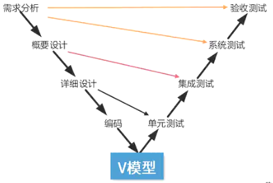

# 软件测试

## 最佳实践

### 考察问
1. 静态测试动态测试
    1. 🟡🟩💚静态测试: (运行/不运行)
    2. 🟡🟩💚动态测试: (运行/不运行)
        1. 黑盒测试: (考虑/不考虑)内部
        2. 白盒测试: (考虑/不考虑)内部
2. 🟡🟩💚单元测试: (详细/概要/需求)
3. 🟡🟩💚集成测试: (详细/概要/需求)
4. 🟡🟩💚系统测试: (详细/概要/需求)
5. 零碎知识
    1. 每个测试用例定义`()`的输出或结果
    2. 测试用例中不仅要说明`()`的输入条件，还应该描述那些`()`、`()`输入条件
    3. 软件测试`()`证明被测对象的正确性
    4. 80%软件错误都可以在大概20%模块中找到根源
    5. 软件性能测试有多种不同类型的测试方法，其中，`()`用于测试在限定的系统下考查软件系统极限运行的情况，`()`可用于测试系统同时处理的在线最大用户数量。
    6. 测试脚本
        1. `()`脚本。线性脚本是`录制手工`测试的测试用例时得到的脚本，这些脚本是未做修改的。
        2. `()`脚本。结构化脚本具有各种逻辑`结构`，包括选择型结构、分支结构、循环迭代结构，而且具有函数调用功能。结构化脚本具有很好的可用性和灵活性，易于维护。 
        3. `()`脚本。共享脚本是指一个脚本可以`被多个`测试用例使用，即脚本语言允许一个脚本调用另一个脚本。
        4. `()`脚本。数据驱动脚本是指将测试输入存储在独立的`数据文件中`，而不是脚本中。这样，脚本可以针对不同的数据输入实现多个测试用例。
        5. `()`脚本。关键字驱动脚本是数据驱动脚本的逻辑扩展，它用测试文件`描述`测试用例，它说明测试用例做什么，而不是如何做。关键字驱动脚本允许使用`描述性`的方法，只需要提供测试用例的描述，即可生成测试用例。 
    7. 在白盒测试中，测试强度最高的是`()`
    8. 在黑盒测试中，`()`方法最适合描述在多个逻辑条件取值组合所构成的复杂情况下，分别要执行哪些不同的动作。
    9. `()`测试的目的是测试软件变更之后，变更部分的正确性和对变更需求的符合性，以及软件原有的、正确的功能、性能和其它规定的要求的不损害性
    10. 在单元测试中，`()`模块用来调用`()`模块，自顶向下的单元测试中不需要另外编写驱动模块

### 考察点

1. 静态测试动态测试
    1. 静态测试: 不运行
    2. 动态测试: 运行
        1. 黑盒测试: 不考虑内部
        2. 白盒测试: 考虑内部
2. 单元测试: 详细设计说明
3. 集成测试: 概要设计说明
4. 系统测试: 需求说明

6. 零碎知识

    1. 每个测试用例都定义`预期`的输出或结果
    2. 测试用例中不仅要说明`合法有效`的输入条件，还应该描述那些`不期望的`、`非法的`输入条件
    3. 软件测试`可以`证明被测对象的正确性
    4. 80%软件错误都可以在大概20%模块中找到根源
    5. 软件性能测试有多种不同类型的测试方法，其中，`强度测试`用于测试在限定的系统下考查软件系统极限运行的情况，`容量测试`可用于测试系统同时处理的在线最大用户数量。
    6.  测试脚本

        1. 线性脚本。线性脚本是`录制手工`测试的测试用例时得到的脚本，这些脚本是未做修改的。
        2. 结构化脚本。结构化脚本具有各种`逻辑结构`，包括选择型结构、分支结构、循环迭代结构，而且具有函数调用功能。结构化脚本具有很好的可用性和灵活性，易于维护。 
        3. 共享脚本。共享脚本是指一个脚本可以`被多个`测试用例使用，即脚本语言允许一个脚本调用另一个脚本。
        4. 数据驱动脚本。数据驱动脚本是指将测试输入存储在独立的`数据文件中`，而不是脚本中。这样，脚本可以针对不同的数据输入实现多个测试用例。
        5. 关键字驱动脚本。关键字驱动脚本是数据驱动脚本的逻辑扩展，它用测试文件`描述`测试用例，它说明测试用例做什么，而不是如何做。关键字驱动脚本允许使用`描述性`的方法，只需要提供测试用例的描述，即可生成测试用例。 
    7.  在白盒测试中，测试强度最高的是`路径覆盖`
    8.  在黑盒测试中，`判定表`方法最适合描述在多个逻辑条件取值组合所构成的复杂情况下，分别要执行哪些不同的动作。
    9.  `回归测试`的目的是测试软件变更之后，变更部分的正确性和对变更需求的符合性，以及软件原有的、正确的功能、性能和其它规定的要求的不损害性
    10. 在单元测试中，`驱动`模块用来调用`被测`模块，自顶向下的单元测试中不需要另外编写驱动模块
    11. `强度测试`用于测试在限定的系统下考查软件系统极限运行的情况，`容量测试`可用于测试系统同时处理的在线最大用户数量。

## 软件测试基本概念

测试是为了发现错误而执行程序的过程，成功的测试是发现了至今尚未发现的错误的测试。

测试的目的是以最少的人力和时间发现潜在的各种错误和缺陷。信息系统测试包括软件测试、硬件测试、网络测试。

测试应遵循的基本原则:

1. 应尽早并不断地进行测试
2. 测试工作应避免原先开发软件的人员或小组参与
3. 设计测试方案时要确定输入数据，还要根据系统功能确定预期的输出结果
4. 设计测试用例时要设计合理、有效的输入条件，还要包含不合理、失效的输入条件
5. 在测试时要检查程序是否做了该做、不该做的事，多余的工作会影响程序的效率
6. 严格按照测试计划进行测试
7. 妥善保存测试计划、测试用例
8. 要精心设计测试用例

## 静态测试和动态测试

- 静态测试：被测程序`不`在机器上`运行`，采用人工检测和计算机辅助静态分析的手段对程序进行测试，包括对文档的静态测试和对代码的静态测试。对文档的静态测试主要以检查单的形式进行，而对代码的静态测试，包括桌前检查、代码审查、代码走查的方式。使用这种方法能够有效地发现30%-70%的逻辑设计和编码错误。
- 动态测试：通过`运行`程序发现错误，一般采用黑盒测试和白盒测试。
    - `黑盒`测试：也称功能测试，在不考虑软件内部结构和特性的情况下，根据功能设计用例，测试软件功能。常用的黑盒测试技术有等价类划分、边界值分析、错误推测、因果图和判定表等。
    - `白盒`测试：也称结构测试，根据程序的内部结构和逻辑来设计测试用例，对程序的路径和过程进行测试，检查是否满足设计的需要。常用的白盒测试技术有控制流分析、数据流分析、路径分析、程序变异等。根据测试用例的覆盖程度，分为语句覆盖、判定覆盖、分支覆盖和路径覆盖等。 

🔒题目

1. 💚软件测试是保障软件质量的重要手段。(  )是指被测试程序不在机器上运行，而采用人工监测和计算机辅助分析的手段对程序进行监测。(  )也称为功能测试，不考虑程序的内部结构和处理算法，只检查软件功能是否能按照要求正常使用。
    - A.静态测试 
    - B.动态测试
    - C.黑盒测试
    - D.白盒测试

    - A.系统测试
    - B.集成测试
    - C.黑盒测试
    - D.白盒测试

    答案: A C

2. 💚软件测试一般分为两个大类：动态测试和静态测试。前者通过运行程序发现错误，包括（  ）等方法；后者采用人工和计算机辅助静态分析的手段对程序进行检测，包括（  ）等方法。
    - A. 边界值分析、逻辑覆盖、基本路径
    - B. 桌面检查、逻辑覆盖、错误推测
    - C. 桌面检查、代码审查、代码走查
    - D. 错误推测、代码审查、基本路径

    - A. 边界值分析、逻辑覆盖、基本路径
    - B. 桌面检查、逻辑覆盖、错误推测
    - C. 桌面检查、代码审查、代码走查
    - D. 错误推测、代码审查、基本路径

    答案: AC

3. ❤️在白盒测试中，测试强度最高的是（）。
    - A. 语句覆盖
    - B. 分支覆盖
    - C. 判定覆盖
    - D. 路径覆盖

    参考答案：D 

4. ❤️在黑盒测试中，（）方法最适合描述在多个逻辑条件取值组合所构成的复杂情况下，分别要执行哪些不同的动作。
    - A. 等价类
    - B. 边界类
    - C. 判定表
    - D. 因果图

    参考答案： C

## 单元测试集成测试系统测试

软件测试可分为：单元测试、集成测试、确认测试和系统测试。

1. 单元测试

    单元测试也称模块测试，在模块编写完成且编译无误后进行，侧重于模块中的内部处理逻辑和数据结构。测试依据是软件`详细设计说明书`。

2. 集成测试

    集成测试就是把模块按系统设计说明书的要求组合起来进行测试。目的是检查模块之间，以及模块和已集成的软件之间的接口关系，并验证已集成的软件是否符合设计要求。测试依据是软件`概要设计文档`。

3. 确认测试

    确认测试主要用于验证软件的功能、性能和其他特性是否与用户需求一致。根据用户的参与程度，通常包括以下类型： 

    - 内部确认测试：主要由软件开发组织内部按照SRS进行测试。
    - Alpha测试：用户在软件开发环境下进行测试。 
    - Beta测试：用户在实际环境下进行测试（开发者通常不在场），通过测试后，产品才能交付用户。 
    - 验收测试：针对SRS，在交付前以用户为主进行的测试。其测试对象为完整的、集成的计算机系统。验收测试的目的：在真实的用户工作环境下，检验软件系统是否满足开发技术合同或SRS。验收测试的结论是用户确定是否接收该软件的主要依据。验收测试是由用户而不是软件工程师进行的。

4. 系统测试

    系统测试的对象是完整、集成的计算机系统。目的是通过与系统的需求进行比较，发现所开发的系统与用户需求不符或矛盾的地方。测试依据是`用户需求或开发合同`。主要包括功能测试、性能测试、健壮性测试、安装或反安装测试、用户界面测试、压力测试、可靠及安全性测试。一般采用黑盒测试法。 

5. 配置项测试

    测试对象是软件配置项，测试目的是检验软件配置项与SRS的一致性。测试的依据是SRS。在此之前，应确认被测软件配置项已通过单元测试和集成测试。

6. 回归测试

    回归测试的目的是测试软件变更之后，变更部分的正确性和对变更需求的符合性，以及软件原有的、正确的功能、性能和其他规定的要求的不损害性。

🔒题目
1. 💛（）的目的是测试软件变更之后，变更部分的正确性和对变更需求的符合性，以及软件原有的、正确的功能、性能和其它规定的要求的不损害性。

    - A. 验收测试 
    - B. Alpha 测试 
    - C. Beta 测试 
    - D. 回归测试

    - 答案： D 

## 自动化测试工具

当前流行的自动化测试工具主要使用脚本技术来生成测试用例。脚本是一组测试工具执行的指令集合，其作用是通过回放的方式来模拟手工测试所执行的操作，生成的脚本必须是可读、可编辑的，并且应提供控制指令的支持，使工具能够复用所编写的脚本。

脚本的基本结构主要有以下5种：

1. 线性脚本。线性脚本是`录制手工`测试的测试用例时得到的脚本，这些脚本是未做修改的。
2. 结构化脚本。结构化脚本具有各种`逻辑结构`，包括选择型结构、分支结构、循环迭代结构，而且具有函数调用功能。结构化脚本具有很好的可用性和灵活性，易于维护。 
3. 共享脚本。共享脚本是指一个脚本可以`被多个`测试用例使用，即脚本语言允许一个脚本调用另一个脚本。
4. 数据驱动脚本。数据驱动脚本是指将测试输入存储在独立的`数据文件中`，而不是脚本中。这样，脚本可以针对不同的数据输入实现多个测试用例。
5. 关键字驱动脚本。关键字驱动脚本是数据驱动脚本的逻辑扩展，它用测试文件描述测试用例，它说明测试用例做什么，而不是如何做。关键字驱动脚本允许使用`描述性`的方法，只需要提供测试用例的描述，即可生成测试用例。 

自动化测试工具主要使用脚本技术来生成测试用例，其中，（）是录制手工测试的测试用例时得到的脚本；（）是将测试输入存储在独立的数据文件中，而不是在脚本中。

- A.线性脚本  B.结构化脚本  C.数据驱动脚本  D.共享脚本
- A.线性脚本  B.结构化脚本  C.数据驱动脚本  D.共享脚本

🔒问题

1. ❤️系统测试的依据是(  )。

    - A.软件详细设计说明书 
    - B.软件需求规格说明书
    - C.软件概要设计说明书 
    - D.软件用户手册

    答案：B 

2. ❤️在单元测试中，（  ）。

    - A. 驱动模块用来调用被测模块，自顶向下的单元测试中不需要另外编写驱动模块
    - B. 桩模块用来模拟被测模块所调用的子模块，自顶向下的单元测试中不需要另外编写桩模块
    - C. 驱动模块用来模拟被测模块所调用的子模块，自底向上的单元测试中不需要另外编写驱动模块
    - D. 桩模块用来调用被测模块，自底向上的单元测试中不需要另外编写桩模块

    答案: A

3. ❤️软件性能测试有多种不同类型的测试方法，其中，（  ）用于测试在限定的系统下考查软件系统极限运行的情况，（  ）可用于测试系统同时处理的在线最大用户数量。

    - A 强度测试  B 负载测试  C 压力测试  D 容量测试
    - A 强度测试  B 负载测试  C 压力测试  D 容量测试

    答案: AD

4. ❤️以下关于软件测试说法错误的是（）。
    
    - A. 每个测试用例都必须定义预期的输出或结果
    - B. 测试用例中不仅要说明合法有效的输入条件，还应该描述那些不期望的、非法的输入条件
    - C. 软件测试可以证明被测对象的正确性
    - D. 80%软件错误都可以在大概20%模块中找到根源

    参考答案：C 

