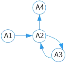
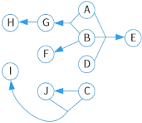
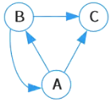
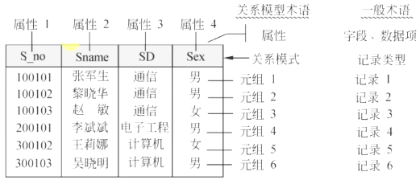
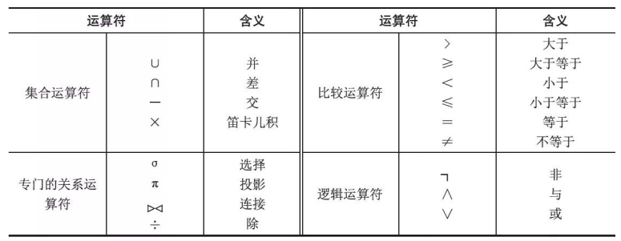
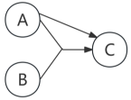
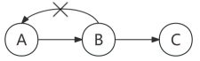

# 2关系数据库

## 最佳实践

### 题目总结

- (✨2025上)34.已知关系R(a,b,c,d)和R上的函数依赖F={a->cd, c->b}，则R的候选码是( )。
    - A.c
    - B.d
    - C.a
    - D.b

    答案: C

1. 给定关系R(A1，A2，A3，A4)上的函数依赖集F={A1→A2，A3→A2，A2→A3，A2→A4}，R的候选关键字为(  )。

    

    - A. A1
    - B. A1A3
    - C. A1A3A4
    - D. A1A2A3

    答案: A

    L: A1
    M: A2 A3(不需要, 因为A1可以唯一确定, 加入A2或A3冗余)
    R: A4

2. 关系模式P (A，B，C，D，E，F，G，H，I，J)满足下列函数依赖：FD={ABD→E，AB→G，B→F，C→J，CJ→I，G→H}，求候选码?

    

    L: ABCD

3. 关系R (A，B，C) 满足下列函数依赖：F {B→C，B→A，A→BC} ，关系R的候选关键字为(  )。

    

    - A. AB
    - B. A和B
    - C. A和BC
    - D. AC和AB

    答案: B

    M: A B
    R: C

3. 给出关系$R(U, F)$，$U = \{A, B, C, D, E\}$，$F = \{A→B, D→C, BC→E, AC→B\}$，求属性闭包的等式成立的是(  )。$R$的候选关键字为(  )。

    - A. $(A)_F^+= U$  
    - B. $(B)_F^+= U$  
    - C. $(AC)_F^+= U$  
    - D. $(AD)_F^+= U$

    - A. $AD$  
    - B. $AB$  
    - C. $AC$  
    - D. $BC$

    答案: D  A

    设$X$是函数依赖集，被$X$逻辑蕴涵的函数依赖全体构成的集合，称为函数依赖集$X$的闭包。简言之，闭包本质上就是这些属性能直接或间接推出的属性集的集合。

    不难求出，$(A)=AB$，$(B)=B$，$(AC)=ABC$，$(AD)=ABCDE$，因此$D$选项正确。
    $AD$能推出$U$的所有属性，因此$AD$即为$R$的候选关键字。 

### 考察问

### 考察点

- 关系的基本术语

    1. 关系模式就是指`()`
    2. `()`: 在现实世界中，要描述一个事物常常取若干`()`来表示。这些特征称为属性。例如学生通过学号、姓名、性别、系别、年龄、籍贯等属性来描述。
    3. `()`: 每个属性的`()`对应一个值的集合，称为该属性的域。例如，学号的域是6位整型数；姓名的域是10位字符；性别的域为｛男，女｝等。一般在关系数据模型中，对域还加了一个限制，即所有的域都应是原子数据(Atomic Data)。例如，整数、字符串是原子数据，而集合、记录、数组是非原子数据。关系数据模型的这种限制称为第一范式(First Normal Form, lNF)条件。但也有些关系数据模型突破了lNF的限制。
    4. `()`: 目或度指的是一个关系中属性的个数。
    5. `()`:若关系中的某一属性或属性组的值能`()`的标识一个元组，则称该属性或属性组为候选码。
    6. `()`:或称主键，若一个关系有`()`，则选定其中一个作为主码。
    7. `()`:包含在任何`()`称为主属性。不包含在任何候选码中的属性称为非主属性 (Non-Prime Attribute)。
    8. `()`:如果关系模式R中的属性或属性组不是该关系的码，但它是`()`的码，那么该属性集对关系模式R而言是外码。例如，客户与贷款之间的借贷联系c-1 (旦d ，loan-no )，属性 c-id 是客户关系中的码，所以c-id 是外码；属性 loan-no 是贷款关系中的码，所以loan-no也是外码。
    9. `()`:关系模型的`()`是这个关系模式的`()`，称为全码。例如，关系模式R(T, C, S), 属性T表示教师，属性C表示课程，属性S表示学生。假设一个教师可以讲授多门课程，某门课程可以由多个教师讲授，学生可以听不同教师讲授的不同课程，那么，要想区分关系中的每一个元组，这个关系模式R的码应为全属性T、C和s, 即ALL-KEY 。

1. 关系的`()`称为关系模式(Relation Schema)，可以形式化地表示为：$R(U, D, dom, F)$
2. R(U): $X \to Y$. R是`()`; U是`()`; X, Y是具体的`()`(字段)
3. F={A1→A2，A3→A2，A2→A3，A2→A4}. F是`()`, A1,...,A4是`()`
4. 关系的完整性约束
    1. `()`完整性: 包含主键(唯一其非空)
    2. `()`完整性: 外键
    3. `()`完整性 
5.  4类运算符
    1. `()`比较符
    2. `()`运算符
    3. `()`运算符: 从关系的水平方向进行的，包括并、交、差及广义笛卡儿积
    4. `()`运算符: 可以从关系的水平方向进行运算，又可以向关系的垂直方向运算，重点3个是`()`、`()`、`()`
2. 函数依赖的分类
    1. `()`依赖: 一个学员对应一个名字, 一个名字对应多个学员, 多对一, 学员名字依赖于学员ID.
    2. `()`依赖: 一个学员可以选多个课程, 一个课程可以被多个学员, 多对多, 选择学员ID和课程ID作为选课表的主键, 学员姓名依赖学员ID, 学员姓名部分以来于学员ID和课程ID. 
    3. `()`依赖: 一个学员对应一个教室, 一个教室对应多个学员, 多对一, 学员ID决定教室ID, 教室ID决定教室名称(多对一). 教室名称到学员ID是传递依赖.
    4. `()`依赖: 一个学员选多个课程, 一个课程对多个学员选择, 多对多; 一个学员有多个兴趣, 一个兴趣对应多个学员, 多对多. 课程和兴趣之间没有关系. 学员ID多值依赖于课程和学员ID多值依赖于兴趣
1. 图示法函数依赖求候选键
    1. 将关系的函数依赖关系用`()`的方式表示
    2. 找出所有`()`的属性，并以该属性集合为起点，尝试遍历有向图，若能正常`()`图中`()`，则该属性集即为关系模式的`()`。此种情况:
        1. `()`, 必然是`()`, 因为只有自己可以找到自己
        2. 不能添加中间节点, 因为会有冗余
    3. 若入度为0的属性集`()`，则需要尝试性的将一些`()`(既有入度，也有出度的结点)并入度为0的属性集中，直至该属性集合能遍历所有结点，则该属性集合为候选键。此种情景:
        1. `()`, `()`, 因为只有自己可以找到自己
        2. 然后添加足以`()`的`()`

## 关系数据库基本概念

### 关系的基本术语
1. 关系模式就是指`数据表`
2. `属性(Attribute)`: 在现实世界中，要描述一个事物常常取若干`特征`来表示。这些特征称为属性。例如学生通过学号、姓名、性别、系别、年龄、籍贯等属性来描述。
3. `域(Domain)`: 每个属性的`取值范围`对应一个值的集合，称为该属性的域。例如，学号的域是6位整型数；姓名的域是10位字符；性别的域为｛男，女｝等。一般在关系数据模型中，对域还加了一个限制，即所有的域都应是原子数据(Atomic Data)。例如，整数、字符串是原子数据，而集合、记录、数组是非原子数据。关系数据模型的这种限制称为第一范式(First Normal Form, lNF)条件。但也有些关系数据模型突破了lNF的限制。
4. `目或度(Degree)`: 目或度指的是一个关系中属性的个数。
5. `候选码(Candidate Key)`:若关系中的某一属性或属性组的值能`唯一`的标识一个元组，则称该属性或属性组为候选码。
6. `主码(Primary Key)`:或称主键，若一个关系有`多个候选码`，则选定其中一个作为主码。
7. `主属性(Prime Attribute)`:包含在任何`候选码中的属性`称为主属性。不包含在任何候选码中的属性称为非主属性 (Non-Prime Attribute)。
8. `外码(Foreign Key)`:如果关系模式R中的属性或属性组不是该关系的码，但它是`其他关系`的码，那么该属性集对关系模式R而言是外码。例如，客户与贷款之间的借贷联系c-1 (旦d ，loan-no )，属性 c-id 是客户关系中的码，所以c-id 是外码；属性 loan-no 是贷款关系中的码，所以loan-no也是外码。
9. `全码(All-key)`:关系模型的`所有属性组`是这个关系模式的`候选码`，称为全码。例如，关系模式R(T, C, S), 属性T表示教师，属性C表示课程，属性S表示学生。假设一个教师可以讲授多门课程，某门课程可以由多个教师讲授，学生可以听不同教师讲授的不同课程，那么，要想区分关系中的每一个元组，这个关系模式R的码应为全属性T、C和s, 即ALL-KEY 。
10. 笛卡尔积：

    【定义6.1】设$D_1$，$D_2$，$D_3$，$\cdots$，$D_n$为任意集合，定义$D_1$，$D_2$，$D_3$，$\cdots$，$D_n$的笛卡尔积为：

    $D_1 \times D_2 \times D_3 \times \cdots \times D_n = \{ (d_1, d_2, d_3, \cdots, d_n) \mid d_i \in D_i,\ i = 1, 2, 3, \cdots, n \}$

    其中，集合中的每一个元素$(d_1, d_2, d_3, \cdots, d_n)$叫作一个$n$元组($n$-tuple，即$n$个属性的元组)，元素中的每一个值$d_i$叫作元组一个分量。若$D_i\ (i = 1, 2, 3, \cdots, n)$为有限集，其基数(Cardinal Number，元组的个数)为$m_i\ (i = 1, 2, 3, \cdots, n)$，则$D_1 \times D_2 \times D_3 \times \cdots \times D_n$的基数$M$为：

    $M = \prod_{i = 1}^{n} m_i$

## 关系的三种类型(拓展)

1. 基本关系。通常又称为基本表，它是实际存在的表，是实际存储数据的逻辑表示。
2. 查询表。查询表是查询结果对应的表。
3. 视图表。视图表是由基本表或其他视图表导出的表。由于它本身不独立存储在数据库中，数据库中只存放它的定义，所以常称为虚表。

### 关系数据库模式

在数据库中要区分型和值。关系数据库中的型也称为关系数据库模式，是关系数据库结构的描述。它包括若干域的定义以及在这些域上定义的若干关系模式。关系数据库的值是这些关系模式在某一时刻对应的关系的集合，通常称之为关系数据库。

【定义6.2】关系的描述称为关系模式(Relation Schema)。可以形式化地表示为：

$R(U，D，dom，F)$

其中，$R$表示关系名；$U$(Unified Attributes Set)是组成该关系的属性名集合；$D$是属性的域(Domain)；$dom$是属性向域的映像集合；$F$(Functional Dependency Set)为属性间数据的依赖关系集合。

通常将关系模式简记为：

$R(U)$或$R(A_1，A_2，A_3，\cdots，A_n)$

其中，$R$为关系名，$A_1，A_2，A_3，\cdots，A_n$为属性名或域名，属性向域的映像常常直接说明属性的类型、长度。通常在关系模式主属性上加下画线表示该属性为主码属性。

例如：学生关系$S$有学号$Sno$、学生姓名$Same$、系名$SD$、年龄$SA$属性；课程关系$C$有课程号$Cno$、课程名$Cname$、先修课程号$PCno$属性；学生选课关系$SC$有学号$Sno$、课程号$Cno$、成绩$Grade$属性。定义关系模式及主码如下(本题未考虑$F$属性间数据的依赖，该问题在后续内容讨论)。

1. 学生关系模式$S(\underline{Sno}，Sname，SD，SA)$。

2. 课程关系模式$C(\underline{Cno}，Cname，PCno)$，$Dom(PCno)=Cno$。这里，$PCno$是先行课程号，来自$Cno$域，但由于$PCno$属性名不等于$Cno$值域名，所以要用$Dom$来定义。但是，不能将$Pcno$直接改为$Cno$，因为在关系模型中，各列属性必须取相异的名字。

3. 学生选课关系模式$SC(\underline{Sno}，\underline{Cno}，Grade)$。$SC$关系中的$Sno$、$Cno$又分别为外码。因为它们分别是$S$、$C$关系中的主码。

### 关系的完整性约束

关系的完整性约束共分为 3 类：实体完整性、参照完整性(也称引用完整性)和用户定义完整性。

1. 实体完整性(Entity Integrity)。实体完整性规则要求每个数据表都必须有主键，而作为主键的所有字段，其属性必须是`唯一`且`非空值`。

2. 参照完整性(Referential Integrity)。现实世界中的实体之间往往存在某种联系，在关系模型中实体及实体间的联系是用关系来描述的，这样自然就存在着关系与关系间的引用。

    参照完整性规定：若$F$是基本关系$R$的外码，它与基本关系$S$的主码$Ks$相对应(基本关系$R$和$S$不一定是不同的关系)，则对于$R$中每个元组在$F$上的值或者取空值($F$的每个属性值均为空值)，或者等于$S$中某个元组的主码值。

    例如，某企业员工$Emp$关系模式和部门$Dept$关系模式表示如下：

    Emp(<u>员工号</u>，姓名，性别，参加工作时间，<u>部门号</u>)
    Dept(<u>部门号</u>，名称，电话，<u>负责人</u>)

    Emp和Dept关系存在着属性的引用，即员工关系中的“部门号”值必须是确实存在的部门的部门号。按照关系的完整性规则，员工关系中的“部门号”属性取值要参照部门关系的“部门号”属性取值。如果新入职的员工还未分配具体的部门，那么部门号取空值。

    注意：本书若在关系模式主属性上加实下画线，通常表示该属性为主码属性；如果在关系模式属性上加虚下画线，通常表示该属性为外码属性。

3. 用户定义完整性(UserDefined Integrity)。就是针对某一具体的关系数据库的约束条件，反映某一具体应用所涉及的数据必须满足的语义要求，由应用的环境决定。例如，银行的用户账户规定必须大于等于100000，小于999999。

## 关系运算

关系代数运算符有4类：

1. 算术比较符
2. 逻辑运算符
3. 集合运算符: 从关系的水平方向进行的，包括并、交、差及广义笛卡儿积
4. 关系运算符: 可以从关系的水平方向进行运算，又可以向关系的垂直方向运算，包括选择、投影、连接以及除法

[text](2_1关系运算🔴🟨💛.md)

## 关系数据库设计基本理论

### 函数依赖

【定义 6.3】设$R(U)$是属性集$U$上的关系模式，$X、Y$是$U$的子集。若对$R(U)$的任何一个可能的关系$r$，$r$中不可能存在两个元组在$X$上的属性值相等，而在$Y$上的属性值不等，则称$X$函数决定$Y$或$Y$函数依赖于$X$，记作：$X \to Y$。  

如果$X \to Y$，但$Y \nsubseteq X$，则称$X \to Y$是非平凡的函数依赖。一般情况下总是讨论非平凡的函数依赖。  

如果$X \to Y$，但$Y \subseteq X$，则称$X \to Y$是平凡的函数依赖。

注意：函数依赖$X \to Y$的定义要求关系模式$R$的任何可能的$r$都满足上述条件。因此不能仅考察关系模式$R$在某一时刻的关系$r$，就断定某函数依赖成立。  

例如，关系模式$\text{Student(Sno，Sname，SD，Sage，Sex)}$可能在某一时刻，$\text{Student}$的关系$r$中每个学生的年龄都不同，也就是说没有两个元组在$\text{Sage}$属性上取值相同，而在$\text{Sno}$属性上取值不同，但我们决不可据此就断定$\text{Sage} \to \text{Sno}$。很有可能在某一时刻，$\text{Student}$的关系$r$中有两个元组在$\text{Sage}$属性上取值相同，而在$\text{Sno}$属性上取值不同。  

函数依赖是语义范畴的概念，我们只能根据语义来确定函数依赖。例如，在没有同名的情况下，$\text{Sname} \to \text{Sage}$，而在允许同名的情况下，这个函数依赖就不成立了。  

【定义 6.4】在$R(U)$中，如果$X \to Y$，并且对于$X$的任何一个真子集$X'$，都有$X'$不能决定$Y$，则称$Y$对$X$完全函数依赖，记作：$X \stackrel{f}{\to} Y$。如果$X \to Y$，但$Y$不完全函数依赖于$X$，则称$Y$对$X$部分函数依赖，记作：$X \stackrel{p}{\to} Y$。部分函数依赖也称作局部函数依赖。  

例如：给定一个学生选课关系$\text{SC(Sno，Cno，G)}$，我们可以得到$F = \{(\text{Sno，Cno}) \to \text{G} \}$，对$(\text{Sno，Cno})$中的任何一个真子集$\text{Sno}$或$\text{Cno}$都不能决定$\text{G}$，所以，$\text{G}$完全依赖于$\text{Sno，Cno}$。  

【定义 6.5】在$R(U，F)$中，如果$X \to Y$，$Y \nsubseteq X$，$Y \nrightarrow X$，$Y \to Z$，则称$Z$对$X$传递依赖。

✨函数依赖分类总结:

1. `函数依赖`

    设R(U)是属性集U上的关系模式，X、Y是U的子集。若对R(U)的任何一个可能的关系r，r中不可能存在两个元组在X上的属性值相等，而在Y上的属性值不等，则称X函数决定Y或Y函数依赖于X，记作$X \to Y$。

    1. “学号 -> 系号”
    2. “系号 -> 系名”

2. `部分函数依赖`

    如果$X \to Y$，但Y不完全函数依赖于X，则称Y对X部分函数依赖。

    (A,B)能确定C，A也能确定C，即(A,B)属性集中的部分属性(A)就可以确定C，则C部分函数依赖于(A,B)。 

    

3. `传递函数依赖`

    在$R(U,F)$中，如果$X \to Y$，$Y \nsubseteq X$，$Y \to Z$，则称Z对X传递依赖。其中，U：属性集，F：是U上的一组函数依赖。
    例子：若$A \to B$，$B \to C$，则$A \to C$(B不能$\to A$，防止直接$A \to C$)，则称C传递函数依赖A。

    

## 图示法函数依赖求候选键(拓展)

求候选键最稳妥的办法是图示法。图示法求候选键的过程如下：

1. 将关系的函数依赖关系用`有向图`的方式表示
2. 找出所有`入度为0`的属性，并以该属性集合为起点，尝试遍历有向图，若能正常`遍历`图中`所有结点`，则该属性集即为关系模式的`候选键`。此种情况:
    1. `入度为0的`, 必然是`候选键集合的元素`, 因为只有自己可以找到自己
    2. 不能添加中间节点, 因为会有冗余
3. 若入度为0的属性集`不能遍历图中所有结点`，则需要尝试性的将一些`中间结点`(既有入度，也有出度的结点)并入度为0的属性集中，直至该属性集合能遍历所有结点，则该属性集合为候选键。此种情景:
    1. `入度为0的`, `必然是候选键集合的元素`, 因为只有自己可以找到自己
    2. 然后添加足以`遍历全部节点`的`中间节点`

### 多值依赖(Multivalued Dependency, MVD)

定义 6.6: 若关系模式$R(U)$中，$X、Y、Z$是$U$的子集，并且$Z = U - X - Y$。当且仅当对$R(U)$的任何一个关系$r$，给定一对$(x, z)$值，有一组$Y$的值，这组值只由$x$值决定而与$z$值无关，则称 “$Y$多值依赖于$X$” 或 “$X$多值决定$Y$” 成立。记为：$X \twoheadrightarrow Y$。

多值依赖具有以下 6 条性质：

- 多值依赖具有对称性。即若$X \twoheadrightarrow Y$，则$X \twoheadrightarrow Z$，其中$Z = U - X - Y$。

- 多值依赖具有传递性。即若$X \twoheadrightarrow Y$，$Y \twoheadrightarrow Z$，则$X \twoheadrightarrow Z - Y$。
- 函数依赖可以看成是多值依赖的特殊情况。
- 若$X \twoheadrightarrow Y$，$X \twoheadrightarrow Z$，则$X \twoheadrightarrow YZ$。
- 若$X \twoheadrightarrow Y$，$X \twoheadrightarrow Z$，则$X \twoheadrightarrow Y \cap Z$。
- 若$X \twoheadrightarrow Y$，$X \twoheadrightarrow Z$，则$X \twoheadrightarrow Z - Y$。

✨[补充参考](https://blog.csdn.net/qq_42060170/article/details/142856492):

多值依赖是**第四范式(4NF)**的核心问题之一，第四范式要求消除多值依赖。

1. 多值依赖的定义:

    在关系数据库中，假设 R(A, B, C) 是一个表，其中 A、B、C 是属性，多值依赖表示为：如果属性 A 确定了属性集 B 的值，并且同时 A 确定了另一个属性集 C 的值，那么在给定的 A 的条件下，B 和 C 彼此独立，且它们的值可以是多对多的关系。

    数学表达式为：

    A →→ B(A 多值依赖 B)

    它表示，当A的值确定时，可以为B选择多个值，同时可以为C选择多个值，但B和C之间没有直接的联系，互不依赖。

2. 多值依赖的特性

    1. 独立性：属性集B和C是相互独立的，它们只依赖于A，但B和C之间不存在任何关系。
    2. 冗余数据：当出现多值依赖时，数据表中会出现大量的冗余数据，导致存储空间浪费和数据维护复杂化。
    3. 数据不一致：由于冗余数据的存在，更新或删除操作可能导致数据不一致，增加了维护的难度。

3. 多值依赖的例子

    假设有一个学生选课表，其中包含学生ID、课程和兴趣爱好三个属性。对于每个学生，他们可以选择多门课程，并且有多种兴趣爱好，但课程与兴趣爱好之间没有关系。表结构如下：

    |学生ID|课程|兴趣爱好|
    | ---- | ---- | ---- |
    |101|数学|篮球|
    |101|数学|阅读|
    |101|英语|篮球|
    |101|英语|阅读|

    在这个例子中，学生ID A多值依赖于课程B和兴趣爱好C。对于学生101，他选择了“数学”和“英语”两门课程，并且他对“篮球”和“阅读”感兴趣。然而，课程和兴趣爱好之间没有直接关系，导致数据冗余。例如，“篮球”和“阅读”每次都与“数学”和“英语”重复出现。

    这个例子中的多值依赖为：

    学生ID →→ 课程
    学生ID →→ 兴趣爱好

4. 消除多值依赖——第四范式(4NF)

    要消除多值依赖并将数据库设计为第四范式(4NF)，需要将多值依赖的属性分离为两个表格，使其遵循分解原则。

    对于上述例子，可以将表进行拆分，分别存储“学生ID-课程”和“学生ID-兴趣爱好”的关系。

    学生选课表：

    |学生ID|课程|
    | ---- | ---- |
    |101|数学|
    |101|英语|

    学生兴趣表：

    |学生ID|兴趣爱好|
    | ---- | ---- |
    |101|篮球|
    |101|阅读|

    现在每个表中的数据是独立的，消除了冗余，没有了多值依赖的情况。这样设计不仅减少了数据冗余，还保证了数据的一致性。

5. 多值依赖和函数依赖的区别

    函数依赖(Functional Dependency，FD)：函数依赖指的是一个属性A确定了属性B的唯一值。简单来说，给定A，可以确定唯一的B。表示为：A→B，即A决定B。

    多值依赖(Multivalued Dependency，MVD)：多值依赖意味着在给定A的情况下，属性B可以有多个值，并且这些值与其他属性集(如C)相互独立。 表示为：A →→ B，即A决定B的多个值，而与其他属性(如C)无关。
