# 关系运算

## 最佳实践

### 题目总结

1. (✨2025上)在下列运算中，( )不属于关系运算。

    - A.删除
    - B.连接
    - C.投影
    - D.选择

    答案: A

1. 给定关系R(A，B，C，D)和S(A，C，E，F)，以下______与$\sigma_{R.B > S.E}(R \bowtie S)$等价。

    - A. $\sigma_{2 > 7}(R \times S)$
    - B. $\pi_{1,2,3,4,7,8}(\sigma_{1 = 5 \land 2 > 7 \land 3 = 6}(R \times S))$
    - C. $\sigma_{2 > '7'}(R \times S)$
    - D. $\pi_{1,2,3,4,7,8}(\sigma_{1 = 5 \land 2 > '7' \land 3 = 6}(R \times S))$

    答案：B

    首先，R与S中未提及具体值'7'(数据库中加引号代表是字符值)， 因此排除C、D选项；其次，A选项未考虑自然连接，排除A；最后，只有B选项中R×S做选择时，第一列与第五列(R.A=S.A)、第三列与第六列(R.C=S.C) ，才考虑了自然连接，B选择符合。 

    ✨从1列开始数, 而不是0

2. 若关系R、S如下图所示，则关系R与S进行自然连接运算后的元组个数和属性列数分别为(  )；关系代数表达式$\pi_{1,4}(\sigma_{3 = 6}(R\times S))$与关系代数表达式(  )等价。

    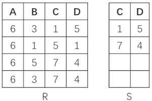

    - A. 6和6
    - B. 4和6
    - C. 3和6
    - D. 3和4  

    - A. $\pi_{A,D}(\sigma_{C = D}(R\times S))$
    - B. $\pi_{A,R.D}(\sigma_{S.C = R.D}(R\times S))$
    - C. $\pi_{A,R.D}(\sigma_{R.C = S.D}(R\times S))$
    - D. $\pi_{A,R.D}(\sigma_{S.C = S.D}(R\times S))$

    答案: DC

3. 在关系R(A1，A2，A3)和S(A2，A3，A4)上进行关系运算的4个等价的表达式E1、E2、E3和E4如下所示：

    - E1 = $\pi_{A1, A4}(\sigma_{A2< '2018' \land A4='95'}(R \Join S))$
    - E2 = $\pi_{A1, A4}(\sigma_{A2< '2018'}(R) \Join \sigma_{A4='95'}(S))$
    - E3 = $\pi_{A1, A4}(\sigma_{A2< '2018' \land R.A3 = S.A3 \land A4='95'}(R \times S))$
    - E4 = $\pi_{A1, A4}(\sigma_{R.A3 = S.A3}(\sigma_{A2< '2018'}(R) \times \sigma_{A4='95'}(S)))$

    如果严格按照表达式运算顺序执行，则查询效率最高的是表达式(  )。

    - A. E1
    - B. E2
    - C. E3
    - D. E4

    答案: D

    1. 笛卡尔积效率肯定最低, 排除E1和E3
    2. 自然连接在性能上优于笛卡尔积, 但是E4少做了一个等值(E3的自然连接有两个等值), 所以是E4

4. 给定关系R(A，B，C，D，E)与S(A，B，C，F，G)，那么与表达式$\pi_{1, 2, 4, 6, 7}(\sigma_{1<6}(R \Join S))$等价的SQL语句如下：SELECT(  )FROM R, S WHERE(  );

    - A. R.A, R.B, R.E, S.C, G
    - B. R.A, R.B, D, F, G
    - C. R.A, R.B, R.D, S.C, F
    - D. R.A, R.B, R.D, S.C, G

    - A. `R.A=S.A OR R.B=S.B OR R.C=S.C OR R.A<S.F`
    - B. `R.A=S.A OR R.B=S.B OR R.C=S.C OR R.A<S.B`
    - C. `R.A=S.A AND R.B=S.B AND R.C=S.C AND R.A<S.F`
    - D. `R.A=S.A AND R.B=S.B AND R.C=S.C AND R.A<S.B`

    答案: BC

### 考察问

1. 关系(表)运算符: 
    1. `()`
    2. `()`
    3. `()`
        1. 笛卡尔
        2. 自然(第一列相等)

### 考察点

1. 关系(表)运算符: 
    1. `选择`
    2. `投影`
    3. `链接`
        1. 笛卡尔
        2. 自然(第一列相等)
## 关系运算符

关系操作的特点是操作对象和操作结果都是集合。关系代数运算符主要有以下4类：
1. 专门的关系运算符
    - 选择：$\sigma$(行选择, 对应where后的语句)
    - 投影：$\pi$(列选择, 对应select后的语句)
    - 笛卡尔积：$\times$
    - 自然连接：$\bowtie$
    - 左连接右连接全连接: $\ltimes$, $\rtimes$, $\sqsupset \bowtie \sqsubset$
    - 除：$\div$
2. 集合运算符
    - 并集：$\cup$
    - 交集：$\cap$
    - 差集：$-$
3. 比较运算符
    - 大于：$>$
    - 大于等于：$\geq$
    - 小于：$<$
    - 小于等于：$\leq$
    - 等于：$=$
    - 不等于：$\neq$
4. 逻辑运算符
    - 与：$\land$
    - 或：$\lor$
    - 非：$\neg$

## 5种基本的关系代数运算

关系模式在代数运算时可以理解为数据库表的运算。

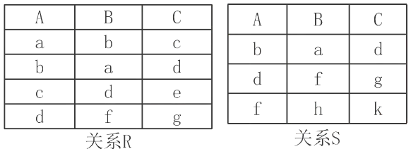

1. 并(Union)

    关系R与S的属性及属性的个数相同。并的结果为属于R或属于S的元组构成的集合。且结果去重.

    $R \cup S = \{t|t \in R \lor t \in S\}$

    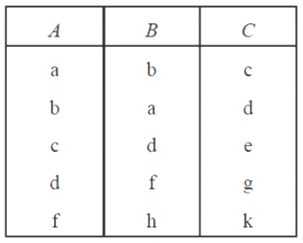

2. 差(Difference)

    关系R与S的属性及属性的个数相同。 $R - S$差的结果为属于R但不属于S的元组构成的集合。

    $R - S = \{t|t \in R \land t \notin S\}$

    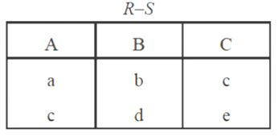

3. 广义笛卡尔积(Extended Cartesian Product)

    如果关系模式R中有n个属性，关系模式S中有m个属性，则广义笛卡尔积的结果中有(n + m)个属性，其中前n个属性来自R，后m个属性来自S。如果R中有 $K_1$ 个元组，S中有 $K_2$ 个元组，则运算结果有 $K_1×K_2$ 个元组。

    $R×S = \{t| < t_m, t_n > \land t_n \in R \land t_m \in S\}$

    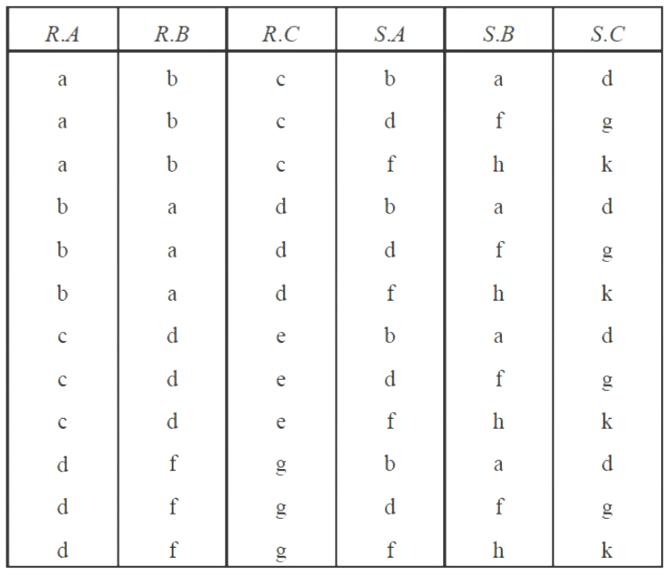

4. 投影(Projection)

    从关系的垂直方向进行运算。在关系R中挑选若干属性列A组成新的关系。

    $\pi_A(R) = \{t[A]|t \in R\}$

    $\pi_{A,C}(R)$的结果为:

    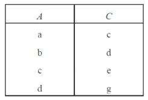

5. 选择(Selection)

    从关系的水平方向进行运算，从关系R中选择满足条件的元组。

    $\sigma_F(R)=\{t|t\in R\land F(t) = \text{True}\}$ 

    其中，F中运算对象是属性名(或列的序号)或者常量(用单引号括起来，如'1'表示数字1)、算术运算符(< 、≤ 、> 、≥ 、≠)、逻辑运算符(∧ 、∨ 、¬)。

    $\sigma_{A > B}(R)$的结果为:

    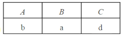

    ✨A>B比较的ascii码

6. 综合运算

    $\sigma_{3 < 4}(R \times S)$

    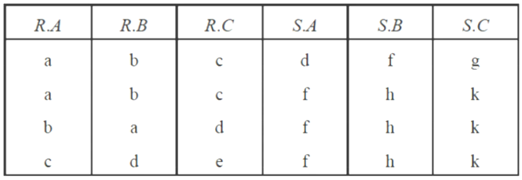

## 扩展的关系代数运算

拓展的的意思是都可以通过基础变换过来

1. 交(Intersection)

    关系R与S的属性及属性的个数相同。关系R与S的交是由属于R同时又属于S的元组构成的集合。

    $R \cap S = \{t|t \in R \land t \in S\}$

    显然，$R \cap S = R - (R - S)$，或者$R \cap S = S - (S - R)$。

2. 连接(Join)

    连接运算是从两个关系R和S的笛卡尔积中选取满足条件的元组。可分为$\theta$连接、等值连接和自然连接3种。

    1. $\theta$连接：从关系R与S的笛卡尔积中选取属性间满足一定条件的元组。

        $_{X \theta Y}^{R \bowtie S} = \{t|t = <t^n, t^m> \land t^n \in R \land t^m \in S \land t^n[X] \theta t^m[Y]\}$

        $\theta$连接也可以表示为：$_{X \theta Y}^{R \bowtie S} = \sigma_{X \theta Y}(R \times S)$。

        设有关系R、S如下图所示，

        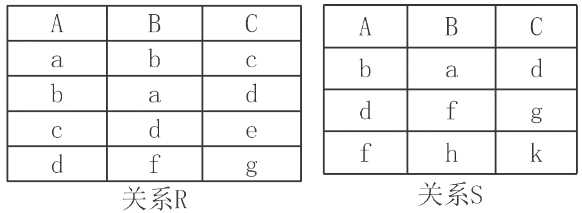

        求 $_{R.A = S.B}^{R \bowtie S}$ 

        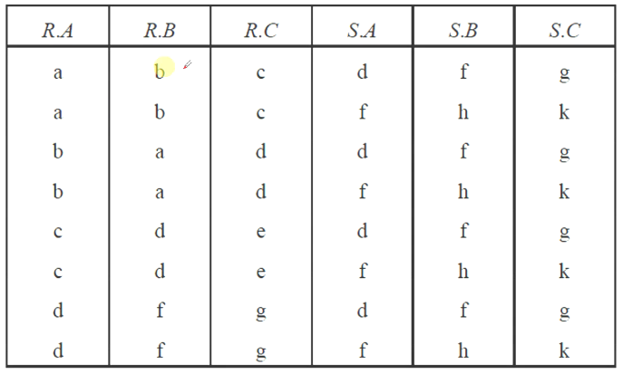

    2. 等值连接：当$\theta$为“=”时，称之为等值连接。

        $_{X = Y}^{R \bowtie S} = \{t|t = <t^n, t^m> \land t^n \in R \land t^m \in S \land t^n[X] = t^m[Y]\}$

    3. 自然连接：是一种特殊的等值连接，它要求两个关系中进行比较的分量必须是相同的属性组，相同属性组的值要相等，并且在结果集中将重复属性列去掉。

        $R \bowtie S = \{t|t = <t^n, t^m> \land t^n \in R \land t^m \in S \land R.B_1 = S.B_1 \land R.B_2 = S.B_2 \land \cdots \land R.B_k = S.B_k\}$ 

        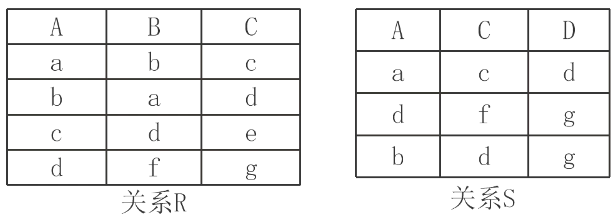

        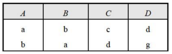

3. 除(Division)

    除运算是同时从关系的水平方向和垂直方向进行运算。将被除数看成一个整体.

    $R \div S = \{t^n[X]|t^n \in R \land \pi_y(S) \subseteq Y_x\}$

    练习：设有关系R、S如下图所示，求$R \div S$ 。

    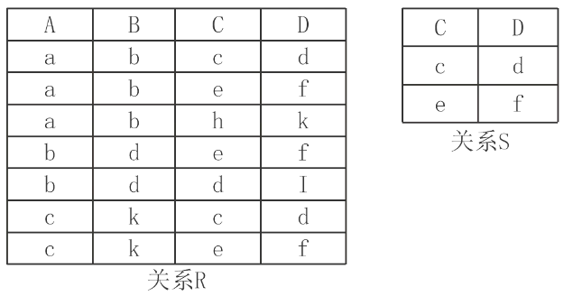

    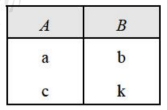

4. 广义投影(Generalized Projection)

    允许在投影列表中使用算术运算，是对投影运算的补充。

    $\pi_{F_1,F_1,\cdots,F_n}(R)$

    练习：设有关系R，求$\pi_{A,B - C}(R)$ 。 

    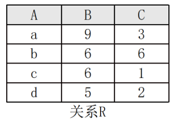

    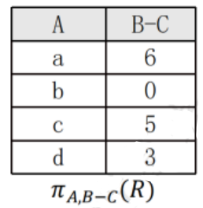

5. 外连接(Outer Join)

    在自然连接中关系R与S的一些元组因为没有公共属性会被抛弃。使用外连接就可以避免这样的丢失。外连接运算就是将自然连接时舍弃的元组也放入新关系，并在新增加的属性上填入空值。

    1. 左外连接(Left Outer Join)：记为$R \ltimes S$，以左侧的关系R为主，保留左侧的关系R的所有元组，右侧的关系S未等值的用NULL填充，加入到$R \ltimes S$中。
    2. 右外连接(Right Outer Join)：记为$R \rtimes S$，以右侧的关系S为主，保留右侧的关系S的所有元组，左侧的关系R未等值的用NULL填充，加入到$R \rtimes S$中。
    3. 全外连接(Full Outer Join)：记为$R \sqsupset \bowtie \sqsubset S$，左外连接和右外连接的并。