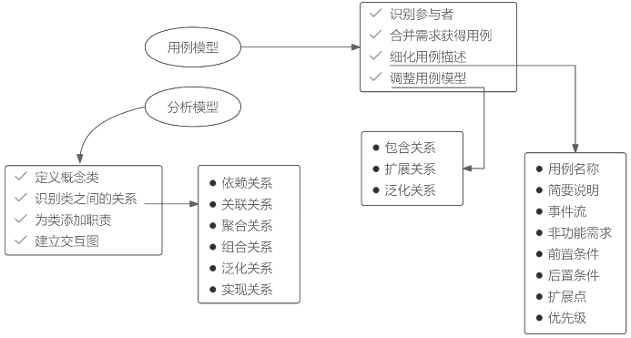

# 面向对象分析

面向对象分析（OOA）的目的是获得对应用问题的理解，确定问题域，以确定系统的功能和性能要求。OOA遵循5个基本步骤：

1. 确定对象和类。
2. 确定结构。结构是指问题域的复杂性和连接关系。类成员结构反映了泛化 - 特化关系，整体 - 部分结构反映整体和局部之间的关系。 
3. 确定主题。主题是指事物的总体概貌和总体分析模型。 
4. 确定属性。属性就是数据元素，可用来描述对象或分类结构的实例。 
5. 确定方法。 

面向对象需求建模:

