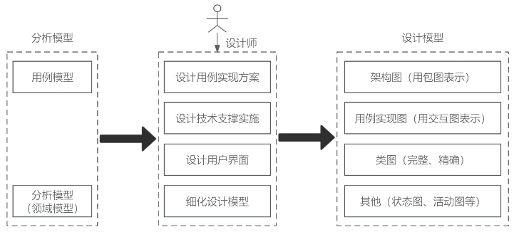

# 面向对象设计

## 最佳实践

### 考察问

1. 🔴🟨❤️OOD类的类型:
    1. ()类: 对应需求中的(), `一定`有属性, `不一定`有操作
    2. ()类: ()需求中的实体(动宾结构), `一定`有操作, `不一定`有属性 
    3. ()类: ()与()交互, 即可有属性, 又可有操作

2. 零碎知识点:
    1. `面向对象的分析模型`主要由()、()、()构成
    2. `面向对象的设计模型`则包含以包图表示的(), 以交互图表示的(), 完整精确的类图, 针对复杂对象的(), 用以描述流程化处理过程的活动图
    3. 最少知识原则：一个软件实体应当尽可能`少`的与其他实体发生`相互作用`。
        - 在类的划分上，应当尽量创建`松耦合的类`
        - 在类的设计上，只要有可能，一个类型应当设计成`不变类`
        - 在类的结构设计上，每个类都应当尽可能`降低`对其`属性和方法`的`访问权限`
        - 在对其他类的引用上，一个对象对其他对象的`引用`应当降到`最低`

### 考察点

1. OOD类的类型:
    1. 实体类: 对应需求中的实体, 一定有属性, 不一定有操作
    2. 控制类: 控制需求中的实体(动宾结构), 一定有操作, 不一定有属性 
    3. 边界类: 参与者与用例交互, 即可有属性, 又可有操作

2. 零碎知识点:
    1. `面向对象的分析模型`主要由`顶层架构图`、`用例与用例图`、`领域概念模型`构成
    2. `面向对象的设计模型`则包含以包图表示的软件体系结构图, 以交互图表示的用例实现图, 完整精确的(), 针对复杂对象的(), 用以描述流程化处理过程的()
    3. 最少知识原则：一个软件实体应当尽可能`少`的与其他实体发生`相互作用`。
        - 在类的划分上，应当尽量创建`松耦合的类`
        - 在类的设计上，只要有可能，一个类型应当设计成`不变类`
        - 在类的结构设计上，每个类都应当尽可能`降低`对其`属性和方法`的`访问权限`
        - 在对其他类的引用上，一个对象对其他对象的`引用`应当降到`最低`

## 概念

面向对象设计(OOD)是将面向对象分析(OOA)所创建的分析模型转化为设计模型，其目标是定义系统构造蓝图。

## OOD的类的类型

在OOD中，类可以分为3种类型：实体类、控制类和边界类。
  
- 实体类：实体类映射需求中的每个实体，保存需要存储在永久存储体中的信息，通常采用业务领域术语命名。通常情况下，实体类`一定有属性，但不一定有操作`。
- 控制类：控制类是用于控制用例工作的类，一般是由动宾结构的短语（“动词＋名词”或“名词＋动词”）转化来的名词，如用例“身份验证”可以对应于一个控制类`身份验证器`。通常情况下，控制类`没有属性，但一定有方法`。
- 边界类：边界类用于系统接口与系统外部进行交互，常见的边界类有窗口、通信协议、`打印机接口`、传感器和终端等。在用例模型中，每个参与者和用例交互至少要有一个边界类，边界类使参与者能与系统交互。通常情况下，`边界类可以既有属性也有方法`。

## 面相对象分析与设计使用的工具图

面向对象的分析模型主要由

1. 顶层架构图
2. 用例与用例图
3. 领域概念模型构成

设计模型则包含

1. 以包图表示的软件体系结构图
2. 以交互图表示的用例实现图
3. 完整精确的类图
4. 针对复杂对象的状态图
5. 用以描述流程化处理过程的活动图等。

🔒题目

2. ❤️面向对象的分析模型主要由______、用例与用例图、领域概念模型构成；设计模型则包含以包图表示的软件体系结构图、以交互图表示的______, 完整精确的类图、针对复杂对象的状态图和描述流程化处理过程的______等。

    - A.业务活动图
    - B.顶层架构图
    - C.数据流模型
    - D.实体联系图

    - A.功能分解图
    - B.时序关系图
    - C.用例实现图
    - D.软件部署图

    - A.序列图
    - B.协作图
    - C.流程图
    - D.活动图

    答案：B C D

## 面向对象设计的原则

1. 单一职责原则：修改某个类的原因有且只有一个，让一个类只做一种责任。
2. 开放 - 封闭原则（open - close原则）：对扩展是开放的，对修改是封闭的。
3. 里氏替换原则：子类型必须能够替换父类型。
4. 依赖倒置原则：抽象不应该依赖于细节，细节应该依赖于抽象。即高层模块不应该依赖于底层模块，二者都应该依赖于抽象。
5. 接口分离原则：客户不应该依赖于它不需要的接口，类间的依赖关系应该建立在最小的接口上。
6. 迪米特法则（最少知识原则）：一个软件实体应当尽可能少的与其他实体发生相互作用。
7. 组合重用原则：要尽量使用组合，而不是继承关系达到重用的目的。
8. 重用发布等价原则：重用的粒度就是发布的粒度。
9. 共同封闭原则：包中的所有类对于同一类性质的变化应该是共同封闭的。一个变化若对一个包产生影响，则将对该包中的所有类产生影响，而对于其他的包不造成任何影响。
10. 共同重用原则：一个包中的所有类应该是共同重用的。如果重用了包中的一个类，那么就要重用包中的所有类。
11. 无环依赖原则：在包的依赖关系图中不允许存在环，即包之间的结构必须是一个直接的无环图形。
12. 稳定依赖原则：朝着稳定的方向进行依赖。
13. 稳定抽象原则：包的抽象程度应该和其稳定程度一致。

🔒题目

1. 💚在面向对象设计的原则中，(  )原则是指抽象不应该依赖于细节，细节应该依赖于抽象，即应针对接口编程，而不是针对实现编程。

    - A.开闭
    - B.里氏替换
    - C.最少知识
    - D.依赖倒置

    答案：D

2. ❤️最少知识原则（也称为迪米特原则）是面向对象设计原则之一，指一个软件实体应当尽可能少地与其他实体发生相互作用。这样，当一个实体被修改时，就会尽可能少地影响其他的实体。下列叙述中，“（  ）”不符最少知识原则。

    - A 在类的划分上，应当尽量创建松耦合的类
    - B 在类的设计上，只要有可能，一个类型应当设计成不变类
    - C 在类的结构设计上，每个类都应当尽可能提高对其属性和方法的访问权限
    - D 在对其他类的引用上，一个对象对其他对象的引用应当降到最低 

    答案: C