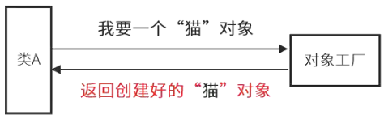
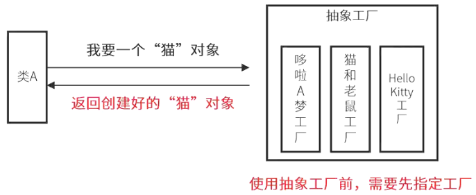
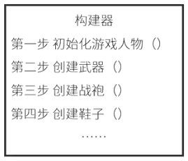
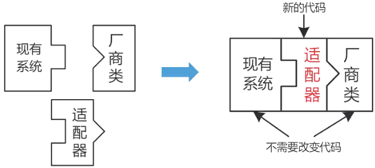
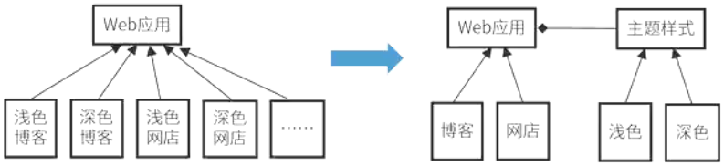
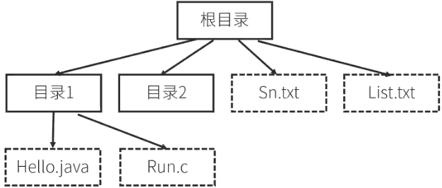
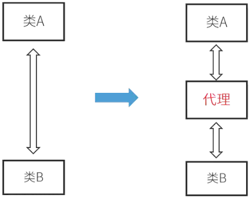
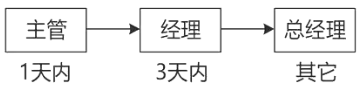
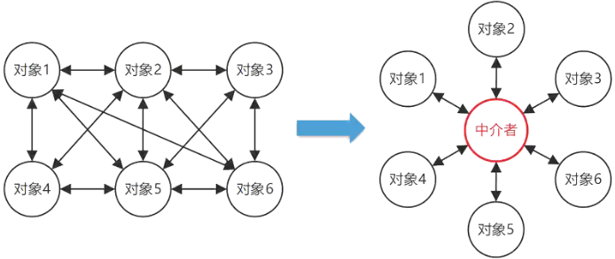
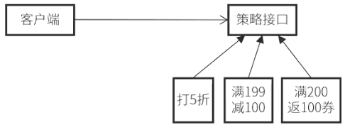

# 设计模式

## 最佳实践

### 考察问


1. 创建型: 主要用于创建对象
    1. `()`方法（Factory Method）: 方法创建, 而非直接创建. 使一个类的实例化延迟到其子类
    2. `()`工厂（Abstract Factory）: 工厂方法的抽象, 生产一系列产品
    3. `()`器（Builder）: 复杂对象的构建与表示分离
    4. `()`（Prototype）: 复制对象
    5. `()`（Singleton）: 单个实例
2. 结构型: 主要用于处理类或对象的组合
    1. `()`（Adapter）: 转换接口
    2. `()`（Bridge）: 解耦抽象与实现
    3. `()`（Composite）: 树形结构
    4. `()`（Decorator: 动态添加职责
    5. `()`（Facade）: 对外统一接口
    6. `()`（Flyweight）: 共享内部状态
    7. `()`（Proxy）: 添加额外逻辑
3. 行为型: 要用于描述类或对象的交互
    1. `()`（Chain of Responsibility）: 传递职责
    2. `()`（Command）: 解耦发送者和接收者
    3. `()`（Interpreter）: 语言转代码
    4. `()`（Iterator）: 分离集合与遍历逻辑
    5. `()`（Mediator）: 解耦发送者和接收者
    6. `()`（Memento）: 解耦状态保存和原发器
    7. `()`（Observer）: 解耦主题和观察者
    8. `()`（State）: 行为根据状态改变而改变
    9. `()`（Strategy）: 多算法切换
    10. `()`（Template Method）: 父类定义模板, 子类具体实现
    11. `()`（Visitor）: 原始类添加新操作


### 考察点

1. 创建型: 主要用于创建对象
    1. `工厂`方法（Factory Method）: 方法创建, 而非直接创建. 使一个类的实例化延迟到其子类`
    2. `抽象`工厂（Abstract Factory）: 工厂方法的抽象, 生产一系列产品
    3. `构建`器（Builder）: 复杂对象的构建与表示分离
    4. `原型`（Prototype）: 复制对象
    5. `单例`（Singleton）: 单个实例
2. 结构型: 主要用于处理类或对象的组合
    1. `适配器`（Adapter）: 转换接口
    2. `桥接`（Bridge）: 解耦抽象与实现
    3. `组合`（Composite）: 树形结构
    4. `装饰`（Decorator: 动态添加职责
    5. `外观`（Facade）: 对外统一接口
    6. `享元`（Flyweight）: 共享内部状态
    7. `代理`（Proxy）: 添加额外逻辑
3. 行为型: 要用于描述类或对象的交互
    1. `责任链`（Chain of Responsibility）: 传递职责
    2. `命令`（Command）: 解耦发送者和接收者
    3. `解释器`（Interpreter）: 语言转代码
    4. `迭代器`（Iterator）: 分离集合与遍历逻辑
    5. `中介者`（Mediator）: 解耦发送者和接收者
    6. `备忘录`（Memento）: 解耦状态保存和原发器
    7. `观察者`（Observer）: 解耦主题和观察者
    8. `状态`（State）: 行为根据状态改变而改变
    9. `策略`（Strategy）: 多算法切换
    10. `模板方法`（Template Method）: 父类定义模板, 子类具体实现
    11. `访问者模式`（Visitor）: 原始类添加新操作

## 概念

模式是对特定问题的解决方案。设计模式的核心在于提供了相关问题的解决方案，使人们可以更加简单方便地复用成功的设计和体系结构。设计模式是前人通过开发经验对特定的代码进行设计，编写总结出来的一套解决特定问题的方案，来提高代码的可维护性、可重用性、可理解性、可靠性等。

设计模式的优点：

1. 是前人经验的总结，可以降低开发人员理解系统的复杂度
2. 可以方便地复用成功的设计和体系结构
3. 使设计方案更加灵活，且易于修改
4. 提高软件的开发效率和软件质量，提高设计水平
5. 有助于更加深入地理解面向对象思想

## 设计模式的要素

设计模式的四个基本要素为：

1. 模式名称
2. 问题
3. 解决方案
4. 效果

## 设计模式的分类

共有23种，这些设计模式可以按两个准则来分类：

- 按设计模式的目的划分，可分为`创建型`、`结构型`和`行为型`三种模式。

    - 创建型设计模式与对象的创建有关；

        - 工厂方法（Factory Method）模式
        - 抽象工厂（Abstract Factory）模式
        - 构建器（Builder）模式
        - 原型（Prototype）模式
        - 单例（Singleton）模式

    - 结构型设计模式处理类或对象的组合；

        - 适配器（Adapter）模式
        - 桥接（Bridge）模式
        - 组合（Composite）模式
        - 装饰（Decorator）模式
        - 外观（Facade）模式
        - 享元（Flyweight）模式
        - 代理（Proxy）模式

    - 行为型设计模式对类或对象怎样交互和怎样分配职责进行描述。

        - 职责链（Chain of Responsibility）模式
        - 命令（Command）模式
        - 解释器（Interpreter）模式
        - 迭代器（Iterator）模式
        - 中介者（Mediator）模式
        - 备忘录（Memento）模式
        - 观察者（Observer）模式
        - 状态（State）模式
        - 策略（Strategy）模式
        - 模板方法（Template Method）模式
        - 访问者（Visitor）模式

- 按设计模式的范围划分，即根据设计模式是作用于类还是作用于对象来划分，可以把设计模式分为类设计模式和对象设计模式。

## 创建型设计模式

- 主要用于对象的创建。
- 创建型设计模式抽象了实例化过程，它们帮助一个系统独立于如何创建、组合和表示它的那些对象。一个类创建型模式使用继承改变被实例化的类，而一个对象创建型模式将实例化委托给另一个对象。
- 将对象的创建和对象的使用分离，在使用对象时无需知道对象创建的细节，使设计更加符合单一职责原则，降低了系统的耦合性，且易于扩展，包括：
    - 抽象工厂模式（Abstract Factory）
    - 生成器模式（Builder）
    - 工厂方法模式（Factory Method）
    - 原型模式（Prototype）
    - 单例模式（Singleton）

|创建型设计模式|定义|记忆口诀|
| ---- | ---- | ---- |
|工厂方法模式（Factory Method）|定义一个用于创建对象的接口，让子类决定实例化哪一个类。使一个类的实例化延迟到其子类|子类决定实例化|
|抽象工厂模式（Abstract Factory）|提供一个创建一系列相关或相互依赖的对象的接口，而无需指定它们具体的类|抽象接口|
|原型模式（Prototype）|用原型实例指定创建对象的种类，并且通过复制这些原型创建新的对象|原型实例|
|单例模式（Singleton）|保证一个类只有一个实例，并提供一个访问它的全局访问点|只有一个实例|
|生成器模式（Builder）|将一个复杂对象的构建与它的表示分离，使得同样的构建过程可以创建不同的表示|构造分离|

### 工厂方法模式（Factory Method）

定义一个用于创建对象的接口，让子类决定实例化哪一个类。使一个类的实例化延迟到其子类。简记为动态生产对象.

适用场景：

1. 当一个类不知道它所必须创建的对象的类的时候。
2. 当一个类希望由它的子类来指定它所创建的对象的时候。
3. 当类将创建对象的职责委托给多个帮助子类中的某一个，并且你希望将哪一个帮助子类是代理者这一信息局部化的时候。



```python
from abc import ABC, abstractmethod

# 抽象产品：武器
class Weapon(ABC):
    @abstractmethod
    def attack(self):
        pass

# 抽象工厂：武器工厂
class WeaponFactory(ABC):
    @abstractmethod
    def create_weapon(self) -> Weapon:
        pass

# 具体产品：剑
class Sword(Weapon):
    def attack(self):
        print("挥剑攻击")

# 具体产品：弓
class Bow(Weapon):
    def attack(self):
        print("射箭攻击")

# 具体产品：法杖
class Staff(Weapon):
    def attack(self):
        print("释放魔法")


# 具体工厂：近战武器工厂（创建剑）
class MeleeWeaponFactory(WeaponFactory):
    def create_weapon(self) -> Weapon:
        return Sword()  # 子类决定创建剑

# 具体工厂：远程武器工厂（创建弓）
class RangedWeaponFactory(WeaponFactory):
    def create_weapon(self) -> Weapon:
        return Bow()  # 子类决定创建弓

# 具体工厂：魔法武器工厂（创建法杖）
class MagicWeaponFactory(WeaponFactory):
    def create_weapon(self) -> Weapon:
        return Staff()  # 子类决定创建法杖

def client_code(factory: WeaponFactory):
    weapon = factory.create_weapon()  # 父类只定义接口，不关心具体创建什么
    weapon.attack()

# 使用近战武器工厂
client_code(MeleeWeaponFactory())  # 输出：挥剑攻击

# 使用远程武器工厂
client_code(RangedWeaponFactory())  # 输出：射箭攻击
```

代码解释:

1. 父类（WeaponFactory）只定义接口: 父类中声明了create_weapon()方法，但没有实现具体创建逻辑（只是返回抽象的Weapon类型）。
2. 子类（如MeleeWeaponFactory）负责具体实例化: 每个子类重写create_weapon()方法时，明确指定要创建的具体产品（如Sword、Bow）。
3. 客户端只依赖抽象: 客户端代码（client_code）只需要通过抽象工厂接口调用create_weapon()，不需要知道具体创建的是哪种武器。

优势:

1. 将对象创建逻辑封装在工厂类中：客户端不需要直接实例化具体产品类，而是通过调用工厂方法来获取产品。
2. 扩展性强：如果需要添加新的产品类型（如轮船），只需创建新的具体产品类和对应的工厂类，不需要修改现有代码，符合开闭原则。
3. 解耦对象的创建和使用：客户端只依赖于抽象产品和抽象工厂，不依赖于具体实现，降低了代码的耦合度。

### 抽象工厂模式（Abstract Factory）

提供一个创建一系列相关或相互依赖的对象的接口，而无需指定它们具体的类。简记为生产成系列对象.

适用场景：

- 一个系统要独立于它的产品的创建、组合和表示时。
- 一个系统要由多个产品系列中的一个来配置时。
- 当要强调一系列相关的产品对象的设计以便进行联合使用时。
- 当提供一个产品类库，只想显示它们的接口而不是实现时。

提供一个接口，可以创建一系列相关或相互依赖的对象，而无需指定它们具体的类。



### 生成器模式（Builder）

将一个复杂对象的构建与它的表示分离，使得同样的构建过程可以创建不同的表示。简记复杂对象构造.

适用场景：

- 当创建复杂对象的算法应该独立于该对象的组成部分以及它们的装配方式时。
- 当构造过程必须允许被构造的对象有不同的表示时。
- 简要说明：将一个复杂类的表示与其构造相分离，使得相同的构建过程能够得出不同的表示。



```python
# 产品类：电脑
class Computer:
    def __init__(self):
        self.cpu = None
        self.ram = None
        self.storage = None
        self.gpu = None

    def __str__(self):
        return f"Computer: CPU={self.cpu}, RAM={self.ram}, Storage={self.storage}, GPU={self.gpu}"


# 抽象生成器类
class ComputerBuilder:
    def __init__(self):
        self.computer = Computer()

    def build_cpu(self):
        pass

    def build_ram(self):
        pass

    def build_storage(self):
        pass

    def build_gpu(self):
        pass

    def get_result(self):
        return self.computer


# 具体生成器类：高端电脑生成器
class HighEndComputerBuilder(ComputerBuilder):
    def build_cpu(self):
        self.computer.cpu = "Intel Core i9"

    def build_ram(self):
        self.computer.ram = "32GB"

    def build_storage(self):
        self.computer.storage = "1TB SSD"

    def build_gpu(self):
        self.computer.gpu = "NVIDIA RTX 3080"


# 具体生成器类：低端电脑生成器
class LowEndComputerBuilder(ComputerBuilder):
    def build_cpu(self):
        self.computer.cpu = "Intel Core i3"

    def build_ram(self):
        self.computer.ram = "8GB"

    def build_storage(self):
        self.computer.storage = "256GB SSD"

    def build_gpu(self):
        self.computer.gpu = "Integrated Graphics"


# 指挥者类
class Director:
    def __init__(self, builder):
        self.builder = builder

    def construct_computer(self):
        self.builder.build_cpu()
        self.builder.build_ram()
        self.builder.build_storage()
        self.builder.build_gpu()
        return self.builder.get_result()


# 客户端代码
if __name__ == "__main__":
    # 创建高端电脑生成器和指挥者
    high_end_builder = HighEndComputerBuilder()
    director = Director(high_end_builder)
    high_end_computer = director.construct_computer()
    print(high_end_computer)

    # 创建低端电脑生成器和指挥者
    low_end_builder = LowEndComputerBuilder()
    director = Director(low_end_builder)
    low_end_computer = director.construct_computer()
    print(low_end_computer)
```

### 原型模式（Prototype）

用原型实例指定创建对象的种类，并且通过复制这些原型创建新的对象。简记为复制对象

适用场景：

1. 当一个系统应该独立于它的产品创建、构成和表示时。
2. 当要实例化的类是在运行时刻指定时，例如，通过动态装载。
3. 为了避免创建一个与产品类层次平行的工厂类层次时。
4. 当一个类的实例只能有几个不同状态组合中的一种时。建立相应数目的原型并克隆它们，可能比每次用合适的状态手工实例化该类更方便一些。

```python
import copy


# 抽象原型类
class Shape:
    def clone(self):
        pass

    def draw(self):
        pass


# 具体原型类：圆形
class Circle(Shape):
    def __init__(self, radius=0, x=0, y=0):
        self.radius = radius
        self.x = x
        self.y = y

    def clone(self):
        return copy.deepcopy(self)

    def draw(self):
        print(f"Drawing a circle at ({self.x}, {self.y}) with radius {self.radius}")


# 具体原型类：矩形
class Rectangle(Shape):
    def __init__(self, width=0, height=0, x=0, y=0):
        self.width = width
        self.height = height
        self.x = x
        self.y = y

    def clone(self):
        return copy.deepcopy(self)

    def draw(self):
        print(f"Drawing a rectangle at ({self.x}, {self.y}) with width {self.width} and height {self.height}")


# 客户端代码
if __name__ == "__main__":
    # 创建一个圆形实例
    circle = Circle(radius=5, x=10, y=10)
    # 克隆圆形实例
    circle_clone = circle.clone()
    circle.draw()
    circle_clone.draw()

    # 创建一个矩形实例
    rectangle = Rectangle(width=10, height=5, x=20, y=20)
    # 克隆矩形实例
    rectangle_clone = rectangle.clone()
    rectangle.draw()
    rectangle_clone.draw()
```

### 单例模式（Singleton）

保证一个类只有一个实例，并提供一个访问它的全局访问点。简单记为单实例.

适用场景：

1. 当类只能有一个实例而且客户可以从一个众所周知的访问点访问它时。
2. 当这个唯一实例应该是通过子类化可扩展的，并且客户无须更改代码就能使用一个扩展的实例时。

## 结构型设计模式

主要用于处理类或对象的组合。

分为结构型类模式和结构型对象模式，在结构型类模式中主要是类的继承和实现，在结构型对象模式中主要是类与对象的关联关系，根据组合重用原则，大部分结构型模式是结构型对象模式，包括：

1. 适配器模式（Adapter）
2. 桥接模式（Bridge）
3. 组合模式（Composite）
4. 装饰模式（Decorator）
5. 外观模式（Facade）
6. 享元模式（Flyweight）
7. 代理模式（Proxy）

适配器模式可以是结构型类模式也可以是结构型对象模式，其他均为结构型对象模式。

|结构型设计模式|定义|记忆口诀|
| ---- | ---- | ---- |
|适配器模式（Adapter）|将一个类的接口转换成客户希望的另一种接口。它使得原本由于接口不兼容而不能一起工作的那些类可以一起工作|转换成兼容接口|
|桥接模式（Bridge）|将抽象部分与其实现部分分离，使它们都可以独立的变化|抽象与实现分离|
|组合模式（Composite）|将对象组合成树型结构以表示“部分-整体”的层次结构，它使得用户对单个对象和组合对象的使用具有一致性|树型结构|
|装饰模式（Decorator）|动态地给一个对象添加一些额外的职责|额外的职责|
|外观模式（Facade）|为子系统中的一组接口提供一个一致的界面，它定义了一个高层接口，这个接口使得这一子系统更加容易使用|一致的界面|
|享元模式（Flyweight）|运用共享技术有效地支持大量细粒度的对象|共享|
|代理模式（Proxy）|为其他对象提供一种代理以控制对这个对象的访问|代理|

### 适配器模式（Adapter）

将一个类的接口转换成客户希望的另一种接口。它使得原本由于接口不兼容而不能一起工作的那些类可以一起工作。速记关键字：转换接口

适用场景：

1. 想使用一个已经存在的类，而它的接口不符合要求。
2. 想创建一个可以复用的类，该类可以与其他不相关的类或不可预见的类(即那些接口可能不一定兼容的类)协同工作。
3. (仅适用于对象Adapter)想使用一个已经存在的子类，但是不可能对每一个都进行子类化以匹配它们的接口。对象适配器可以适配它的父类接口。



### 桥接模式（Bridge）

将抽象部分与其实现部分分离，使它们都可以独立的变化。速记关键字：解耦抽象与实现

适用场景：

1. 不希望在抽象和它的实现部分之间有一个固定的绑定关系。
2. 类的抽象以及它的实现都应该可以通过生成子类的方法加以扩充。
3. 对一个抽象的实现部分的修改应对客户不产生影响，即客户代码不必重新编译。
4. (C++)想对客户完全隐藏抽象的实现部分。
5. 有许多类要生成的类层次结构。
6. 想在多个对象间共享实现(可能使用引用计数)，但同时要求客户并不知道这一点。



```python
# ========== 实现部分（Implementor） ==========
class OS:
    def paint(self):
        pass

class WindowsOS(OS):
    def paint(self):
        return "Windows风格按钮"

class MacOS(OS):
    def paint(self):
        return "macOS风格按钮"

# ========== 抽象部分（Abstraction） ==========
class Button:
    def __init__(self, os: OS):
        self.os = os  # 桥接实现部分

    def render(self):
        return f"渲染{self.os.paint()}"

# ========== 扩展抽象部分（Refined Abstraction） ==========
class RoundButton(Button):
    def render(self):
        return f"圆形{super().render()}"

class SquareButton(Button):
    def render(self):
        return f"方形{super().render()}"

# ========== 客户端代码 ==========
if __name__ == "__main__":
    # 在Windows上渲染圆形按钮
    windows_round_button = RoundButton(WindowsOS())
    print(windows_round_button.render())  # 输出: 圆形渲染Windows风格按钮

    # 在macOS上渲染方形按钮
    mac_square_button = SquareButton(MacOS())
    print(mac_square_button.render())     # 输出: 方形渲染macOS风格按钮    
```

关键角色分析

1. 实现部分（Implementor）：

    1. OS：定义操作系统的抽象接口。
    2. WindowsOS、MacOS：具体实现不同操作系统的渲染逻辑。

2. 抽象部分（Abstraction）：

    1. Button：持有一个OS对象的引用（桥接），定义通用按钮行为。
    2. RoundButton、SquareButton：扩展抽象类，增加特定形状的按钮。

3. 客户端：

    通过组合不同的抽象和实现，可以创建各种按钮（如 Windows 圆形按钮、macOS 方形按钮）。

桥接的优势:

1. 解耦抽象与实现：按钮形状（抽象）和操作系统（实现）可以独立变化。
2. 扩展性强：新增操作系统（如 Linux）或按钮形状（如三角形）时，无需修改现有代码。

### 组合模式（Composite）

将对象组合成树型结构以表示“部分-整体”的层次结构，它使得用户对单个对象和组合对象的使用具有一致性。速记关键字：树形目录结构

适用场景：

1. 想表示对象的部分-整体层次结构。
2. 希望用户忽略组合对象与单个对象的不同，用户将统一地使用组合结构中的所有对象。



```python
from abc import ABC, abstractmethod

# 抽象组件类（员工）
class Employee(ABC):
    @abstractmethod
    def get_info(self):
        pass

    @abstractmethod
    def add(self, employee):
        pass

    @abstractmethod
    def remove(self, employee):
        pass

    @abstractmethod
    def get_children(self):
        pass

# 叶子节点（普通员工）
class RegularEmployee(Employee):
    def __init__(self, name, position):
        self.name = name
        self.position = position

    def get_info(self):
        return f"普通员工: {self.name}, 职位: {self.position}"

    def add(self, employee):
        print("普通员工不能添加下属")

    def remove(self, employee):
        print("普通员工不能移除下属")

    def get_children(self):
        return []

# 组合节点（经理）
class Manager(Employee):
    def __init__(self, name, position):
        self.name = name
        self.position = position
        self.subordinates = []

    def get_info(self):
        return f"经理: {self.name}, 职位: {self.position}"

    def add(self, employee):
        self.subordinates.append(employee)

    def remove(self, employee):
        self.subordinates.remove(employee)

    def get_children(self):
        return self.subordinates

# 客户端代码
if __name__ == "__main__":
    # 创建员工
    developer1 = RegularEmployee("张三", "后端开发")
    developer2 = RegularEmployee("李四", "前端开发")
    tester = RegularEmployee("王五", "测试")

    # 创建经理
    tech_manager = Manager("赵六", "技术经理")
    hr_manager = Manager("钱七", "人力资源经理")

    # 构建组织结构
    tech_manager.add(developer1)
    tech_manager.add(developer2)
    hr_manager.add(tester)

    # 打印信息
    print(tech_manager.get_info())
    for subordinate in tech_manager.get_children():
        print(f"  下属: {subordinate.get_info()}")

    print(hr_manager.get_info())
    for subordinate in hr_manager.get_children():
        print(f"  下属: {subordinate.get_info()}")
```

在这个例子中：

1. Employee 是抽象组件类，定义了所有员工（包括普通员工和经理）的通用接口。
2. RegularEmployee 是叶子节点，表示普通员工，它不能包含子节点。
3. Manager 是组合节点，表示经理，它可以包含子节点（下属）。
4. 客户端代码可以统一处理单个员工（叶子节点）和经理（组合节点），例如调用 get_info() 方法获取信息，或调用 add() 方法添加下属。

### 装饰模式（Decorator）

在不修改对象外观和功能的情况下添加或者删除对象功能，即动态地给一个对象添加一些额外的职责. 速记关键字：动态添加职责

适用场景：

1. 在不影响其他对象的情况下，以动态、透明的方式给单个对象添加职责。
2. 处理那些可以撤销的职责。
3. 当不能采用生成子类的方式进行扩充时。一种情况是，可能有大量独立的扩展，为支持每一种组合将产生大量的子类，使得子类数目呈爆炸性增长。另一种情况可能是，由于类定义被隐藏，或类定义不能用于生成子类。

### 外观模式（Facade）

为子系统中的一组接口提供一个一致的界面，它定义了一个高层接口，这个接口使得这一子系统更加容易使用。速记关键字：对外统一接口

适用场景：

1. 要为一个复杂子系统提供一个简单接口时，Facade可以提供一个简单的默认视图。
2. 客户程序与抽象类的实现部分之间存在着很大的依赖性。引入Facade将这个子系统与客户以及其他的子系统分离，可以提高子系统的独立性和可移植性。
3. 当需要构建一个层次结构的子系统时，使用Facade模式定义子系统中每层的入口点。如果子系统之间是相互依赖的，则可以让它们仅通过Facade进行通信，从而简化了它们之间的依赖关系。

### 享元模式（Flyweight）

通过共享对象来减少内存使用，尤其适用于需要创建大量相似对象的场景。

适用场景：

1. 一个应用程序使用了大量的对象。
2. 完全由于使用大量的对象，造成很大的存储开销。
3. 对象的大多数状态都可变为外部状态。
4. 如果删除对象的外部状态，那么可以用相对较少的共享对象取代很多组对象。
5. 应用程序不依赖于对象标识。由于Flyweight对象可以被共享，所以对于概念上明显有别的对象，标识测试将返回真值。

```python
# 享元类：字符
class Character:
    def __init__(self, char, font, size, color):
        self.char = char  # 内部状态：不可变，共享
        self.font = font  # 内部状态：不可变，共享
        self.size = size  # 内部状态：不可变，共享
        self.color = color  # 内部状态：不可变，共享

    def display(self, position):
        # position是外部状态，在使用时传入
        print(f"在位置{position}显示字符: {self.char}, 字体: {self.font}, 大小: {self.size}, 颜色: {self.color}")

# 享元工厂：管理和提供字符对象
class CharacterFactory:
    _characters = {}  # 缓存已创建的字符对象

    @staticmethod
    def get_character(char, font, size, color):
        key = f"{char}_{font}_{size}_{color}"
        if key not in CharacterFactory._characters:
            # 如果对象不存在，则创建并缓存
            CharacterFactory._characters[key] = Character(char, font, size, color)
        return CharacterFactory._characters[key]

# 客户端代码
if __name__ == "__main__":
    factory = CharacterFactory()

    # 创建多个相同的字符对象（共享）
    char1 = factory.get_character('A', 'Arial', 12, 'black')
    char2 = factory.get_character('A', 'Arial', 12, 'black')
    char3 = factory.get_character('B', 'Arial', 12, 'black')

    # 显示字符，传入不同的位置（外部状态）
    char1.display(10)
    char2.display(20)
    char3.display(30)

    # 验证对象是否共享
    print(char1 is char2)  # 输出: True（对象被共享）
    print(char1 is char3)  # 输出: False（字符不同，对象不共享）
```

在这个例子中：

1. Character 是享元类，它包含了字符的内部状态（如字符内容、字体、大小、颜色），这些状态是不可变的，并且可以被多个对象共享。
2. CharacterFactory 是享元工厂，负责创建和管理享元对象。它维护了一个缓存池，存储已经创建的字符对象，当需要相同的字符时，直接从缓存中获取，而不是创建新对象。
3. 在客户端代码中，我们通过工厂获取了多个字符对象，其中 char1 和 char2 的内部状态完全相同，因此它们实际上是同一个对象（通过 is 运算符验证），而 char3 由于字符内容不同，是一个不同的对象。
享元模式的优点包括：

1. 大幅减少对象的创建数量，降低内存占用。
2. 提高系统性能，特别是在需要创建大量相似对象的场景中。

### 代理模式（Proxy）

为其他对象提供一种代理以控制对这个对象的访问。速记关键字：快捷方式

适用场景：

1. 远程代理(Remote Proxy)为一个对象在不同地址空间提供局部代表。
2. 虚代理(Virtual Proxy)根据需要创建开销很大的对象。
3. 保护代理(Protection Proxy)控制对原始对象的访问，用于对象应该有不同的访问权限的时候。
4. 智能引用(Smart Reference)取代了简单的指针，它在访问对象时执行一些附加操作。



```python
# ========== 抽象主题（Subject） ==========
class Image:
    def display(self):
        pass

# ========== 真实主题（Real Subject） ==========
class RealImage(Image):
    def __init__(self, filename):
        self.filename = filename
        self.load_from_disk()  # 初始化时加载图片（可能很慢）

    def load_from_disk(self):
        print(f"加载图片: {self.filename}")

    def display(self):
        print(f"显示图片: {self.filename}")

# ========== 代理（Proxy） ==========
class ProxyImage(Image):
    def __init__(self, filename):
        self.filename = filename
        self.real_image = None  # 延迟加载真实图片

    def display(self):
        if self.real_image is None:
            self.real_image = RealImage(self.filename)  # 首次访问时才加载
        self.real_image.display()  # 委托给真实对象

# ========== 客户端代码 ==========
if __name__ == "__main__":
    # 使用代理访问图片
    image = ProxyImage("example.jpg")

    print("第一次调用 display():")
    image.display()  # 第一次调用，需要加载图片

    print("\n第二次调用 display():")
    image.display()  # 第二次调用，直接使用缓存的图片    
```

关键角色分析

1. 抽象主题（Subject）：Image：定义图片显示的接口。
2. 真实主题（Real Subject）：RealImage：实际处理图片加载和显示的类，初始化时会加载图片。
3. 代理（Proxy）：
    1. ProxyImage：持有对RealImage的引用，控制对其的访问。
    2. 延迟加载：首次调用display()时才创建RealImage对象。
    3. 缓存：避免重复加载相同的图片。
4. 客户端：通过ProxyImage间接访问RealImage，无需关心加载细节。

代理模式的优势

1. 控制访问：可以在访问真实对象前后添加额外逻辑（如权限验证、缓存、延迟加载）。
2. 降低耦合：客户端与真实对象解耦，只依赖抽象接口。
3. 提高性能：通过缓存或延迟加载减少资源消耗。

代理和装饰的区别:

1. 代理是对象的`经纪人`，负责管理对象的访问。
2. 装饰器是对象的`配件`，负责给对象添加额外功能。

## 行为型设计模式

主要描述类或对象的交互行为。用于描述对类或对象怎样交互和怎样分配职责，包括：

1. 责任链模式（Chain of Responsibility）
2. 命令模式（Command）
3. 解释器模式（Interpreter）
4. 迭代器模式（Iterator）
5. 中介者模式（Mediator）
6. 备忘录模式（Memento）
7. 观察者模式（Observer）
8. 状态模式（State）
9. 策略模式（Strategy）
10. 模板方法模式（Template Method）
11. 访问者模式（Visitor）

|行为型设计模式|定义|记忆口诀|
| ---- | ---- | ---- |
|责任链模式（Chain of Responsibility）|使多个对象都有机会处理请求，从而避免请求的发送者和接收者之间的耦合关系。将这些对象连成一条链，并沿着这条链传递该请求，直到有一个对象处理它为止|机会连成一条链|
|命令模式（Command）|将一个请求封装为一个对象，从而使得可以用不同的请求对客户进行参数化；对请求排队或记录请求日志，以及支持可撤销的操作|参数化|
|解释器模式（Interpreter）|给定一个语言，定义它的文法的一种表示，并定义一个解释器，这个解释器使用该表示来解释语言中的句子|解释器|
|迭代器模式（Iterator）|提供一种方法顺序访问一个聚合对象中的各个元素，且不需要暴露该对象的内部表示|顺序访问|
|中介者模式（Mediator）|用一个中介对象来封装一系列的对象交互。它使各对象不需要显示地相互引用，从而使其耦合松散，而且可以独立地改变它们之间的交互|中介对象|
|备忘录模式（Memento）|在不破坏封装性的前提下捕获一个对象的内部状态，并在对象之外保存这个状态。这样以后就可以将对象恢复到原先保存的状态|保存状态|
|观察者模式（Observer）|定义对象间的一种一对多的依赖关系，当一个对象的状态发生改变时，所有依赖于它的对象都得到通知并自动更新|自动更新|
|状态模式（State）|允许一个对象在其内部状态改变时改变它的行为|状态改变|
|策略模式（Strategy）|定义一系列的算法，把它们一个个封装起来，并且使它们可以相互替换。它使得算法可以独立于使用它们的客户而变化|算法相互替换|
|模板方法模式（Template Method）|定义一个操作中的算法骨架，而将一些步骤延迟到子类中。它使得子类可以不改变一个算法的结构即可重新定义该算法的某些特定步骤|重新定义算法|
|访问者模式（Visitor）|表示一个作用于某对象结构中的各元素的操作。它允许在不改变各元素的类的前提下定义作用于这些元素的新操作|新操作|

### 责任链模式（Chain of Responsibility）

请求沿着处理者链进行传递，直到有一个处理者能够处理该请求为止。这种模式将请求的发送者和接收者解耦，使得多个对象都有机会处理请求。速记关键字：传递职责

适用场景：

1. 有多个的对象可以处理一个请求，哪个对象处理该请求运行时刻自动确定。
2. 想在不明确指定接收者的情况下向多个对象中的一个提交一个请求。
3. 可处理一个请求的对象集合应被动态指定。



```python
from abc import ABC, abstractmethod

# 抽象处理者类
class Approver(ABC):
    def __init__(self, next_approver=None):
        self.next_approver = next_approver  # 指向下一个处理者的引用

    def set_next_approver(self, approver):
        self.next_approver = approver
        return approver  # 方便链式调用

    @abstractmethod
    def process_request(self, days):
        pass

# 具体处理者：组长
class TeamLeader(Approver):
    def process_request(self, days):
        if days <= 1:
            print(f"组长批准了 {days} 天的假期")
        else:
            print(f"组长无法批准 {days} 天的假期，已转交项目经理")
            if self.next_approver:
                self.next_approver.process_request(days)

# 具体处理者：项目经理
class ProjectManager(Approver):
    def process_request(self, days):
        if days <= 3:
            print(f"项目经理批准了 {days} 天的假期")
        else:
            print(f"项目经理无法批准 {days} 天的假期，已转交部门经理")
            if self.next_approver:
                self.next_approver.process_request(days)

# 具体处理者：部门经理
class DepartmentManager(Approver):
    def process_request(self, days):
        if days <= 7:
            print(f"部门经理批准了 {days} 天的假期")
        else:
            print(f"部门经理无法批准 {days} 天的假期，请假申请被拒绝")

# 客户端代码
if __name__ == "__main__":
    # 创建处理者
    team_leader = TeamLeader()
    project_manager = ProjectManager()
    department_manager = DepartmentManager()

    # 构建责任链
    team_leader.set_next_approver(project_manager).set_next_approver(department_manager)

    # 提交不同天数的请假申请
    team_leader.process_request(1)   # 组长可以处理
    print()
    team_leader.process_request(3)   # 项目经理可以处理
    print()
    team_leader.process_request(5)   # 部门经理可以处理
    print()
    team_leader.process_request(10)  # 无人能处理，申请被拒绝
```

在这个例子中：

1. Approver 是抽象处理者类，定义了处理请求的接口和设置下一个处理者的方法。
2. TeamLeader、ProjectManager 和 DepartmentManager 是具体处理者，它们各自负责处理特定范围内的请假天数，如果超出自己的权限，则将请求传递给下一个处理者。
3. 在客户端代码中，我们创建了三个处理者并构建了责任链，然后提交不同天数的请假申请，观察请求如何在责任链中传递和被处理。

责任链模式的优点包括：

1. 降低了请求发送者和接收者之间的耦合度。
2. 可以动态地添加或修改处理者，增强了系统的灵活性。
3. 简化了对象的相互连接，每个处理者只需要知道下一个处理者即可。

### 命令模式（Command）

把请求封装成一个对象，从而让你可以用不同的请求对客户进行参数化，对请求排队或记录请求日志，以及支持可撤销的操作。速记关键字：日志记录，可撤销

适用场景：

1. 抽象出待执行的动作以参数化某对象。
2. 在不同的时刻指定、排列和执行请求。
3. 支持取消操作。
4. 支持修改日志。
5. 用构建在原语操作上的高层操作构造一个系统。

```python
# ========== 接收者（Receiver）：实际执行操作的对象 ==========
class Light:
    def turn_on(self):
        print("电灯已打开")
    
    def turn_off(self):
        print("电灯已关闭")

class TV:
    def turn_on(self):
        print("电视已打开")
    
    def turn_off(self):
        print("电视已关闭")

# ========== 命令接口（Command） ==========
class Command:
    def execute(self):
        pass
    
    def undo(self):
        pass

# ========== 具体命令类 ==========
class LightOnCommand(Command):
    def __init__(self, light):
        self.light = light
    
    def execute(self):
        self.light.turn_on()
    
    def undo(self):
        self.light.turn_off()

class LightOffCommand(Command):
    def __init__(self, light):
        self.light = light
    
    def execute(self):
        self.light.turn_off()
    
    def undo(self):
        self.light.turn_on()

class TVOnCommand(Command):
    def __init__(self, tv):
        self.tv = tv
    
    def execute(self):
        self.tv.turn_on()
    
    def undo(self):
        self.tv.turn_off()

class TVOffCommand(Command):
    def __init__(self, tv):
        self.tv = tv
    
    def execute(self):
        self.tv.turn_off()
    
    def undo(self):
        self.tv.turn_on()

# ========== 调用者（Invoker）：遥控器 ==========
class RemoteControl:
    def __init__(self):
        self.command = None  # 存储当前命令
        self.history = []    # 记录命令历史，用于撤销
    
    def set_command(self, command):
        self.command = command
    
    def press_button(self):
        self.command.execute()
        self.history.append(self.command)
    
    def press_undo_button(self):
        if self.history:
            last_command = self.history.pop()
            last_command.undo()
        else:
            print("没有可撤销的命令")

# ========== 客户端代码 ==========
if __name__ == "__main__":
    # 创建接收者
    light = Light()
    tv = TV()

    # 创建命令
    light_on = LightOnCommand(light)
    light_off = LightOffCommand(light)
    tv_on = TVOnCommand(tv)
    tv_off = TVOffCommand(tv)

    # 创建调用者（遥控器）
    remote = RemoteControl()

    # 使用遥控器控制电灯
    remote.set_command(light_on)
    remote.press_button()  # 输出: 电灯已打开

    remote.set_command(light_off)
    remote.press_button()  # 输出: 电灯已关闭

    # 使用遥控器控制电视
    remote.set_command(tv_on)
    remote.press_button()  # 输出: 电视已打开

    # 撤销操作
    remote.press_undo_button()  # 输出: 电视已关闭    
```

关键角色分析

1. 接收者（Receiver）：Light、TV：实际执行操作的对象，知道如何完成具体任务。
2. 命令接口（Command）：Command：定义执行和撤销操作的接口。
3. 具体命令（Concrete Command）：LightOnCommand、LightOffCommand 等：封装接收者的操作，实现命令接口。
4. 调用者（Invoker）：RemoteControl：持有命令对象，负责调用命令的执行方法，支持撤销。
5. 客户端：创建接收者、命令和调用者，并将它们关联起来。

命令模式的优势

1. 解耦请求与实现：发送者（遥控器）和接收者（设备）不直接交互，通过命令对象解耦。
2. 支持撤销操作：命令对象可以实现 undo() 方法，方便回滚操作。
3. 支持命令队列和记录：可以将命令存储在队列中或记录日志，实现批处理或事务。
4. 符合开闭原则：新增命令无需修改现有代码，扩展性强。

### 解释器模式（Interpreter）

提供一个解释器来解释该语法中的句子。这种模式常用于 SQL 解析、符号处理引擎等场景。

适用场景：

1. 当有一个语言需要解释执行，并且可将该语言中的句子表示为一个抽象语法树时。

```python
# 抽象表达式类
class Expression:
    def interpret(self):
        pass

# 数字表达式类
class Number(Expression):
    def __init__(self, value):
        self.value = value
    
    def interpret(self):
        return self.value

# 加法表达式类
class Add(Expression):
    def __init__(self, left, right):
        self.left = left
        self.right = right
    
    def interpret(self):
        return self.left.interpret() + self.right.interpret()

# 减法表达式类
class Subtract(Expression):
    def __init__(self, left, right):
        self.left = left
        self.right = right
    
    def interpret(self):
        return self.left.interpret() - self.right.interpret()

# 解释器类
class Interpreter:
    def parse(self, expression):
        # 简单的解析逻辑，实际应用中可能需要更复杂的语法分析
        tokens = expression.split()
        stack = []
        
        for token in tokens:
            if token == '+':
                right = stack.pop()
                left = stack.pop()
                stack.append(Add(left, right))
            elif token == '-':
                right = stack.pop()
                left = stack.pop()
                stack.append(Subtract(left, right))
            else:
                # 假设token是数字
                stack.append(Number(int(token)))
        
        return stack.pop()

# 客户端代码
if __name__ == "__main__":
    interpreter = Interpreter()
    
    # 解析并计算表达式 "5 + 3 - 2"
    expression = interpreter.parse("5 + 3 - 2")
    result = expression.interpret()
    
    print(f"表达式计算结果: {result}")  # 输出: 表达式计算结果: 6
```

在这个例子中：

1. Expression 是抽象表达式类，定义了解释方法 interpret。
2. Number、Add 和 Subtract 是具体表达式类，实现了 interpret 方法，分别表示数字、加法和减法操作。
3. Interpreter 是解释器类，负责解析输入的表达式字符串，并构建抽象语法树。
4. 在客户端代码中，我们创建了解释器，解析了一个简单的数学表达式 "5 + 3 - 2"，并计算出结果。

解释器模式的优点包括：

1. 易于改变和扩展语法，只需要增加新的表达式类。
2. 实现语法比较简单，可以使用类的继承来实现不同的解释操作。

### 迭代器模式（Iterator）

提供一种方法顺序访问一个聚合对象中的各个元素，且不需要暴露该对象的内部表示。速记关键字：数据集

适用场景：

1. 访问一个聚合对象的内容而无须暴露它的内部表示。
2. 支持对聚合对象的多种遍历。
3. 为遍历不同的聚合结构提供一个统一的接口。

```python
# ========== 迭代器接口 ==========
class Iterator:
    def has_next(self):
        pass
    
    def next(self):
        pass

# ========== 集合接口 ==========
class Aggregate:
    def create_iterator(self):
        pass

# ========== 具体迭代器：书架迭代器 ==========
class BookShelfIterator(Iterator):
    def __init__(self, book_shelf):
        self.book_shelf = book_shelf
        self.index = 0
    
    def has_next(self):
        return self.index < len(self.book_shelf.books)
    
    def next(self):
        book = self.book_shelf.books[self.index]
        self.index += 1
        return book

# ========== 具体集合：书架 ==========
class BookShelf(Aggregate):
    def __init__(self):
        self.books = []
    
    def add_book(self, book):
        self.books.append(book)
    
    def create_iterator(self):
        return BookShelfIterator(self)

# ========== 客户端代码 ==========
if __name__ == "__main__":
    # 创建书架并添加书籍
    book_shelf = BookShelf()
    book_shelf.add_book("《Python编程》")
    book_shelf.add_book("《设计模式》")
    book_shelf.add_book("《算法导论》")

    # 创建迭代器并遍历书籍
    iterator = book_shelf.create_iterator()
    while iterator.has_next():
        book = iterator.next()
        print(book)    

```

关键角色分析

1. 迭代器接口（Iterator）：
    1. has_next()：判断是否还有下一个元素。
    2. next()：返回下一个元素。
2. 集合接口（Aggregate）：create_iterator()：创建迭代器的方法。
3. 具体迭代器（BookShelfIterator）：实现迭代器接口，负责遍历书架中的书籍。
4. 具体集合（BookShelf）：实现集合接口，提供添加书籍和创建迭代器的方法。
5. 客户端：通过迭代器遍历集合，无需了解书架的内部结构（如列表实现）。

迭代器模式的优势

1. 分离集合与遍历逻辑：集合只负责存储元素，迭代器负责遍历，符合单一职责原则。
2. 统一遍历接口：客户端可以使用相同的方式遍历不同类型的集合。
3. 支持多种遍历方式：可以为同一个集合创建不同的迭代器，实现不同的遍历策略。

### 中介者模式（Mediator）

用一个中介对象来封装一系列的对象交互。它使各对象不需要显示地相互引用，从而使其耦合松散，而且可以独立地改变它们之间的交互。速记关键字：不直接引用

适用场景：

1. 一组对象以定义良好但是复杂的方式进行通信，产生的相互依赖关系结构混乱且难以理解。
2. 一个对象引用其他很多对象并且直接与这些对象通信，导致难以复用该对象。
3. 想定制一个分布在多个类中的行为，而又不想生成太多的子类。



```python
# ========== 抽象中介者 ==========
class Mediator:
    def send_message(self, message, user):
        pass

# ========== 具体中介者：聊天室 ==========
class ChatRoom(Mediator):
    def __init__(self):
        self.users = []
    
    def register_user(self, user):
        self.users.append(user)
        user.set_chat_room(self)
    
    def send_message(self, message, user):
        for u in self.users:
            if u != user:  # 不发送给自己
                u.receive_message(message, user.name)

# ========== 抽象同事类 ==========
class User:
    def __init__(self, name):
        self.name = name
        self.chat_room = None
    
    def set_chat_room(self, chat_room):
        self.chat_room = chat_room
    
    def send(self, message):
        print(f"{self.name} 发送消息: {message}")
        self.chat_room.send_message(message, self)
    
    def receive_message(self, message, sender):
        print(f"{self.name} 收到来自 {sender} 的消息: {message}")

# ========== 客户端代码 ==========
if __name__ == "__main__":
    # 创建聊天室
    chat_room = ChatRoom()

    # 创建用户
    alice = User("Alice")
    bob = User("Bob")
    charlie = User("Charlie")

    # 注册用户到聊天室
    chat_room.register_user(alice)
    chat_room.register_user(bob)
    chat_room.register_user(charlie)

    # 用户发送消息
    alice.send("大家好！")
    print()
    bob.send("Hello, Alice!")    
```

关键角色分析

1. 抽象中介者（Mediator）：send_message()：定义中介者发送消息的接口。
2. 具体中介者（ChatRoom）：
    1. 维护用户列表，协调用户之间的通信。
    2. 实现消息转发逻辑。
3. 抽象同事类（User）：
    1. 定义用户的基本行为（发送、接收消息）。
    2. 持有中介者的引用。
4. 具体同事类（Alice、Bob、Charlie）：通过中介者发送和接收消息，不直接与其他用户交互。
5. 客户端：创建中介者和同事对象，并将同事注册到中介者。

中介者模式的优势

1. 降低耦合：同事对象之间不直接引用，所有交互通过中介者进行。
2. 集中控制：中介者集中处理对象间的交互逻辑，便于维护和修改。
3. 符合迪米特法则：每个对象只需和中介者通信，减少了对象间的依赖。

### 备忘录模式（Memento）

在不破坏封装性的前提下捕获一个对象的内部状态，并在对象之外保存这个状态。这样以后就可以将对象恢复到原先保存的状态。速记关键字：游戏存档

适用场景：
  
1. 必须保存一个对象在某一个时刻的(部分)状态，这样以后需要时它才能恢复到先前的状态。
2. 如果一个用接口来让其他对象直接得到这些状态，将会暴露对象的实现细节并破坏对象的封装性。

```python
# ========== 备忘录类 ==========
class Memento:
    def __init__(self, content):
        self.content = content  # 保存的状态

# ========== 原发器类：文本编辑器 ==========
class TextEditor:
    def __init__(self):
        self.content = ""
    
    def write(self, text):
        self.content += text
    
    def create_memento(self):
        return Memento(self.content)  # 创建备忘录
    
    def restore_from_memento(self, memento):
        self.content = memento.content  # 从备忘录恢复
    
    def show_content(self):
        return self.content

# ========== 管理者类：历史记录 ==========
class History:
    def __init__(self):
        self.mementos = []  # 保存备忘录的列表
    
    def push(self, memento):
        self.mementos.append(memento)  # 添加备忘录
    
    def pop(self):
        if not self.mementos:
            return None
        return self.mementos.pop()  # 取出最近的备忘录

# ========== 客户端代码 ==========
if __name__ == "__main__":
    editor = TextEditor()
    history = History()

    # 编辑文本并保存状态
    editor.write("Hello, ")
    history.push(editor.create_memento())  # 保存状态1

    editor.write("world!")
    history.push(editor.create_memento())  # 保存状态2

    print("当前内容:", editor.show_content())  # 输出: Hello, world!

    # 撤销操作
    memento = history.pop()  # 获取最近的备忘录
    editor.restore_from_memento(memento)  # 恢复到状态2
    print("撤销后内容:", editor.show_content())  # 输出: Hello, world!

    memento = history.pop()  # 获取上一个备忘录
    editor.restore_from_memento(memento)  # 恢复到状态1
    print("再次撤销后内容:", editor.show_content())  # 输出: Hello,    
```

关键角色分析

1. 备忘录（Memento）：
    1. 存储原发器的内部状态（如文本内容）。
    2. 提供对状态的读取接口，但不暴露给外部。
2. 原发器（Originator）：
    1. TextEditor：创建和恢复备忘录，负责管理自身状态。
    2. create_memento()：创建备忘录保存当前状态。
    3. restore_from_memento()：从备忘录恢复状态。
3. 管理者（Caretaker）：History：负责保存和管理备忘录，不修改备忘录内容。
4. 客户端：控制原发器和管理者的交互，触发状态保存和恢复操作。

备忘录模式的优势

1. 保持封装性：状态的保存和恢复不暴露原发器的内部结构。
2. 简化原发器：状态管理逻辑由管理者负责，原发器职责更清晰。
3. 支持撤销 / 重做：方便实现多级撤销操作。

### 观察者模式（Observer）

定义对象间的一种一对多的依赖关系，当一个对象的状态发生改变时，所有依赖于它的对象都得到通知并自动更新。速记关键字：订阅、广播、联动

适用场景：

1. 当一个抽象模型有两个方面，其中一个方面依赖于另一个方面，将这两者封装在独立的对象中以使它们可以各自独立地改变和复用。
2. 当对一个对象的改变需要同时改变其他对象，而不知道具体有多少对象有待改变时。
3. 当一个对象必须通知其他对象，而它又不能假定其他对象是谁，即不希望这些对象是紧耦合的。

```python
# ========== 观察者接口 ==========
class Observer:
    def update(self, temperature, humidity):
        pass

# ========== 主题接口 ==========
class Subject:
    def register_observer(self, observer):
        pass
    
    def remove_observer(self, observer):
        pass
    
    def notify_observers(self):
        pass

# ========== 具体主题：天气数据 ==========
class WeatherData(Subject):
    def __init__(self):
        self.observers = []  # 存储观察者的列表
        self.temperature = 0
        self.humidity = 0
    
    def register_observer(self, observer):
        self.observers.append(observer)
    
    def remove_observer(self, observer):
        self.observers.remove(observer)
    
    def notify_observers(self):
        for observer in self.observers:
            observer.update(self.temperature, self.humidity)
    
    def measurements_changed(self):
        self.notify_observers()
    
    def set_measurements(self, temperature, humidity):
        self.temperature = temperature
        self.humidity = humidity
        self.measurements_changed()

# ========== 具体观察者：显示面板 ==========
class CurrentConditionsDisplay(Observer):
    def update(self, temperature, humidity):
        print(f"当前条件：温度 {temperature}°C，湿度 {humidity}%")

# ========== 具体观察者：统计显示 ==========
class StatisticsDisplay(Observer):
    def update(self, temperature, humidity):
        print(f"统计数据：平均温度 {temperature}°C，平均湿度 {humidity}%")

# ========== 客户端代码 ==========
if __name__ == "__main__":
    # 创建主题和观察者
    weather_data = WeatherData()
    current_display = CurrentConditionsDisplay()
    stats_display = StatisticsDisplay()

    # 注册观察者
    weather_data.register_observer(current_display)
    weather_data.register_observer(stats_display)

    # 更新天气数据，触发通知
    weather_data.set_measurements(25, 65)
    # 输出:
    # 当前条件：温度 25°C，湿度 65%
    # 统计数据：平均温度 25°C，平均湿度 65%

    # 移除一个观察者
    weather_data.remove_observer(stats_display)

    # 再次更新数据
    weather_data.set_measurements(30, 70)
    # 输出:
    # 当前条件：温度 30°C，湿度 70%    
```

关键角色分析

1. 观察者接口（Observer）：update()：定义接收通知的方法，当主题状态变化时被调用。
2. 主题接口（Subject）：
    1. register_observer()：注册观察者。
    2. remove_observer()：移除观察者。
    3. notify_observers()：通知所有观察者。
3. 具体主题（WeatherData）：
    1. 维护观察者列表，管理观察者的注册和移除。
    2. 状态变化时调用notify_observers()。
4. 具体观察者（CurrentConditionsDisplay、StatisticsDisplay）：实现update()方法，处理接收到的通知。
5. 客户端：创建主题和观察者，并建立它们之间的关联。

观察者模式的优势

1. 松耦合：主题和观察者之间的依赖关系最小化，主题只需要知道观察者实现了接口。
2. 支持广播通信：主题可以同时通知多个观察者。
3. 符合开闭原则：新增观察者无需修改主题代码。

### 状态模式（State）

允许一个对象在其内部状态改变时改变它的行为。速记关键字：状态变成类

适用场景：

1. 一个对象的行为决定于它的状态，并且它必须在运行时刻根据状态改变它的行为。
2. 一个操作中含有庞大的多分支的条件语句，且这些分支依赖于该对象的状态。这个状态常用一个或多个枚举常量表示。通常，有多个操作包含这一相同的条件结构。State模式将每一个条件分支放入一个独立的类中。这使得开发者可以根据对象自身的情况将对象的状态作为一个对象，这一对象可以不依赖于其他对象独立变化。

```python
from abc import ABC, abstractmethod

# 状态接口
class TrafficLightState(ABC):
    @abstractmethod
    def handle(self, context):
        pass

# 具体状态类：红灯
class RedLight(TrafficLightState):
    def handle(self, context):
        print("红灯亮，停止通行")
        context.state = GreenLight()  # 切换到绿灯

# 具体状态类：绿灯
class GreenLight(TrafficLightState):
    def handle(self, context):
        print("绿灯亮，可以通行")
        context.state = YellowLight()  # 切换到黄灯

# 具体状态类：黄灯
class YellowLight(TrafficLightState):
    def handle(self, context):
        print("黄灯亮，准备停止")
        context.state = RedLight()  # 切换到红灯

# 上下文类：交通信号灯
class TrafficLight:
    def __init__(self):
        self.state = RedLight()  # 初始状态为红灯

    def change(self):
        self.state.handle(self)  # 委托给当前状态处理


if __name__ == "__main__":
    # 创建交通信号灯对象
    light = TrafficLight()

    # 模拟状态变化
    light.change()  # 红灯 -> 绿灯
    light.change()  # 绿灯 -> 黄灯
    light.change()  # 黄灯 -> 红灯
    light.change()  # 红灯 -> 绿灯

```

1. 状态接口（TrafficLightState）：定义了所有具体状态必须实现的方法handle，该方法接收上下文对象（TrafficLight）作为参数。
2. 具体状态类（RedLight, GreenLight, YellowLight）：实现了handle方法，在方法中定义了当前状态的行为，并负责将上下文切换到下一个状态。
3. 上下文类（TrafficLight）：维护一个当前状态的引用，并提供一个公共方法change来触发状态转换。
状态模式的核心思想是将状态相关的行为封装在状态类中，当状态发生变化时，上下文对象的行为也会相应地改变。

### 策略模式（Strategy）

定义一系列的算法，把它们一个个封装起来，并且使它们可以相互替换。它使得算法可以独立于使用它们的客户而变化。速记关键字：多算法切换

适用场景：

1. 许多相关的类仅仅是行为有异。“策略”提供了一种用多个行为中的一个行为来配置一个类的方法。
2. 需要使用一个算法的不同变体。
3. 算法使用客户不应该知道的数据。可使用策略模式以避免暴露复杂的、与算法相关的数据结构。
4. 一个类定义了多种行为，并且这些行为在这个类的操作中以多个条件语句的形式出现，将相关的条件分支移入它们各自的Strategy类中，以代替这些条件语句。



```python
from abc import ABC, abstractmethod

# 支付策略接口
class PaymentStrategy(ABC):
    @abstractmethod
    def pay(self, amount):
        pass

# 具体支付策略：信用卡支付
class CreditCardPayment(PaymentStrategy):
    def __init__(self, card_number, name, expiry_date, cvv):
        self.card_number = card_number
        self.name = name
        self.expiry_date = expiry_date
        self.cvv = cvv

    def pay(self, amount):
        print(f"使用信用卡 {self.card_number[-4:]} 支付 {amount} 元")
        # 实际的信用卡支付逻辑...

# 具体支付策略：支付宝支付
class AlipayPayment(PaymentStrategy):
    def __init__(self, account):
        self.account = account

    def pay(self, amount):
        print(f"使用支付宝 {self.account} 支付 {amount} 元")
        # 实际的支付宝支付逻辑...

# 具体支付策略：微信支付
class WechatPayment(PaymentStrategy):
    def __init__(self, open_id):
        self.open_id = open_id

    def pay(self, amount):
        print(f"使用微信支付 {self.open_id} 支付 {amount} 元")
        # 实际的微信支付逻辑...

# 上下文类：购物车
class ShoppingCart:
    def __init__(self, payment_strategy):
        self.items = []
        self.payment_strategy = payment_strategy

    def add_item(self, item, price):
        self.items.append((item, price))

    def calculate_total(self):
        return sum(price for _, price in self.items)

    def checkout(self):
        total = self.calculate_total()
        self.payment_strategy.pay(total)

# 创建购物车并添加商品
cart = ShoppingCart(CreditCardPayment("1234-5678-9012-3456", "张三", "12/25", "123"))
cart.add_item("iPhone", 8999)
cart.add_item("MacBook", 12999)

# 使用信用卡支付
cart.checkout()

# 切换支付方式为支付宝
cart.payment_strategy = AlipayPayment("zhangsan@example.com")
cart.checkout()

```

代码解释

1. 策略接口（PaymentStrategy）：定义了所有支付策略必须实现的方法pay，用于执行支付操作。
2. 具体策略类（CreditCardPayment, AlipayPayment, WechatPayment）：实现了pay方法，封装了具体的支付逻辑。
3. 上下文类（ShoppingCart）：维护一个支付策略的引用，并提供一个公共方法checkout来执行支付操作。

策略模式的核心思想是将算法的定义和使用分离。通过定义统一的接口，可以在运行时动态切换算法，使代码更加灵活和可维护。当需要添加新的支付方式时，只需创建一个新的策略类并实现支付接口，而不需要修改现有的代码。

### 模板方法模式（Template Method）

定义一个操作中的算法骨架，而将一些步骤延迟到子类中。它使得子类可以不改变一个算法的结构即可重新定义该算法的某些特定步骤。速记关键字：框架

适用场景：

1. 一次性实现一个算法的不变的部分，并将可变的行为留给子类来实现。
2. 各子类中公共的行为应被提取出来并集中到一个公共父类中，以避免代码重复。
3. 控制子类扩展。模板方法旨在特定点调用“hook”操作(默认的行为，子类可以在必要时进行重定义扩展)，这就只允许在这些点进行扩展。

```python
# 抽象类，定义模板方法
class Beverage:
    def prepare(self):
        self.boil_water()
        self.brew()
        self.pour_in_cup()
        self.add_condiments()

    def boil_water(self):
        print("烧开水")

    def pour_in_cup(self):
        print("倒入杯子")

    @classmethod
    def brew(cls):
        pass

    @classmethod
    def add_condiments(cls):
        pass

# 具体子类，实现模板方法的特定步骤
class Coffee(Beverage):
    @classmethod
    def brew(cls):
        print("用咖啡豆煮咖啡")

    @classmethod
    def add_condiments(cls):
        print("加入牛奶和糖")

# 具体子类，实现模板方法的特定步骤
class Tea(Beverage):
    @classmethod
    def brew(cls):
        print("用茶叶泡茶")

    @classmethod
    def add_condiments(cls):
        print("加入柠檬")

# 使用示例
if __name__ == "__main__":
    coffee = Coffee()
    coffee.prepare()

    print("-" * 20)

    tea = Tea()
    tea.prepare()

```

代码解释：

1. 抽象类 Beverage：定义了 prepare 方法作为模板方法，包含了制作饮品的基本步骤（烧开水、冲泡、倒入杯子、添加调料）。其中 boil_water 和 pour_in_cup 方法有默认实现，而 brew 和 add_condiments 方法是抽象的，需要子类来实现。
2. 具体子类 Coffee 和 Tea：继承自 Beverage 类，分别实现了 brew 和 add_condiments 方法，定制了制作咖啡和茶的具体方式。
3. 使用示例：创建 Coffee 和 Tea 的实例，并调用 prepare 方法，展示了如何通过模板方法模式在不改变整体制作流程的情况下，实现不同饮品的制作。

通过模板方法模式，可以将通用的算法步骤封装在抽象类中，而将具体的实现细节留给子类去处理，从而提高代码的复用性和可扩展性。

### 访问者模式（Visitor）

通过将算法与对象结构分离，访问者模式可以在不修改现有类的情况下添加新功能。速记关键字：算法与对象分离

。
适用场景：

1. 一个对象结构包含很多类对象，它们有不同的接口，而用户想对这些对象实施一些依赖于其具体类的操作。
2. 需要对一个对象结构中的对象进行很多不同的并且不相关的操作，而又想要避免这些操作“污染”这些对象的类。
3. 定义对象结构的类很少改变，但经常需要在此结构上定义新的操作。

```python
from abc import ABC, abstractmethod

# 抽象元素：动物
class Animal(ABC):
    @abstractmethod
    def accept(self, visitor):
        pass

# 具体元素：狮子
class Lion(Animal):
    def accept(self, visitor):
        visitor.visit_lion(self)

# 具体元素：猴子
class Monkey(Animal):
    def accept(self, visitor):
        visitor.visit_monkey(self)

# 具体元素：大象
class Elephant(Animal):
    def accept(self, visitor):
        visitor.visit_elephant(self)

# 抽象访问者
class Visitor(ABC):
    @abstractmethod
    def visit_lion(self, lion):
        pass

    @abstractmethod
    def visit_monkey(self, monkey):
        pass

    @abstractmethod
    def visit_elephant(self, elephant):
        pass

# 具体访问者：喂食操作
class FeedingVisitor(Visitor):
    def visit_lion(self, lion):
        print("喂食狮子：肉")

    def visit_monkey(self, monkey):
        print("喂食猴子：香蕉")

    def visit_elephant(self, elephant):
        print("喂食大象：草")

# 具体访问者：检查健康操作
class HealthCheckVisitor(Visitor):
    def visit_lion(self, lion):
        print("检查狮子的牙齿和爪子")

    def visit_monkey(self, monkey):
        print("检查猴子的体温")

    def visit_elephant(self, elephant):
        print("检查大象的脚和皮肤")

# 使用示例
if __name__ == "__main__":
    # 创建动物
    lion = Lion()
    monkey = Monkey()
    elephant = Elephant()

    # 创建访问者
    feeding_visitor = FeedingVisitor()
    health_visitor = HealthCheckVisitor()

    # 执行喂食操作
    print("喂食操作：")
    lion.accept(feeding_visitor)
    monkey.accept(feeding_visitor)
    elephant.accept(feeding_visitor)

    # 执行健康检查操作
    print("\n健康检查操作：")
    lion.accept(health_visitor)
    monkey.accept(health_visitor)
    elephant.accept(health_visitor)
```

代码解释

1. 抽象元素（Animal）：定义了accept方法，用于接收访问者。
2. 具体元素（Lion, Monkey, Elephant）：实现accept方法，调用访问者的对应方法。
3. 抽象访问者（Visitor）：为每种动物定义访问方法。
4. 具体访问者（FeedingVisitor, HealthCheckVisitor）：实现具体的操作逻辑。

关键点：通过accept方法和访问者的组合，在不修改动物类的前提下添加新操作（如训练、洗澡等）。只需创建新的访问者类，无需改动现有代码。

## 设计模式分类

| |创建型|结构型|行为型|
| ---- | ---- | ---- | ---- |
|类|工厂方法模式|适配器模式（类）|解释器模式、模板方法模式|
|对象|抽象工厂模式、生成器模式、原型模式、单例模式|适配器模式（对象）、桥接模式、组合模式、装饰模式、外观模式、享元模式、代理模式|责任链模式、命令模式、迭代器模式、中介者模式、备忘录模式、观察者模式、状态模式、策略模式、访问者模式|

## 🔒题目

1. 💚设计模式按照目的可以划分为三类，其中，（  ）模式是对对象实例化过程的抽象。例如（  ）模式确保一个类只有一个实例，并提供了全局访问入口；（  ）模式允许对象在不了解要创建对象的确切类以及如何创建等细节的情况下创建自定义对象 ；（  ）模式将复杂对象的构建与其表示分离。

    - A 创建型  B 结构型  C 行为型  D 功能型
    - A Facade  B Builder  C Prototype  D Singleton
    - A Facade  B Builder  C Prototype  D Singleton
    - A Facade  B Builder  C Prototype  D Singleton

    答案: ADCB

2. 💚经典的设计模式共有23个，这些模式可以按两个准则来分类：一是按设计模式的目的划分，可分为______型、结构型和行为型三种模式；二是按设计模式的范围划分，可以把设计模式分为类设计模式和______设计模式。

    - A.创建
    - B.实例
    - C.代理
    - D.协同

    - A.包
    - B.模板
    - C.对象
    - D.架构

    答案：A C

3. 💛创建型模式支持对象的创建，该模式允许在系统中创建对象，而不需要在代码中标识特定类的类型，这样用户就不需要编写大量、复杂的代码来初始化对象。在不指定具体类的情况下，______模式为创建一系列相关或相互依赖的对象提供了一个接口。______模式将复杂对象的构建与其表示相分离，这样相同的构造过程可以创建不同的对象。______模式允许对象在不了解要创建对象的确切类以及如何创建等细节的情况下创建自定义对象。

    - A.Prototype
    - B.AbstractFactory
    - C.Builder
    - D.Singleton

    - A.Prototype
    - B.AbstractFactory
    - C.Builder
    - D.Singleton

    - A.Prototype
    - B.AbstractFactory
    - C.Builder
    - D.Singleton

    答案: B C A

4. 某软件企业为影音产品销售公司W开发一套在线销售系统，以提升服务质量和效率，项目组决定采用面向对象方法开发该系统。在设计建模阶段需满足以下要求：

    W公司常开展促销活动，根据订单总额、商品数量等不同条件，提供百分比折扣或现金减免等多种促销方式供用户选择。实现每种促销活动代码量大且会随策略调整，系统设计需兼顾现有和新促销，避免频繁重写控制器类代码。

    在线销售系统要计算每个订单税率，不同商品税率及计算方式有别，W公司决定直接调用不同商品供应商提供的税率计算类，但各供应商类调用方法不同。系统设计需考虑更换供应商时，尽量减少系统中修改或创建新类的情况。

    项目组架构师决定采用设计模式满足上述要求，并从已熟练掌握的设计模式中选择，包括适配器模式（Adapter）、构造器模式（Builder）、命令模式（Command）、外观模式（Facade）、中介模式（Mediator）、原型模式（Prototype）、代理模式（Proxy）、状态模式（State）和策略模式（Strategy）等。

    1. 💛设计模式按照其应用模式可以分为三类：创建型、结构型和行为型，请用200字以内文字说明三者的作用。

        - 创建型模式：主要用于创建对象，为设计类实例化新对象提供指导。
        - 结构型模式：主要用于处理类或对象的组合，指导如何设计类以形成更大的结构。
        - 行为型模式：主要用于描述类或对象的交互及职责分配，指导类之间交互和分配责任的方式。

    2. 💛请将项目组已经掌握的设计模式按照其作用分别归类到创建型、结构型和行为型模式中。

        - 创建型模式：构造器模式、原型模式。
        - 结构型模式：适配器模式、外观模式、代理模式。
        - 行为型模式：命令模式、中介模式、状态模式和策略模式。

    3. 💛针对题目中所提出的设计要求(1) 和(2) ，项目组应该分别选择何种设计模式？请分别用200字以内文字说明具体的解决方案。

        - 策略模式：在有公共接口的独立类中定义每个计算。创建各种促销类并继承自同一个超类，各促销类有相同标准接口方法来计算折扣金额，内部计算代码不同。
        - 适配器模式：增加一个类作为适配器，转换类接口到客户端期望的接口。实现适配器类，其子类包含调用购买类的代码，将系统调用映射到供应商的税率计算类，更换供应商时只需写新的适配子类 。
