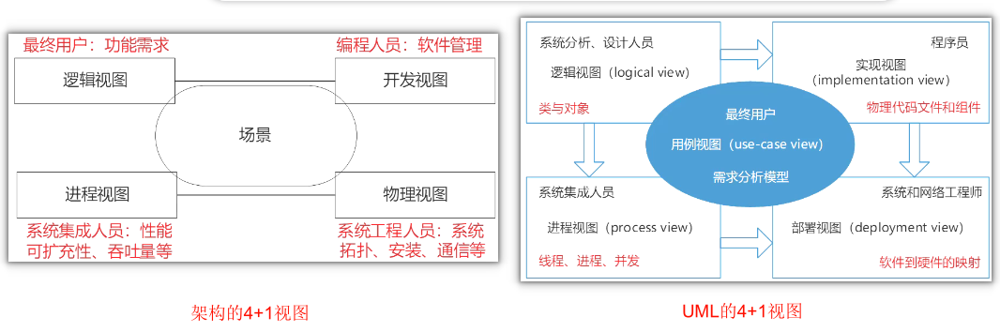

# 软件架构概念

## 最佳实践

### 考察问

1. 软件架构的4+1视图
    1. 逻辑视图: `()`
    2. 进程视图: `()`
    3. 开发视图(实现视图): `()`
    4. 物理视图(部署视图): `()`
    5. 统一的场景(用例视图): 

1. 零碎知识
    1. 软件架构的作用:
        1. 在设计变更相对容易的阶段，考虑系统结构的`()`
        2. 便于技术人员与非技术人员就软件设计进行`()`
        3. 展现软件的`()`、属性与`()`关系

    2. 功能性需求的满足属于`()`或`()`的任务, 非软件架构的作用
    3. 软件架构的4+1视图体现了`()`的思想
    4. ADL主要包含4部分, 分别是: `()`、`()`、`()`, `()`

### 考察点

1. 软件架构的4+1视图
    1. 逻辑视图: `系统的功能需求`
    2. 开发视图: `软件模块的组织和管理`
    3. 进程视图: `非功能性的需求`
    4. 物理视图: `软件映射到硬件上`
    5. 统一的场景: 

2. 零碎知识
    1. 软件架构的作用:
        1. 在设计变更相对容易的阶段，考虑系统结构的`可选方案`
        2. 便于技术人员与非技术人员就软件设计进行`交互`
        3. 展现软件的`结构`、属性与`内部交互`关系

    2. 功能性需求的满足属于`详细设计`或`测试阶段`的任务, 非软件架构的作用
    3. 软件架构的4+1视图体现了`关注点分离`的思想
    4. ADL主要包含4部分, 分别是: `组件`、`组件接口`、`连接件`, `架构配置`

## 软件架构的定义

研究者和工程人员对 Software Architecture(简称 SA) 的翻译不尽相同，本书中软件“体系结构”和“架构”具有相同的含义。

在体系结构设计的环境中，软件构件简单到可以是程序模块或者面向对象的类，也可以扩充到包含数据库和能够完成客户与服务器网络配置的“中间件”(也可以是作为包含数据库和能够完成客户与服务器网络配置的“中间件”的扩充)。

软件体系结构的设计通常考虑到设计金字塔中的两个层次： 数据设计和体系结构设计。数据设计体现传统系统中体系结构的数据构件和面向对象系统中类的定义(封装了属性和操作)，体系结构设计则主要关注软件构件的结构、属性和交互作用。

## 软件架构的作用(拓展)

- 软件架构设计包括提出架构模型，产生架构设计和进行设计评审等活动，是一个迭代的过程。
- 架构设计主要关注软件构件的结构、属性和交互作用，并通过多种视图全面描述特定系统的架构。 
- 软件架构是项目干系人进行交流的手段，明确了对系统实现的约束条件，决定了开发和维护组织的组织结构，制约着系统的质量属性。研究软件架构的根本目的是解决好软件的复用、质量和维护问题。
- 软件架构是可传递和可复用的模型，通过研究软件架构可能预测软件的质量。 

🔒题目

1. 以下叙述，( ) 不是软件架构的主要作用。

    - A. 在设计变更相对容易的阶段，考虑系统结构的可选方案
    - B. 便于技术人员与非技术人员就软件设计进行交互
    - C. 展现软件的结构、属性与内部交互关系
    - D. 表达系统是否满足用户的功能性需求

答案: D

## 软件架构设计与生命周期

### 需求分析阶段

需求分析和 SA 设计面临的是不同的对象：一个是问题空间；另一个是解空间。从软件需求模型向 SA 模型的转换主要关注两个问题。

1. 如何根据需求模型构建 SA 模型。
2. 如何保证模型转换的可追踪性。

### 设计阶段

这一阶段的 SA 研究主要包括： SA 模型的描述、 SA 模型的设计与分析方法，以及对 SA 设计经验的总结与复用等。有关 SA 模型描述的研究分为 3 个层次。

1. SA 的基本概念，即 SA 模型由哪些元素组成，这些组成元素之间按照何种原则组织。传统的设计概念只包括构件(软件系统中相对独立的有机组成部分，最初称为模块)以及一些基本的模块互联机制。随着研究的深入，构件间的互联机制逐渐独立出来，成为与构件同等级别的实体，称为连接子。现阶段的 SA 描述方法是构件和连接子的建模。

2. 体系结构描述语言 (Architecture Description Language,  ADL), 支持构件、连接子及其配置的描述语言就是如今所说的体系结构描述语言。 ADL 对连接子的重视成为区分 ADL 和其他建模语言的重要特征之一。

    🔒问题

    1. 架构描述语言(Architecture Description Language, ADL)是一种为明确说明软件系统的概念架构和对这些概念架构建模提供功能的语言。ADL主要包括以下组成部分：组件、组件接口、( ) 和架构配置。

        - A. 架构风格
        - B. 架构实现
        - C. 连接件
        - D. 组件约束

        答案: C

3. SA 模型的多视图表示，从不同的视角描述特定系统的体系结构，从而得到多个视图，并将这些视图组织起来以描述整体的 SA 模型。

    软件架构设计的4 + 1视图:

    

    - `逻辑`视图：也称设计视图，主要描述`系统的功能需求`。
    - `开发`视图：也称实现视图，侧重于`软件模块的组织和管理`。
    - `进程`视图：也称过程视图，主要关注一些`非功能性的需求`，例如`系统的性能和可用性`。进程视图强调并发性、分布性、系统集成性和容错能力，以及逻辑视图中的主要抽象的进程结构。 
    - `物理`视图：主要描述如何把`软件映射到硬件上`，通常要考虑到解决系统拓扑结构、系统安装、通信等问题。 
    - `统一的场景`：可以看作是那些重要系统活动的抽象，它使4个视图有机地联系起来，从某种意义上说，场景是最重要的需求抽象。在开发架构时，它可以帮助设计者找到架构的构件以及它们之间的作用关系。逻辑视图和开发视图描述系统的静态结构，而进程视图和物理视图描述系统的动态结构。对于不同的软件系统来说，侧重的角度也有所不同。例如，对于管理信息系统来说，比较侧重于从逻辑视图和开发视图来描述系统，而对于实时控制系统来说，则比较注重于从进程视图和物理视图来描述系统。 

    🔒题目:

    1. 1995年Kruchten提出了著名的“4 + 1”视图，用来描述软件系统的架构。在“4 + 1”视图中，(  ) 用来描述设计的对象模型和对象之间的关系；(  ) 描述了软件模块的组织与管理；(  ) 描述了设计的并发和同步特征。

        1. A. 逻辑视图  B. 用例视图  C. 过程视图  D. 开发视图
        2. A. 逻辑视图  B. 用例视图  C. 过程视图  D. 开发视图
        3. A. 逻辑视图  B. 用例视图  C. 过程视图  D. 开发视图

        答案: ADC

    2. 在软件体系结构的建模与描述中，多视图是一种描述软件体系结构的重要途径，其体现了(  ) 的思想。其中，4 + 1模型是描述软体系结构的常用模型，在该模型中，“1”指的是(  )。

        - A. 关注点分离
        - B. 面向对象
        - C. 模型驱动
        - D. UML

        - A. 统一场景 
        - B. 开发视图 
        - C. 逻辑视图 
        - D. 物理视图

        答案: A A

    3. 考虑软件架构时，重要的是从不同的视角(perspective)来检查，这促使软件设计师考虑架构的不同属性。例如，展示功能组织的 ( ) 能判断质量特性，展示并发行为的 ( ) 能判断系统行为特性。选择的特定视角或视图也就是逻辑视图、进程视图、实现视图和 ( ) 。使用 ( ) 来记录设计元素的功能和概念接口，设计元素的功能定义了它本身在系统中的角色，这些角色包括功能、性能等。

        - A. 静态视角
        - B. 动态视角
        - C. 多维视角
        - D. 功能视角

        - A. 开发视角
        - B. 动态视角
        - C. 部署视角
        - D. 功能视角

        - A. 开发视图
        - B. 配置视图
        - C. 部署视图
        - D. 物理视图

        - A. 逻辑视图
        - B. 物理视图
        - C. 部署视图
        - D. 用例视图

        - 答案：A  B  B  A ✨这个题好像有问题

### 实现阶段

为了有效实现从 SA 设计向实现的转换，实现阶段的体系结构研究表现在以下几个方面。

1. 研究基千 SA 的开发过程支持，如项目组织结构、配置管理等。
2. 寻求从 SA 向实现过渡的途径，如将程序设计语言元素引入 SA 阶段、模型映射、构件组装、复用中间件平台等。
3. 研究基千 SA 的测试技术。

### 构件组装阶段

在 SA 设计模型的指导下，可复用构件的组装可以在较高层次上实现系统，并能够提高系统实现的效率。在构件组装的过程中， SA 设计模型起到了系统蓝图的作用。研究内容包括如下两个方面。

1. 如何支持可复用构件的互联，即对 SA 设计模型中规约的连接子的实现提供支持。
2. 在组装过程中，如何检测并消除体系结构失配问题。

    在构件组装阶段的失配问题主要包括：由构件引起的失配、由连接子引起的失配、由于系统成分对全局体系结构的假设存在冲突引起的失配等。

### 部署阶段

SA 对软件部署作用如下。

1. 提供高层的体系结构视图来描述部署阶段的软硬件模型。
2. 基于 SA 模型可以分析部署方案的质量属性，从而选择合理的部署方案。

### 后开发阶段

后开发阶段是指软件部署安装之后的阶段。这一阶段的 SA 研究主要围绕维护、演化、复用等方面来进行。典型的研究方向包括动态软件体系结构、体系结构恢复与重建等。

1. 动态软件体系结构

    传统的 SA 研究设想体系结构总是静态的，即软件的体系结构一旦建立，就不会在运行时刻发生变动。但人们在实践中发现，现实中的软件往往具有动态性，即它们的体系结构会在运行时发生改变。 SA 在运行时发生的变化包括两类：一类是软件内部执行所导致的体系结构改变。比如，很多服务器端软件会在客户请求到达时创建新的构件来响应用户的请求。某个自适应的软件系统可能根据不同的配置状况采用不同的连接子来传送数据。另一类变化是软件系统外部的请求对软件进行的重配置。比如，有很多高安全性的软件系统，这些系统在升级或进行其他修改时不能停机。因为修改是在运行时刻进行的，体系结构也就动态地发生了变化。在高安全性系统之外也有很多软件需要进行动态修改，比如很多操作系统期望能够在升级时无须重新启动系统，在运行过程中就完成对体系结构的修改。

2. 体系结构恢复与重建

    当前系统的开发很少是从头开始的，大量的软件开发任务是基于已有的遗产系统进行升级、增强或移植。这些系统在开发的时候没有考虑 SA, 在将这些系统进行构件化包装、复用的时候，会得不到体系结构的支持。因此，从这些系统中恢复或重构体系结构是有意义的，也是必要的。

    SA 重建是指从已实现的系统中获取体系结构的过程。一般地， SA 重建的输出是一组体系结构视图。现有的体系结构重建方法可以分为 4 类。
    1. 手工体系结构重建。
    2. 工具支持的手工重建。通过工具对手工重建提供辅助支持，包括获得基本体系结构单元、提供图形界面允许用户操作 SA 模型、支持分析 SA 模型等。如 KLOCwork inS ight工具使用代码分析算法直接从源代码获得 SA 构件视图，用户可以通过操作图形化的 SA 来设定体系结构规则，并可在工具的支持下实现对体系结构的理解、自动控制和管理。
    3. 通过查询语言来自动建立聚集。这类方法适用千较大规模的系统，基本思路是：在逆向工程工具的支待下分析程序源代码，然后将得到的体系结构信息存入数据库，并通过适当的查询语言得到有效的体系结构显示。
    4. 使用其他技术，比如数据挖掘等。
