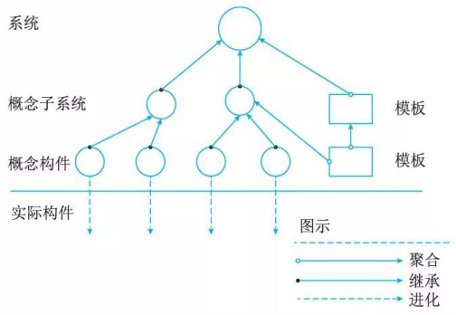
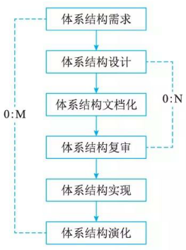
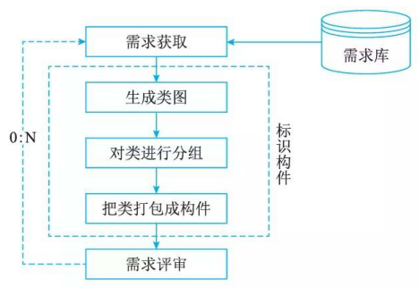
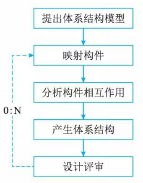
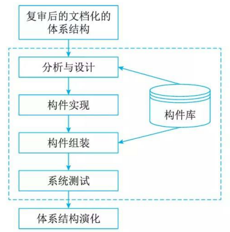
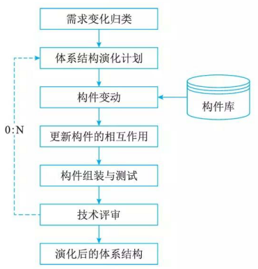

# 基千架构的软件开发方法

## 休系结构的设计方法概述

基于体系结构的软件设计 (Architecture-Based Software Design, ABSD) 方法。是由架构驱动，即由构成架构的商业、质量和功能需求的组合驱动架构设计。

ABSD 方法有 3 个基础。

1. 第 1 个基础是功能的分解。在功能分解中， ABSD 方法使用已有的基于模块的内聚和耦合技术。
2. 第 2 个基础是通过选择体系结构风格来实现质量和商业需求。
3. 第 3 个基础是软件模板的使用，软件模板利用了一些软件系统的结构。

🔒题目:

1. 基于架构的软件设计(Architecture-Based Software Design，ABSD)方法进行软件设计与开发。ABSD方法有三个基础，分别是对系统进行______分解、采用合适的架构风格实现质量属性与商业需求、采用软件模板设计软件结构。

    - A. 系统 
    - B. 模块 
    - C. 子系统 
    - D. 功能

    答案: D

## 概念与术语

### 设计元素

ABSD 方法中使用的设计元素如图 7-1 所示。在最顶层，系统被分解为若干概念子系统和一个或若干个软件模板。在第 2 层，概念子系统又被分解成概念构件和一个或若干个附加软件模板。

🔒题目:

1. ABSD方法是一个自顶向下，递归细化的方法，ABSD方法在最顶层，系统被分解为若干______和一个或者多个软件模板。

    - A. 系统
    - B. 构件
    - C. 模块
    - D. 概念子系统

    答案: D

2. 基于体系结构的软件设计(Architecture-Based Software Design，ABSD)方法是体系结构驱动，是指构成体系结构的(  )的组合驱动的。ABSD方法是一个自顶向下、递归细化的方法，软件系统的体系结构通过该方法得到细化，直到能产生(  )。

    - A. 产品、功能需求和设计活动
    - B. 商业、质量和功能需求
    - C. 商业、产品和功能需求
    - D. 商业、质量和设计活动

    - A. 软件产品和代码
    - B. 软件构件和类
    - C. 软件构件和连接件
    - D. 类和软件代码

    答案: B B

### 视角与视图

考虑体系结构时，要从不同的视角 (Perspective) 来观察对架构的描述，这需要软件设计师考虑体系结构的不同属性。例如，展示功能组织的静态视角能判断质量特性，展示并发行为的动态视角能判断系统行为特性，因此，选择的特定视角或视图(如逻辑视图、进程视图、实现视图和配置视图)可以全方位的考虑体系结构设计。使用逻辑视图来记录设计元素的功能和概念接口，设计元素的功能定义了它本身在系统中的角色，这些角色包括功能、性能等。

🔒题目

2. 在基于体系结构的软件设计方法中，采用 (  ) 来描述软件架构，采用 (  ) 来描述功能需求，采用 (  ) 来描述质量需求。

    - A. 类图和序列图  B. 视角与视图  C. 构件和类图  D. 构件与功能  
    - A. 类图  B. 视角  C. 用例  D. 质量场景  
    - A. 连接件  B. 用例  C. 质量场景  D. 质量属性

    答案: BCC

### 用例和质量场景

用例已经成为推测系统在一个具体设置中的行为的重要技术，用例被用在很多不同的场合，用例是系统的一个给予用户一个结果值的功能点，用例用来捕获功能需求。

在使用用例捕获功能需求的同时，人们通过定义特定场景来捕获质量需求，并称这些场景为质量场景。这样一来，在一般的软件开发过程中，人们使用质量场景捕获变更、性能、可靠性和交互性，分别称之为变更场景、性能场景、可靠性场景和交互性场景。质量场景必须包括预期的和非预期的场景。例如，一个预期的性能场景是估计每年用户数量增加 10 ％的影响，一个非预期的场景是估计每年用户数量增加 100％的影响。非预期场景可能不会真正实现，但它们在决定设计的边界条件时很有用。

## 基千体系结构的开发模型

传统的软件开发过程可以划分为从概念直到实现的若干个阶段，包括问题定义、需求分析、软件设计、软件实现及软件测试等。如果采用传统的软件开发模型，软件体系结构的建立应位于需求分析之后，概要设计之前。

ABSD 模型把整个基千体系结构的软件过程划分为体系结构需求、设计、文档化、复审、实现和演化 6 个子过程，如图 7-2 所示。

## 体系结构需求

### 需求获取

体系结构需求一般来自 3 个方面，分别是系统的质量目标、系统的商业目标和系统开发人员的商业目标。

### 标识构件

在图 7-3 中虚框部分属于标识构件过程，该过程为系统生成初始逻辑结构，包含大致的构件。这一过程又可分为 3 步来实现。

1. 第 1 步：生成类图。生成类图的 CASE 工具有很多，例如 Rational Rose  2000 能自动生成类图。
2. 第 2 步：对类进行分组。在生成的类图基础上，使用一些标准对类进行分组可以大大简化类图结构，使之更清晰。一般地，与其他类隔离的类形成一个组，由概括关联的类组成一个附加组，由聚合或合成关联的类也形成一个附加组。
3. 第 3 步：把类打包成构件。把在第 2 步得到的类簇打包成构件，这些构件可以分组合并成更大的构件。

### 架构需求评审

组织一个由不同代表(如分析人员、客户、设计人员和测试人员)组成的小组，对体系结构需求及相关构件进行仔细地审查。

## 体系结构设计

1. 提出软件体系结构模型

    在建立体系结构的初期，选择一个合适的体系结构风格是首要的。在这个风格的基础上，开发人员通过体系结构模型，可以获得关于体系结构属性的理解。此时，虽然这个模型是理想化的(其中的某些部分可能错误地表示了应用的特征)，但是，该模型为将来的实现和演化过程建立了目标。

2. 把已标识的构件映射到软件体系结构中

    把在体系结构需求阶段已标识的构件映射到体系结构中，将产生一个中间结构，这个中间结构只包含那些能明确适合体系结构模型的构件。

3. 分析构件之间的相互作用

    为了把所有已标识的构件集成到体系结构中，必须认真分析这些构件的相互作用和关系。

4. 产生软件体系结构

    一旦决定了关键构件之间的关系和相互作用，就可以在第 2 阶段得到的中间结构的基础上进行精化。

5. 设计评审

    一旦设计了软件体系结构，必须邀请独立于系统开发的外部人员对体系结构进行评审。

## 体系结构文档化

文档是在系统演化的每一个阶段，系统设计与开发人员的通信媒介，是为验证体系结构设计和提炼或修改这些设计(必要时)所执行预先分析的基础。

体系结构文档化过程的主要输出结果是两个文档：体系结构规格说明和测试体系结构需求的质量设计说明书。

##  体系结构复审

复审的目的是标识潜在的风险，及早发现体系结构设计中的缺陷和错误，包括体系结构能否满足需求、质量需求是否在设计中得到体现、层次是否清晰、构件的划分是否合理、文档表达是否明确、构件的设计是否满足功能与性能的要求等。

## 休系结构实现

所谓“实现”就是要用实体来显示出一个软件体系结构，即要符合体系结构所描述的结构性设计决策，分割成规定的构件，按规定方式互相交互。体系结构的实现过程如图 7-5 所示。

图 7-5 中的虚框部分是体系结构的实现过程。整个实现过程是以复审后的文档化的体系结构说明书为基础的，每个构件必须满足软件体系结构中说明的对其他构件的责任。这些决定即实现的约束是在系统级或项目范围内给出的，每个构件上工作的实现者是看不见的。

在体系结构说明书中，已经定义系统中的构件与构件之间的关系。因为在体系结构层次上，构件接口约束对外唯一地代表了构件，所以可以从构件库中查找符合接口约束的构件，必要时开发新的满足要求的构件。然后，按照设计提供的结构，通过组装支持工具把这些构件的实现体组装起来，完成整个软件系统的连接与合成。

最后一步是测试，包括单个构件的功能性测试和被组装的应用的整体功能和性能测试。

## 体系结构的演化

体系结构演化是使用系统演化步骤去修改应用，以满足新的需求。主要包括以下 6 个步骤。

1. 需求变化归类

    首先必须对用户需求的变化进行归类，使变化的需求与已有构件对应。对找不到对应构件的变动，也要做好标记，在后续工作中，将创建新的构件，以对应这部分变化的需求。

2. 制订体系结构演化计划

    在改变原有结构之前，开发组织必须制订一个周密的体系结构演化计划，作为后续演化开发工作的指南。

3. 修改、增加或删除构件

    在演化计划的基础上，开发人员可根据在第 1 步得到的需求变动的归类情况，决定是否修改或删除存在的构件、增加新构件。最后，对修改和增加的构件进行功能性测试。

4. 更新构件的相互作用

    随着构件的增加、删除和修改，构件之间的控制流必须得到更新。
5. 构件组装与测试

    通过组装支待工具把这些构件的实现体组装起来，完成整个软件系统的连接与合成，形成新的体系结构。然后对组装后的系统整体功能和性能进行测试。

6. 技术评审

    对以上步骤进行确认，进行技术评审。评审组装后的体系结构是否反映需求变动、符合用户需求。如果不符合，则需要在第 2 到第 6 步之间进行迭代。在原来系统上所做的所有修改必须集成到原来的体系结构中，完成一次演化过程。

    

## 🔒题目:

1. 架构需求一般来自三个方面，分别是系统的质量目标、系统的业务目标和(  )。

    - A. 系统开发人员的业务目标
    - B. 公司的经济目标
    - C. 公司的业务目标
    - D. 需求人员的业务目标

    答案: A

2. ABSDM(Architecture-Based Software Design Model)把整个基于体系结构的软件过程划分为体系结构需求、体系结构设计、体系结构文档化、(  ) 、(  ) 和体系结构演化等6个子过程。其中，(  ) 过程的主要输出结果是体系结构规格说明和测试体系结构需求的质量设计说明书。

    - A. 体系结构复审  B. 体系结构测试  C. 体系结构变更  D. 体系结构管理  
    - A. 体系结构实现  B. 体系结构测试  C. 体系结构建模  D. 体系结构管理  
    - A. 体系结构设计  B. 体系结构需求  C. 体系结构文档化  D. 体系结构测试

    答案: AAC

2. 基于架构的软件设计(Architecture-Based Software Design，ABSD)方法进行软件设计与开发。ABSD方法有三个基础，分别是对系统进行 ( ) 分解、采用合适的架构风格实现质量属性与商业需求、采用软件模板设计软件结构。

    - A. 系统
    - B. 模块
    - C. 子系统
    - D. 功能

    - 答案：D 

3. 基于体系结构的软件设计(Architecture-Based Software Design，ABSD)方法是体系结构驱动，是指构成体系结构的 ( ) 的组合驱动的。ABSD方法是一个自顶向下、递归细化的方法，软件系统的体系结构通过该方法得到细化，直到能产生 ( ) 。

    - A. 产品、功能需求和设计活动
    - B. 商业、质量和功能需求
    - C. 商业、产品和功能需求
    - D. 商业、质量和设计活动

    - A. 软件产品和代码
    - B. 软件构件和类
    - C. 软件构件和连接件
    - D. 类和软件代码

    - 答案：B  B
