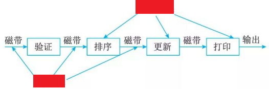
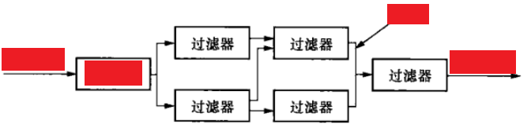
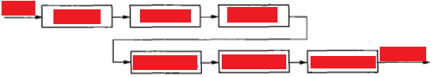
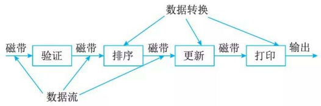

# 数据流体系结构风格(Data Flow Style)

## 最佳实践

### 掌握评估

- 批处理
    - 每个处理步骤是一个`()`的程序
    - 每一步必须在`()`才能开始
    - 并且数据必须是以`()`的方式传递

    

- 管道过滤器
    - 构件是`()`，负责对数据进行加工处理。
    - 连接件是`()`, 看做是输入数据流和输出数据流之间的通路
    

    🌰传统编译器

    

### 题目总结

- 批处理
    - 每个处理步骤是一个`单独`的程序
    - 每一步必须在`前一步结束后`才能开始
    - 并且数据必须是以`整体`的方式传递

    

- 管道过滤器
    - 构件是`过滤器`，负责对数据进行加工处理。
    - 连接件是`管道`, 看做是输入数据流和输出数据流之间的通路

    

    🌰传统编译器

    

## 数据流体系结构风格

数据流体系结构没有概念上的程序计数器：指令的可执行性和执行仅基于指令输入参数的可用性来确定，因此，指令执行的顺序是不可预测的，即行为是不确定的。数据流体系结构风格主要包括批处理风格和管道－过滤器风格。

## 批处理体系结构风格(Batch Sequential)

在批处理风格(见图)的软件体系结构中:

- 每个处理步骤是一个单独的程序
- 每一步必须在前一步结束后才能开始
- 并且数据必须是完整的，以整体的方式传递

基本构件是独立的应用程序，连接件是某种类型的媒介。连接件定义了相应的数据流图，表达拓扑结构。

🌰Hadoop大数据处理：Hadoop在处理过程中有明确的步骤安排，比如map几次，shuffle几次，再reduce几次

## 管道-过滤器体系结构风格(Pipe Filter)

现有的解决方案是把系统分解为几个序贯的处理步骤，这些步骤之间通过数据流连接，一个步骤的输出是另一个步骤的输入。每个处理步骤由一个过滤器(Filter)实现，处理步骤之间的数据传输由管道(Pipe)负责。每个处理步骤(过滤器)都有一组输入和输出，过滤器从管道中读取输入的数据流，经过内部处理，然后产生输出数据流并写入管道中。因此，管道-过滤器风格(见图) 的基本构件是过滤器，连接件是数据流传输管道，将一个过滤器的输出传到另一过滤器的输入。

✨总结

- 构件是过滤器，负责对数据进行加工处理。
- 连接件是管道, 看做是输入数据流和输出数据流之间的通路

传统的编译器就是管道/过滤器体系结构风格的一个实例。编译器由词法分析、语法分析、语义分析、中间代码生成、中间代码优化和目标代码生成几个模块组成，一个模块的输出是另一个模块的输入。源程序经过各个模块的独立处理之后，最终将产生目标程序。编译器的框架结构如图：

## 参考
- https://blog.csdn.net/weixin_43452424/article/details/104529719