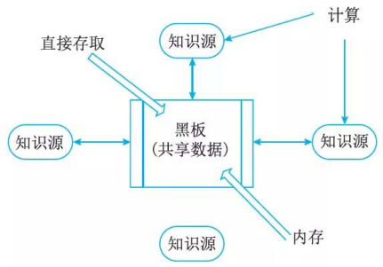
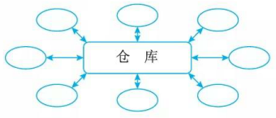

# 以数据为中心的休系结构风格

## 最佳实践

### 掌握评估

- 仓库
    - 构件: 
        - 中央数据库: `()`
        - 独立构件: `()`
    - 连接件: 仓库与独立构件之间的交互
- 黑板

    

    

### 题目总结

- 仓库
    - 构件: 
        - 中央数据库: `说明当前数据的状态`
        - 独立构件: `操作中央数据`
    - 连接件: 仓库与独立构件之间的交互
- 黑板

    

    

## 仓库体系结构风格

仓库(Repository)是存储和维护数据的中心场所。在仓库风格(见图)中，有两种不同的构件：`中央数据结构``说明当前数据的状态`以及一组`对中央数据进行操作`的`独立构件`，仓库与独立构件间的相互作用在系统中会有大的变化。这种风格的`连接件`即为`仓库与独立构件之间的交互`。

## 黑板体系结构风格

黑板体系结构风格(Blackboard Architecture Style) 适用于解决复杂的`非结构化`的问题，能在求解过程中综合运用多种不同知识源，使得问题的表达、组织和求解变得比较容易。黑板系统是一种问题求解模型，是组织推理步骤、控制状态数据和问题求解之领域知识的概念框架。它将问题的解空间组织成一个或多个应用相关的分级结构。分级结构的每一层信息由一个唯一的词汇来描述，它代表了问题的部分解。领域相关的知识被分成独立的知识模块，它将某一层次中的信息转换成同层或相邻层的信息。各种应用通过不同知识表达方法、推理框架和控制机制的组合来实现。影响黑板系统设计的最大因素是应用问题本身的特性，但是支撑应用程序的黑板体系结构有许多相似的特征和构件。

对于特定应用问题，黑板系统可通过选取各种`黑板`、`知识源`和`控制模块`的构件来设计，也可以利用预先定制的黑板体系结构的编程环境。黑板系统的传统应用是信号处理领域，如语音识别和模式识别。另一应用是松耦合代理数据共享存取。

### 黑板

即共享的问题求解工作空间。一般是以层次结构的方式组织，主要存放知识源所需要的信息和求解过程中的解状态数据，有时也存放控制数据。在问题求解过程中，知识源不断地修改黑板。知识源之间的通信和交互只能通过黑板进行。

### Knowledge sources知识源

知识源是描述某个独立领域问题的知识及其处理方法的知识库其分别存放且相互独立的，他们通过黑板进行通讯，合作求出问题的解，通常知识源具有“条件-动作”的形式。当条件满足时，知识源被触发，其动作部分增加或修改黑板上得内容。

- 待解决的问题被分为若干个子问题，每个子问题由一个独立的知识源加以计算。
- 知识源包含独立的领域知识。
- 知识源执行计算后会更新黑板里的数据状态。
- 多个知识源之间只能通过黑板交换知识
- 通过对黑板的读写操作来完成交换。

### Control控制器

- 黑板模型求解问题的推理机构，由监督程序和调度程序组成。
- 监督程序根据黑板的状态变化激活相关知识源
- 调度程序选择最合适的知识源来执行，用执行结果修改黑板状态。
- 用来控制和协调所有的知识源，使其协同的解决问题;
- 了解各个知识源的能力，实时决策解决问题的步骤;

### 案例🌰

根据拼图的思想总结，我们可以将整个拼图过程总结为四个层次，然后分别进行处理或者解决，最终得到一个完整的拼图。

| Level  | 内容                                   |
| ------ | -------------------------------------- |
| Level 4 | 将大块装配起来                         |
| Level 3 | 构造边上的大块 构造内部的大块       |
| Level 2 | 按边拼图 按内部拼图                 |
| Level 1 | 将所有的小块按照方向排列出来           |

🔒题目

- (✨2025上23)黑板架构风格中，用于进行数据处理和计算的构件是( )。
    - A.知识源
    - B.控制器
    - C.黑板
    - D.中央数据结构

    答案: A

## 参考

- https://blog.csdn.net/weixin_43452424/article/details/104822805
- https://zhuanlan.zhihu.com/p/408982486

